<!--yml
category: 未分类
date: 2022-04-26 14:54:30
-->

# RSA算法原理及CTF解题_WHOAMIAnony的博客-CSDN博客

> 来源：[https://blog.csdn.net/qq_45521281/article/details/114706622](https://blog.csdn.net/qq_45521281/article/details/114706622)

The RSA encryption algorithm is an asymmetric encryption algorithm. RSA is widely used in public key cryptography and electronic commerce. RSA was proposed in 1977 by Ron Rivest, Adi Shamir, and Leonard Adleman. All three of them were working at the Massachusetts Institute of Technology. RSA is composed of the first three letters of their last names.

已知c ，e，n（非常大），和 dp，dq，求解明文m

# RSA算法原理

## 什么是RSA

RSA算法是现今使用最广泛的公钥密码算法，也是号称地球上最安全的加密算法。在了解RSA算法之前，先熟悉下几个术语。

根据密钥的使用方法，可以将密码分为对称加密和公钥加密：

*   对称密码：加密和解密使用同一种密钥的方式
*   公钥密码：加密和解密使用不同密码的方式，因此公钥密码通常也称为非对称密码。

## RSA加密

RSA的加密过程可以使用一个通式来表达


**也就是说RSA加密是对明文的E次方后除以N后求余数的过程。**

从通式可知，**只要知道E和N任何人都可以进行RSA加密了**，所以说E、N是RSA加密的密钥，也就是说**E和N的组合就是公钥，我们用(E,N)来表示公钥。**


不过E和N不并不是随便什么数都可以的，它们都是经过严格的数学计算得出的，关于E和N拥有什么样的要求及其特性后面会讲到。顺便啰嗦一句E是加密（Encryption）的首字母，N是数字（Number）的首字母

## RSA解密

RSA的解密同样可以使用一个通式来表达


也就是说对密文进行D次方后除以N的余数就是明文，这就是RSA解密过程。知道D和N就能进行解密密文了，所以D和N的组合就是私钥


从上述可以看出RSA的加密方式和解密方式是相同的，加密是求“E次方的mod N”，解密是求“D次方的mod N”
此处D是解密（Decryption）的首字母；N是数字（Number）的首字母。

**总结一下**

|  |  |
| :-: | :-: |
| **公钥** | **（E，N）** |
| **私钥** | **（D，N）** |
| **密钥对** | **（E，D，N）** |
| 加密 | 密文＝明文^E mod N |
| 解密 | 明文＝密文^D mod N |

## 生成密钥对

既然公钥是（E，N），私钥是（D，N）所以密钥对即为（E，D，N）但密钥对是怎样生成的？步骤如下：

1.  求N
2.  求L（L为计算过程的中间数）
3.  求E
4.  求D

### 1\. 求N

准备两个质数p，q。这两个数不能太小，太小则会容易破解，将p乘以q就是N

### 2\. 求欧拉函数φ(N)

然后计算欧拉函数φ(N)或L：

### 3\. 求E

E 必须满足两个条件：E 是一个比1大比φ(N)小的数，E 和 φ(N) 的最大公约数为1，即 E 和 φ(N) 互质

用gcd(X,Y)来表示X，Y的最大公约数则E条件如下：

*   **1 < E < φ(N)**
*   **gcd(E,φ(N)) = 1**

之所以需要E和φ(N)的最大公约数为1是为了保证一定存在解密时需要使用的数D。现在我们已经求出了E和N也就是说我们已经生成了密钥对中的公钥了。

### 4\. 求D

数D是由数E计算出来的。D、E和φ(N)之间必须满足以下关系：

*   **1 < D < φ(N)**
*   **(E * D) mod φ(N) = 1**

只要D满足上述2个条件，则通过E和N进行加密的密文就可以用D和N进行解密。
简单地说条件2是为了保证密文解密后的数据就是明文。
现在私钥自然也已经生成了，密钥对也就自然生成了。

小结下：

| 求N | N＝ p ＊ q ；p，q为大质数 |
| :-: | :-: |
| 求φ(N) | φ(N)＝ (p－1，q－1) |
| 求E | 1 < E < φ(N)，gcd(E，φ(N))=1；E，φ(N)最大公约数为1（E和L互质） |
| 求D | 1 < D < φ(N)，(E＊D) mod φ(N) ＝ 1 |

# CTF中的常见RSA题型

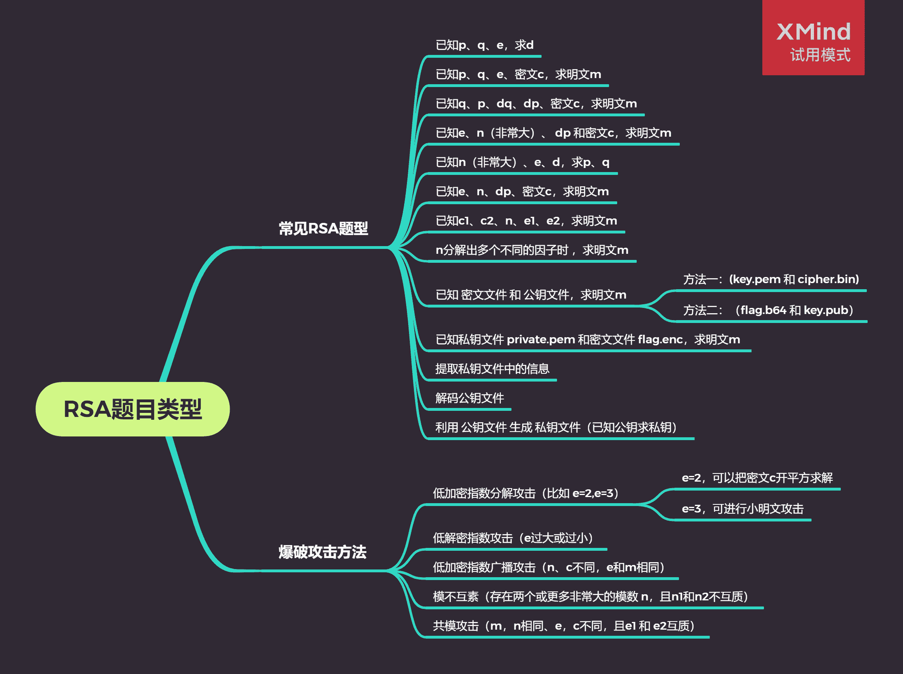

已知p ＝ 17、q ＝ 19。

**计算N:**

```
N=P*Q=323 
```

**欧拉函数，即L：**

```
φ(N)=(p-1)*(q-1) = 144 
```

**计算公钥e：**

```
要求1<e<φ(N),即1<e<20，并且e要与φ(N)互质, 那么我们取最小值e=5

此时公钥=(E，N) = (5，323) 
```

**计算私钥d：**

```
要求1 < d < φ(N)并且(e*d) mod φ(N) = 1, 即5*d%144=1, 那么d=29

此时私钥＝(D，N) = (29，323) 
```

d可以用python gmpy2库的`gmpy2.invert(e,φ(N))`求逆元快速算出来。

**1\. 公钥加密：**

**准备的明文m或M必须时小于N的数，因为加密或者解密都要mod N其结果必须小于N**

假设明文m ＝ 123，则：

```
密文 = 明文^e mod N
即
密文 = 123^5 % 323 = 225 
```

**2\. 私钥解密：**

```
明文＝密文^D mod N
即
225^29 % 323=123 
```

> 参数N和E是公开的但是D是私有的并且绝不能公开！P和Q在生成密钥后便不再需要了，但是必须销毁。
> 
> 为了从公钥(N,E)得到D,需要试图分解N为它的两个素数因子。对于一个很大的模数N（512位或更大）
> 要想分解出它的P和Q是件非常困难的事。
> 
> RSA 加密模式的所有安全性都依赖于大数分解(但是还没有数学上的证明)。

我们学习RSA不可能去手算，因此我们需要自己编写脚本！编写python脚本时我们需要**gmpy2**库。

> GMP（GNU Multiple Precision Arithmetic Library，即GNU高精度算术运算库），它是一个开源的高精度运算库，其中不但有普通的整数、实数、浮点数的高精度运算，还有随机数生成，尤其是提供了非常完备的数论中的运算接口，比如Miller-Rabin素数测试算法、大素数生成、欧几里德算法、求域中元素的逆、Jacobi符号、legendre符号等。
> gmpy2是Python的一个扩展库，是对GMP的封装，它的前身是gmpy，经过其作者的调整和封装，使得gmpy2的使用大大简化。

## 已知p、q、e，求d

[BUUCTF-Crypto]RSA

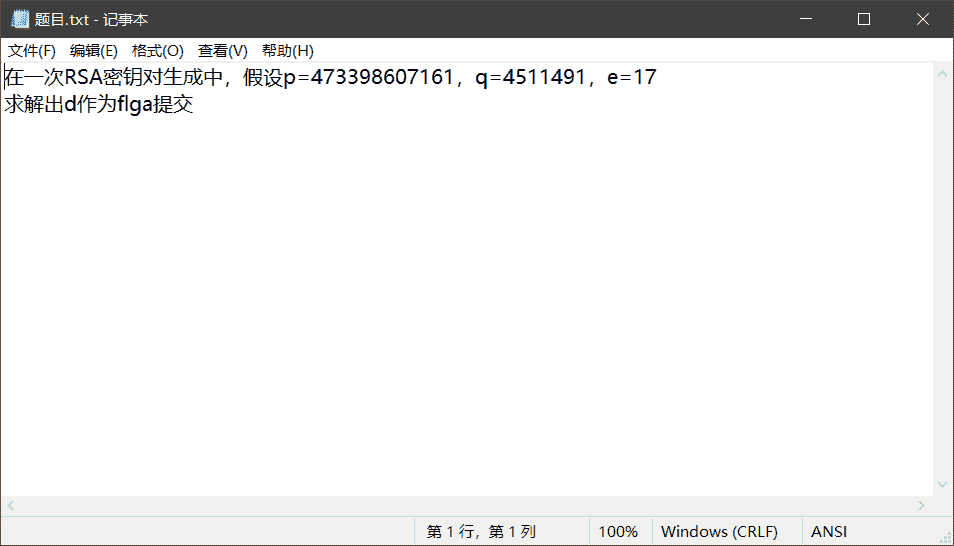

由题意可知：p，q，e，求d。直接上python脚本：

```
 import gmpy2
p = 473398607161
q = 4511491
e = 17
d = gmpy2.invert(e,(p-1)*(q-1))  
print d 
```

得到d等于125631357777427553，即flag为flag{125631357777427553}。

## 已知p、q、e、密文c，求明文m

[BUUCTF-Crypto]rsarsa

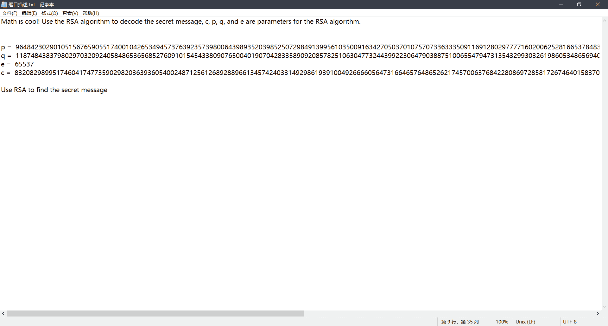

已知p、q、e、密文c，求明文m，根据公式`m=pow(c,d,n)`。写出脚本：

```
 import gmpy2
def Decrypt(c,e,p,q):
	L=(p-1)*(q-1)
	d=gmpy2.invert(e,L)
	n=p*q
	m=gmpy2.powmod(c,d,n)
	flag=str(m)
	print "flag{"+flag+"}"
if __name__ == '__main__':
	p =  9648423029010515676590551740010426534945737639235739800643989352039852507298491399561035009163427050370107570733633350911691280297777160200625281665378483
	q =  11874843837980297032092405848653656852760910154543380907650040190704283358909208578251063047732443992230647903887510065547947313543299303261986053486569407
	e =  65537
	c =  83208298995174604174773590298203639360540024871256126892889661345742403314929861939100492666605647316646576486526217457006376842280869728581726746401583705899941768214138742259689334840735633553053887641847651173776251820293087212885670180367406807406765923638973161375817392737747832762751690104423869019034
	Decrypt(c,e,p,q) 
```

注意：有时得到的明文需要转为十六进制后再转为字符串。

执行后得到flag为：flag{5577446633554466577768879988}。

gmpy2.powmod(x,y,z) 这个函数就是表示x 的 y 次幂后除以z的余数即：

```
gmpy2.powmod(x,y,z) = x^y % z 
```

## 已知q、p、dq、dp、密文c，求明文m

[BUUCTF-Crypto]RSA1

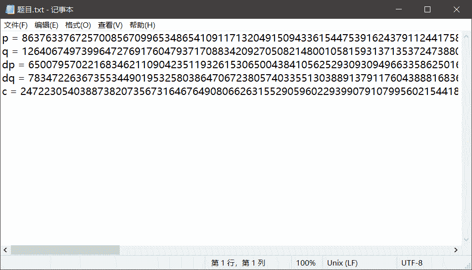

这道题并没有直接给公钥，但是泄露了dp和dq，应该是让我们根据这些条件求出明文m。dp和dq一开始并不知道这是个啥，看过WriteUp后才得知有如下关系：

```
dp=d mod(p-1)
dq=d mod(q-1)
即
dp=d%(p-1)
dq=d%(q-1) 
```

但现在也还没有明白最后怎么推出来的，可以参考下面：

> [https://www.cnblogs.com/P201521440001/p/11415504.html#rsa%E7%B3%BB%E5%88%97](https://www.cnblogs.com/P201521440001/p/11415504.html#rsa%E7%B3%BB%E5%88%97)
> 
> https://beiyuouo.github.io/blog/ctf-buuctf/

写出如下脚本：

```
 import gmpy2
p = 8637633767257008567099653486541091171320491509433615447539162437911244175885667806398411790524083553445158113502227745206205327690939504032994699902053229
q = 12640674973996472769176047937170883420927050821480010581593137135372473880595613737337630629752577346147039284030082593490776630572584959954205336880228469 
dp = 6500795702216834621109042351193261530650043841056252930930949663358625016881832840728066026150264693076109354874099841380454881716097778307268116910582929 
dq = 783472263673553449019532580386470672380574033551303889137911760438881683674556098098256795673512201963002175438762767516968043599582527539160811120550041 
c = 24722305403887382073567316467649080662631552905960229399079107995602154418176056335800638887527614164073530437657085079676157350205351945222989351316076486573599576041978339872265925062764318536089007310270278526159678937431903862892400747915525118983959970607934142974736675784325993445942031372107342103852

I = gmpy2.invert(q,p)
mp = pow(c,dp,p)               
mq = pow(c,dq,q)               

m = (((mp-mq)*I)%p)*q+mq       

print(hex(m))          
// 最后得到十六进制数后有时还要转化为字符串 
```

注意：有时得到的明文需要转为十六进制后再转为字符串。

最后得到flag为：flag{W31c0m3_70_Ch1n470wn}。

## 已知e、n（非常大）、 dp 和密文c，求明文m

领航杯2019的一道题，EasyRSA：给了e、n、c 由于特别大，没法直接用质因数分解求得 q， p

```
phint = d % (p - 1)    其实 phint = dp

qhint = d % (q - 1)    其实 qhint = dq 
```

phint和qhint也就是其他常见文章里的dp和dq，他俩加上e、n和密文c全部已知的话是可以实现任意密文c解密。

```
import gmpy2
import libnum
e=65537

n=16969752165509132627630266968748854330340701692125427619559836488350298234735571480353078614975580378467355952333755313935516513773552163392952656321490268452556604858966899956242107008410558657924344295651939297328007932245741660910510032969527598266270511004857674534802203387399678231880894252328431133224653544948661283777645985028207609526654816645155558915197745062569124587412378716049814040670665079480055644873470756602993387261939566958806296599782943460141582045150971031211218617091283284118573714029266331227327398724265170352646794068702789645980810005549376399535110820052472419846801809110186557162127

dp=1781625775291028870269685257521108090329543012728705467782546913951537642623621769246441122189948671374990946405164459867410646825591310622618379116284293794090970292165263334749393009999335413089903796624326168039618287078192646490488534062803960418790874890435529393047389228718835244370645215187358081805

c=0x6c78dcee37830f3ec4ab4989d40fbb595060b3fbc395d52ad26defc13372c1a3948c5388f4e450e46e016c7803133d6881e5efc3b90a4789448097c94124590b1e7949f2524d7edccd61a27691c18d090ac1f54643b563141306045417581e3b263f4ad2816136a48b106f3058b08e2a810f4ae8ef25916cc110b41ac8158ce69ecbe20fc60c1ddb20154c6646bc5142aefe47abf053a8ac949d5bc057bb18b191ad08070fe9ec5d76b1fceae685514532448c1b388b2d38e7241ac19c296e95e4e021a3a4015d909a1d53a2eb7fa86f6329f4e6c937f958be576c58fab4d9c9126999c99bb28718efc41a6f5db52b47942a2ddf21639f020b5489699cf22b46

for i in range(1,65538):
    if (dp*e-1)%i == 0:
        if n%(((dp*e-1)//i)+1)==0:
            p=((dp*e-1)//i)+1
            q=n//(((dp*e-1)//i)+1)
            phi = (p-1)*(q-1)
            d = gmpy2.invert(e,phi)%phi
            print(libnum.n2s(pow(c,d,n))) 
```

执行脚本即可得到flag。

## 已知n（非常大）、e、d，求p、q

由于n特别大，所以没法直接用质因数分解求得 q、p。

例题：题目给出了2个文件，一个是加密的脚本chall.py、另一个是加密脚本的输出内容output.txt。

先分析一下这个加密脚本chall.py：

```
from gmpy2 import invert
from md5 import md5
from secret import p,q

e = 65537
n = p*q
phi = (p-1)(q-1)
d = invert(e, phi)

print n,e,d
print "Flag: flag{%s}" % md5(str(p + q)).hexdigest() 
```

加密脚本真的是很简单啊，flag就是str(p+q)进行md5加密之后的得到的字符串，从output.txt中可以得到n,e,d。现在的关键问题就是求出p和q来，由于n太大了，所以我们不能直接用质因数分解求得 q、p。

我们写如下脚本求 q、p：

```
 import random
from md5 import md5

def gcd(a, b):
   if a < b:
     a, b = b, a
   while b != 0:
     temp = a % b
     a = b
     b = temp
   return a

def getpq(n,e,d):
	p = 1
	q = 1
	while p==1 and q==1:
		k = d * e - 1
		g = random.randint ( 0 , n )
		while p==1 and q==1 and k % 2 == 0:
			k /= 2
			y = pow(g,k,n)
			if y!=1 and gcd(y-1,n)>1:
				p = gcd(y-1,n)
				q = n/p
	return p,q

def main():
	n = 16352578963372306131642407541567045533766691177138375676491913897592458965544068296813122740126583082006556217616296009516413202833698268845634497478988128850373221853516973259086845725813424850548682503827191121548693288763243619033224322698075987667531863213468223654181658012754897588147027437229269098246969811226129883327598021859724836993626315476699384610680857047403431430525708390695622848315322636785398223207468754197643541958599210127261345770914514670199047435085714403641469016212958361993969304545214061560160267760786482163373784437641808292654489343487613446165542988382687729593384887516272690654309
	e = 65537
	d = 9459928379973667430138068528059438139092368625339079253289560577985304435062213121398231875832264894458314629575455553485752685643743266654630829957442008775259776311585654014858165341757547284112061885158006881475740553532826576260839430343960738520822367975528644329172668877696208741007648370045520535298040161675407779239300466681615493892692265542290255408673533853011662134953869432632554008235340864803377610352438146264524770710345273439724107080190182918285547426166561803716644089414078389475072103315432638197578186106576626728869020366214077455194554930725576023274922741115941214789600089166754476449453
	p,q = getpq(n,e,d)
        print p 
        print q
        print "Flag: flag{%s}" %md5(str(p + q)).hexdigest()
if __name__ == '__main__':
	main() 
```

## 已知e、n、dp、密文c，求明文m

[BUUCTF-Crypto]RSA2

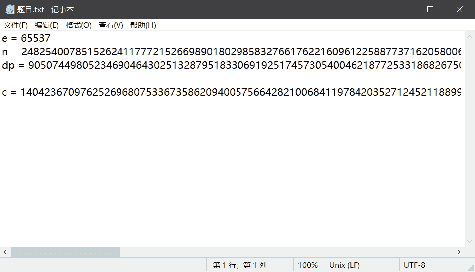

这道题也是没有直接给公钥，但是泄露了dp，应该是让我们根据这些条件求出明文m。

编写脚本：

```
 import gmpy2 as gp

e = 65537
n = 248254007851526241177721526698901802985832766176221609612258877371620580060433101538328030305219918697643619814200930679612109885533801335348445023751670478437073055544724280684733298051599167660303645183146161497485358633681492129668802402065797789905550489547645118787266601929429724133167768465309665906113
dp = 905074498052346904643025132879518330691925174573054004621877253318682675055421970943552016695528560364834446303196939207056642927148093290374440210503657

c = 140423670976252696807533673586209400575664282100684119784203527124521188996403826597436883766041879067494280957410201958935737360380801845453829293997433414188838725751796261702622028587211560353362847191060306578510511380965162133472698713063592621028959167072781482562673683090590521214218071160287665180751

for i in range(1, e):  
    if (dp * e - 1) % i == 0:
        if n % (((dp * e - 1) // i) + 1) == 0:  
            p = ((dp * e - 1) // i) + 1
            q = n // (((dp * e - 1) // i) + 1)
            phi = (q - 1) * (p - 1)  
            d = gp.invert(e, phi)  
            m = pow(c, d, n)  

print m   
print '------------'
print hex(m)[2:]  
print '------------'
print hex(m)[2:].decode('hex') 
```

注意：有时得到的明文需要转为十六进制后再转为字符串。

最后得到flag为：flag{wow_leaking_dp_breaks_rsa?_98924743502}。

## 已知c1、c2、n、e1、e2，求明文m

[BUUCTF-Crypto]RSA3

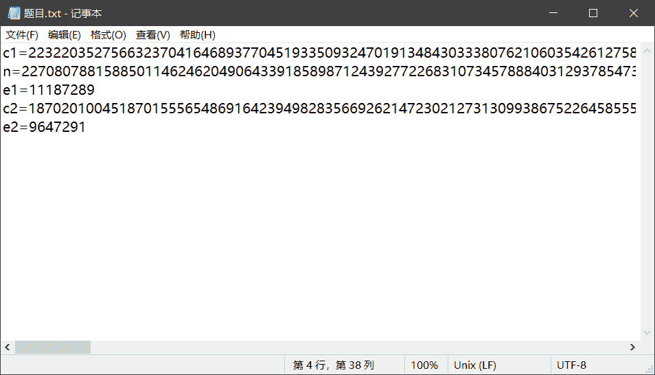

如上图，我们已知c1、c2、e1、e1、n，让我们求解明文m，我们编写如下脚本：

```
from gmpy2 import *
import libnum

n=22708078815885011462462049064339185898712439277226831073457888403129378547350292420267016551819052430779004755846649044001024141485283286483130702616057274698473611149508798869706347501931583117632710700787228016480127677393649929530416598686027354216422565934459015161927613607902831542857977859612596282353679327773303727004407262197231586324599181983572622404590354084541788062262164510140605868122410388090174420147752408554129789760902300898046273909007852818474030770699647647363015102118956737673941354217692696044969695308506436573142565573487583507037356944848039864382339216266670673567488871508925311154801
e1=11187289
e2=9647291
s = gcdext(e1, e2)
s1 = s[1]
s2 = -s[2]

c1=22322035275663237041646893770451933509324701913484303338076210603542612758956262869640822486470121149424485571361007421293675516338822195280313794991136048140918842471219840263536338886250492682739436410013436651161720725855484866690084788721349555662019879081501113222996123305533009325964377798892703161521852805956811219563883312896330156298621674684353919547558127920925706842808914762199011054955816534977675267395009575347820387073483928425066536361482774892370969520740304287456555508933372782327506569010772537497541764311429052216291198932092617792645253901478910801592878203564861118912045464959832566051361
c2=18702010045187015556548691642394982835669262147230212731309938675226458555210425972429418449273410535387985931036711854265623905066805665751803269106880746769003478900791099590239513925449748814075904017471585572848473556490565450062664706449128415834787961947266259789785962922238701134079720414228414066193071495304612341052987455615930023536823801499269773357186087452747500840640419365011554421183037505653461286732740983702740822671148045619497667184586123657285604061875653909567822328914065337797733444640351518775487649819978262363617265797982843179630888729407238496650987720428708217115257989007867331698397
e2=9647291
c2 = invert(c2, n)
m = (pow(c1,s1,n) * pow(c2 , s2 , n)) % n
print m
print libnum.n2s(m) 
```

如下图，执行后得到flag：

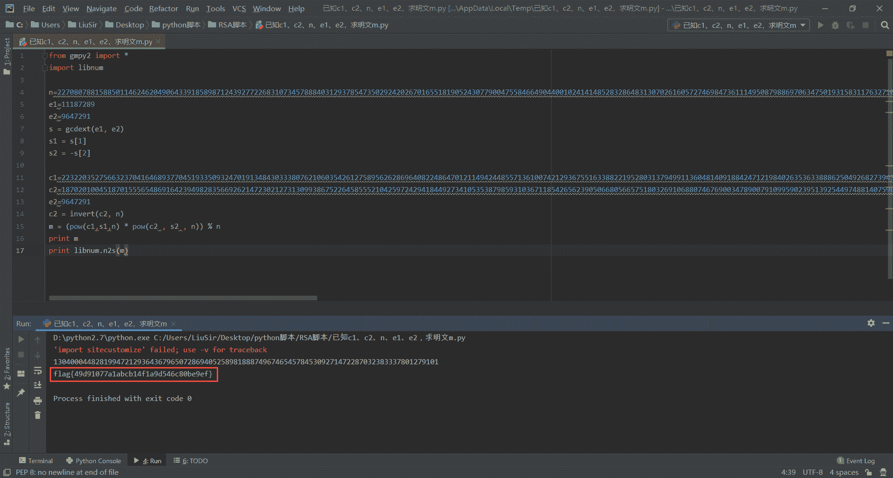

## n分解出多个不同的因子时 ，求明文m

给出：

```
n= 544187306850902797629107353619267427694837163600853983242783
e= 39293
c= 439254895818320413408827022398053685867343267971712332011972 
```

这里n不是很大，可以对其进行质因数分解。

我们对n在这个分解网站（http://www.factordb.com/index.php）进行质因数分解，得到了3个质因数：


写出如下脚本对密文c进行解密得到明文m：

```
import gmpy2
from Crypto.Util.number import long_to_bytes

n= 544187306850902797629107353619267427694837163600853983242783
e= 39293
c= 439254895818320413408827022398053685867343267971712332011972
p1 = 67724172605733871
p2 = 11571390939636959887
p3 = 694415063702720454699679
phi = (p1-1)*(p2-1)*(p3-1)  
d = gmpy2.invert(e, phi)  
m = pow(c, d, n)  
print long_to_bytes(m) 
```

执行脚本后，即可得到flag。

## 已知 密文文件 和 公钥文件，求明文m

要用到[RsaCtfTool](https://github.com/Ganapati/RsaCtfTool)工具，教程：https://www.jianshu.com/p/c945b0f0de0a

密文文件可能是以下几种：

*   flag.enc
*   cipher.bin
*   flag.b64
*   …

公钥文件可能是以下几种：

*   pubkey.pem
*   key.pem
*   key.pub
*   pub.key
*   …

#### 方法一：(key.pem 和 cipher.bin)

攻防世界-wtc_rsa_bbq

下载附件，得到一个没有后缀的cry200文件，用winhex一看是一个zip，修改后缀为zip后解压，得到两个文件，key.pem公钥文件和cipher.bin密文文件：

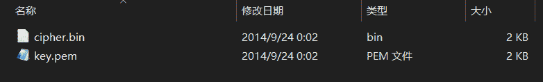

应该是让我们先破解得到私钥，然后再用私钥破解明文，丢kali里面直接用 RsaCtfTool 进行破解明文即可（这一过程 RsaCtfTool 将自动求解私钥）：

```
python3 RsaCtfTool.py --publickey key.pem --uncipherfile cipher.bin
python3 RsaCtfTool.py --publickey 公钥文件 --uncipherfile 加密的文件 
```

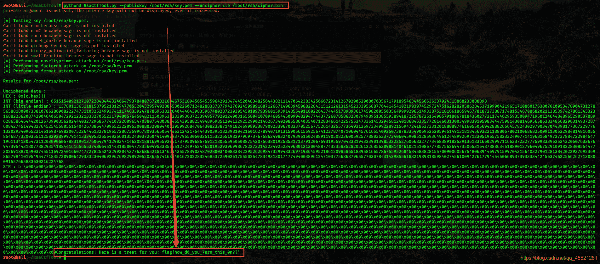

如上图得到flag。

#### 方法二：（flag.b64 和 key.pub）

攻防世界-cr4-poor-rsa

下载题目附件，下载附件，同样得到一个没有后缀的文件，在kali上用file命令一看，发现是一个rar压缩包：


修改后缀为rar后解压，得到两个文件，flag.b64密文文件和 key.pub 公钥文件：

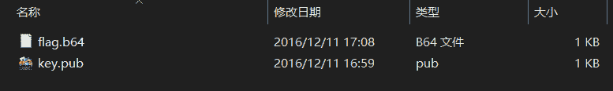

**这个flag.b64的名字有点奇怪，会不会是里面的内容被base64加密了，所以我们先处理flag.b64，将flag.b64中的内容进行解 base64操作。使用 notepad++ 打开 flag.b64文件使用 插件中的 MIME Tools 中的 base64 decode 将文件内容解密，然后保存。**

然后使用 RsaCtfTool 工具进行破解：

```
python3 RsaCtfTool.py --publickey key.pub --uncipherfile flag.b64 
```

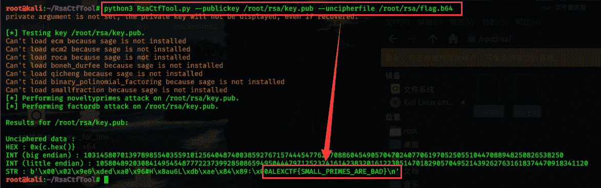

## 已知私钥文件 private.pem 和密文文件 flag.enc，求明文m

这个简单了，直接用RsaCtfTool进行破解即可：

```
python3 RsaCtfTool.py --private private.pem --uncipherfile flag.enc 
```

## 提取私钥文件中的信息

这个简单，直接用RsaCtfTool即可提取即可：

```
python3 RsaCtfTool.py --key private.pem --dumpkey 
```

## 解码公钥文件

我们得到的公钥文件（pubkey.pem等）里面都是加密的，像这样：

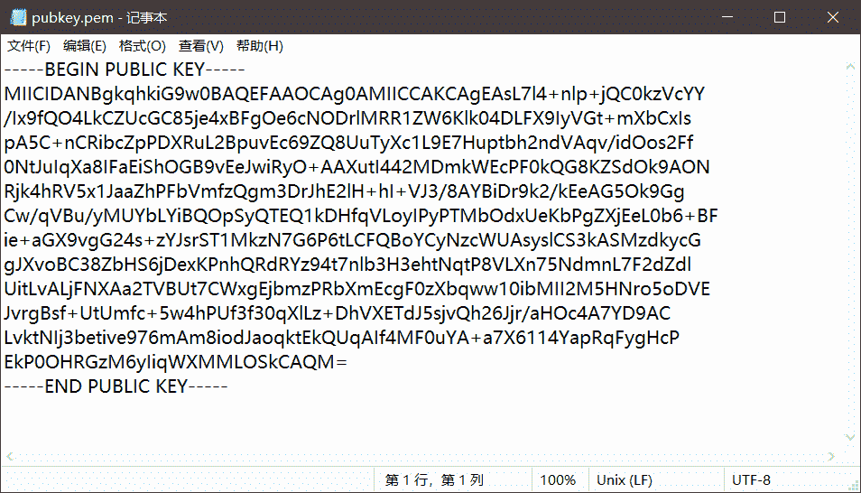

光这样我们是看不到公钥里面的e和n的，我们可以用以下两种方法对公钥文件进行解码：

**1\. 用RsaCtfTool.py工具：**

即把pubkey.pem、key.pub等格式的公钥文件转换为n，e

```
python3 RsaCtfTool.py --dumpkey --key 公钥文件 
```

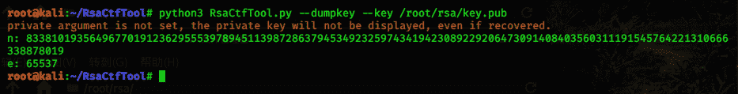

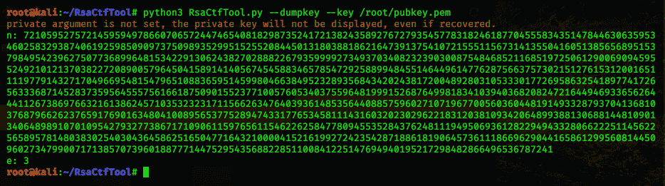

**2\. 利用 openssl 找出指数 e 和模数 n**

openssl工具kali自带了。

```
openssl rsa -pubin -text -modulus -in warmup -in pubkey.pem 
```


## 利用 公钥文件 生成 私钥文件（已知公钥求私钥）

这个简单，直接用RsaCtfTool生成即可：

```
python3 RsaCtfTool.py --publickey pubkey.pem --private > private.pem
python3 RsaCtfTool.py --publickey pub.key --private > private.key
...... 
```

例题：还是上面方法二里的攻防世界-cr4-poor-rsa。

该题由于给出了公钥文件，所以我们可以先直接利用 公钥文件 生成 私钥文件，即从公钥求私钥，然后就可以用私钥直接对密文文件进行解密了。

先从公钥生成私钥：

```
python3 RsaCtfTool.py --publickey key.pub --private 
```

如下图得到了私钥：

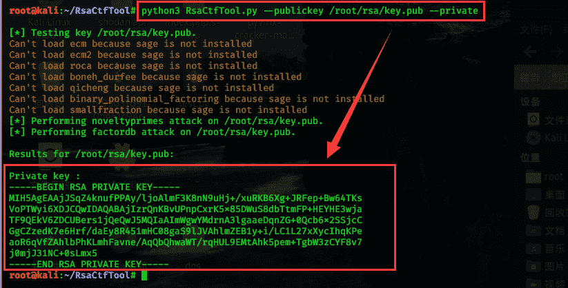

然后将私钥和密文文件丢到CaptfEncoder工具里去解密，注意这里的文本要为未解密之前的base64编码：

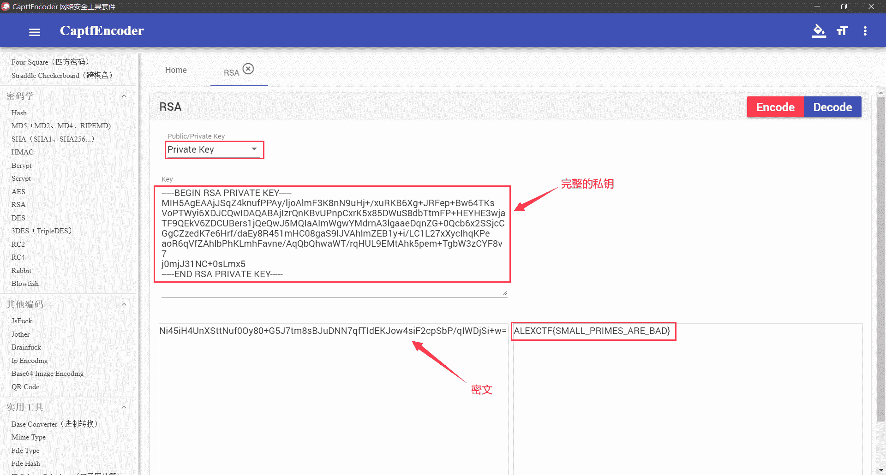

# 爆破攻击方法

## 低加密指数分解攻击（比如 e=2,e=3）

在 RSA 中 e 也称为加密指数。由于 e 是可以随意选取的，选取小一点的 e 可以缩短加密时间（比如 e=2,e=3），但是选取不当的话，就会造成安全问题。

下面就是e选取的太小导致存在的安全问题：

#### （1）e=2，可以把密文c开平方求解

RSA加密，当e等于2时，相当于把明文m平方而已，得到的c也比n小很多。尝试把c开根号看能否得到明文。一般的python开根号方法精度较低，对大整数开出来的根号准确度低。

发现使用gmpy2库可以对大整数开根号。

例题：西湖论剑rsa

已知如下：

```
e=2

c=9217979941366220275377875095861710925207028551771520610387238734819759256223080175603032167658086669886661302962985046348865181740591251321966682848536331583243529 
```

让我们求明文m。

编写脚本进行开根号求解：

```
import gmpy2
import libnum
c = 9217979941366220275377875095861710925207028551771520610387238734819759256223080175603032167658086669886661302962985046348865181740591251321966682848536331583243529
m = gmpy2.isqrt(c)
m = int(m)
m_text = libnum.n2s(m)  
print(m_text) 
```

执行完后便可以得到flag为：flag1{Th1s_i5_wHat_You_ne3d_FirsT}。

#### （2）e=3，可进行小明文攻击

适用情况：e较小，一般为3。

当如果公钥e很小，明文m也不大的话，就会导致 `m^e=k*n+c` 中的k值很小甚至为0，爆破k或直接开三次方即可。

例题：Jarvis OJ -Crypto-Extremely hard RSA

下载附件，题目给出了两个文件， flag.enc 密文文件 和 pubkey.pem 公钥文件文件

当然这个题我们可以先用RsaCtfTool进行破解：

```
python3 RsaCtfTool.py --publickey pubkey.pem --uncipherfile  flag.enc 
```

但是破解失败了，所以换一种思路，先用openssl或RsaCtfTool解码公钥：


从中发现e=3，很小，所以很可能存在小名文攻击。

**可以假设，k为0，然后将c直接开三次方就可以得到明文 m 了。注意：密文c要从 flag.enc 密文文件中以十六进制方式来读取，因为文件中含有很多不可打印字符。**

编写脚本：

```
import gmpy2,binascii,libnum,time
n = 0xB0BEE5E3E9E5A7E8D00B493355C618FC8C7D7D03B82E409951C182F398DEE3104580E7BA70D383AE5311475656E8A964D380CB157F48C951ADFA65DB0B122CA40E42FA709189B719A4F0D746E2F6069BAF11CEBD650F14B93C977352FD13B1EEA6D6E1DA775502ABFF89D3A8B3615FD0DB49B88A976BC20568489284E181F6F11E270891C8EF80017BAD238E363039A458470F1749101BC29949D3A4F4038D463938851579C7525A69984F15B5667F34209B70EB261136947FA123E549DFFF00601883AFD936FE411E006E4E93D1A00B0FEA541BBFC8C5186CB6220503A94B2413110D640C77EA54BA3220FC8F4CC6CE77151E29B3E06578C478BD1BEBE04589EF9A197F6F806DB8B3ECD826CAD24F5324CCDEC6E8FEAD2C2150068602C8DCDC59402CCAC9424B790048CCDD9327068095EFA010B7F196C74BA8C37B128F9E1411751633F78B7B9E56F71F77A1B4DAAD3FC54B5E7EF935D9A72FB176759765522B4BBC02E314D5C06B64D5054B7B096C601236E6CCF45B5E611C805D335DBAB0C35D226CC208D8CE4736BA39A0354426FAE006C7FE52D5267DCFB9C3884F51FDDFDF4A9794BCFE0E1557113749E6C8EF421DBA263AFF68739CE00ED80FD0022EF92D3488F76DEB62BDEF7BEA6026F22A1D25AA2A92D124414A8021FE0C174B9803E6BB5FAD75E186A946A17280770F1243F4387446CCCEB2222A965CC30B3929    

e = 3
res = 0
c = int(open('flag.enc','rb').read().encode('hex'),16)
print time.asctime
for i in xrange(200000000):
    if gmpy2.iroot(c+n*i,3)[1] == 1:
        res = gmpy2.iroot(c+n*i,3)[0]
        print i,res
        print libnum,n2s(res)
        print time.asctime()
        break 
```

破电脑跑了快半个小时，期间以为卡了，还好跑出来了。

## 低解密指数攻击（e过大或过小）

适用情况：e过大或过小，一般e过大时使用。

在RSA中d也称为解密指数，当d比较小的时候，e也就显得特别大了。在e过大或过小的情况下，可使用算法从e中快速推断出d的值，进而求出m。（具体我也没看懂）

一般我们看到e非常大，就应该下意识的想到是使用低解密指数攻击，也叫RSA维纳攻击(RSA wiener attack)。

例题：我不是个人

题目给出如下：

```
n = 460657813884289609896372056585544172485318117026246263899744329237492701820627219556007788200590119136173895989001382151536006853823326382892363143604314518686388786002989248800814861248595075326277099645338694977097459168530898776007293695728101976069423971696524237755227187061418202849911479124793990722597

e = 354611102441307572056572181827925899198345350228753730931089393275463916544456626894245415096107834465778409532373187125318554614722599301791528916212839368121066035541008808261534500586023652767712271625785204280964688004680328300124849680477105302519377370092578107827116821391826210972320377614967547827619

c = 38230991316229399651823567590692301060044620412191737764632384680546256228451518238842965221394711848337832459443844446889468362154188214840736744657885858943810177675871991111466653158257191139605699916347308294995664530280816850482740530602254559123759121106338359220242637775919026933563326069449424391192 
```

让我们求明文。

编写如下脚本解密：

```
 import gmpy2
import time

def continuedFra(x, y):
    cF = []
    while y:
        cF += [x / y]
        x, y = y, x % y
    return cF
def Simplify(ctnf):
    numerator = 0
    denominator = 1
    for x in ctnf[::-1]:
        numerator, denominator = denominator, x * denominator + numerator
    return (numerator, denominator)

def calculateFrac(x, y):
    cF = continuedFra(x, y)
    cF = map(Simplify, (cF[0:i] for i in xrange(1, len(cF))))
    return cF

def solve_pq(a, b, c):
    par = gmpy2.isqrt(b * b - 4 * a * c)
    return (-b + par) / (2 * a), (-b - par) / (2 * a)
def wienerAttack(e, n):
    for (d, k) in calculateFrac(e, n):
        if k == 0: continue
        if (e * d - 1) % k != 0: continue
        phi = (e * d - 1) / k
        p, q = solve_pq(1, n - phi + 1, n)
        if p * q == n:
            return abs(int(p)), abs(int(q))
    print 'not find!'
time.clock()
n = 460657813884289609896372056585544172485318117026246263899744329237492701820627219556007788200590119136173895989001382151536006853823326382892363143604314518686388786002989248800814861248595075326277099645338694977097459168530898776007293695728101976069423971696524237755227187061418202849911479124793990722597

e = 354611102441307572056572181827925899198345350228753730931089393275463916544456626894245415096107834465778409532373187125318554614722599301791528916212839368121066035541008808261534500586023652767712271625785204280964688004680328300124849680477105302519377370092578107827116821391826210972320377614967547827619

c = 38230991316229399651823567590692301060044620412191737764632384680546256228451518238842965221394711848337832459443844446889468362154188214840736744657885858943810177675871991111466653158257191139605699916347308294995664530280816850482740530602254559123759121106338359220242637775919026933563326069449424391192

p, q = wienerAttack(e, n)
print '[+]Found!'
print '  [-]p =',p
print '  [-]q =',q
print '  [-]n =',p*q
d = gmpy2.invert(e,(p-1)*(q-1))
print '  [-]d =', d
print '  [-]m is:' + '{:x}'.format(pow(c,d,n)).decode('hex')
print '\n[!]Timer:', round(time.clock(),2), 's'
print '[!]All Done!' 
```

如下图，执行后即可得到flag：

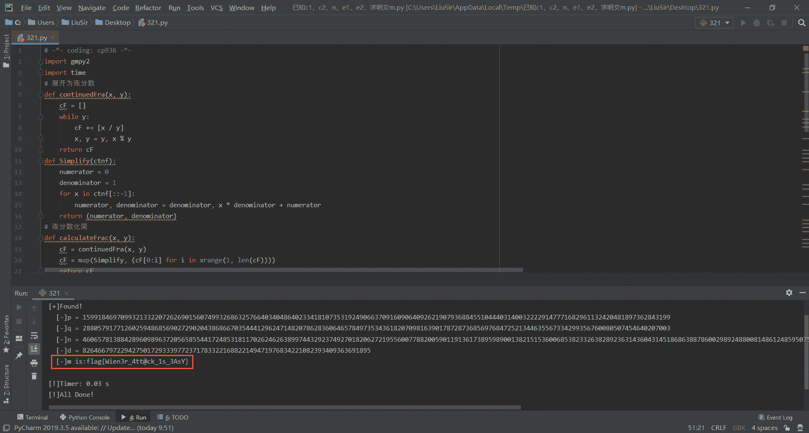

### 多重基数的RSA低解密指数攻击

[2020祥云杯]simplersa

这里与之前的低解密指数攻击不同，这是多重基数的，即 `phi = (p - 1) * (q - 1) * (r - 1)`。

下载附件后解压得到：


teask.py内容如下：

```
from Crypto.Util.number import *
import gmpy2

p, q, r = [getPrime(512) for i in range(3)]
n = p * q * r
phi = (p - 1) * (q - 1) * (r - 1)
d = getPrime(256)
e = gmpy2.invert(d , phi)

flag = b"flag{xxxxxxxxxxxxxxxxxxxxxxxxxxxxxxxxxxxx}"

c = pow(bytes_to_long(flag), e, n)

print(e, n)
print(c) 
```

task.txt：

```
1072295425944136507039938677101442481213519408125148233880442849206353379681989305000570387093152236263203395726974692959819315410781180094216209100069530791407495510882640781920564732214327898099944792714253622047873152630438060151644601786843683746256407925709702163565141004356238879406385566586704226148537863811717298966607314747737551724379516675376634771455883976069007134218982435170160647848549412289128982070647832774446345062489374092673169618836701679   // e

1827221992692849179244069834273816565714276505305246103435962887461520381709739927223055239953965182451252194768935702628056587034173800605827424043281673183606478736189927377745575379908876456485016832416806029254972769617393560238494326078940842295153029285394491783712384990125100774596477064482280829407856014835231711788990066676534414414741067759564102331614666713797073811245099512130528600464099492734671689084990036077860042238454908960841595107122933173   // n

1079929174110820494059355415059104229905268763089157771374657932646711017488701536460687319648362549563313125268069722412148023885626962640915852317297916421725818077814237292807218952574111141918158391190621362508862842932945783059181952614317289116405878741758913351697905289993651105968169193211242144991434715552952340791545323270065763529865010326192824334684413212357708275259096202509042838081150055727650443887438253964607414944245877904002580997866300452   // c 
```

一看e这么大，下意识就想到了低解密指数攻击（维纳攻击），但这里与之前的不同，这是多重基数的，即 `phi = (p - 1) * (q - 1) * (r - 1)`。

在网上找到一个解密脚本：

```
 from Cryptodome.Util.number import long_to_bytes
e = 1072295425944136507039938677101442481213519408125148233880442849206353379681989305000570387093152236263203395726974692959819315410781180094216209100069530791407495510882640781920564732214327898099944792714253622047873152630438060151644601786843683746256407925709702163565141004356238879406385566586704226148537863811717298966607314747737551724379516675376634771455883976069007134218982435170160647848549412289128982070647832774446345062489374092673169618836701679
n = 1827221992692849179244069834273816565714276505305246103435962887461520381709739927223055239953965182451252194768935702628056587034173800605827424043281673183606478736189927377745575379908876456485016832416806029254972769617393560238494326078940842295153029285394491783712384990125100774596477064482280829407856014835231711788990066676534414414741067759564102331614666713797073811245099512130528600464099492734671689084990036077860042238454908960841595107122933173
c = 1079929174110820494059355415059104229905268763089157771374657932646711017488701536460687319648362549563313125268069722412148023885626962640915852317297916421725818077814237292807218952574111141918158391190621362508862842932945783059181952614317289116405878741758913351697905289993651105968169193211242144991434715552952340791545323270065763529865010326192824334684413212357708275259096202509042838081150055727650443887438253964607414944245877904002580997866300452

def lf(x,y):
	arr=[]
	while y:
		arr+=[x//y]
		x,y=y,x%y
	return arr

def jj(k):
	x=0
	y=1
	for i in k[::-1]:
		x,y=y,x+i*y
	return (y,x)
data=lf(e,n)

for x in range(1,len(data)+1):
	data1=data[:x]
	d = jj(data1)[1]
	m = pow(c,d,n)
	flag = long_to_bytes(m)
	if b'flag{' in flag:
		print(flag)
		break 
```

解密脚本2：

```
 import gmpy2
from Crypto.Util.number import *

def transform(x,y):       
    res=[]
    while y:
        res.append(x//y)
        x,y=y,x%y
    return res

def continued_fraction(sub_res):
    numerator,denominator=1,0
    for i in sub_res[::-1]:      
        denominator,numerator=numerator,i*numerator+denominator
    return denominator,numerator   

def sub_fraction(x,y):
    res=transform(x,y)
    res=list(map(continued_fraction,(res[0:i] for i in range(1,len(res)))))  
    return res

def get_pq(a,b,c):      
    par=gmpy2.isqrt(b*b-4*a*c)   
    x1,x2=(-b+par)//(2*a),(-b-par)//(2*a)
    return x1,x2

def wienerAttack(e,n):
    for (d,k) in sub_fraction(e,n):  

        if 250<=d.bit_length()<=256:
            print(d) 
            global c 
            print(long_to_bytes(pow(c,d,n)))
        else:
            continue
        phi=(e*d-1)//k               
        px,qy=get_pq(1,n-phi+1,n)
        if px*qy==n:
            p,q=abs(int(px)),abs(int(qy))     
            d=gmpy2.invert(e,(p-1)*(q-1))     
            return d
    print("该方法不适用")

e=1072295425944136507039938677101442481213519408125148233880442849206353379681989305000570387093152236263203395726974692959819315410781180094216209100069530791407495510882640781920564732214327898099944792714253622047873152630438060151644601786843683746256407925709702163565141004356238879406385566586704226148537863811717298966607314747737551724379516675376634771455883976069007134218982435170160647848549412289128982070647832774446345062489374092673169618836701679 
n=1827221992692849179244069834273816565714276505305246103435962887461520381709739927223055239953965182451252194768935702628056587034173800605827424043281673183606478736189927377745575379908876456485016832416806029254972769617393560238494326078940842295153029285394491783712384990125100774596477064482280829407856014835231711788990066676534414414741067759564102331614666713797073811245099512130528600464099492734671689084990036077860042238454908960841595107122933173
c=1079929174110820494059355415059104229905268763089157771374657932646711017488701536460687319648362549563313125268069722412148023885626962640915852317297916421725818077814237292807218952574111141918158391190621362508862842932945783059181952614317289116405878741758913351697905289993651105968169193211242144991434715552952340791545323270065763529865010326192824334684413212357708275259096202509042838081150055727650443887438253964607414944245877904002580997866300452
d = wienerAttack(e,n)
print("d=",d) 
```

**（这两个脚本也可以用来解正常的维纳攻击，但之前那个脚本不能用来解多重基数的RSA维纳攻击）**

执行后得到flag：

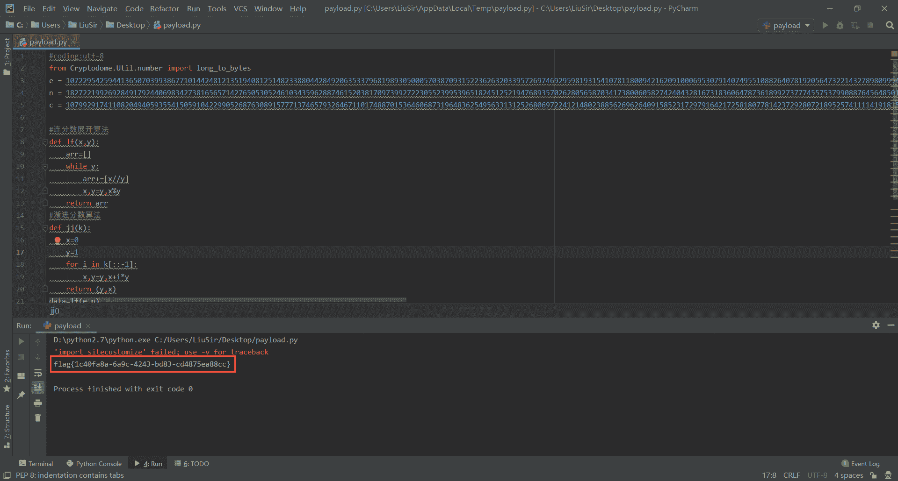

## 低加密指数广播攻击（n、c不同，e和m相同）

使用条件：模数n、密文c不同，明文m、加密指数e相同

如果选取的**加密指数较低e**，并且使用了**相同的加密指数e**给一个接受者的群发送**相同的信息（明文相同）**，那么可以进行广播攻击得到明文。

例题1：Jarvis OJ -2018强网杯nextrsa-Level9

题目给出如下：

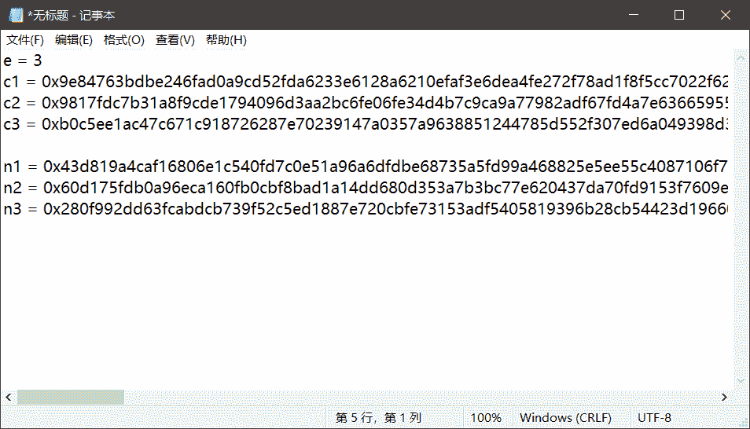

即相同的加密指数e，但是模数n和密文c不同，很明显使用低加密指数广播攻击。

解题脚本1，如下，执行即可得到明文m：

```
 import random
from gmpy2 import invert, iroot
import libnum

def broadcast(n1, n2 ,n3, c1, c2, c3):
    n = [n1, n2, n3]
    C = [c1, c2, c3]
    N = 1
    for i in n:
        N *= i

    Ni = []
    for i in n:
        Ni.append(N / i)

    T = []
    for i in xrange(3):
        T.append(long(invert(Ni[i], n[i])))

    X = 0
    for i in xrange(3):
        X += C[i] * Ni[i] * T[i]

    m3 = X % N
    m = iroot(m3, 3)
    return m[0]

def main():
    e = 3

    c1 = 0x9e84763bdbe246fad0a9cd52fda6233e6128a6210efaf3e6dea4fe272f78ad1f8f5cc7022f62f4f542341128e42d6fd10e67c5f96edbd243917c0151289f7228e44019b8c65a541d7306b398465e26b69cab36cc61e4ac094832b4299bbaf4630b722a0fb4f1997053be97e926f94afb55a0bb6ef00ab694e2f595d9eb8ca96c49f5cbbe194529f68a1aaf6f5151484b471285ba8fc8cd30b55612f35a74dc68e255c363579a80d27ce5090873ac719ba59f2492c91fd28bcce26b6a02bae005cbbd2a4cfe5b93442be8664d2313d412e7e09f545c64b7b74bbc408b6e574d0d300135cba8d6c1d73737d59baca9992ede644d856eb4cfcda562a75743e4b491
    c2 = 0x9817fdc7b31a8f9cde1794096d3aa2bc6fe06fe34d4b7c9ca9a77982adf67fd4a7e636659553f4168a16757dc3a75e54ff850b9a94a5270f4f75502c7055a3a389df2ea6b00784a4e78e66901b427253c0f343f127e0ff162a349bb14eb4c1453fc6daace19bba4940d77c435686ef3b59f732072cde2e148d1a64f9682b3f1ceb9a000d87e180a1f9eb20c59dbebc13ddb2e07b64db89217f40369aeec878a45d99909ab2a3e4cdb74aa68890c941315ae289d6667200c53f9a32c8a64bfc74e62898ac03c460f945a13f11ee28860a3cd07526c30aa92eb89442a76549fe4ed8a43d14fdeeb350e90443a3a586db719f8610eb5d4a8f5bd1e481b5ef6e96ef
    c3 = 0xb0c5ee1ac47c671c918726287e70239147a0357a9638851244785d552f307ed6a049398d3e6f8ed373b3696cfbd0bce1ba88d152f48d4cea82cd5dafd50b9843e3fa2155ec7dd4c996edde630987806202e45821ad6622935393cd996968fc5e251aa3539ed593fe893b15d21ecbe6893eba7fe77b9be935ca0aeaf2ec53df7c7086349eb12792aefb7d34c31c18f3cd7fb68e8a432652ef76096096e1a5d7ace90a282facf2d2760e6b5d98f0c70b23a6db654d10085be9dcc670625646a153b52c6c710efe8eb876289870bdd69cb7b45813e4fcfce815d191838926e9d60dd58be73565cff0e10f4e80122e077a5ee720caedc1617bf6a0bb072bbd2dab0

    n1 = 0x43d819a4caf16806e1c540fd7c0e51a96a6dfdbe68735a5fd99a468825e5ee55c4087106f7d1f91e10d50df1f2082f0f32bb82f398134b0b8758353bdabc5ba2817f4e6e0786e176686b2e75a7c47d073f346d6adb2684a9d28b658dddc75b3c5d10a22a3e85c6c12549d0ce7577e79a068405d3904f3f6b9cc408c4cd8595bf67fe672474e0b94dc99072caaa4f866fc6c3feddc74f10d6a0fb31864f52adef71649684f1a72c910ec5ca7909cc10aef85d43a57ec91f096a2d4794299e967fcd5add6e9cfb5baf7751387e24b93dbc1f37315ce573dc063ecddd4ae6fb9127307cfc80a037e7ff5c40a5f7590c8b2f5bd06dd392fbc51e5d059cffbcb85555L
    n2 = 0x60d175fdb0a96eca160fb0cbf8bad1a14dd680d353a7b3bc77e620437da70fd9153f7609efde652b825c4ae7f25decf14a3c8240ea8c5892003f1430cc88b0ded9dae12ebffc6b23632ac530ac4ae23fbffb7cfe431ff3d802f5a54ab76257a86aeec1cf47d482fec970fc27c5b376fbf2cf993270bba9b78174395de3346d4e221d1eafdb8eecc8edb953d1ccaa5fc250aed83b3a458f9e9d947c4b01a6e72ce4fee37e77faaf5597d780ad5f0a7623edb08ce76264f72c3ff17afc932f5812b10692bcc941a18b6f3904ca31d038baf3fc1968d1cc0588a656d0c53cd5c89cedba8a5230956af2170554d27f524c2027adce84fd4d0e018dc88ca4d5d26867L
    n3 = 0x280f992dd63fcabdcb739f52c5ed1887e720cbfe73153adf5405819396b28cb54423d196600cce76c8554cd963281fc4b153e3b257e96d091e5d99567dd1fa9ace52511ace4da407f5269e71b1b13822316d751e788dc935d63916075530d7fb89cbec9b02c01aef19c39b4ecaa1f7fe2faf990aa938eb89730eda30558e669da5459ed96f1463a983443187359c07fba8e97024452087b410c9ac1e39ed1c74f380fd29ebdd28618d60c36e6973fc87c066cae05e9e270b5ac25ea5ca0bac5948de0263d8cc89d91c4b574202e71811d0ddf1ed23c1bc35f3a042aac6a0bdf32d37dede3536f70c257aafb4cfbe3370cd7b4187c023c35671de3888a1ed1303L
    m = broadcast(n1, n2 ,n3, c1, c2, c3)
    print m    
    print libnum.n2s(m)   

if __name__=="__main__":
    main() 
```

（题目给的是十六进制，我们可以先将其转换为十进制在解密，或者解密后再用libnum.n2s(m)将其转换为字符串）

得到的明文m是一大串数字。该脚本即使不提供确切的e值也可以求出结果m，因为他自动爆破合适的e，这在下面的题目中很有用。

解题脚本2：使用的是中国剩余定理解的题，代码确实简洁。

```
 import gmpy2
import libnum

def CRT(data):
	sum = 0
	m = 1
	for n in data:
		m = m*n[0]
	for n,c in data:
		m1 = m/n
		mr = gmpy2.invert(m1,n)
		sum = sum+mr*m1*c
	return sum%m

c1 = 0x9e84763bdbe246fad0a9cd52fda6233e6128a6210efaf3e6dea4fe272f78ad1f8f5cc7022f62f4f542341128e42d6fd10e67c5f96edbd243917c0151289f7228e44019b8c65a541d7306b398465e26b69cab36cc61e4ac094832b4299bbaf4630b722a0fb4f1997053be97e926f94afb55a0bb6ef00ab694e2f595d9eb8ca96c49f5cbbe194529f68a1aaf6f5151484b471285ba8fc8cd30b55612f35a74dc68e255c363579a80d27ce5090873ac719ba59f2492c91fd28bcce26b6a02bae005cbbd2a4cfe5b93442be8664d2313d412e7e09f545c64b7b74bbc408b6e574d0d300135cba8d6c1d73737d59baca9992ede644d856eb4cfcda562a75743e4b491
c2 = 0x9817fdc7b31a8f9cde1794096d3aa2bc6fe06fe34d4b7c9ca9a77982adf67fd4a7e636659553f4168a16757dc3a75e54ff850b9a94a5270f4f75502c7055a3a389df2ea6b00784a4e78e66901b427253c0f343f127e0ff162a349bb14eb4c1453fc6daace19bba4940d77c435686ef3b59f732072cde2e148d1a64f9682b3f1ceb9a000d87e180a1f9eb20c59dbebc13ddb2e07b64db89217f40369aeec878a45d99909ab2a3e4cdb74aa68890c941315ae289d6667200c53f9a32c8a64bfc74e62898ac03c460f945a13f11ee28860a3cd07526c30aa92eb89442a76549fe4ed8a43d14fdeeb350e90443a3a586db719f8610eb5d4a8f5bd1e481b5ef6e96ef
c3 = 0xb0c5ee1ac47c671c918726287e70239147a0357a9638851244785d552f307ed6a049398d3e6f8ed373b3696cfbd0bce1ba88d152f48d4cea82cd5dafd50b9843e3fa2155ec7dd4c996edde630987806202e45821ad6622935393cd996968fc5e251aa3539ed593fe893b15d21ecbe6893eba7fe77b9be935ca0aeaf2ec53df7c7086349eb12792aefb7d34c31c18f3cd7fb68e8a432652ef76096096e1a5d7ace90a282facf2d2760e6b5d98f0c70b23a6db654d10085be9dcc670625646a153b52c6c710efe8eb876289870bdd69cb7b45813e4fcfce815d191838926e9d60dd58be73565cff0e10f4e80122e077a5ee720caedc1617bf6a0bb072bbd2dab0

n1 = 0x43d819a4caf16806e1c540fd7c0e51a96a6dfdbe68735a5fd99a468825e5ee55c4087106f7d1f91e10d50df1f2082f0f32bb82f398134b0b8758353bdabc5ba2817f4e6e0786e176686b2e75a7c47d073f346d6adb2684a9d28b658dddc75b3c5d10a22a3e85c6c12549d0ce7577e79a068405d3904f3f6b9cc408c4cd8595bf67fe672474e0b94dc99072caaa4f866fc6c3feddc74f10d6a0fb31864f52adef71649684f1a72c910ec5ca7909cc10aef85d43a57ec91f096a2d4794299e967fcd5add6e9cfb5baf7751387e24b93dbc1f37315ce573dc063ecddd4ae6fb9127307cfc80a037e7ff5c40a5f7590c8b2f5bd06dd392fbc51e5d059cffbcb85555L
n2 = 0x60d175fdb0a96eca160fb0cbf8bad1a14dd680d353a7b3bc77e620437da70fd9153f7609efde652b825c4ae7f25decf14a3c8240ea8c5892003f1430cc88b0ded9dae12ebffc6b23632ac530ac4ae23fbffb7cfe431ff3d802f5a54ab76257a86aeec1cf47d482fec970fc27c5b376fbf2cf993270bba9b78174395de3346d4e221d1eafdb8eecc8edb953d1ccaa5fc250aed83b3a458f9e9d947c4b01a6e72ce4fee37e77faaf5597d780ad5f0a7623edb08ce76264f72c3ff17afc932f5812b10692bcc941a18b6f3904ca31d038baf3fc1968d1cc0588a656d0c53cd5c89cedba8a5230956af2170554d27f524c2027adce84fd4d0e018dc88ca4d5d26867L
n3 = 0x280f992dd63fcabdcb739f52c5ed1887e720cbfe73153adf5405819396b28cb54423d196600cce76c8554cd963281fc4b153e3b257e96d091e5d99567dd1fa9ace52511ace4da407f5269e71b1b13822316d751e788dc935d63916075530d7fb89cbec9b02c01aef19c39b4ecaa1f7fe2faf990aa938eb89730eda30558e669da5459ed96f1463a983443187359c07fba8e97024452087b410c9ac1e39ed1c74f380fd29ebdd28618d60c36e6973fc87c066cae05e9e270b5ac25ea5ca0bac5948de0263d8cc89d91c4b574202e71811d0ddf1ed23c1bc35f3a042aac6a0bdf32d37dede3536f70c257aafb4cfbe3370cd7b4187c023c35671de3888a1ed1303L
e = 3

n = [n1,n2,n3]
c = [c1,c2,c3]
data = zip(n,c)
m_e = CRT(data)
m = gmpy2.iroot(m_e,e)[0]
print m    
print libnum.n2s(m) 
```

例题2：[BUUCTF-Crypto]RSA4

题目给出如下：


还是模数n和密文c不同，注意，注意这次没有给出e的值。解题的话其实直接爆破e即可，理论上讲e不可能特别大。

编写如下脚本（还是上面那个脚本，因为该脚本为我们自动爆破了e），此题中的n、c均是以5进制表示（只有0到4的数），要先用`int("*****",5)`转换为十进制才能计算：

```
 import random
from gmpy2 import invert, iroot
import libnum

def broadcast(n1, n2, n3, c1, c2, c3):
    n = [n1, n2, n3]
    C = [c1, c2, c3]
    N = 1
    for i in n:
        N *= i

    Ni = []
    for i in n:
        Ni.append(N / i)

    T = []
    for i in xrange(3):
        T.append(long(invert(Ni[i], n[i])))

    X = 0
    for i in xrange(3):
        X += C[i] * Ni[i] * T[i]

    m3 = X % N
    m = iroot(m3, 3)
    return m[0]

def main():
    e = 3

    n1 = int('331310324212000030020214312244232222400142410423413104441140203003243002104333214202031202212403400220031202142322434104143104244241214204444443323000244130122022422310201104411044030113302323014101331214303223312402430402404413033243132101010422240133122211400434023222214231402403403200012221023341333340042343122302113410210110221233241303024431330001303404020104442443120130000334110042432010203401440404010003442001223042211442001413004',5)
    c1 = int('310020004234033304244200421414413320341301002123030311202340222410301423440312412440240244110200112141140201224032402232131204213012303204422003300004011434102141321223311243242010014140422411342304322201241112402132203101131221223004022003120002110230023341143201404311340311134230140231412201333333142402423134333211302102413111111424430032440123340034044314223400401224111323000242234420441240411021023100222003123214343030122032301042243',5)
    n2 = int('302240000040421410144422133334143140011011044322223144412002220243001141141114123223331331304421113021231204322233120121444434210041232214144413244434424302311222143224402302432102242132244032010020113224011121043232143221203424243134044314022212024343100042342002432331144300214212414033414120004344211330224020301223033334324244031204240122301242232011303211220044222411134403012132420311110302442344021122101224411230002203344140143044114',5)
    c2 = int('112200203404013430330214124004404423210041321043000303233141423344144222343401042200334033203124030011440014210112103234440312134032123400444344144233020130110134042102220302002413321102022414130443041144240310121020100310104334204234412411424420321211112232031121330310333414423433343322024400121200333330432223421433344122023012440013041401423202210124024431040013414313121123433424113113414422043330422002314144111134142044333404112240344',5)
    n3 = int('332200324410041111434222123043121331442103233332422341041340412034230003314420311333101344231212130200312041044324431141033004333110021013020140020011222012300020041342040004002220210223122111314112124333211132230332124022423141214031303144444134403024420111423244424030030003340213032121303213343020401304243330001314023030121034113334404440421242240113103203013341231330004332040302440011324004130324034323430143102401440130242321424020323',5)
    c3 = int('10013444120141130322433204124002242224332334011124210012440241402342100410331131441303242011002101323040403311120421304422222200324402244243322422444414043342130111111330022213203030324422101133032212042042243101434342203204121042113212104212423330331134311311114143200011240002111312122234340003403312040401043021433112031334324322123304112340014030132021432101130211241134422413442312013042141212003102211300321404043012124332013240431242',5)
    m = broadcast(n1, n2, n3, c1, c2, c3)
    print m  
    print libnum.n2s(m)   

if __name__ == "__main__":
    main() 
```

如下得到flag：

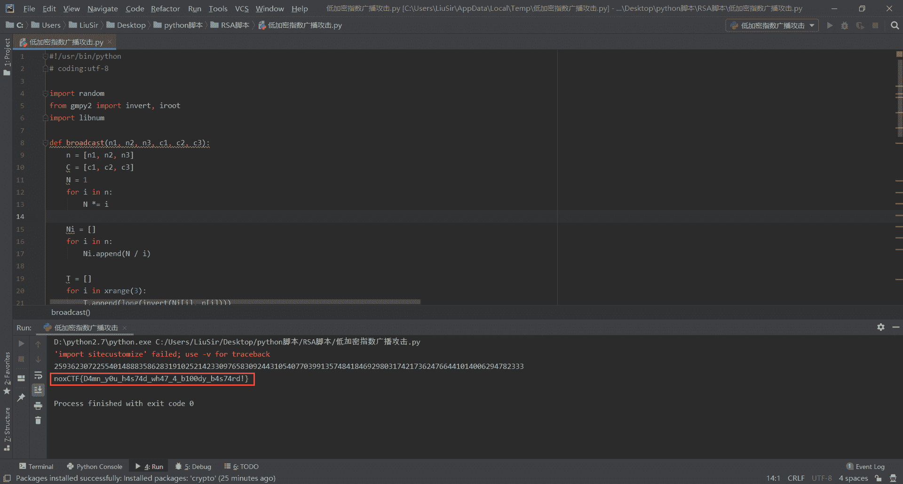

## 模不互素（存在两个或更多非常大的模数 n，且n1和n2不互质）

适用条件：存在两个或更多非常大的模数 n，且n1和n2不互质，即gcd(N1,N2)!=1，二者有公因数。

例题：

题目给出如下：

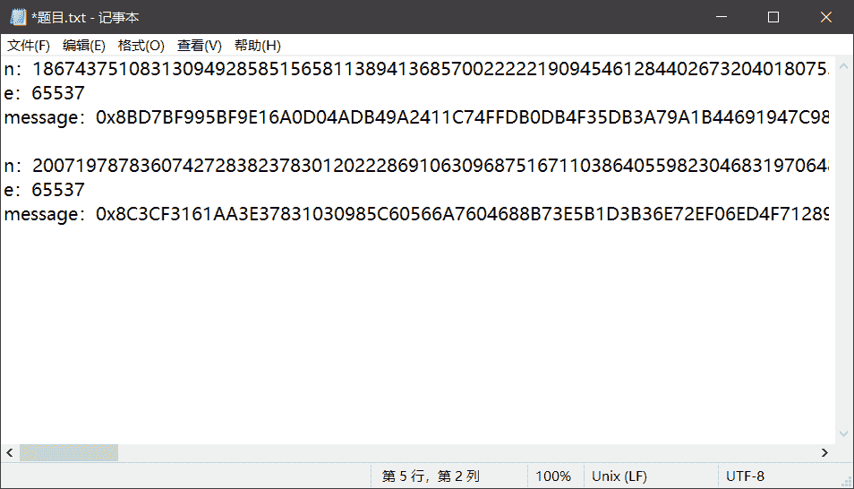

让我们求出明文。

**由于 不能直接 分解 n ，只能先找出 n1，n2 的公因数作为 q ，再拿n1 ，n2除以 q 得到 p1 和p2**

编写脚本：

判定 x 和 y 是否互素：

```
 def gcd(a, b):  
    if (b == 0):
        return a
    else:
        return gcd(b, a % b)

def main():
    x = 17  
    y = 65537
    if gcd(x, y) == 1:  
        print(str(x) + " " + str(y) + "  两个数互素")
    else:
        print(str(x) + " " + str(y) + " 两个数不互素")

if __name__ == "__main__":
    main() 
```

解密脚本：（题目给的c1和c2是十六进制，我们可以先将其转换成十进制再解密）

```
 import gmpy2
import libnum

c1 = int(
    '0x8BD7BF995BF9E16A0D04ADB49A2411C74FFDB0DB4F35DB3A79A1B44691947C9824085BC4CA5F7F4EFA3C8FD0BC3E870AA6D5E15307A63A2172C44C5903D35785B8D06B51651EE7106B070D5A6AABA089AB67609661265B74914C865F863DC1D2DC08CE0B026107A74EC3FDC62666B50110B9D15A243EAAD6F53646929A3369285404868E42DD0BBE92D956018E3C0B36EF5E9516E433228CFDD06D6E662EC0A9A31061EA11F61CA17EABF43D2D4977FC9D6FC53AB6DC01509401B8D9A46B59A9ADAA97D54CC50C27445E4C21B893510620EC3566AD6E8727FA147437B207505217E6F2DF009E2286C8354D281374D7802D08A2062FE48DBF135BBCAB120EBF84',
    16)
c2 = int(
    '0x8C3CF3161AA3E37831030985C60566A7604688B73E5B1D3B36E72EF06ED4F71289EFE80E0D94BD755034E6C210F17DA85B9D0388F3AD104C68BC514A8EB1569A109EB5F266F7C5FA4DDFA638258949B43D4CF1406720CCD4CA11E74FDF8AEB35C56A79781C87157FC4213573329C5B0FF411F8A4F34580AA103DB9FD403C0D409FA11860A7C4595FDC49DC2CF94E5112B772E5DEC8F17E24B10A7FD7A95DCB87BE5E27C32FC931574A7847BC506A61EFE9DB3D3F612143845FE80D7B3EA548B886A67A29CBDB2775B1F91178B6DA763F1A6ECFF46592E4C7FFAAB6C9FEF29D9CB9E035A3D98ECFFB26BA2EEAA56D1CD096E6A2CF9A58086CAD7718DDA5CB0C1B',
    16)
n1 = int(
    18674375108313094928585156581138941368570022222190945461284402673204018075354069827186085851309806592398721628845336840532779579197302984987661547245423180760958022898546496524249201679543421158842103496452861932183144343315925106154322066796612415616342291023962127055311307613898583850177922930685155351380500587263611591893137588708003711296496548004793832636078992866149115453883484010146248683416979269684197112659302912316105354447631916609587360103908746719586185593386794532066034112164661723748874045470225129298518385683561122623859924435600673501186244422907402943929464694448652074412105888867178867357727)
n2 = int(
    20071978783607427283823783012022286910630968751671103864055982304683197064862908267206049336732205051588820325894943126769930029619538705149178241710069113634567118672515743206769333625177879492557703359178528342489585156713623530654319500738508146831223487732824835005697932704427046675392714922683584376449203594641540794557871881581407228096642417744611261557101573050163285919971711214856243031354845945564837109657494523902296444463748723639109612438012590084771865377795409000586992732971594598355272609789079147061852664472115395344504822644651957496307894998467309347038349470471900776050769578152203349128951)

p1 = gmpy2.gcd(n1, n2)
assert (p1 != 1)
p2 = n1 / p1
p3 = n2 / p1
e = 0x10001
d1 = gmpy2.invert(e, (p1 - 1) * (p2 - 1))
d2 = gmpy2.invert(e, (p1 - 1) * (p3 - 1))
m1 = pow(c1, d1, n1)
m2 = pow(c2, d2, n2)
print libnum.n2s(m1) + libnum.n2s(m2) 
```

执行后即可得到flag：

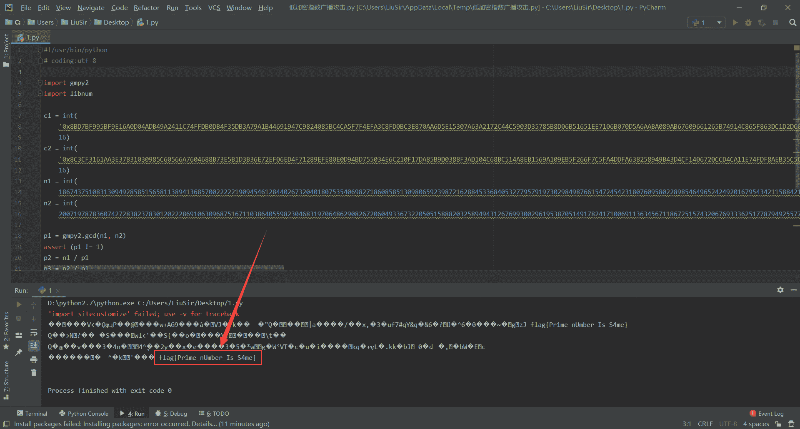

## 共模攻击（m，n相同、e，c不同，且e1 和 e2互质）

适用情况：明文m、模数n相同，公钥指数e、密文c不同，gcd(e1,e2)==1，也就是e1和e2互质。

对同一明文的多次加密使用相同的模数和不同的公钥指数可能导致共模攻击。

例题：

题目给出如下：

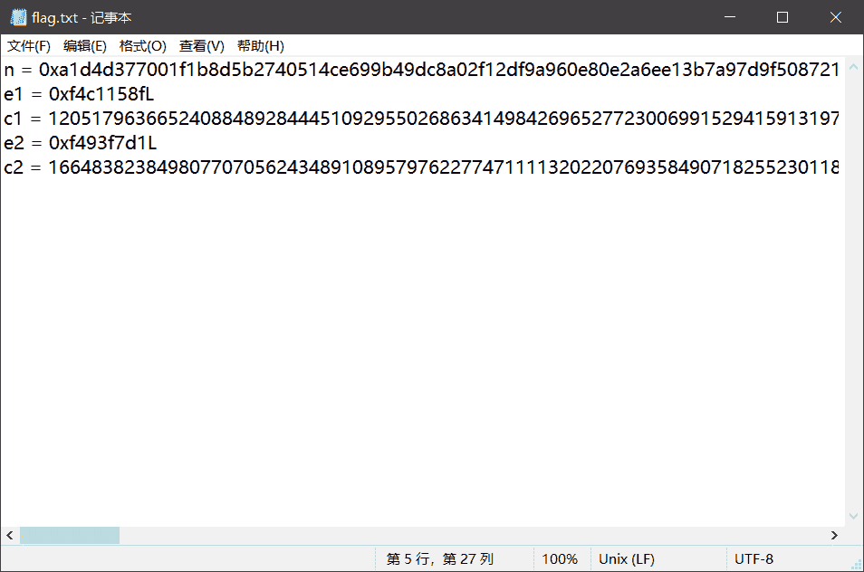

可以发现，明文m、模数n相同，公钥指数e、密文c不同，且e1 和 e2互质，为共模攻击，直接上脚本：

```
from gmpy2 import *
import libnum

n=int('a1d4d377001f1b8d5b2740514ce699b49dc8a02f12df9a960e80e2a6ee13b7a97d9f508721e3dd7a6842c24ab25ab87d1132358de7c6c4cee3fb3ec9b7fd873626bd0251d16912de1f0f1a2bba52b082339113ad1a262121db31db9ee1bf9f26023182acce8f84612bfeb075803cf610f27b7b16147f7d29cc3fd463df7ea31ca860d59aae5506479c76206603de54044e7b778e21082c4c4da795d39dc2b9c0589e577a773133c89fa8e3a4bd047b8e7d6da0d9a0d8a3c1a3607ce983deb350e1c649725cccb0e9d756fc3107dd4352aa18c45a65bab7772a4c5aef7020a1e67e6085cc125d9fc042d96489a08d885f448ece8f7f254067dfff0c4e72a63557',16)
e1=int('f4c1158f',16)
e2=int('f493f7d1',16)
s = gcdext(e1, e2)
s1 = s[1]
s2 = -s[2]

c1=12051796366524088489284445109295502686341498426965277230069915294159131976231473789977279364263965099422235647723775278060569378071469131866368399394772898224166518089593340803913798327451963589996734323497943301819051718709807518655868569656941242449109980876397661605271517459716669684900920279597477446629607627693769738733623143693170696779851882404994923673483971528314806130892416509854017091137325195201225617407959645788145876202882024723106204183257094755002924708009138560347432552090905489132135154932987521239299578509008290614398700799670928805692609756924823628055245227290288940649158862576448537833423
c2=16648382384980770705624348910895797622774711113202207693584907182552301186239613809347201161450012615995859738410661452438496756353485538305614949211776668793864984429696790944750894691957799234264508530084026894611228513698963347402329109838109621609770406925700520983387811451074838470370044678634099202003480925903267508744006195455234025325060817223813858985074720872124168142943926467694676717713503559007112874381750005406371400109962943508349497151148446064846096531445037416174913915923050332242843403926133165817310272633884358263778516770288515592959832151762499526363131801945163501999337808208074381212795
#e2=9647291
c2 = invert(c2, n)
m = (pow(c1,s1,n) * pow(c2 , s2 , n)) % n
print m
print libnum.n2s(m) 
```

（注意进制转换，上面的n、e1、e2为十六进制，c1、c2为十进制，我们要把他们转化为相同的进制）

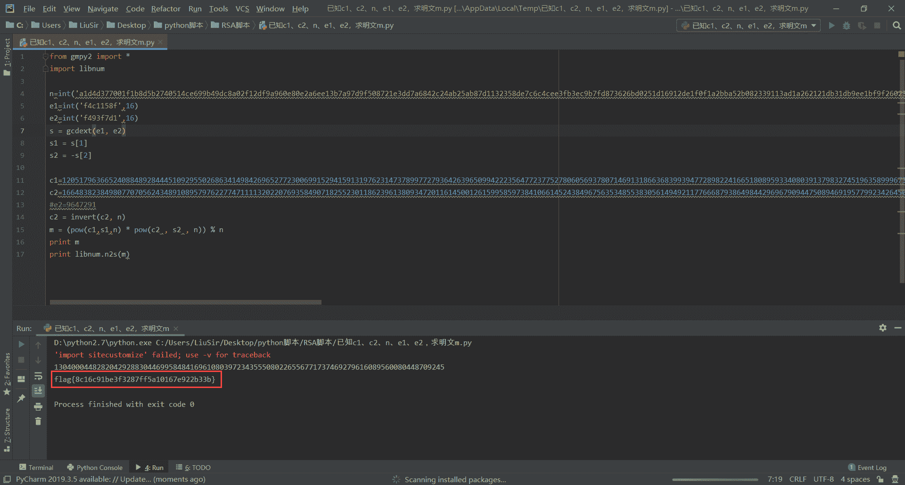

如上图得到flag。