<!--yml
category: 未分类
date: 2022-04-26 14:54:57
-->

# SCTF 2019 re部分题解(持续更新中)_pipixia233333的博客-CSDN博客

> 来源：[https://blog.csdn.net/qq_41071646/article/details/93536419](https://blog.csdn.net/qq_41071646/article/details/93536419)

一个月都很颓废  导致 比赛没有打的很好  而且 浪费了很多时光 

说起来这还是 我第250篇原创博客 23333

暑假有了一些计划  搞搞密码学 编译原理 等等其它东西

然后呢    收拾好心情后 看了一眼SCTF  

说实话 SCTF比上次的那个分站赛对我胃口 是 *CTF还是什么来着   并非说 *CTF不好 而是我密码学太烂了（所以暑假准备补补）

然后看一下 第一题吧

strange apk 

这个题  已经有所提示了   

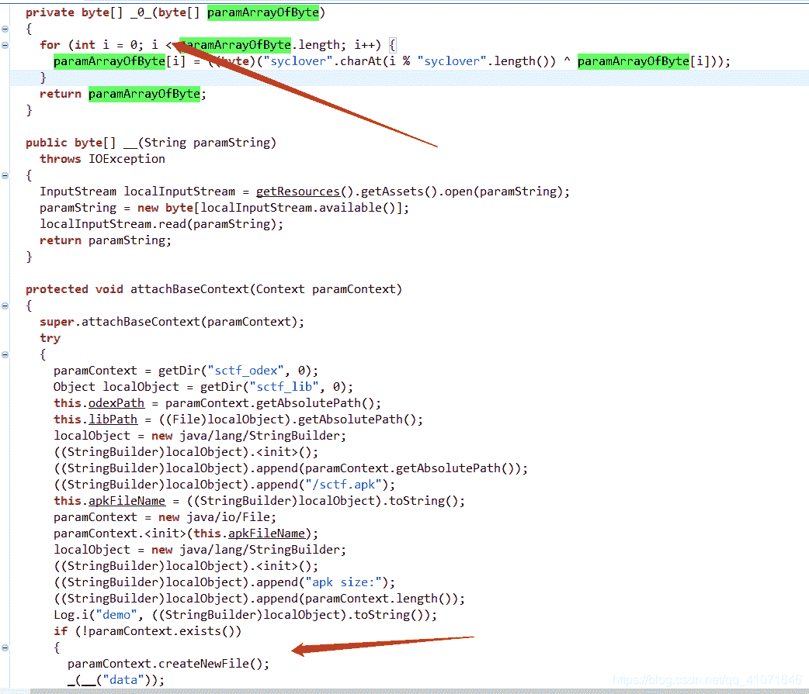

发现 下面的那个函数 最后经过了那个异或判断然后写了回去  用一个脚本 搞出来就好

```
#!/usr/bin/env python2
# -*- coding:utf-8 -*-

if __name__=="__main__":
  key="syclover"
  encode = open("data", "rb").read()
  fdecode = open("mydata","wb")
  decode = ''
  cout=0
  for d in encode:
    decode += chr(ord(d)^ord(key[cout % 8]))
    cout+=1

  with open('mydata', 'wb') as f:
    f.write(decode)
```

然后 发现data 搞出来是一个apk

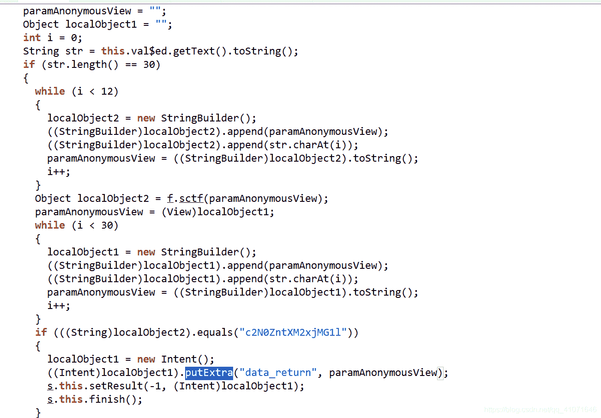

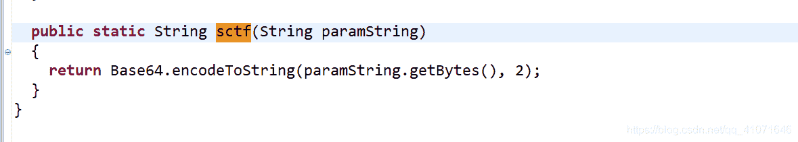

这里是base64  说明前12位base64加密 等于那个字符串

然后看下面 putExtra 这个函数类似windows 的消息   是 安卓的 一个页面传入另一个页面 变量的一个方法

可以去了解一下

然后 去找一下  发现了

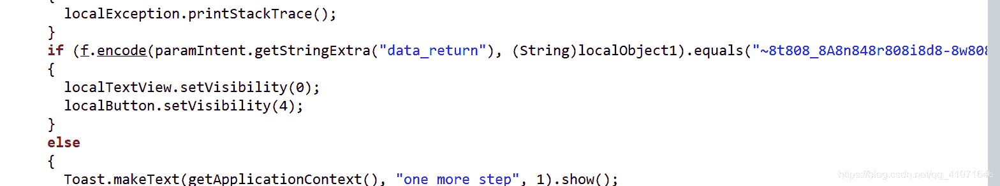

点进去看

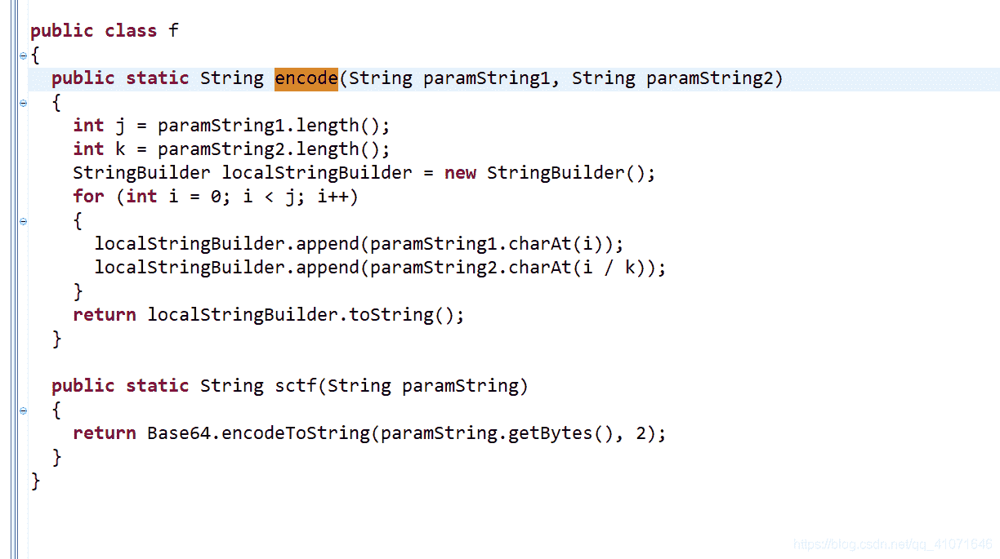

字符串一是可控的 我们让字符串一 尽量符合就好

```
#!/usr/bin/env python3
# -*- coding:utf-8 -*-
import base64
if __name__=="__main__":
	strFlag=""
	str1="c2N0ZntXM2xjMG1l"
	str2="~8t808_8A8n848r808i8d8-8w808r8l8d8}8"
	strFlag = str(base64.b64decode(str1))[2:-1]
	#print(strFlag)
	for i in range(0,len(str2),2):
		#print(str2[i])
		strFlag+=str(str2[i])
	print(strFlag)
```

sctf{W3lc0me~t0_An4r0id-w0rld}

第二题  crackme

这个题目因为涉及到了 密码学 不太清楚 所以 就白给了很多天

最后  知道了是aes

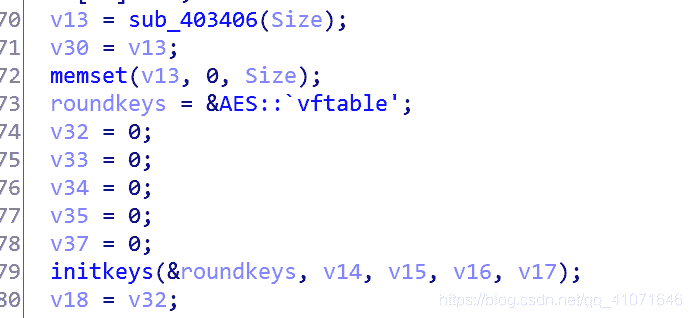

然后跟着 别人的aes 代码对着分析，，，，，   才分析出来这个 是CBC模式  然后一开始总是接错  还以为自己哪里出问题了

后来发现 是自己的问题

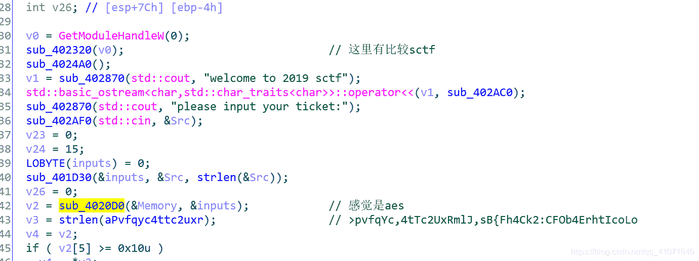

那个SCTF我没有注意 发现这里把 >pvfqYc,4tTc2UxRmlJ,sB{Fh4Ck2:CFOb4ErhtIcoLo 这个字符串改了

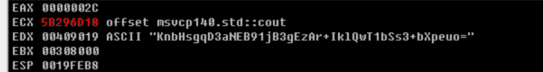

nKnbHsgqD3aNEB91jB3gEzAr+IklQwT1bSs3+bXpeuo= （前面有个n 没有显示出来）然后 这里就很给了 往下分析aes  发现了

key

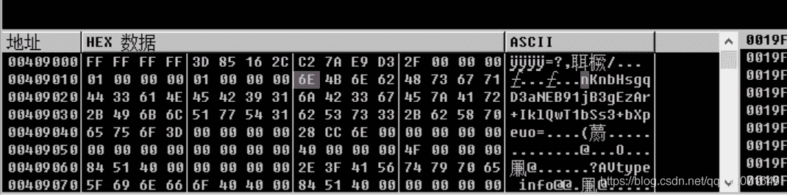

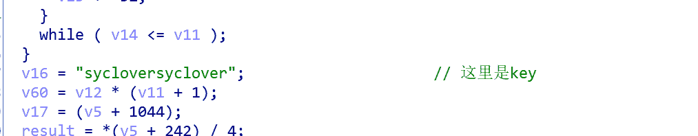

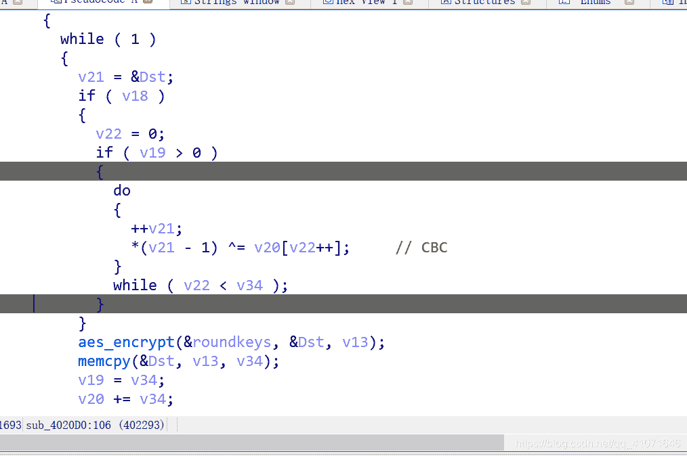

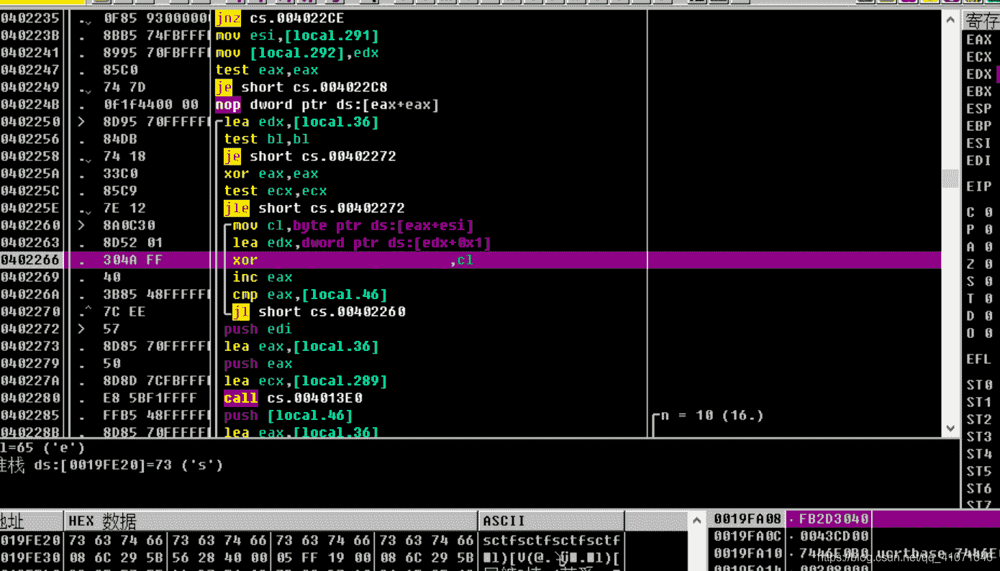

IV向量是 sctf*4

解出flag就好

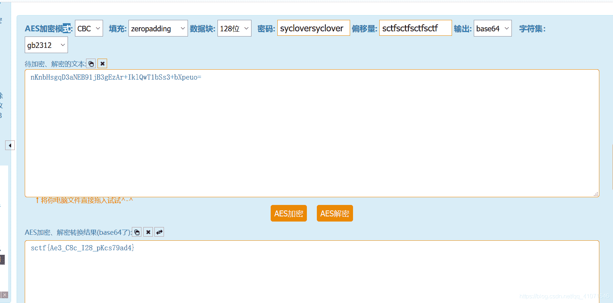