<!--yml
category: 未分类
date: 2022-04-26 14:50:40
-->

# TWCTF 2016 (Tokyo Westerns CTF ) WEB WriteUp_Bendawang的博客-CSDN博客

> 来源：[https://blog.csdn.net/qq_19876131/article/details/52453875](https://blog.csdn.net/qq_19876131/article/details/52453875)

这个是9.3-9.5举行的一个比赛。上个链接[https://score.ctf.westerns.tokyo/problems?locale=en](https://score.ctf.westerns.tokyo/problems?locale=en)

不过我这一段时间都在忙着做一个智障的项目，大的比赛都没时间做，也就只能赛后来补补题，发现自己还是太菜了，菜的抠脚。
还好题目还开着。不过补题花了不少时间，学了不少姿势。
现在貌似还开着的，不知道会开多久。

## web 50 Global Page

比赛的时候做的，抓包试验了几次就摸清规律了，修改请求头，GET的page参数设置为`php:/`，然后在`Accept-Language`参数设置为`/filter/convert.base64-encode/resource=**`，就可以使用`php://`配合文件包含读取任意文件了。

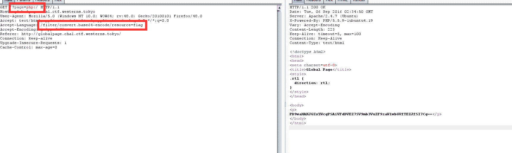

拿到了flag，base64解码得到flag是`TWCTF{I_found_simple_LFI}`

## web 100 Get the admin password!

一道mdb注入，不多解释了，比较简单，这里就不对mongodb注入做太多说明了，回头有空写个博客来详细总结下好了。
直接写个脚本盲注下就可以了，截图如下：
因为忙着上厕所，所以懒得写二分了，上完回来就跑完了，所以就不贴了代码了，截图如下：

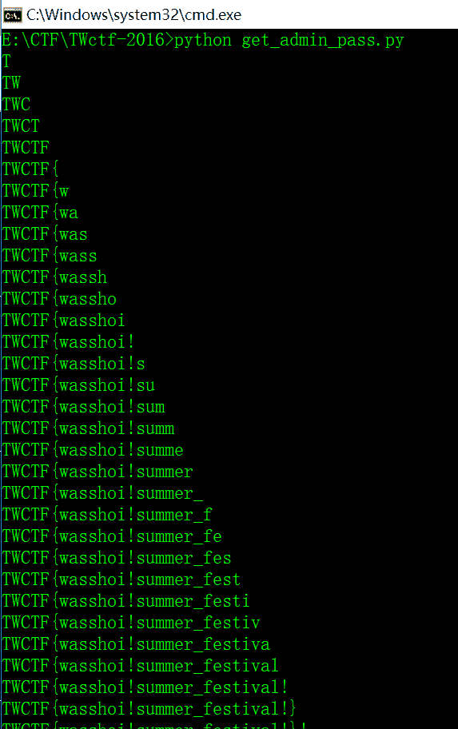

所以最后的flag就是`TWCTF{wasshoi!summer_festival!}`

## web 100 Poems

## web 150 rotten uploader

题目提示如下：

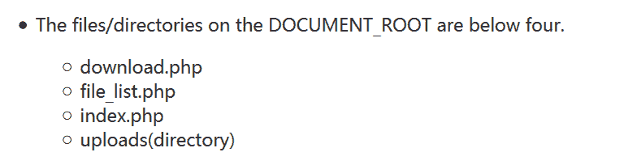

进入之后发现可以直接通过这样子`http://rup.chal.ctf.westerns.tokyo/downloader.php?f=../index.php`下载到`index.php`和`download.php`的源码，但是下`file_list.php`下不下来，先读另外两个的源码吧，`index.php`如下：

```
<?php

include('file_list.php');
?>
<!DOCTYPE HTML PUBLIC "-//IETF//DTD HTML 2.0 Level 2//EN">
<html>
  <head>
    <title>Uploader</title>
  </head>
  <body>
    <h1>Simple Uploader</h1>
    <p>There are no upload features.</p>
    <h3>Files</h3>
    <table width="100%" border="1">
          <tr>
            <th>#</th>
            <th>Filename</th>
            <th>Size</th>
            <th>Link</th>
          </tr>
              <?php foreach($files as $file): ?>
    <?php if($file[0]) continue;   
          <tr>
            <td><?= $file[1]; ?></td>
            <td><?= $file[2]; ?></td>
            <td><?= $file[3]; ?> bytes</td>
            <td><a href="download.php?f=<?= $file[4]; ?>">Download</a></td>
          </tr>
          <?php endforeach;?>
      </table>
  </body>
</html>
```

`download.php`如下：

```
<?php
header("Content-Type: application/octet-stream");
if(stripos($_GET['f'], 'file_list') !== FALSE) die();
readfile('uploads/' . $_GET['f']); 
?>
```

阅读之后发现`index.php`里面没啥信息，只是包含了下`file_list.php`，而`download.php`直接把这个过滤了，所以目的就是如何绕过过滤。
这里也是经过别人提示学到了一个新的姿势，这里通过wireshark抓包可以分析出服务器的操作系统是windows，之前我的博客也有说怎么判断操作系统，这里我是根据TTL=128得到服务器操作系统是windows的，

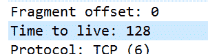

而windows是有长文件名和段文件名的区别。
给个链接[http://blog.csdn.net/oathevil/article/details/5717341](http://blog.csdn.net/oathevil/article/details/5717341)
所以最后payload就是

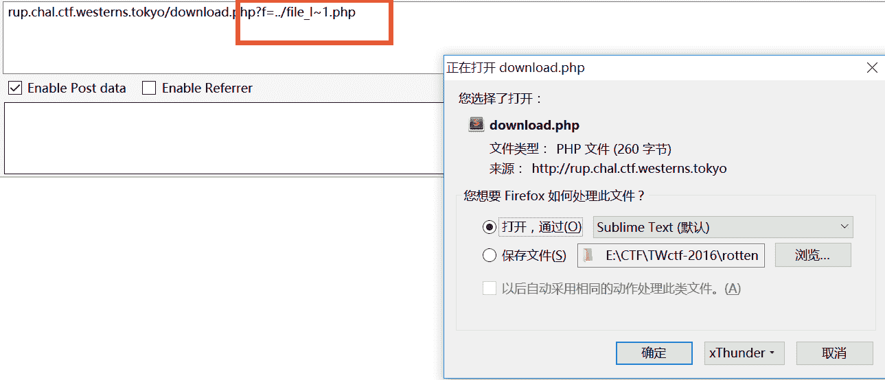

`file_list.php`源码如下：

```
<?php
$files = [
  [FALSE, 1, 'test.cpp', 1135, 'test.cpp'],
  [FALSE, 2, 'test.c', 74, 'test.c'],
  [TRUE, 3, '   ', 35, 'flag_c82e41f5bb7c8d4b947c9586444578ade88fe0d7'],
  [FALSE, 4, 'test.rb', 1446, 'test.rb'],
];
```

这样就得到提示了，直接又去获取`flag_c82e41f5bb7c8d4b947c9586444578ade88fe0d7`源码即可拿到flag，flag是`TWCTF{Hotto_Smile}`

## web 200 ZIP cracker

这里首页存在备份文件，如下：

```
 <?php
if(!empty($_FILES['zip']['tmp_name']) and !empty($_FILES['dict']['tmp_name'])) {
    if(max($_FILES['zip']['size'], $_FILES['dict']['size']) <= 1024*1024) {

        $zip = $_FILES['zip']['tmp_name'];
        $dict = $_FILES['dict']['tmp_name'];

        $option = "-D -p $dict";
        if(isset($_POST['unzip'])) {
            $option = "-u ".$option;
        }

        $cmd = "timeout 3 ./fcrackzip-1.0/fcrackzip $option $zip";
        $res = shell_exec($cmd);
    }
    else {
         $res = 'file is too large.';
    }
}
else {
 $res = 'file is missing';
}
?>
<!doctype html>
<html>
<head>
<meta charset=utf-8>
<title>ZipCracker - Crack Your Zip Online</title>
<link rel="stylesheet" href=""http://cdn.foundation5.zurb.com/foundation.css">
<link rel="stylesheet" href="/zipcracker.css">
</head>

<body>
<div class="main">
<div class="top-bar">
  <div class="top-bar-title">ZipCracker</div>
</div>
<div class="container-wrapper">
    <div class="container">
        <h1 class="container-head">
            Crack Your ZIP Online
        </h1>
        <p class="container-subhead">
            Only dictionary-based crack is available.<br>
            Both zip and dictionary file must not exceed 1MB.
        </p>
        <form action="" method="POST" enctype="multipart/form-data">
            <label for="zip" class="button">ZIP file</label>
            <input id="zip" type="file" name="zip" class="show-for-sr">

            <label for="dict" class="button">Dictionary file</label>
            <input id="dict" type="file" name="dict" class="show-for-sr">

            <input id="unzip" type="checkbox" name="unzip">
            <label for="unzip">use unzip</label>

            <button type="submit" class="success button">Crack</button>
        </form>
        <p>file is missing</p>
    </div>
</div>
</div>
</body>
</html>
```

然后知道目录下有一个工具fcrackzip，能够访问并且下载其所有的源文件和工具，看完wp知道应该是工具里面写法有问题，这里时间也不很够就没有去看工具源码，直接给出做法，有兴趣的可以自己去看看。
首先是创建一个以`aaa";ls /#`为密码的zip文件，然后在把密码写进pass.txt


然后上传就可以了，记住勾选`use unzip`

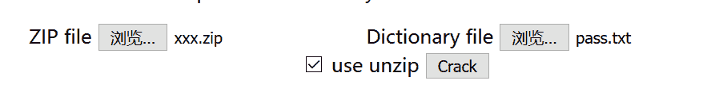

看源码发现命令执行了：

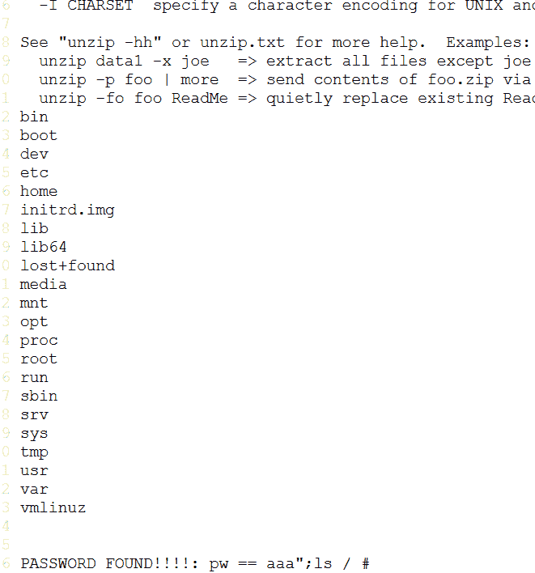

那就可以直接`cat flag.php`了

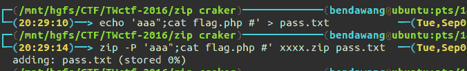

提交
成功拿到flag

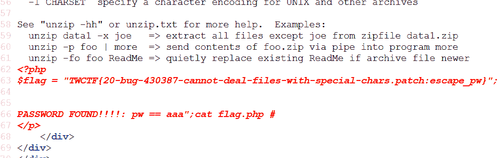

## web 300 Tsurai Web

这道题的主要考点就是
例如用的是`__import__('a')`
而当前目录如下：

```
 |-a
  |
  |-a.py
```

它会引用文件夹a下的`__init__.py`
而这里题目的源码可以下下来自己跑起来，就是flask框架写得，不懂得可以看看我的博客里面有关于flask的介绍，嘿嘿
自己跑起来的时候，每创建一个用户，就会在data下创建如下

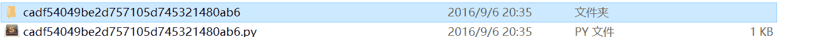

漏洞点在这里

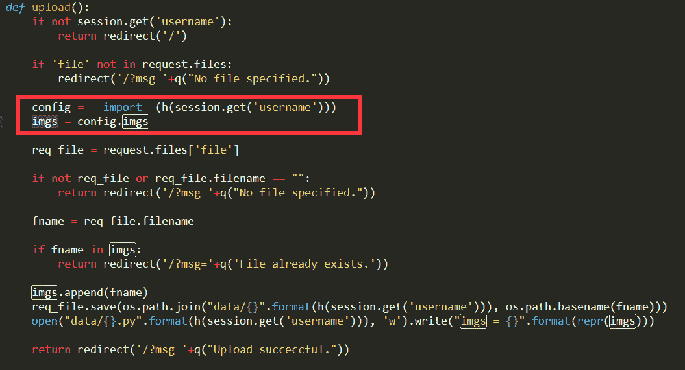

就是最开始说的，它会优先引用同名文件夹的`__init__.py`，当时前提是得有，但是这里我们上传的所有文件都以原文件名存在该文件夹下。
所以我们就可以手动上传一个`__init__.py`，
本地如图：

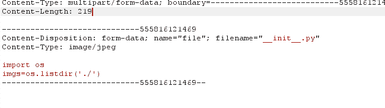

跟随重定向可以看到

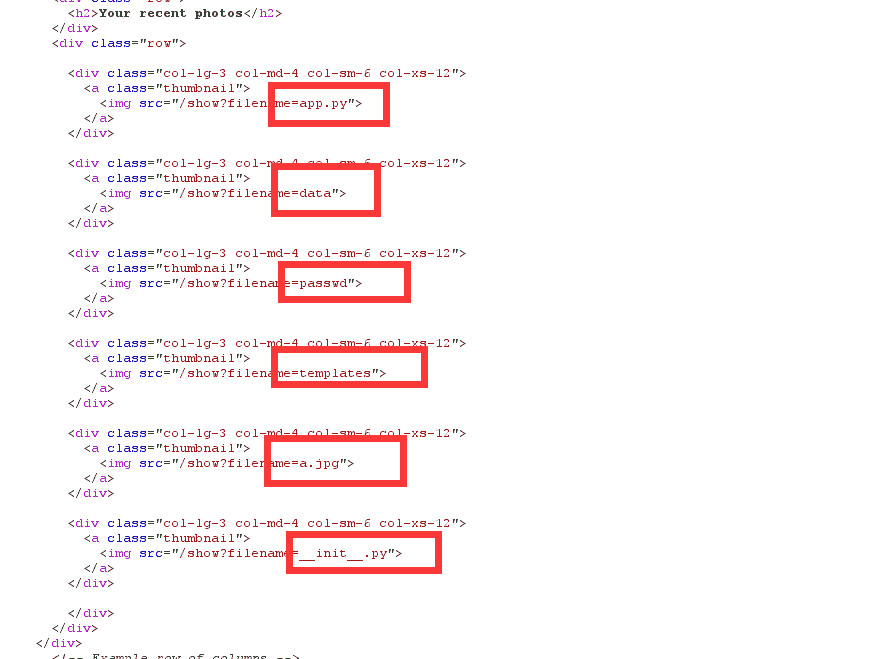

把本地目录所有都读取出来了。

现在上题目操作，其实都是一样的，读取出

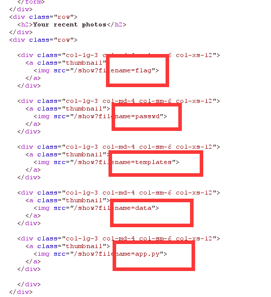

目录下存在一个flag，接下来直接读取flag文件内容即可

这里我不知道咋回事报500error，所以我重新注册一个账户，上传py执行命令读取flag文件就可以了
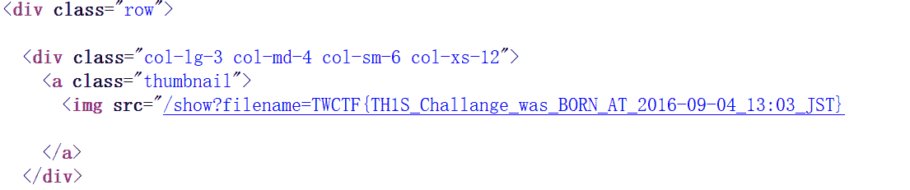

所以flag就是`TWCTF{TH1S_Challange_was_BORN_AT_2016-09-04_13:03_JST}`