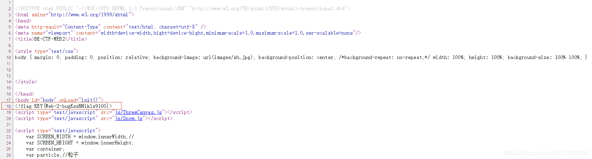
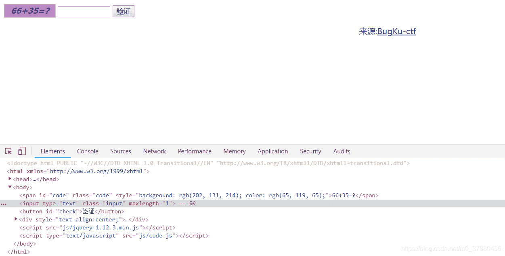
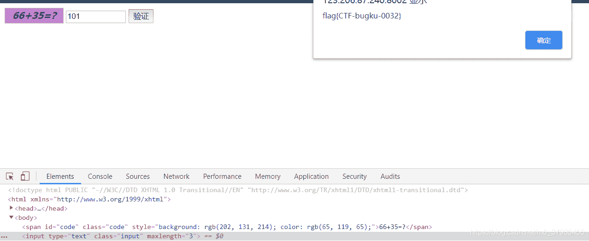
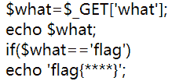
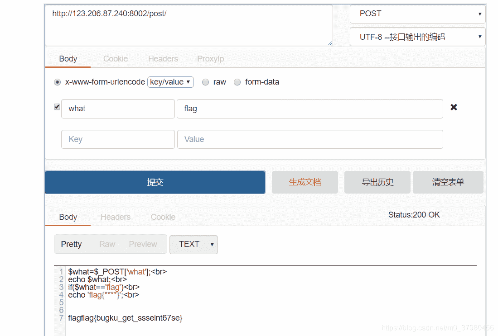
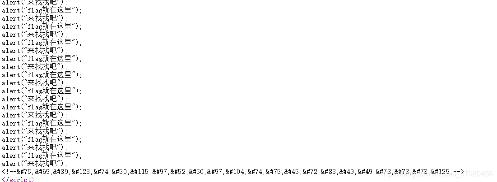
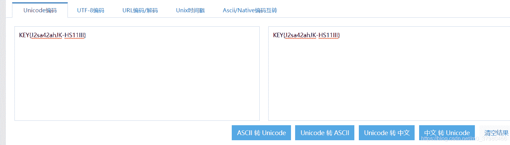
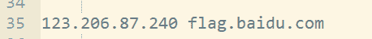
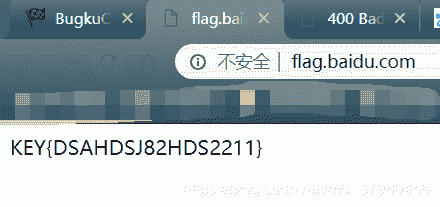
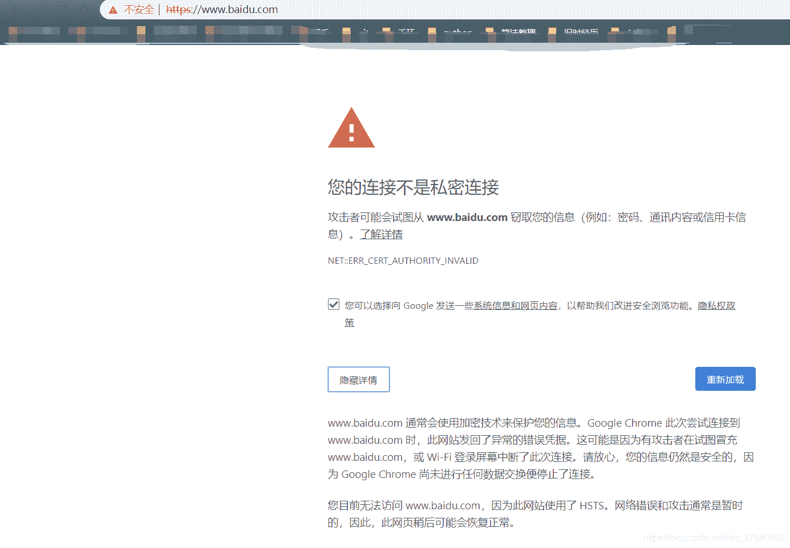

<!--yml
category: 未分类
date: 2022-04-26 14:53:08
-->

# Writeup_BugkuCTF_Web_秦小乙的工作台的博客-CSDN博客

> 来源：[https://blog.csdn.net/m0_37980456/article/details/88383560](https://blog.csdn.net/m0_37980456/article/details/88383560)

# 前言

0基础上手CTF（现在也很菜），刷题时也会感觉有些writeup在我当时还不够零基础，希望能帮助到一些想要涉及该方面的同学。本篇针对Web题，尽量用通俗易懂的方式讲解，或者会点出相关知识点方便自主查找，比较优质的题目会有一些自己的心得。

## 1\. web2

打开是动态的滑稽图，没有头绪直接右键查看网页源代码（或者Ctrl+U）

注释内得到flag。

## 2.计算题

输入时发现只能输入一位数，很明显是网页css设置了最大长度(JavaWeb知识)。

右键“检查”找到此处的maxlength双击改为所需位数，然后输入正确答案即可得到flag。

## 3.web基础$_GET

和第4题都属于两种页面提交方式。

php语言，语意大致为选择判断，get“what”时输出what指代内容，get“flag”时输出 flag。因此利用URL定义，payload为：[http://123.206.87.240:8002/get/?what=flag（即在网址后方直接加上?what=flag）即可获得flag。](http://123.206.87.240:8002/get/?what=flag%EF%BC%88%E5%8D%B3%E5%9C%A8%E7%BD%91%E5%9D%80%E5%90%8E%E6%96%B9%E7%9B%B4%E6%8E%A5%E5%8A%A0%E4%B8%8A?what=flag%EF%BC%89%E5%8D%B3%E5%8F%AF%E8%8E%B7%E5%BE%97flag%E3%80%82)

## 4.web基础$_POST

post不能简单在网址修改，故使用在线工具实现post访问提交内容(工具地址：[http://coolaf.com/tool/post）](http://coolaf.com/tool/post%EF%BC%89)

成功获得flag。

## 5\. 矛盾

```
$num=$_GET['num'];
if(!is_numeric($num))
{
echo $num;
if($num==1)
echo 'flag{**********}';
} 
```

依旧是php代码，大意为is_numeric函数判断num是否为数字，数字不输出，非数字再判断num若为1则输出flag。可是如果num为1在第一个判断就无法通过了！！

这里面涉及到了**%00截断**这个知识点：URL中的%00（形如%xx）,web server会把它当作十六进制处理，然后将该十六进制数据hex（00）“翻译”成统一的ASCII码值“null”。
构建payload:

> index1.php?num=1%00

这使得第一次判断时，num后有空不为数字，第二次判断时num值也为1,符合所有要求得到flag。

## 6\. web3

这道题打开后是不断弹出的alert警告，玩了一会儿发现没什么动静，查看网页源代码发现注释里有一段特殊字符，不理解什么意思，去查了一下这种“&#x;”格式，获知这是Unicode编码方式。

同样利用[工具](http://tool.chinaz.com/tools/unicode.aspx)进行Unicode转中文即可获得flag。


## 7\. 域名解析

题目提示很清楚，需要将flag.baidu.com解析到123.206.87.240
第一次打开无连接，即DNS访问无法连接，所以利用hosts文件修改，

这里相当于添加指定数字ip路径到字符串网址，通过这种方式即可进入该页面，即可获得flag。

这道题解题关键在于搞清楚域名解析、hosts、IP地址、DNS解析的原理，~~为什么hosts里指定的数字ip可以打开对应字符串网址（域名）？直接输入相应数字ip为什么没有效果？~~
hosts的特点是优先于DNS解析查询域名的IP地址，而每一个IP地址唯一对应网络中众多的主机之一（同时又可以对应多个域名）。因此当IP地址未与域名通过DNS绑定时，如果单纯输入IP就可能会因为一个IP对应多个网站，没办法查找到所需网站额，而这时候的域名和网站又是一一对应的，所以才可以出现这种需要IP先与域名绑定（这里是利用hosts文件实现绑定）再通过域名查找到真正所需网站。
相应的也引申出hosts文件的问题，我们常修改hosts文件来实现翻墙或者使用其他脚本，但hosts中毒可能导致的DNS劫持也必须提防，可能会出现网页地址没有问题但实际使用的ip地址指向其他网站。当然，现在的大网站一般也都有相应的审核机制，譬如：
