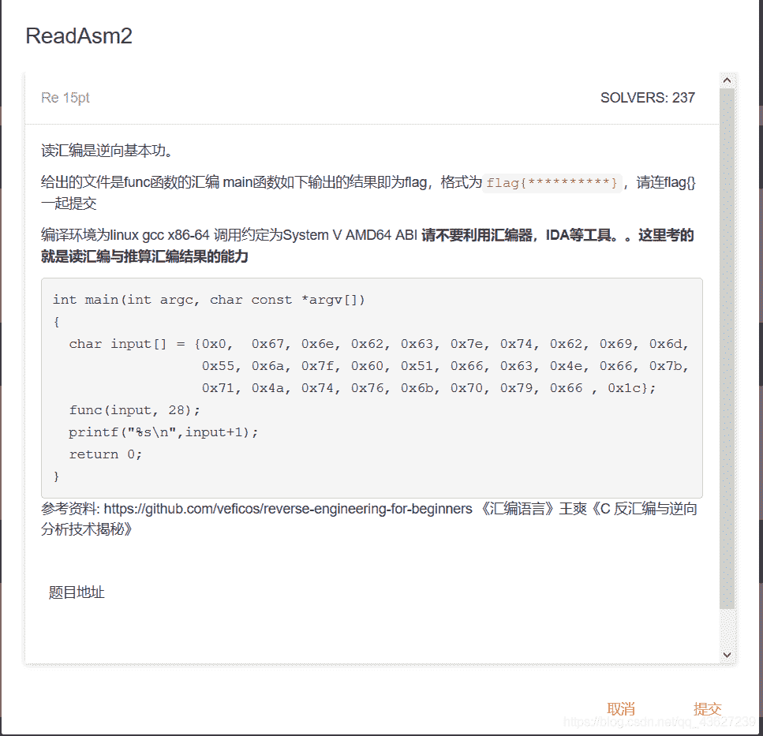
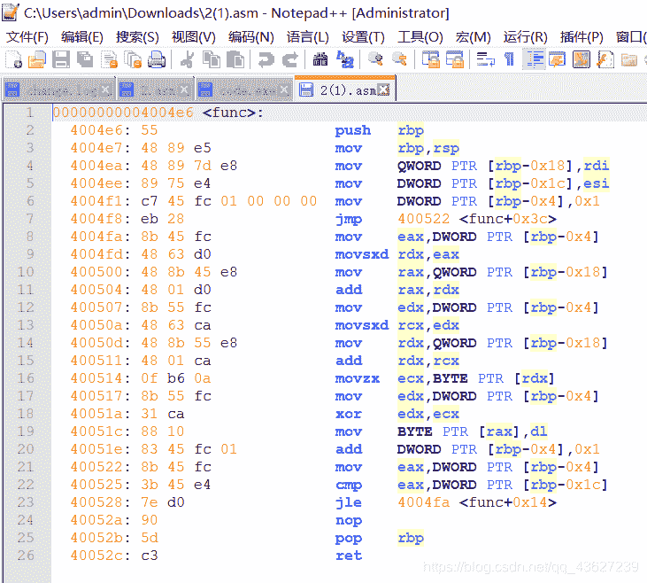
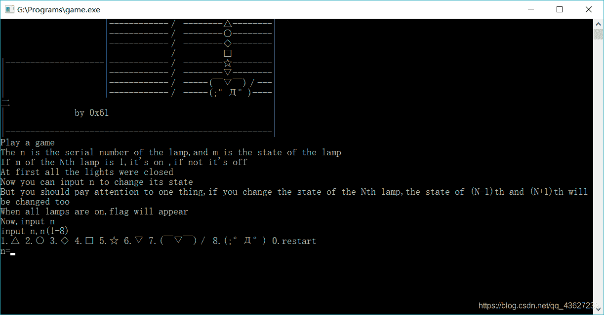
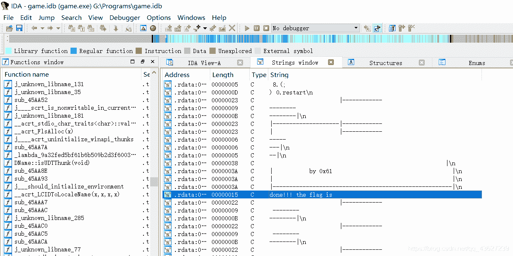
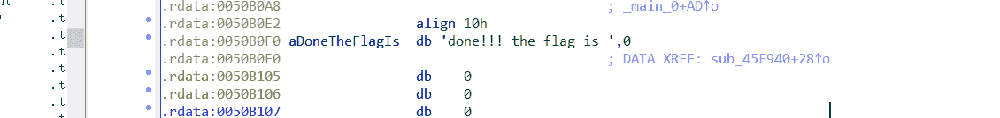

<!--yml
category: 未分类
date: 2022-04-26 14:44:22
-->

# XL----逆向入门新手题解_颜又舞的博客-CSDN博客

> 来源：[https://blog.csdn.net/qq_43627239/article/details/96910805](https://blog.csdn.net/qq_43627239/article/details/96910805)

今天做的逆向题分为两类

1.静态分析 2.动态分析

还有汇编语言的理解！

1.南邮ctf训练平台第二题：

这个题不用任何汇编语言的工具 就只是把汇编读懂 然后写出脚本运行就得到flag

打开这道题



分析main函数 可以发现主要功能还是在于func函数中 于是我们仔细看func函数

00000000004004e6<func>:;4004e6一列表示该指令对应的虚拟内存地址 55一列为该指令对应的计算机指令

4004e6:55push rbp ;入栈，将寄存器的值压入调用 bp栈中

4004e7:4889 e5 mov rbp,rsp;建立新栈帧，别掉函数栈帧栈底地址放入寄存器

4004ea:48897d e8 movQWORDPTR[rbp-0x18],rdi;对应main中input[]这时i=0 //[rbp-0x18] = input[0]

4004ee:8975 e4 movDWORDPTR[rbp-0x1c],esi;放入28 //[rbp-0x1c] = 28

4004f1: c745 fc 01000000movDWORDPTR[rbp-0x4],0x1;首先将0x1赋值给[rbp-0x4] //i = 1

4004f8: eb28jmp400522<func+0x3c>;接着跳转到400522的位置 //for(i=1;i<=28;i++) 下面以第一次过程为例

4004fa:8b45 fc moveax,DWORDPTR[rbp-0x4];将[rbp-0x4]的值赋给eax寄存器 //即令eax=i =1

4004fd:4863 d0 movsxd rdx,eax;将eax的值带符号扩展，并传送至rdx中 //即令rdx=eax =i =1

400500:488b45 e8 mov rax,QWORDPTR[rbp-0x18];将rax的值给input[0] //即令rax = input[0] =[rbp-0x18]

400504:4801 d0 add rax,rdx;将rdx的值加上rax再赋值给rax //即 rax=input[1] =i+input[0] =rdx+rax

400507:8b55 fc movedx,DWORDPTR[rbp-0x4];将[rbp-0x4]的值给edx //即令edx=i =1

40050a:4863 ca movsxd rcx,edx;将edx的值带符号扩展，并传送至rcx中 //即令rcx=i =1

40050d:488b55 e8 mov rdx,QWORDPTR[rbp-0x18];将[rbp-0x18]的值给rdx //即令rdx=[rbp-0x18] =input[0]

400511:4801 ca add rdx,rcx;将rcx的值加上rdx再赋值给rdx //即i++ rdx=input[1]

400514:0f b6 0amovzxecx,BYTEPTR[rdx];将rdx无符号扩展，并传送至ecx //即ecx=chr(rdx) =chr(input[0])

400517:8b55 fc movedx,DWORDPTR[rbp-0x4];edx = [rbp-0x4] //即edx=i =1

40051a:31 ca xoredx,ecx;将edx与ecx异或 //i^input[0]

40051c:8810movBYTEPTR[rax],dl;rax = dl

40051e:8345 fc 01addDWORDPTR[rbp-0x4],0x1;[rbp-0x4]++ //i++

400522:8b45 fc moveax,DWORDPTR[rbp-0x4];将[rbp-0x4]的值赋给eax寄存器 //eax = i

400525:3b45 e4 cmpeax,DWORDPTR[rbp-0x1c];将[rbp-0x1c]中的值与eax值比较第一次就是28

400528:7e d0 jle4004fa<func+0x14>;如果<=那么就跳到4004fa //if eax即i <=28跳到4004fa继续循环

40052a:90nop;空指令

40052b:5dpop rbp ;出栈

40052c: c3ret;ret相当于return
然后可以写出python脚本或者C语言脚本得到flag

```
 python脚本

a = [0x67,0x6e,0x62,0x63,0x7e,0x74, 0x62, 0x69, 0x6d, 0x55, 0x6a, 0x7f, 0x60, 0x51, 0x66, 0x63, 0x4e, 0x66, 0x7b,0x71, 0x4a, 0x74, 0x76, 0x6b, 0x70, 0x79, 0x66 , 0x1c]
b = ""
for x in range(1,29):
b=b+chr(a[x-1] ^ x)
print b

 c脚本

 #include<stdio.h>

void func(char* a,int s)
{
    for(int i=1;i<=s;i++)
    {
       a[i]=char(a[i]^ i);
    }
}
int main()
 {
  char input[] = {0x0,  0x67, 0x6e, 0x62, 0x63, 0x7e, 0x74, 0x62, 0x69, 0x6d,
                  0x55, 0x6a, 0x7f, 0x60, 0x51, 0x66, 0x63, 0x4e, 0x66, 0x7b,
                  0x71, 0x4a, 0x74, 0x76, 0x6b, 0x70, 0x79, 0x66 , 0x1c};
    func(input,28);
    for(int i=0;i<=28;i++)
    {
        printf("%c",input[i]);
    }

     return 0;
 }
```

一篇写的很好的题解

[https://blog.csdn.net/xiangshangbashaonian/article/details/78881498](https://blog.csdn.net/xiangshangbashaonian/article/details/78881498)

静态分析：（工具：IDA）

攻防世界第二题 game.exe

打开 发现是一个游戏 意思是有n盏灯，m是灯的状态，m为1灯是开，m为0灯是关。一开始灯全部都是关的。现在输入一个序列对n盏灯进行开关使它们都是亮的就可以找到flag，开关第n盏灯时，会影响到n-1和n+1盏灯的状态。



关键是静态分析 把exe文件用IDA打开 用shift+F12打开strings windows

然后双击图中选中的那句话 得到如图 然后 右击鼠标点击list across........点击ok再点击F5跳转就可以看到源代码



源代码

```
int sub_45E940()
{
  signed int i; // [esp+D0h] [ebp-94h]
  char v2; // [esp+DCh] [ebp-88h]
  char v3; // [esp+DDh] [ebp-87h]
  char v4; // [esp+DEh] [ebp-86h]
  char v5; // [esp+DFh] [ebp-85h]
  char v6; // [esp+E0h] [ebp-84h]
  char v7; // [esp+E1h] [ebp-83h]
  char v8; // [esp+E2h] [ebp-82h]
  char v9; // [esp+E3h] [ebp-81h]
  char v10; // [esp+E4h] [ebp-80h]
  char v11; // [esp+E5h] [ebp-7Fh]
  char v12; // [esp+E6h] [ebp-7Eh]
  char v13; // [esp+E7h] [ebp-7Dh]
  char v14; // [esp+E8h] [ebp-7Ch]
  char v15; // [esp+E9h] [ebp-7Bh]
  char v16; // [esp+EAh] [ebp-7Ah]
  char v17; // [esp+EBh] [ebp-79h]
  char v18; // [esp+ECh] [ebp-78h]
  char v19; // [esp+EDh] [ebp-77h]
  char v20; // [esp+EEh] [ebp-76h]
  char v21; // [esp+EFh] [ebp-75h]
  char v22; // [esp+F0h] [ebp-74h]
  char v23; // [esp+F1h] [ebp-73h]
  char v24; // [esp+F2h] [ebp-72h]
  char v25; // [esp+F3h] [ebp-71h]
  char v26; // [esp+F4h] [ebp-70h]
  char v27; // [esp+F5h] [ebp-6Fh]
  char v28; // [esp+F6h] [ebp-6Eh]
  char v29; // [esp+F7h] [ebp-6Dh]
  char v30; // [esp+F8h] [ebp-6Ch]
  char v31; // [esp+F9h] [ebp-6Bh]
  char v32; // [esp+FAh] [ebp-6Ah]
  char v33; // [esp+FBh] [ebp-69h]
  char v34; // [esp+FCh] [ebp-68h]
  char v35; // [esp+FDh] [ebp-67h]
  char v36; // [esp+FEh] [ebp-66h]
  char v37; // [esp+FFh] [ebp-65h]
  char v38; // [esp+100h] [ebp-64h]
  char v39; // [esp+101h] [ebp-63h]
  char v40; // [esp+102h] [ebp-62h]
  char v41; // [esp+103h] [ebp-61h]
  char v42; // [esp+104h] [ebp-60h]
  char v43; // [esp+105h] [ebp-5Fh]
  char v44; // [esp+106h] [ebp-5Eh]
  char v45; // [esp+107h] [ebp-5Dh]
  char v46; // [esp+108h] [ebp-5Ch]
  char v47; // [esp+109h] [ebp-5Bh]
  char v48; // [esp+10Ah] [ebp-5Ah]
  char v49; // [esp+10Bh] [ebp-59h]
  char v50; // [esp+10Ch] [ebp-58h]
  char v51; // [esp+10Dh] [ebp-57h]
  char v52; // [esp+10Eh] [ebp-56h]
  char v53; // [esp+10Fh] [ebp-55h]
  char v54; // [esp+110h] [ebp-54h]
  char v55; // [esp+111h] [ebp-53h]
  char v56; // [esp+112h] [ebp-52h]
  char v57; // [esp+113h] [ebp-51h]
  char v58; // [esp+114h] [ebp-50h]
  char v59; // [esp+120h] [ebp-44h]
  char v60; // [esp+121h] [ebp-43h]
  char v61; // [esp+122h] [ebp-42h]
  char v62; // [esp+123h] [ebp-41h]
  char v63; // [esp+124h] [ebp-40h]
  char v64; // [esp+125h] [ebp-3Fh]
  char v65; // [esp+126h] [ebp-3Eh]
  char v66; // [esp+127h] [ebp-3Dh]
  char v67; // [esp+128h] [ebp-3Ch]
  char v68; // [esp+129h] [ebp-3Bh]
  char v69; // [esp+12Ah] [ebp-3Ah]
  char v70; // [esp+12Bh] [ebp-39h]
  char v71; // [esp+12Ch] [ebp-38h]
  char v72; // [esp+12Dh] [ebp-37h]
  char v73; // [esp+12Eh] [ebp-36h]
  char v74; // [esp+12Fh] [ebp-35h]
  char v75; // [esp+130h] [ebp-34h]
  char v76; // [esp+131h] [ebp-33h]
  char v77; // [esp+132h] [ebp-32h]
  char v78; // [esp+133h] [ebp-31h]
  char v79; // [esp+134h] [ebp-30h]
  char v80; // [esp+135h] [ebp-2Fh]
  char v81; // [esp+136h] [ebp-2Eh]
  char v82; // [esp+137h] [ebp-2Dh]
  char v83; // [esp+138h] [ebp-2Ch]
  char v84; // [esp+139h] [ebp-2Bh]
  char v85; // [esp+13Ah] [ebp-2Ah]
  char v86; // [esp+13Bh] [ebp-29h]
  char v87; // [esp+13Ch] [ebp-28h]
  char v88; // [esp+13Dh] [ebp-27h]
  char v89; // [esp+13Eh] [ebp-26h]
  char v90; // [esp+13Fh] [ebp-25h]
  char v91; // [esp+140h] [ebp-24h]
  char v92; // [esp+141h] [ebp-23h]
  char v93; // [esp+142h] [ebp-22h]
  char v94; // [esp+143h] [ebp-21h]
  char v95; // [esp+144h] [ebp-20h]
  char v96; // [esp+145h] [ebp-1Fh]
  char v97; // [esp+146h] [ebp-1Eh]
  char v98; // [esp+147h] [ebp-1Dh]
  char v99; // [esp+148h] [ebp-1Ch]
  char v100; // [esp+149h] [ebp-1Bh]
  char v101; // [esp+14Ah] [ebp-1Ah]
  char v102; // [esp+14Bh] [ebp-19h]
  char v103; // [esp+14Ch] [ebp-18h]
  char v104; // [esp+14Dh] [ebp-17h]
  char v105; // [esp+14Eh] [ebp-16h]
  char v106; // [esp+14Fh] [ebp-15h]
  char v107; // [esp+150h] [ebp-14h]
  char v108; // [esp+151h] [ebp-13h]
  char v109; // [esp+152h] [ebp-12h]
  char v110; // [esp+153h] [ebp-11h]
  char v111; // [esp+154h] [ebp-10h]
  char v112; // [esp+155h] [ebp-Fh]
  char v113; // [esp+156h] [ebp-Eh]
  char v114; // [esp+157h] [ebp-Dh]
  char v115; // [esp+158h] [ebp-Ch]

  sub_45A7BE("done!!! the flag is ");
  v59 = 18;
  v60 = 64;
  v61 = 98;
  v62 = 5;
  v63 = 2;
  v64 = 4;
  v65 = 6;
  v66 = 3;
  v67 = 6;
  v68 = 48;
  v69 = 49;
  v70 = 65;
  v71 = 32;
  v72 = 12;
  v73 = 48;
  v74 = 65;
  v75 = 31;
  v76 = 78;
  v77 = 62;
  v78 = 32;
  v79 = 49;
  v80 = 32;
  v81 = 1;
  v82 = 57;
  v83 = 96;
  v84 = 3;
  v85 = 21;
  v86 = 9;
  v87 = 4;
  v88 = 62;
  v89 = 3;
  v90 = 5;
  v91 = 4;
  v92 = 1;
  v93 = 2;
  v94 = 3;
  v95 = 44;
  v96 = 65;
  v97 = 78;
  v98 = 32;
  v99 = 16;
  v100 = 97;
  v101 = 54;
  v102 = 16;
  v103 = 44;
  v104 = 52;
  v105 = 32;
  v106 = 64;
  v107 = 89;
  v108 = 45;
  v109 = 32;
  v110 = 65;
  v111 = 15;
  v112 = 34;
  v113 = 18;
  v114 = 16;
  v115 = 0;
  v2 = 123;
  v3 = 32;
  v4 = 18;
  v5 = 98;
  v6 = 119;
  v7 = 108;
  v8 = 65;
  v9 = 41;
  v10 = 124;
  v11 = 80;
  v12 = 125;
  v13 = 38;
  v14 = 124;
  v15 = 111;
  v16 = 74;
  v17 = 49;
  v18 = 83;
  v19 = 108;
  v20 = 94;
  v21 = 108;
  v22 = 84;
  v23 = 6;
  v24 = 96;
  v25 = 83;
  v26 = 44;
  v27 = 121;
  v28 = 104;
  v29 = 110;
  v30 = 32;
  v31 = 95;
  v32 = 117;
  v33 = 101;
  v34 = 99;
  v35 = 123;
  v36 = 127;
  v37 = 119;
  v38 = 96;
  v39 = 48;
  v40 = 107;
  v41 = 71;
  v42 = 92;
  v43 = 29;
  v44 = 81;
  v45 = 107;
  v46 = 90;
  v47 = 85;
  v48 = 64;
  v49 = 12;
  v50 = 43;
  v51 = 76;
  v52 = 86;
  v53 = 13;
  v54 = 114;
  v55 = 1;
  v56 = 117;
  v57 = 126;
  v58 = 0;
  for ( i = 0; i < 56; ++i )
  {
    *(&v2 + i) ^= *(&v59 + i);
    *(&v2 + i) ^= 0x13u;
  }
  return sub_45A7BE("%s\n");
}
```

上面的代码就是求flag的过程，我们可以编写一个Python脚本来模仿这个过程

可以编写一个python求出flag

动态分析：工具（OD）

题目：南邮ctf第一题 1.exe

又尝试了很多遍没有成功   先看大佬的题解

[https://blog.csdn.net/xiangshangbashaonian/article/details/78878876](https://blog.csdn.net/xiangshangbashaonian/article/details/78878876)