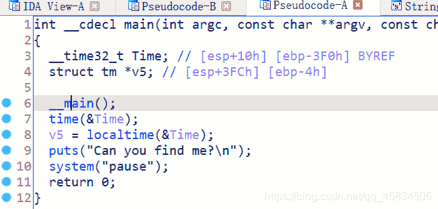
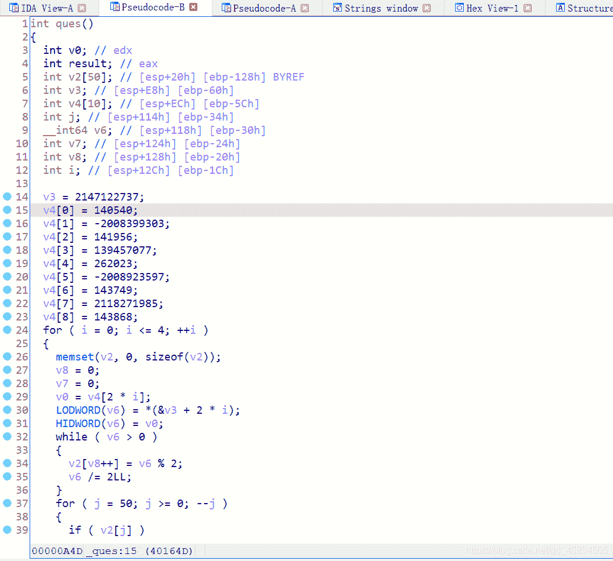
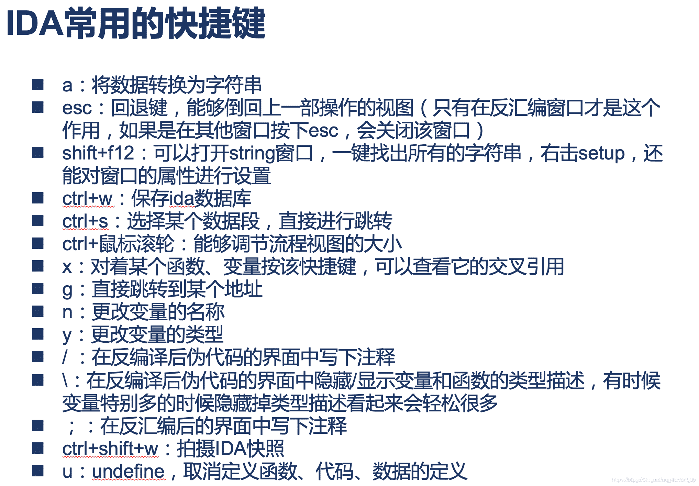
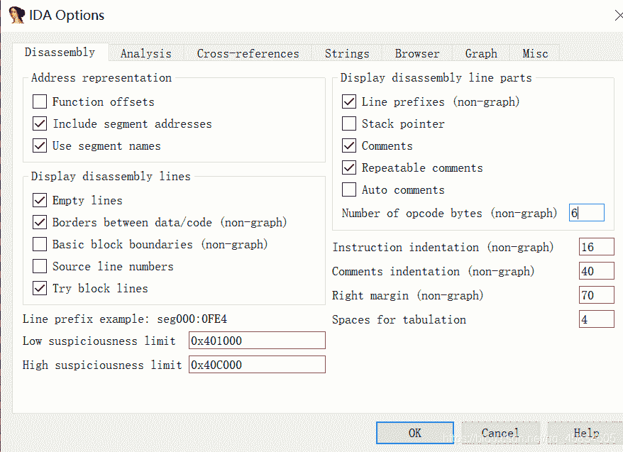
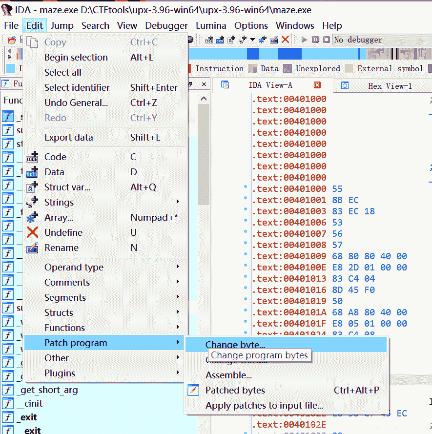
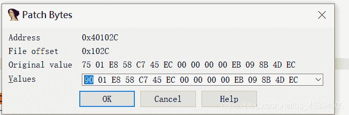
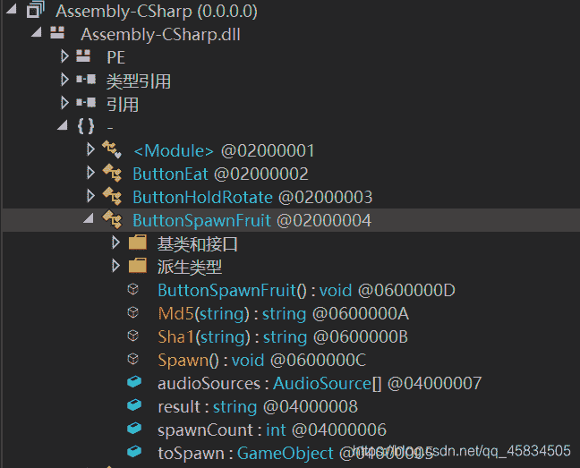
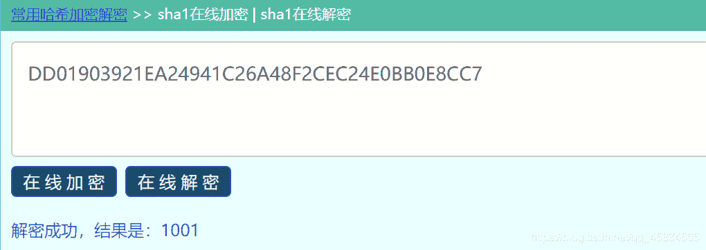

<!--yml
category: 未分类
date: 2022-04-26 14:34:25
-->

# [BUUCTF 刷题] Reverse解题方法总结（一）_Y1seco的博客-CSDN博客_buuctf reverse

> 来源：[https://blog.csdn.net/qq_45834505/article/details/114270473](https://blog.csdn.net/qq_45834505/article/details/114270473)

## 前言：

汇编语言相关
dup是一个操作符，在汇编语言中同db、dw、dd等一样，也是由编译器识别处理的符号。它是和db、dw、dd等数据定义伪指令配合使用的，用来进行数据的重复，比如：

```
db 3 dup(0)  指定义3个字节它们都是0
db 3 dup(0,1,2)  指 db 0,1,2,0,1,2,0,1,2 
```

## 一 动态调试

### 1.gdb

例：
b +函数名 ：下断点
r :运行
n:运行一步
x/200wx $ eax
x:就是用来查看内存中数值的，后面的200代表查看多少个，wx代表是以word字节查看看，$eax代表的eax寄存器中的值
x/sw $eax
x 指令表示查看寄存器内容，参数/s 表示用字符串形式显示，/w 表示四字节宽，/sw 表示字符串显示，四字节宽

### 2.OD

#### BUUCTF [BJDCTF2020]easy

查看main函数，发现flag应该是被隐藏起来了

在左侧function函数中一个一个试，发现有quess函数

放入OD中调试
修改程序的EIP 右键new origin

## 二 静态分析IDA

一. 常见窗口及快捷键
IDA view: 定位要修改的代码段在哪里。

Hex view: 用来修改我们的数据

exports window: 导出窗口

import window: 导入窗口

names window: 函数和参数的命名列表

functions window: 样本的所有函数窗口

strings window: 字符串显示窗口，会列出程序中的所有字符串



二.脱壳
1.32位ida打开，shift+f12查看程序里的字符串，得到了关于flag的提示
2.双击，ctrl+x跟进，找到关键函数
3.分析 strcmp 等函数作用
4.取地址则相反，如 v9=wodah,则进行
text = (char *)join(key3, &v9); //key3=kills v9=hadow 将V9拼接到key3上（join函数实现拼接功能）

三. xor
写脚本
edit =>export data 可导出数据

三 算法分析
[例题：BUUCTF8086](https://buuoj.cn/challenges#%5BBJDCTF%202nd%5D8086)
[解析](https://blog.csdn.net/mcmuyanga/article/details/109467256?ops_request_misc=&request_id=&biz_id=102&utm_term=buuctf%20reverse%208086&utm_medium=distribute.pc_search_result.none-task-blog-2~all~sobaiduweb~default-0-109467256.pc_search_result_no_baidu_js&spm=1018.2226.3001.4187)

### 安卓逆向 apk

工具：apkIDE ,androidkiller
例题：BUUCTF 相册
[jadx-gui](https://blog.csdn.net/weixin_39142112/article/details/80356244?ops_request_misc=%257B%2522request%255Fid%2522%253A%2522161655153616780261955974%2522%252C%2522scm%2522%253A%252220140713.130102334..%2522%257D&request_id=161655153616780261955974&biz_id=0&utm_medium=distribute.pc_search_result.none-task-blog-2~all~baidu_landing_v2~default-7-80356244.pc_search_result_hbase_insert&utm_term=jadx+-gui%E5%AE%89%E8%A3%85%E6%95%99%E7%A8%8B)查看apk的源代码，点击查找查询关键字
apkide里查看了一下libcore.so文件（C代码写的库文件，一般放在lib文件下。android是基于java的 但也可以调用c代码，so就是），用ida打开，shift+F12查看字符串，找到一串base64编码的字符，解密得到flag

## 三. 算法分析

根据字符串和函数逻辑写脚本逆推

```
 key="adsfkndcls"
text="killshadow"

flag=""
loop="ABCDEFGHIJKLMNOPQRSTUVWXYZ"

v3 = 0
v5 = len(key)

for i in range(0,len(text)):
    for j in loop:
        if ord(text[i])==(ord(j)-39-ord(key[i])+97)%26+97:
            flag+=j

print ('flag{'+flag+'}')

#include<stdio.h> 
int main()
{
	char key[] = "adsfkndcls";
	char text[] = "killshadow";
	int i;
	int v3=10;
	for (int i = 0; i < 10; i++)
	{
		for (int j = 0; j < 128; j++)
		{
			if (j < 'A' || j > 'z' || j > 'Z' && j < 'a')
			{
				continue;
			}
			if ((j - 39 - key[v3 % 10] + 97) % 26 + 97 == text[i])
			{
				printf("%c",j);
				v3++;
				break;
			}
		}
	}
} 
```

### 2.[BUUCTF8086]

[大佬博客](https://blog.csdn.net/mcmuyanga/article/details/109467256?ops_request_misc=&request_id=&biz_id=102&utm_term=buuctf%20reverse%208086&utm_medium=distribute.pc_search_result.none-task-blog-2~all~sobaiduweb~default-0-109467256.pc_search_result_no_baidu_js&spm=1018.2226.3001.4187)

### 3.[ACTF] rome

ASCII爆破脚本

```
v15= [ 'Q','s','w','3','s','j', '_','l','z','4','_','U','j','w','@','l' ]
flag=""

for i in range(16):
    for j in range(128):#ascii表上有127个字符，一个一个试吧
        x=j
        if chr(x).isupper():
            x=(x-51)%26+65
        if chr(x).islower():
            x=(x-79)%26+97
        if chr(x)==v15[i]:
            flag+=chr(j)

print ('flag{'+flag+'}')

原文链接：https://blog.csdn.net/mcmuyanga/article/details/110196934 
```

### 4.BUUCTF [BJDCTF2020]easy

查看main函数，发现flag应该是被隐藏起来了

在左侧function函数中一个一个试，发现有quess函数


## RSA

1.  [在线RSA公钥分解](http://tool.chacuo.net/cryptrsapubkey)
2.  [在线RSA大整数分解](http://factordb.com/index.php?query=)
3.  解密脚本：

```
import gmpy2
import binascii

p = 282164587459512124844245113950593348271
q = 366669102002966856876605669837014229419
e = 65537
c = 0xad939ff59f6e70bcbfad406f2494993757eee98b91bc244184a377520d06fc35
n = p * q
d = gmpy2.invert(e, (p-1) * (q-1))
m = gmpy2.powmod(c, d, n)

print(binascii.unhexlify(hex(m)[2:]).decode(encoding="utf-8")) 
```

```
import gmpy2 
import rsa 

e =
n = 
p =
q =

phin = (q-1)*(p-1)

d = gmpy2.invert(e, phin)

key = rsa.PrivateKey(n, e, int(d), p, q)

with open("D:\\flag.txt", "rb+") as f:
    f = f.read()
    print(rsa.decrypt(f, key)) 
```

## 加壳脱壳

### upx

把需要加壳,去壳的文件拖入同一目录下:

```
输入加壳命令：upx sample_mal.exe :显示加壳成功。
脱壳：upx -d sample_mal.exe ：显示脱壳成功。 
```

### 花指令去除

```
花指令作用：
正常代码添加了花指令之后，可以破坏静态反汇编的过程，使反汇编的结果出现错误，使ida和ollydbg等搜索不到字符串。错误的反汇编结果会造成破解者的分析工作大量增加，进而使之不能理解程序的结构和算法，也就很难破解程序，从而达到病毒或软件保护的目的。

几种跳转指令和对应的机器码
– 0xE8 CALL 后面的四个字节是地址
– 0xE9 JMP 后面 的四个字节是偏移
– 0xEB JMP 后面 的二个字节是偏移
特征：不能直接f5反汇编
			代码段显红
   		    jz  short near ptr loc_40735
   		    calll near ptr  406713CCh 
```

去除花指令
显示偏移


将花指令的地方改为90(即nop)

改为90（nop)


IDA中：按D，将代码转换成数据
按C，将数据转换为代码

[参考文章](https://blog.csdn.net/weixin_44352049/article/details/85567929?ops_request_misc=%257B%2522request%255Fid%2522%253A%2522161813749516780357210998%2522%252C%2522scm%2522%253A%252220140713.130102334.pc%255Fall.%2522%257D&request_id=161813749516780357210998&biz_id=0&utm_medium=distribute.pc_search_result.none-task-blog-2~all~first_rank_v2~rank_v29-8-85567929.pc_search_result_cache&utm_term=%E8%8A%B1%E6%8C%87%E4%BB%A4%E5%8E%BB%E9%99%A4&spm=1018.2226.3001.4187)

## .NET程序

dnSpy是分析net程序的反编译工具
[下载地址](https://github.com/0xd4d/dnSpy/releases)
ps:github官网加载慢的话借鉴这个[博客](https://blog.csdn.net/what951006/article/details/110115023)的解决方法，下载加速器Pigcha加速器

### [BJDCTF2020]BJD hamburger competition

将BJD hamburger competition_Data\Managed中的
文件用dnspy打开，查找关键函数

发现ButtonSpawnFruit中使用了Md5和SHA函数
关键代码：

```
 public void Spawn()
{
	FruitSpawner component = GameObject.FindWithTag("GameController").GetComponent<FruitSpawner>();
	if (component)
	{
		if (this.audioSources.Length != 0)
		{
			this.audioSources[Random.Range(0, this.audioSources.Length)].Play();
		}
		component.Spawn(this.toSpawn);
		string name = this.toSpawn.name;
		if (name == "汉堡底" && Init.spawnCount == 0)
		{
			Init.secret += 997;
		}
		else if (name == "鸭屁股")
		{
			Init.secret -= 127;
		}
		else if (name == "胡罗贝")
		{
			Init.secret *= 3;
		}
		else if (name == "臭豆腐")
		{
			Init.secret ^= 18;
		}
		else if (name == "俘虏")
		{
			Init.secret += 29;
		}
		else if (name == "白拆")
		{
			Init.secret -= 47;
		}
		else if (name == "美汁汁")
		{
			Init.secret *= 5;
		}
		else if (name == "柠檬")
		{
			Init.secret ^= 87;
		}
		else if (name == "汉堡顶" && Init.spawnCount == 5)
		{
			Init.secret ^= 127;
			string str = Init.secret.ToString();
			if (ButtonSpawnFruit.Sha1(str) == "DD01903921EA24941C26A48F2CEC24E0BB0E8CC7")
			{
				this.result = "BJDCTF{" + ButtonSpawnFruit.Md5(str) + "}";
				Debug.Log(this.result);
			}
		}
		Init.spawnCount++;
		Debug.Log(Init.secret);
		Debug.Log(Init.spawnCount);
	}
} 
```

使用[SHA1在线加解密网站](http://www.ttmd5.com/hash.php?type=5)解密字符串得到str

使用MD5在线加密str得到

```
b8c37e33defde51cf91e1e03e51657da 
```

分析md5函数

```
 public static string Md5(string str)
{
	byte[] bytes = Encoding.UTF8.GetBytes(str); 
	byte[] array = MD5.Create().ComputeHash(bytes);
	StringBuilder stringBuilder = new StringBuilder();
	foreach (byte b in array)
	{
		stringBuilder.Append(b.ToString("X2")); 
	}
	return stringBuilder.ToString().Substring(0, 20);
} 
```

得到flag{B8C37E33DEFDE51CF91E}