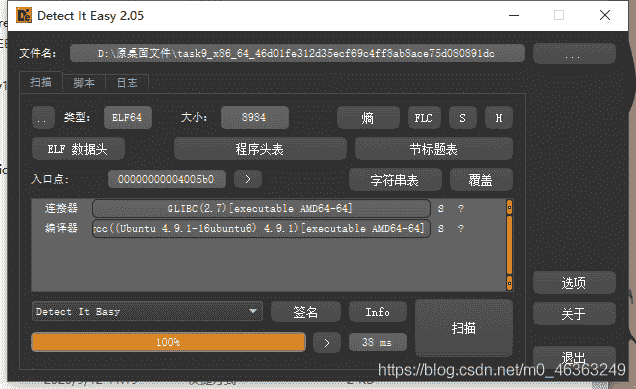
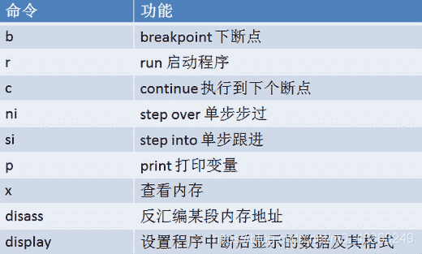
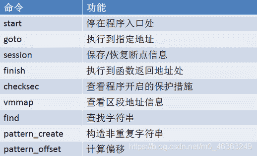
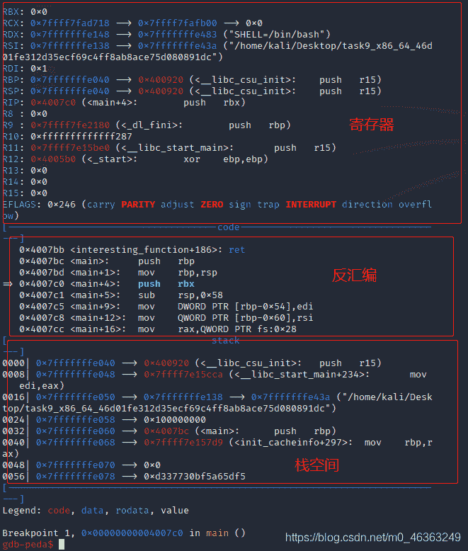
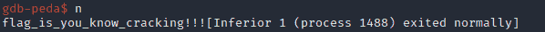

<!--yml
category: 未分类
date: 2022-04-26 14:20:37
-->

# [CTF]攻防世界Simple-check-100题解（GDB）_拈花倾城的博客-CSDN博客

> 来源：[https://blog.csdn.net/m0_46363249/article/details/113585464](https://blog.csdn.net/m0_46363249/article/details/113585464)

# 关于GDB的简单使用

**题目链接**：[simple-check-100](https://adworld.xctf.org.cn/task/answer?type=reverse&number=4&grade=1&id=4709&page=1)

**GDB安装教程**（以及peda插件）[我的另一篇文章](https://blog.csdn.net/m0_46363249/article/details/109304163)

**注**：本博文记录压缩包中ELF文件flag的获取过程，exe文件flag是乱码，具体过程就不给大家演示了。着重分享GDB的内容。

**GDB**的实现原理：[其他师傅的文章，很详细](https://blog.csdn.net/z_stand/article/details/108395906)

### step 1 获取信息

我们拿到了题目，老样子获取信息。


### step 2 放入IDA分析一下

```
int __cdecl main(int argc, const char **argv, const char **envp)
{
  void *v3; 
  const char **v5; 
  int v6; 
  char v7; 
  char v8; 
  char v9; 
  char v10; 
  char v11; 
  char v12; 
  char v13; 
  char v14; 
  char v15; 
  char v16; 
  char v17; 
  char v18; 
  char v19; 
  char v20; 
  char v21; 
  char v22; 
  char v23; 
  char v24; 
  char v25; 
  char v26; 
  char v27; 
  char v28; 
  char v29; 
  char v30; 
  char v31; 
  char v32; 
  char v33; 
  char v34; 
  __int64 v35; 
  const char ***v36; 
  unsigned __int64 v37; 

  v6 = argc;
  v5 = argv;
  v37 = __readfsqword(0x28u);
  v7 = 84;
  v8 = -56;
  v9 = 126;
  v10 = -29;
  v11 = 100;
  v12 = -57;
  v13 = 22;
  v14 = -102;
  v15 = -51;
  v16 = 17;
  v17 = 101;
  v18 = 50;
  v19 = 45;
  v20 = -29;
  v21 = -45;
  v22 = 67;
  v23 = -110;
  v24 = -87;
  v25 = -99;
  v26 = -46;
  v27 = -26;
  v28 = 109;
  v29 = 44;
  v30 = -45;
  v31 = -74;
  v32 = -67;
  v33 = -2;
  v34 = 106;
  v35 = 19LL;
  v3 = alloca(32LL);
  v36 = &v5;
  printf("Key: ", argv, 3LL, 16LL, 20LL, 0LL, argv);
  __isoc99_scanf("%s", v36);
  if ( (unsigned int)check_key(v36) )
    interesting_function(&v7);
  else
    puts("Wrong");
  return 0;
} 
```

我们可以得出check_key是核心函数，只要使得`if ( (unsigned int)check_key(v36) )`成功即可。这样我们就可以进入GDB进行调试了。

### step 3 进入GDB进行动态调试

GDB的常用命令如下：

peda的常用命令如下：

现在来看我们的程序，需要输入指令如下:

```
gdb
file task9_x86_64_46d01fe312d35ecf69c4ff8ab8ace75d080891dc
b main
r 
```


我们单步步过直到check_key函数，单步步过的指令是n

### step 4 跳过check_key函数

把test eax,eax改为真即可，也就是把eax改为1。

```
set $eax=1 
```


这样我们就得到了这个题目的flag:flag_is_you_know_cracking!!!
希望大家可以有所收获！