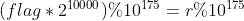
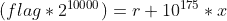
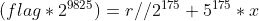
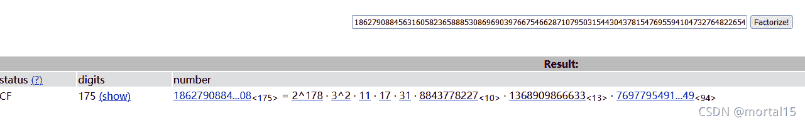
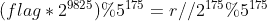
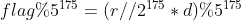
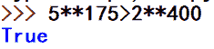

<!--yml
category: 未分类
date: 2022-04-26 14:44:06
-->

# [DASCTF八月挑战赛]easymath题解_mortal15的博客-CSDN博客

> 来源：[https://blog.csdn.net/a5555678744/article/details/120018284](https://blog.csdn.net/a5555678744/article/details/120018284)

    DASCTF八月赛的Crypto方向，拿下其他两道题很简单，但是这道最多人解出来的题反而解不出来。打完比赛回来看其他师傅写的wp，说是这是TSGCTF原题，所以直接放弃思考，上大佬的wp，我看看大佬这个wp，感觉这题还是有点东西的，里面涉及的基础的一些数学知识还是值得总结总结。

## 题目

```
assert(len(open('flag.txt', 'rb').read()) < 50)
assert(str(int.from_bytes(open('flag.txt', 'rb').read(), byteorder='big') << 10000).endswith('1862790884563160582365888530869690397667546628710795031544304378154769559410473276482265448754388655981091313419549689169381115573539422545933044902527020209259938095466283008') 
```

题目就两行，意思大概就是有个长度不超过50的flag，让它右移10000个二进制位，然后截下来最后175个十进制位，让我们通过截下来的175个十进制位还原flag。

## 分析

本题最大的障碍就是没有用数学的方式来分析这道题，我之前在想最后这些十进制位和原来的flag之间有怎样的关联，比如flag的最后一个二进制位怎么影响最后剩下来的这些尾数，然后还想一位一位往上推，总之路子走错了。

题目也有提示，ezmath嘛，跟数学有关，这里最好的解决方案还是用数学式子来表示其中的关系。

### ****

其中r为告诉我们的那个尾数。

分析到这里其实就很容易想到2**10000的逆元了，通过逆元消掉其他项，剩下一个flag。

## 求解

但是消掉2**10000存在一个问题，2**10000与10**175并不互质，很明显，两者有2的公因数，按照逆元的定义，这是不行的。因此要做一些变换。

我们先将上面式子的模拆开：



把公因数2给去了得到：





 （r可以整除2**175）

式子现在可以变化为：



此时2**9825与5**175互质，可以求出逆元d：

```
import gmpy2
d = gmpy2.invert(2**9825,5**175)
```

两边同时乘上d，由逆元性质得到：



由于题目提到flag长度小于50，一个字符占8个二进制位，即可计算：



 由此可以消去左边的模运算

由于r已知，右边可以直接计算出来，结果即为flag

最后long_to_bytes()得：

```
flag{90ee7e8df270bf5133a95ff904a059b8}
```