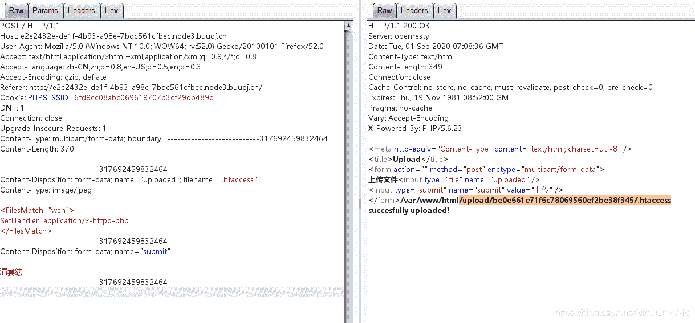
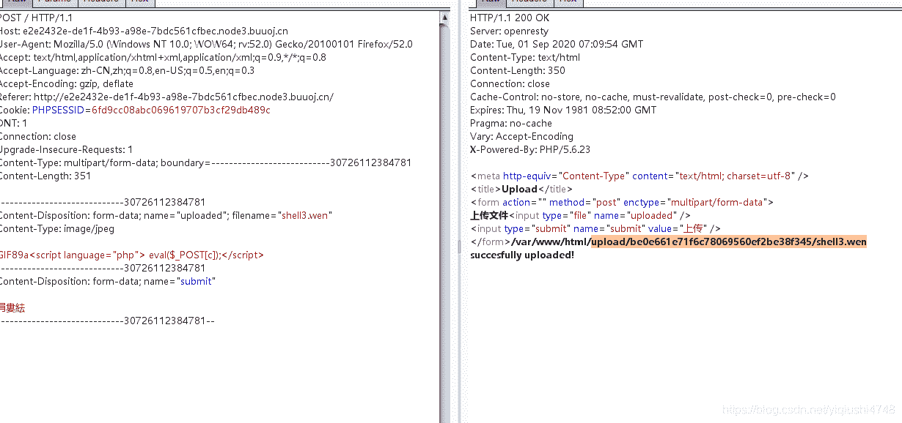
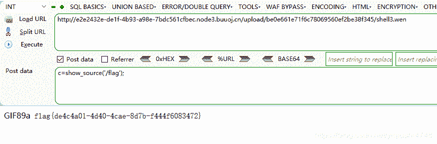
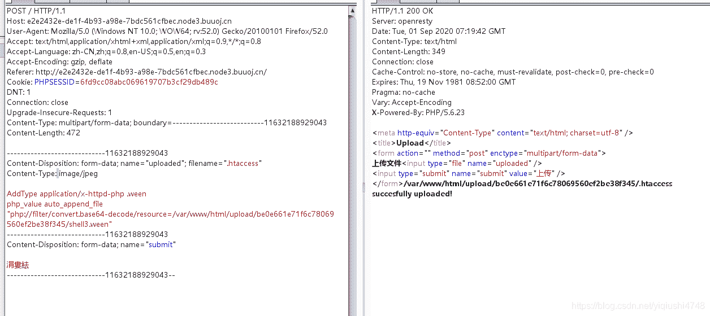
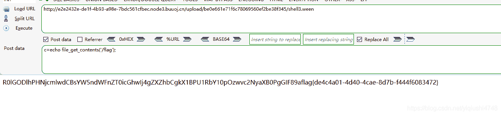

<!--yml
category: 未分类
date: 2022-04-26 14:35:44
-->

# [GXYCTF2019]BabyUpload 题解_偷一个月亮的博客-CSDN博客

> 来源：[https://blog.csdn.net/yiqiushi4748/article/details/108343263](https://blog.csdn.net/yiqiushi4748/article/details/108343263)

方法一：

<FilesMatch  "wen">

SetHandler  application/x-httpd-php

</FilesMatch>

 

 

 

方法二：

首先上传随意后缀名木马

 

更改.htaccess文件

 

访问测试

虽然未解码，其实已经附着，可以使用一句话木马

 

 

三个获取文件内容得函数