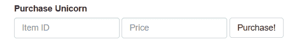
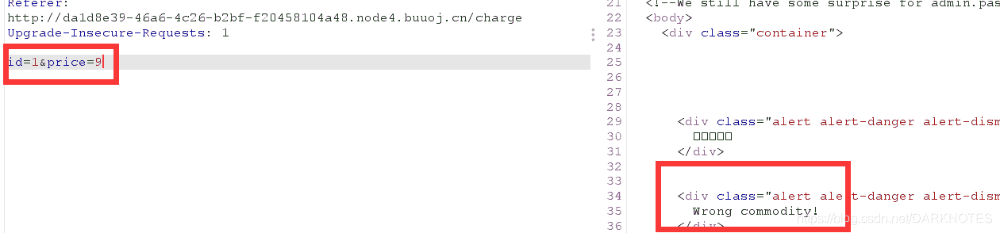
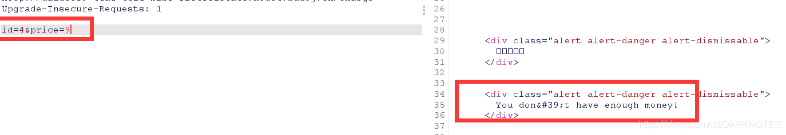
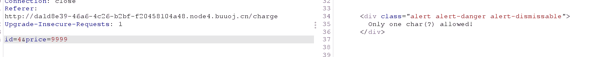

<!--yml
category: 未分类
date: 2022-04-26 14:46:31
-->

# [WP/BUU/Unicode编码]BUUCTF Unicorn shop题解_車鈊的博客-CSDN博客

> 来源：[https://blog.csdn.net/DARKNOTES/article/details/119265031](https://blog.csdn.net/DARKNOTES/article/details/119265031)

### [ASIS 2019]Unicorn shop

#### 测试

商店页面，逻辑大致为输入相应的商品号和支付金额购买商品，



用1号商品抓包测试，



错误的商品，继续测试2、3均如此，直到4正常了



但是钱不够，输入更多钱



仅允许一个字符输入

#### 分析

9999为四个字符，编码后也是如此

```
9999
%u0039%u0039%u0039%u0039 
```

因此，我们需要找到一个**代指的数字**超过1337.0的**单个**字符，我们从Unicode编码库中寻找

https://www.compart.com/en/unicode/


`%u2181`满足要求，代指罗马数字5000

在刚刚抓到的burp包中将其**编码**，发送即可。