<!--yml
category: 未分类
date: 2022-04-26 14:44:25
-->

# [buuctf]crypto刷题学习记录（1-22）_hyxyan的博客-CSDN博客

> 来源：[https://blog.csdn.net/hyxyan/article/details/108268902](https://blog.csdn.net/hyxyan/article/details/108268902)

**目录**

[一、MD5](#%E4%B8%80%E3%80%81MD5)

[二、Url编码](#%E4%BA%8C%E3%80%81Url%E7%BC%96%E7%A0%81)

[三、看我回旋踢](#%E4%B8%89%E3%80%81%E7%9C%8B%E6%88%91%E5%9B%9E%E6%97%8B%E8%B8%A2)

[四、一眼就解密](#%E5%9B%9B%E3%80%81%E4%B8%80%E7%9C%BC%E5%B0%B1%E8%A7%A3%E5%AF%86)

[五、摩丝](#%E4%BA%94%E3%80%81%E6%91%A9%E4%B8%9D)

[六、[BJDCTF 2nd]签到-y1ng](#%E5%85%AD%E3%80%81%5BBJDCTF%202nd%5D%E7%AD%BE%E5%88%B0-y1ng)

[七、[BJDCTF 2nd]password](#%E4%B8%83%E3%80%81%5BBJDCTF%202nd%5Dpassword)

[八、变异凯撒](#%E5%85%AB%E3%80%81%E5%8F%98%E5%BC%82%E5%87%AF%E6%92%92)

[九、Quoted-printable](#%E4%B9%9D%E3%80%81Quoted-printable)

[十、Rabbit](#%E5%8D%81%E3%80%81Rabbit)

[十一、篱笆墙的影子](#%E5%8D%81%E4%B8%80%E3%80%81%E7%AF%B1%E7%AC%86%E5%A2%99%E7%9A%84%E5%BD%B1%E5%AD%90)

[十二、RSA](#%E5%8D%81%E4%BA%8C%E3%80%81RSA)

[十三、丢失的MD5](#%E5%8D%81%E4%B8%89%E3%80%81%E4%B8%A2%E5%A4%B1%E7%9A%84MD5)

[十四、[BJDCTF 2nd]老文盲了](#%E5%8D%81%E5%9B%9B%E3%80%81%5BBJDCTF%202nd%5D%E8%80%81%E6%96%87%E7%9B%B2%E4%BA%86)

[十五、Alice与Bob](#%E5%8D%81%E4%BA%94%E3%80%81Alice%E4%B8%8EBob)

[十六、rsarsa](#%E5%8D%81%E5%85%AD%E3%80%81rsarsa)

[ 十七、大帝的密码武器](#%C2%A0%E5%8D%81%E4%B8%83%E3%80%81%E5%A4%A7%E5%B8%9D%E7%9A%84%E5%AF%86%E7%A0%81%E6%AD%A6%E5%99%A8)

[ 十八、Windows系统密码](#%C2%A0%E5%8D%81%E5%85%AB%E3%80%81Windows%E7%B3%BB%E7%BB%9F%E5%AF%86%E7%A0%81)

[ 十九、[BJDCTF 2nd]cat_flag](#%C2%A0%E5%8D%81%E4%B9%9D%E3%80%81%5BBJDCTF%202nd%5Dcat_flag)

[ 二十、[BJDCTF 2nd]燕言燕语-y1ng](#%C2%A0%E4%BA%8C%E5%8D%81%E3%80%81%5BBJDCTF%202nd%5D%E7%87%95%E8%A8%80%E7%87%95%E8%AF%AD-y1ng)

[ 二十一、传统知识+古典密码](#%C2%A0%E4%BA%8C%E5%8D%81%E4%B8%80%E3%80%81%E4%BC%A0%E7%BB%9F%E7%9F%A5%E8%AF%86%2B%E5%8F%A4%E5%85%B8%E5%AF%86%E7%A0%81)

[ 二十二、小学生的密码学](#%C2%A0%E4%BA%8C%E5%8D%81%E4%BA%8C%E3%80%81%E5%B0%8F%E5%AD%A6%E7%94%9F%E7%9A%84%E5%AF%86%E7%A0%81%E5%AD%A6)

* * *

# 一、MD5

### 打开题目看到

### e00cf25ad42683b3df678c61f42c6bda

### 直接https://www.cmd5.com/解密可得flag{admin1}

* * *

# 二、Url编码

### 打开题目看到

### %66%6c%61%67%7b%61%6e%64%20%31%3d%31%7d

### 直接解码得flag{and 1=1}

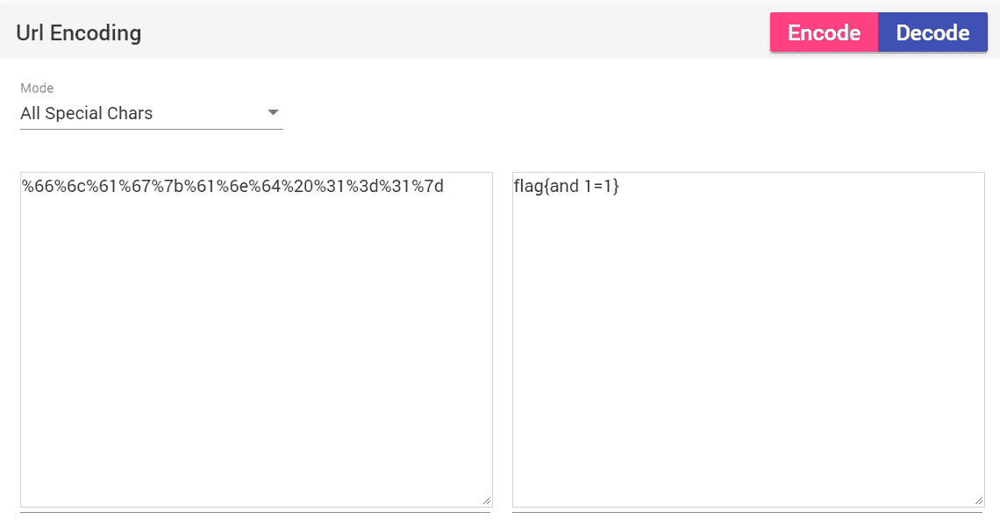

* * *

# 三、看我回旋踢

### 打开题目看到

### synt{5pq1004q-86n5-46q8-o720-oro5on0417r1}

### 像凯撒密码形式，直接解密得flag{5cd1004d-86a5-46d8-b720-beb5ba0417e1}

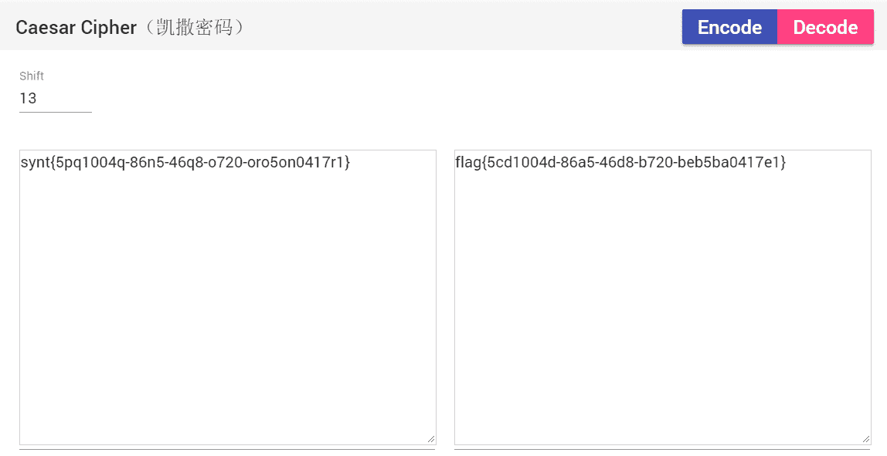

* * *

# 四、一眼就解密

### 打开题目看到

### ZmxhZ3tUSEVfRkxBR19PRl9USElTX1NUUklOR30=

### 直接base64解密得flag{THE_FLAG_OF_THIS_STRING}

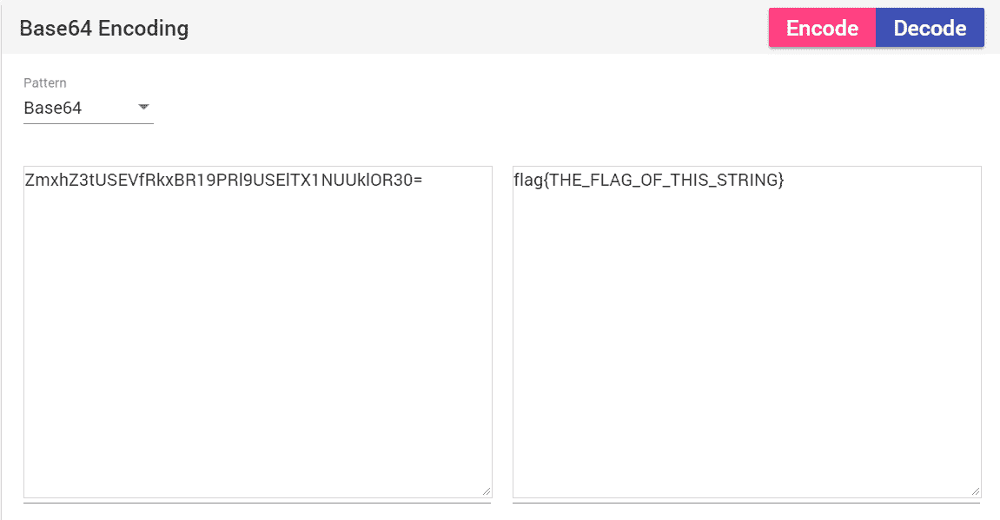

* * *

# 五、摩丝

### 打开题目看到

### .. .-.. --- ...- . -.-- --- ..-

### 直接莫尔斯解密得flag{ILOVEYOU}

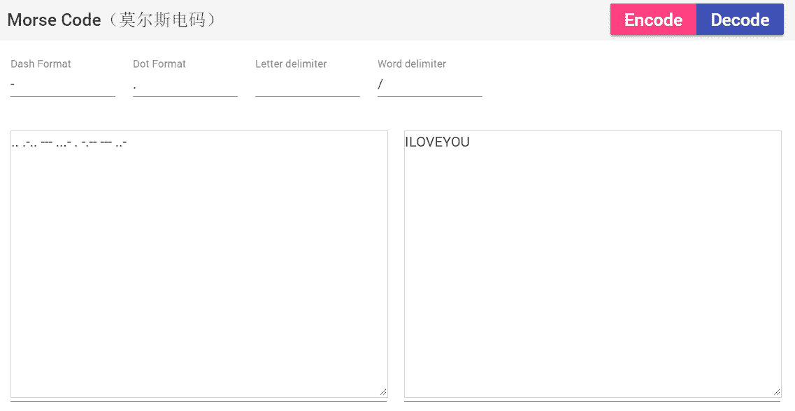

* * *

# 六、[BJDCTF 2nd]签到-y1ng

### 打开题目看到

### QkpEe1czbGMwbWVfVDBfQkpEQ1RGfQ==

### 直接base64解密得BJD{W3lc0me_T0_BJDCTF}

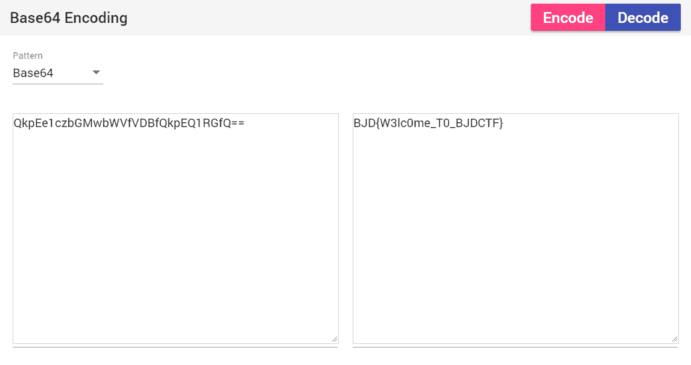

* * *

# 七、[BJDCTF 2nd]password

### 打开题目看到

### 姓名：张三

### 生日：19900315

### 试着将姓名头字母加数字得flag{zs19900315}

* * *

# 八、变异凯撒

### 打开题目看到

### 加密密文：afZ_r9VYfScOeO_UL^RWUc

### 格式：flag{ }

### 观察可知afZ_r与flag{ 存在对应关系

### 利用python ord()函数，得到afZ_r与flag{ 对应的ASCII值

### afZ_r： 97  102  90  95  114

### flag{ ：102 108  97 103 123

### 相差：   5    6     7     8     9

### 得出规律，写python脚本解得flag{Caesar_variation}

```
#coding=utf-8
c=[]
str="afZ_r9VYfScOeO_UL^RWUc"
#字符串转数组，字符转数字
for a in str:
    c.append(ord(a))

#规律，与flag{对应的数字差5，6，7，8，9...
for i in range(0,len(str)):
    c[i]=c[i]+5+i

#数组转字符串
new_str = ''.join([chr(i%128) for i in c])
print new_str
```

# 九、Quoted-printable

### 打开题目看到

### =E9=82=A3=E4=BD=A0=E4=B9=9F=E5=BE=88=E6=A3=92=E5=93=A6

### 直接解码得flag{那你也很棒哦}

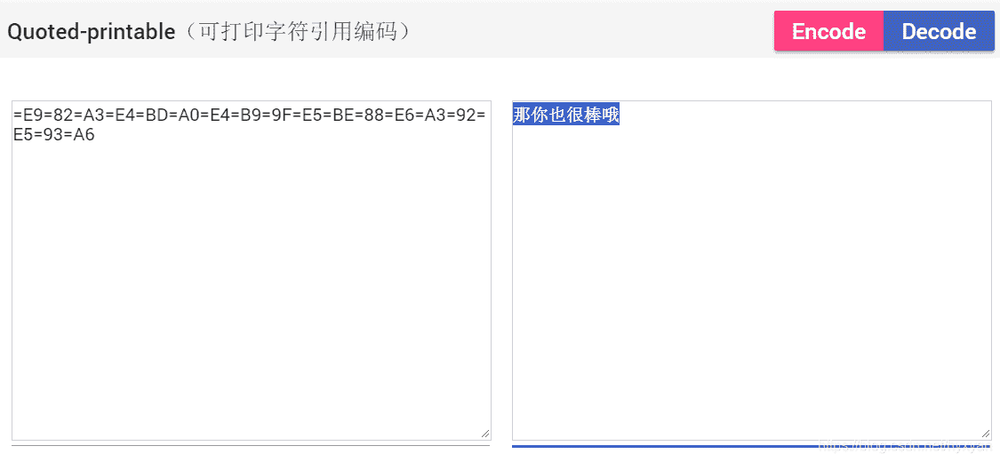

* * *

# 十、Rabbit

### 打开题目看到

### U2FsdGVkX1/+ydnDPowGbjjJXhZxm2MP2AgI

### 直接http://www.jsons.cn/rabbitencrypt/解密可得flag{Cute_Rabbit}

* * *

# 十一、篱笆墙的影子

### 打开题目看到

### felhaagv{ewtehtehfilnakgw}

### 疑似栅栏密码，直接加密得flag{wethinkwehavetheflag}

* * *

# 十二、RSA

### 题目给出：在一次RSA密钥对生成中，假设p=473398607161，q=4511491，e=17
求解出d作为flag提交

### 直接利用python脚本跑出flag{125631357777427553}

```
import gmpy2
from Crypto.Util import number
p = 473398607161
q = 4511491
e = 17
d = gmpy2.invert(e,(p-1)*(q-1))
print (d)
```

* * *

# 十三、丢失的MD5

### 题目直接给出md5.py

### 直接跑出flag{e9032994dabac08080091151380478a2}

* * *

# 十四、[BJDCTF 2nd]老文盲了

### 打开题目看到

### “罼雧締眔擴灝淛匶襫黼瀬鎶軄鶛驕鳓哵眔鞹鰝”

### 这么一串字，使用百度翻译的读音功能，听到读音类似“bdj大括号这就是flag直接交了吧大括号”，知道flag的内容就是“这就是flag直接交了吧”，对应就是“淛匶襫黼瀬鎶軄鶛驕鳓哵”

### 得到flag{淛匶襫黼瀬鎶軄鶛驕鳓哵}

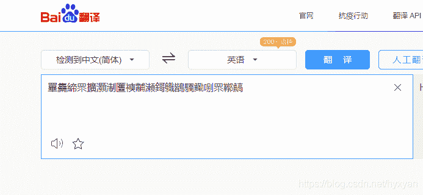

* * *

# 十五、Alice与Bob

### 根据题目，得出

### 先将n=98554799767分解为p，q，小的在前，大的在后，组合成新数字，再将数字进行md5的32位小写哈希。

### 用msieve工具分解n得到p=101999、q=966233，新数字就是101999966233，进行转换

### 得到flag{d450209323a847c8d01c6be47c81811a}

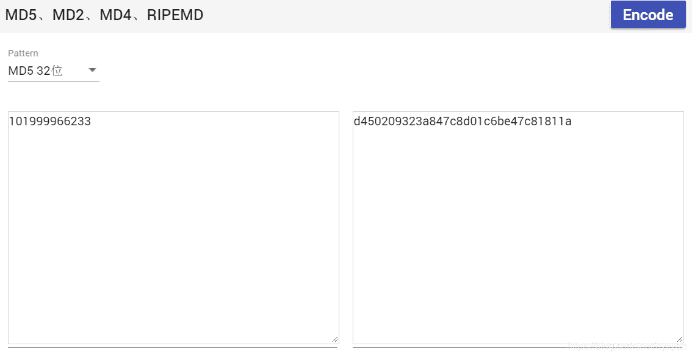

* * *

# 十六、rsarsa

### 由题目可知p、q、e、c

### 直接利用python脚本跑出flag{5577446633554466577768879988}

```
#-*coding:utf-8
import binascii

p = 9648423029010515676590551740010426534945737639235739800643989352039852507298491399561035009163427050370107570733633350911691280297777160200625281665378483
q = 11874843837980297032092405848653656852760910154543380907650040190704283358909208578251063047732443992230647903887510065547947313543299303261986053486569407
e = 65537
c = 83208298995174604174773590298203639360540024871256126892889661345742403314929861939100492666605647316646576486526217457006376842280869728581726746401583705899941768214138742259689334840735633553053887641847651173776251820293087212885670180367406807406765923638973161375817392737747832762751690104423869019034    
n = p*q
t = (p-1)*(q-1)
i = 0
while 1:
    if(1-t*i)%e == 0:
        break
    i -= 1
    # print(i)
print((1-t*i)/e)

d = (1-t*i)/e

m = pow(c,d,n)
print(m)
```

* * *

#  十七、大帝的密码武器

### 由题目可知，解FRPHEVGL密文得到有意义的单词，利用这规律加密ComeChina

### 题目的大帝透露了信息，将FRPHEVGL利用凯撒解密得到SECURITY，偏移13

### 利用同样的偏移，将ComeChina加密，得flag{PbzrPuvan}

### 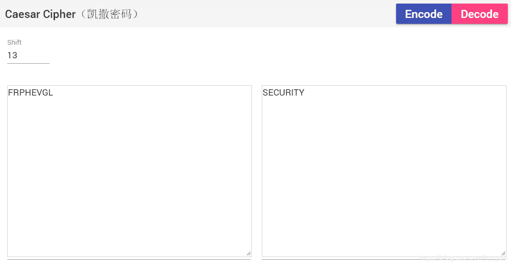

* * *

#  十八、Windows系统密码

### 看题目

### Administrator:500:aad3b435b51404eeaad3b435b51404ee:31d6cfe0d16ae931b73c59d7e0c089c0:::
ctf:1002:06af9108f2e1fecf144e2e8adef09efd:a7fcb22a88038f35a8f39d503e7f0062:::
Guest:501:aad3b435b51404eeaad3b435b51404ee:31d6cfe0d16ae931b73c59d7e0c089c0:::
SUPPORT_388945a0:1001:aad3b435b51404eeaad3b435b51404ee:bef14eee40dffbc345eeb3f58e290d56:::

### 这一串串字符串，像md5码，在线https://www.cmd5.com/一个个解码尝试，发现a7fcb22a88038f35a8f39d503e7f0062解出来是good-luck，得flag{good-luck}

* * *

#  十九、[BJDCTF 2nd]cat_flag

### 看题目是一幅猫猫动图

### 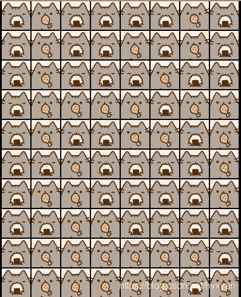

### 看形式好像二进制，寿司猫为0，鸡腿猫为1，转二进制得到

### 01000010010010100100010001111011010011010010000101100001001100000111111001111101

### 转16进制：424a447b4d2161307e7d，利用在线工具http://www.bejson.com/convert/ox2str/转字符串，得到flag：BJD{M!a0~}

* * *

#  二十、[BJDCTF 2nd]燕言燕语-y1ng

### 题目给出

### 79616E7A69205A4A517B78696C7A765F6971737375686F635F73757A6A677D20

### 看起来是两位十六进制拼成的字符串，利用在线工具http://www.bejson.com/convert/ox2str/转字符串，得到

### yanzi ZJQ{xilzv_iqssuhoc_suzjg} 

### 分析发现密钥是yanzi，密文是ZJQ{xilzv_iqssuhoc_suzjg}，疑似维吉尼亚加密

### 利用在线工具http://www.qqxiuzi.cn/bianma/weijiniyamima.php，解密得flag：BJD{yanzi_jiushige_shabi} 

* * *

#  二十一、传统知识+古典密码

### 题目给出以下关键词

### “辛卯，癸巳，丙戌，辛未，庚辰，癸酉，己卯，癸巳”和“+甲子”，对应数字

### 辛卯在干支中排28，癸巳在干支中排30，其他依次是23、8、17、10、16、30，而甲子是60，依题意可得88、90、83、68、77、70、76、90。

### 用python脚本转字符串得XZSDMFLZ

```
#coding=UTF-8

arr = [88,90,83,68,77,70,76,90]
s = ''.join([chr(i%128) for i in arr])
print(s)
```

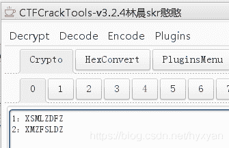

### 发现使用第二个密码通过凯撒解密出来的字符串中，其中一个有规律。

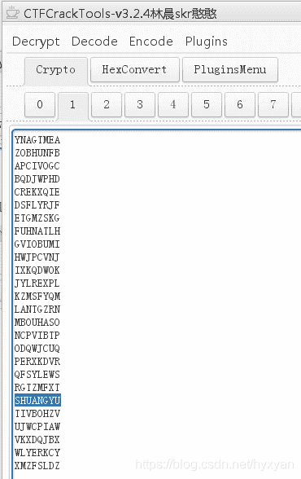

### 得到flag{SHUANGYU}

* * *

#  二十二、小学生的密码学

### 题目给出：e(x)=11x+6(mod26)，密文：welcylk，（flag为base64形式）

### 分析，密文经过仿射变换加密，现在要逆向解密

### 根据仿射变换原理，写python脚本运行得到明文：sorcery

```
#coding=utf-8
from Crypto.Util.number import inverse
#仿射变换,a,b是密钥,a_inv是a的逆元,满足0<=a b<=N-1,gcd(a,N)=1(即a*a_inv%N=1)
#加密：c=am+bmod26
#解密：m=a_inv*(c-b)mod26
text="welcylk"
a=11
b=6
N=26
#利用inverse解出a的逆元
a_inv = inverse(a,N)
print a_inv
#注意，进行运算的c和m，要先经由text的每个字母-字母a的ascii值
M = ''.join([chr((a*(ord(i)-ord('a')+b)%26)+ord('a')) for i in text])
print M
C = ''.join([chr((a_inv*(ord(i)-ord('a')-b)%26)+ord('a')) for i in text])
print C
```

### 转换成base64得flag{c29yY2VyeQ==}