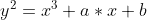
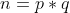
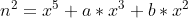
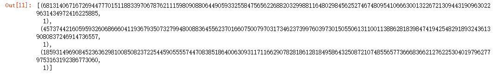

<!--yml
category: 未分类
date: 2022-04-26 14:39:36
-->

# [watevrCTF 2019]ECC-RSA 题解_mortal15的博客-CSDN博客

> 来源：[https://blog.csdn.net/a5555678744/article/details/117575339](https://blog.csdn.net/a5555678744/article/details/117575339)

# 简介

刚开始解除ECC，先去补了点基础知识，建议想搞懂相关基础理论的朋友们可以参考这位师傅的博客，解决这道题这些理论绰绰有余了

[https://blog.csdn.net/sitebus/article/details/82835492](https://blog.csdn.net/sitebus/article/details/82835492)

了解基础知识之后这道题的分析其实不是很难

# 分析算法逻辑

```
from fastecdsa.curve import P521 as Curve
from fastecdsa.point import Point
from Crypto.Util.number import bytes_to_long, isPrime
from os import urandom
from random import getrandbits

def gen_rsa_primes(G):
	urand = bytes_to_long(urandom(521//8))
	while True:
		s = getrandbits(521) ^ urand

		Q = s*G
		if isPrime(Q.x) and isPrime(Q.y):
			print("ECC Private key:", hex(s))
			print("RSA primes:", hex(Q.x), hex(Q.y))
			print("Modulo:", hex(Q.x * Q.y))
			return (Q.x, Q.y) 
```

首先看这个函数，函数的功能可以从函数名中直接看出，也就是生成RSA算法需要的两个素因子。

具体实现上，首先通过urandom和getrandits两个函数得到的值相异或的得到随机数s（这里用两种随机数生成方法相异或，我的理解是能够生成随机性更佳的数字）

但是注意下面这句

```
Q = s*G
```

在椭圆曲线的伽罗瓦群中数乘运算的定义变了，具体怎么变了请参考[https://blog.csdn.net/sitebus/article/details/82835492](https://blog.csdn.net/sitebus/article/details/82835492)

总之就是很难还原出来，但是我们知道一个关键信息就是在伽罗瓦群中，算出来的结果必然也在这个群中，即在这条椭圆曲线上。

即满足以下关系

(椭圆曲线的标准方程）

```
flag = int.from_bytes(input(), byteorder="big")

ecc_p = Curve.p
a = Curve.a
b = Curve.b

Gx = Curve.gx
Gy = Curve.gy
G = Point(Gx, Gy, curve=Curve)

e = 0x10001
p, q = gen_rsa_primes(G)
n = p*q

file_out = open("downloads/ecc-rsa.txt", "w")

file_out.write("ECC Curve Prime: " + hex(ecc_p) + "\n")
file_out.write("Curve a: " + hex(a) + "\n")
file_out.write("Curve b: " + hex(b) + "\n")
file_out.write("Gx: " + hex(Gx) + "\n")
file_out.write("Gy: " + hex(Gy) + "\n")

file_out.write("e: " + hex(e) + "\n")
file_out.write("p * q: " + hex(n) + "\n")

c = pow(flag, e, n)
file_out.write("ciphertext: " + hex(c) + "\n")
'''
ECC Curve Prime: 0x1ffffffffffffffffffffffffffffffffffffffffffffffffffffffffffffffffffffffffffffffffffffffffffffffffffffffffffffffffffffffffffffffffff
Curve a: -0x3
Curve b: 0x51953eb9618e1c9a1f929a21a0b68540eea2da725b99b315f3b8b489918ef109e156193951ec7e937b1652c0bd3bb1bf073573df883d2c34f1ef451fd46b503f00
Gx: 0xc6858e06b70404e9cd9e3ecb662395b4429c648139053fb521f828af606b4d3dbaa14b5e77efe75928fe1dc127a2ffa8de3348b3c1856a429bf97e7e31c2e5bd66
Gy: 0x11839296a789a3bc0045c8a5fb42c7d1bd998f54449579b446817afbd17273e662c97ee72995ef42640c550b9013fad0761353c7086a272c24088be94769fd16650
e: 0x10001
p * q: 0x118aaa1add80bdd0a1788b375e6b04426c50bb3f9cae0b173b382e3723fc858ce7932fb499cd92f5f675d4a2b05d2c575fc685f6cf08a490d6c6a8a6741e8be4572adfcba233da791ccc0aee033677b72788d57004a776909f6d699a0164af514728431b5aed704b289719f09d591f5c1f9d2ed36a58448a9d57567bd232702e9b28f
ciphertext: 0x3862c872480bdd067c0c68cfee4527a063166620c97cca4c99baff6eb0cf5d42421b8f8d8300df5f8c7663adb5d21b47c8cb4ca5aab892006d7d44a1c5b5f5242d88c6e325064adf9b969c7dfc52a034495fe67b5424e1678ca4332d59225855b7a9cb42db2b1db95a90ab6834395397e305078c5baff78c4b7252d7966365afed9e
'''
```

首先这一段flag所在的位置表明，最后要解决的问题就是一个普通RSA的问题，那么关键其实就是n的分解问题，也就是p和q的值

随后关注p和q的产生，发现p，q源自上面说的那个函数

通过前面对函数的分析，很显然上述方程中的x，y分别为p，q

加上

两个方程两个未知数，是有可能得到解的

调整一下方程



放到sage中解

```
a=-0x3
b=0x51953eb9618e1c9a1f929a21a0b68540eea2da725b99b315f3b8b489918ef109e156193951ec7e937b1652c0bd3bb1bf073573df883d2c34f1ef451fd46b503f00
n=0x118aaa1add80bdd0a1788b375e6b04426c50bb3f9cae0b173b382e3723fc858ce7932fb499cd92f5f675d4a2b05d2c575fc685f6cf08a490d6c6a8a6741e8be4572adfcba233da791ccc0aee033677b72788d57004a776909f6d699a0164af514728431b5aed704b289719f09d591f5c1f9d2ed36a58448a9d57567bd232702e9b28f
p0=0x1ffffffffffffffffffffffffffffffffffffffffffffffffffffffffffffffffffffffffffffffffffffffffffffffffffffffffffffffffffffffffffffffffff
R.<x>=Zmod(p0)[]
f=x**5+a*x**3+b*x**2-n**2
f.roots()
```

有三个结果



其中两个不是质数，显然不是p的值，那么

```
p=4573744216059593260686660411936793507327994800883645562370166075007970317346237399760397301505506131100113886281839847419425482918932436139080837246914736557
```

知道n的分解后，写个简单脚本解一下就ok了

```
import gmpy2
from Crypto.Util.number import *
e=0x10001
n=0x118aaa1add80bdd0a1788b375e6b04426c50bb3f9cae0b173b382e3723fc858ce7932fb499cd92f5f675d4a2b05d2c575fc685f6cf08a490d6c6a8a6741e8be4572adfcba233da791ccc0aee033677b72788d57004a776909f6d699a0164af514728431b5aed704b289719f09d591f5c1f9d2ed36a58448a9d57567bd232702e9b28f
p=4573744216059593260686660411936793507327994800883645562370166075007970317346237399760397301505506131100113886281839847419425482918932436139080837246914736557
q=n//p
c=0x3862c872480bdd067c0c68cfee4527a063166620c97cca4c99baff6eb0cf5d42421b8f8d8300df5f8c7663adb5d21b47c8cb4ca5aab892006d7d44a1c5b5f5242d88c6e325064adf9b969c7dfc52a034495fe67b5424e1678ca4332d59225855b7a9cb42db2b1db95a90ab6834395397e305078c5baff78c4b7252d7966365afed9e
d = gmpy2.invert(e,(p-1)*(q-1))
print(long_to_bytes(pow(c,d,n)))

#FLAG：watevr{factoring_polynomials_over_finite_fields_is_too_ez}
```