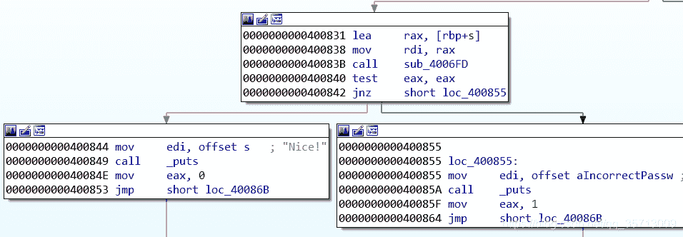
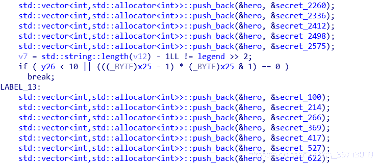

<!--yml
category: 未分类
date: 2022-04-26 14:36:02
-->

# angr-example(解CTF题目)_「已注销」的博客-CSDN博客

> 来源：[https://blog.csdn.net/qq_35713009/article/details/89766154](https://blog.csdn.net/qq_35713009/article/details/89766154)

**0x0 废话**

emmm，总之就是官方给的examples啦。持续更新...

链接：[https://docs.angr.io/examples](https://docs.angr.io/examples)

* * *

**0x1 defcamp_r100**

angr在CTF中最常见的使用方式就是利用符号执行来探索路径。来看主函数



可以看到本题中只需要达到0x400844这个地址，我们的输入就是正确的flag，即我们打印到达0x400844这个地址的state的标准输入流就可以得到flag。 我们来具体实现这个过程

```
import angr

proj = angr.Project('./r100')
st = proj.factory.entry_state()
sm = proj.factory.simulation_manager(st)
sm.explore(find=0x400844, avoid=0x400855)
print sm.found[0].posix.dumps(0)
```

其中，sm.explore即开始执行，当state的地址到达find参数的地址时，执行就会终止，然后将该state放入found stash中；而到达avoid参数的地址时，会将当前state放入avoided stash中。由于我们最后的flag即是我们的输入，所以需要打印标准输入流信息，state.posix存放了一些与环境相关的信息，我们可以通过文件描述符0来获取标准输入流，于是便有了最后一行代码。

本题的check函数是一个较为复杂的运算，如下

```
signed __int64 __fastcall sub_4006FD(__int64 a1)
{
  signed int i; // [rsp+14h] [rbp-24h]
  const char *v3; // [rsp+18h] [rbp-20h]
  const char *v4; // [rsp+20h] [rbp-18h]
  const char *v5; // [rsp+28h] [rbp-10h]

  v3 = "Dufhbmf";
  v4 = "pG`imos";
  v5 = "ewUglpt";
  for ( i = 0; i <= 11; ++i )
  {
    if ( (&v3)[i % 3][2 * (i / 3)] - *(char *)(i + a1) != 1 )
      return 1LL;
  }
  return 0LL;
}
```

不过对angr来说，这点计算量算是很小了，所以能很快的进行约束求解。

* * *

**0x2 asisctffinals2015_fake**

主函数如下

```
__int64 __fastcall main(signed int a1, char **a2, char **a3)
{
  __int64 v3; // r8
  __int64 v5; // [rsp+0h] [rbp-38h]
  __int64 v6; // [rsp+8h] [rbp-30h]
  __int64 v7; // [rsp+10h] [rbp-28h]
  __int64 v8; // [rsp+18h] [rbp-20h]
  __int64 v9; // [rsp+20h] [rbp-18h]

  v3 = 0LL;
  if ( a1 > 1 )
    v3 = strtol(a2[1], 0LL, 10);
  v5 = 1019660215 * v3;
  v6 = 2676064947712729LL
     * ((v3 >> 19)
      - 2837
      * (((signed __int64)((unsigned __int128)(6658253765061184651LL * (signed __int128)(v3 >> 19)) >> 64) >> 10)
       - (v3 >> 63)))
     * ((v3 >> 19)
      - 35
      * (((signed __int64)((unsigned __int128)(1054099661354831521LL * (signed __int128)(v3 >> 19)) >> 64) >> 1)
       - (v3 >> 63)))
     * ((v3 >> 19)
      - 33
      * (((signed __int64)((unsigned __int128)(1117984489315730401LL * (signed __int128)(v3 >> 19)) >> 64) >> 1)
       - (v3 >> 63)));
  v7 = ((v3 >> 19)
      - 9643
      * (((signed __int64)((unsigned __int128)(1958878557656183849LL * (signed __int128)(v3 >> 19)) >> 64) >> 10)
       - (v3 >> 63)))
     * 5785690976857702LL
     * ((v3 >> 19)
      - 167
      * (((signed __int64)((unsigned __int128)(7069410902499468883LL * (signed __int128)(v3 >> 19)) >> 64) >> 6)
       - (v3 >> 63)));
  v8 = ((v3 >> 19)
      - 257
      * (((signed __int64)((unsigned __int128)(9187483429707480961LL * (signed __int128)(v3 >> 19)) >> 64) >> 7)
       - (v3 >> 63)))
     * 668176625215826LL
     * ((v3 >> 19)
      - 55
      * (((signed __int64)((unsigned __int128)(5366325548715505925LL * (signed __int128)(v3 >> 19)) >> 64) >> 4)
       - (v3 >> 63)));
  v9 = ((v3 >> 19)
      - 48271
      * (((signed __int64)((unsigned __int128)(1565284823722614477LL * (signed __int128)(v3 >> 19)) >> 64) >> 12)
       - (v3 >> 63)))
     * 2503371776094LL
     * ((v3 >> 19)
      - 23
      * (((signed __int64)((v3 >> 19) + ((unsigned __int128)(-5614226457215950491LL * (signed __int128)(v3 >> 19)) >> 64)) >> 4)
       - (v3 >> 63)));
  puts((const char *)&v5);
  return 0LL;
}
```

这次，由于flag是通过我们的输入来生成的，而非flag本身，所以我们需要对生成结果进行一些约束，以此来求出flag。

首先，这里是通过命令行参数进行输入，但输入的是一个数字，这就导致了我们不知道它的长度以及符号，所以直接使用字符串数字作为符号变量并非一个好主意，而在之后我们可以看到使用了strtol函数将这个字符串数字转换为了64位整数，我们可以从这里作为出发点，最终对其变换结果进行约束求解。

首先从下列基本块开始

```
.text:000000000040049C mov     rdi, [rsi+8]    ; nptr
.text:00000000004004A0 mov     edx, 0Ah        ; base
.text:00000000004004A5 xor     esi, esi        ; endptr
.text:00000000004004A7 call    _strtol
.text:00000000004004AC mov     r8, rax
```

我们使用以下代码来指定从0x4004AC开始，然后向rax中写入一个符号值

```
st = proj.factory.blank_state(addr=0x4004ac)
inp = st.solver.BVS('inp', 8*8)
st.regs.rax = inp
```

之后执行到call puts这行执行的地址即0x400684处，对要打印的字符串进行约束求解

```
sm = proj.factory.simulation_manager(st)
sm.explore(find=0x400684)
found = sm.found[0]
flag_addr = found.regs.rdi
found.add_constraints(found.memory.load(flag_addr, 5) == int('ASIS{'.encode('hex'), 16))
#也可以这样写
#found.solver.add(found.memory.load(flag_addr, 5) == int('ASIS{'.encode('hex'), 16))
flag = found.memory.load(flag_addr, 40)
found.solver.eval(flag, cast_to=bytes)

>>>'ASIS{f5f7af556bd6973bd6f2687280a243d9}\x00\x00' 
```

这里我们是已知flag格式，前5个字符是'ASIS{'，来作为约束条件，若不知道这个条件，也可以将每个字节都约束为可打印字符，也能求出结果。当然我们也可以求出输入值

```
inp = found.solver.eval(inp, cast_to=bytes)
inp = int(inp.encode('hex'), 16)
print inp

>>>25313971399
```

* * *

**0x3 ais3_crackme**

本题就是通过命令行来输入字符串了，且我们输入的就是flag，之后会对输入进行check从而出现判断flag正确性的两条分支。对于这种问题，我们就需要设置一个符号化变量作为命令行参数，然后通过路径约束求解出结果。

同样，该验证函数也是十分复杂的运算，但angr觉得很容易...

```
_BOOL8 __fastcall verify(char *a1)
{
  int i; // [rsp+14h] [rbp-4h]

  for ( i = 0; a1[i]; ++i )
  {
    if ( encrypted[i] != ((unsigned __int8)((unsigned __int8)(a1[i] ^ i) << ((i ^ 9) & 3)) | (unsigned __int8)((signed int)(unsigned __int8)(a1[i] ^ i) >> (8 - ((i ^ 9) & 3))))
                       + 8 )
      return 0LL;
  }
  return i == 23;
}
```

这里我们要使用claripy，它是angr的约束求解器，使用方法类似z3

```
import claripy
import angr

proj = angr.Project('./ais3_crackme')
argv1 = claripy.BVS('argv1', 100*8) #100个字节
st = proj.factory.entry_state(args=['./ais3_crackme', argv1])
sm = proj.factory.simulation_manager(st)
```

这样我们就完成了命令行参数的初始化工作，接下来就是路径探索与约束求解了

```
sm.explore(find=0x400602, avoid=0x40060E)
print sm.found[0].solver.eval(argv1, cast_to=bytes)
```

* * *

**0x4 csaw_wyvern**

```
int __cdecl main(int argc, const char **argv, const char **envp)
{
  int v3; // ST24_4
  __int64 v4; // rdx
  char v6; // [rsp+80h] [rbp-140h]
  char v7; // [rsp+88h] [rbp-138h]
  char v8; // [rsp+A0h] [rbp-120h]
  char v9; // [rsp+A8h] [rbp-118h]
  char s; // [rsp+B0h] [rbp-110h]
  int v11; // [rsp+1BCh] [rbp-4h]

  v11 = 0;
  std::operator<<<std::char_traits<char>>(&std::cout, (unsigned int)"+-----------------------+\n", envp);
  std::operator<<<std::char_traits<char>>(
    &std::cout,
    (unsigned int)"|    Welcome Hero       |\n",
    "|    Welcome Hero       |\n");
  std::operator<<<std::char_traits<char>>(
    &std::cout,
    (unsigned int)"+-----------------------+\n\n",
    "+-----------------------+\n\n");
  std::operator<<<std::char_traits<char>>(
    &std::cout,
    (unsigned int)"[!] Quest: there is a dragon prowling the domain.\n",
    "[!] Quest: there is a dragon prowling the domain.\n");
  std::operator<<<std::char_traits<char>>(
    &std::cout,
    (unsigned int)"\tbrute strength and magic is our only hope. Test your skill.\n\n",
    "\tbrute strength and magic is our only hope. Test your skill.\n\n");
  std::operator<<<std::char_traits<char>>(
    &std::cout,
    (unsigned int)"Enter the dragon's secret: ",
    "Enter the dragon's secret: ");
  fgets(&s, 257, stdin);
  std::allocator<char>::allocator(&v8, 257LL);
  std::string::string(&v9, &s, &v8);
  std::allocator<char>::~allocator(&v8);
  std::string::string((std::string *)&v7, (const std::string *)&v9);
  v3 = start_quest((std::string *)&v7);
  std::string::~string((std::string *)&v7);
  if ( v3 == 4919 )
  {
    std::string::string((std::string *)&v6, (const std::string *)&v9);
    reward_strength(&v6, &v9);
    std::string::~string((std::string *)&v6);
  }
  else
  {
    std::operator<<<std::char_traits<char>>(
      &std::cout,
      (unsigned int)"\n[-] You have failed. The dragon's power, speed and intelligence was greater.\n",
      v4);
  }
  v11 = 0;
  std::string::~string((std::string *)&v9);
  return v11;
}
```

可以看到本题是一个C++题目，使用了许多STL函数，而angr不支持这些标准，所以需要引入unicorn引擎，由于需要初始化C++标准库，所以我们获取初始状态时应该使用proj.factory.full_init_state()。而从以下地方我们可以看出输入字符串长度为28



于是我们可以初始化出一个simulation_manager

```
import angr
import claripy

proj = angr.Project('./wyvern')
flag_chars = [claripy.BVS('flag_%d' % i, 8) for i in range(28)]
flag = claripy.Concat(*flag_chars + [claripy.BVV('\n')])
st = proj.factory.full_init_state(args=['./wyvern'], add_options=angr.options.unicorn, stdin=flag) 
```

接下来我们对输入进行一些约束，但经测试貌似也没提升多少效率，可能是主要时间都花在了路径探索上。由于输入为可打印字符，且flag格式所包含的字符集一般为'0123456789abcdefghijklmnopqrstuvwxyzABCDEFGHIJKLMNOPQRSTUVWXYZ{}_'，所以我们可以设置以下约束

```
dic = '0123456789abcdefghijklmnopqrstuvwxyzABCDEFGHIJKLMNOPQRSTUVWXYZ{}_'
for k in flag_chars:
    for c in range(128):
        if chr(c) not in dic:
            st.solver.add(k != c)
```

之后就是运行一个simulation manager了，这里官方使用的simulation manager的run()方法来执行，但使用explore应该也是可以的，大概需要跑8分钟左右。

* * *

**0x5 sym-write**

```
int __cdecl main(int argc, const char **argv, const char **envp)
{
  _BOOL4 j; // eax
  signed int i; // [esp+0h] [ebp-18h]
  int v6[2]; // [esp+4h] [ebp-14h]
  unsigned int v7; // [esp+Ch] [ebp-Ch]

  v7 = __readgsdword(0x14u);
  v6[0] = 0;
  v6[1] = 0;
  for ( i = 0; i <= 7; ++i )
  {
    j = ((u >> i) & 1) != 0;
    ++v6[j];
  }
  if ( v6[0] == v6[1] )
    printf("you win!");
  else
    printf("you lose!");
  return 0;
}
```

这个题其实有点诡异，因为没有输入点，最后发现这可能就是官方为了说明如何进行内存写入的小例子，而非CTF题目。我们的目的是求出能使程序输出"you win!"的u值，基本思路是向内存中写入一个符号变量，然后进行路径探索进行约束求解，关键是entry_state()中option的设置。

```
import angr
import claripy

win_addr = 0x80484e3
lose_addr = 0x80484F5
u_addr = 0x804a021
proj = angr.Project('./issue')
st = proj.factory.entry_state(add_options={angr.options.SYMBOLIC_WRITE_ADDRESSES})
u = claripy.BVS('u', 8)
st.memory.store(u_addr, u)
sm = proj.factory.simulation_manager(st)
sm.explore(find=win_addr, avoid=lose_addr)
print sm.found[0].solver.eval(u)
```

* * *

**0x6 flareon2015_2**

本题可以说是求函数参数的一个例子了，如果去分析check函数的话，呈现的反汇编代码还真不太好看。这里我们将state设置到check函数开头，然后我们手动初始化check函数的参数，即栈的数据，将我们的输入以符号变量的形式表示，然后给其他已知参数赋值，最后进行路径探索和约束求解。

```
import angr

main_retaddr = 0x402159
inp_addr = 0x4010e4
retaddr = 0x401064
proj = angr.Project('very_success.exe')
st = proj.factory.blank_state(addr=0x401084)
s.mem[s.regs.esp+12:].dword = 0x25
st.mem[st.regs.esp+8:].dword = main_retaddr
st.mem[st.regs.esp+4:].dword = inp_addr
st.mem[st.regs.esp].dword = retaddr
st.memory.store(0x402159, st.solver.BVS("flag", 8*0x25))
sm = proj.factory.simulation_manager(st)
sm.explore(find=0x40106b, avoid=0x401072)
found_state = sm.found[0]
print found_state.solver.eval(found_state.memory.load(0x402159, 40), cast_to=bytes)
```

* * *

** 0x7 codegate_2017-angrybird**

说实话，这个题有点诡异，感觉就是为了让人用angr出的，题目名称好像也暗示了这一点。首先运行会直接跑飞，输入啥都没用，总之就是跑不了，IDA打开看有个一定会跳转到exit的指令，之后又调用了3个函数，貌似执行这几个函数栈又会出问题。

```
.text:0000000000400769 mov     rax, fs:28h
.text:0000000000400772 mov     [rbp+var_8], rax
.text:0000000000400776 xor     eax, eax
.text:0000000000400778 cmp     eax, 0
.text:000000000040077B jz      _exit
.text:0000000000400781 mov     [rbp+var_70], offset off_606018
.text:0000000000400789 mov     [rbp+var_68], offset off_606020
.text:0000000000400791 mov     [rbp+var_60], offset off_606028
.text:0000000000400799 mov     [rbp+var_58], offset off_606038
.text:00000000004007A1 mov     eax, 0
.text:00000000004007A6 call    sub_4006F6
.text:00000000004007AB mov     [rbp+n], eax
.text:00000000004007AE mov     eax, 0
.text:00000000004007B3 call    sub_40070C
.text:00000000004007B8 mov     eax, 0
.text:00000000004007BD call    sub_40072A
```

 我们可以patch几个关键点，然后用angr跑，也可以将state的地址设置在这堆检测之后，直接跑。经过测试，如果我们直接用最简单的路径探索是可以跑出来的，大概需要10分钟，而如果设置了输入字符串的长度，则能在1分钟左右跑出来

```
st.regs.rbp = st.regs.rsp
st.mem[st.regs.rbp-0x74].int = 21
```

* * *

**0x8 google2016_unbreakable_1**

这个题目就全是线性计算与比较，虽然很多，但是用angr很好解决。

总感觉官方的脚本很微妙呢。这里我们重写一个，其实就是很简单的约束求解啦。这里使用了angr.options.LAZY_SOLVERS这个option，它会在路径探索完成后才检查state的可满足性，从而提高效率，不过这里不加这个option最终会执行失败...不是很懂。

```
import angr

input_addr = 0x6042c0
input_lenth = 0x43
proj = angr.Project('unbreakable')
st = proj.factory.blank_state(addr=0x4005bd, add_options={angr.options.LAZY_SOLVES})
inp = [st.solver.BVS('inp_%d' % i, 8) for i in range(input_lenth)]

for i in range(len(inp)):
    st.memory.store(input_addr + i, inp[i])
    st.solver.add(st.solver.And(inp[i] >= ord(' '), inp[i] <= ord('~')))

sm = proj.factory.simulation_manager(st)
sm.explore(find=0x400830, avoid=0x400850)
found = sm.found[0]
print found.solver.eval(found.memory.load(input_addr, input_lenth), cast_to=bytes)
```

* * *

**0x9 defcon2016quals_baby-re**

这个例子可以用于说明angr对动态库API的基本hook方式。

```
int __cdecl main(int argc, const char **argv, const char **envp)
{
  unsigned int v4; // [rsp+0h] [rbp-60h]
  unsigned int v5; // [rsp+4h] [rbp-5Ch]
  unsigned int v6; // [rsp+8h] [rbp-58h]
  unsigned int v7; // [rsp+Ch] [rbp-54h]
  unsigned int v8; // [rsp+10h] [rbp-50h]
  unsigned int v9; // [rsp+14h] [rbp-4Ch]
  unsigned int v10; // [rsp+18h] [rbp-48h]
  unsigned int v11; // [rsp+1Ch] [rbp-44h]
  unsigned int v12; // [rsp+20h] [rbp-40h]
  unsigned int v13; // [rsp+24h] [rbp-3Ch]
  unsigned int v14; // [rsp+28h] [rbp-38h]
  unsigned int v15; // [rsp+2Ch] [rbp-34h]
  unsigned int v16; // [rsp+30h] [rbp-30h]
  unsigned __int64 v17; // [rsp+38h] [rbp-28h]

  v17 = __readfsqword(0x28u);
  printf("Var[0]: ", argv, envp);
  fflush(_bss_start);
  __isoc99_scanf("%d", &v4);
  printf("Var[1]: ");
  fflush(_bss_start);
  __isoc99_scanf("%d", &v5);
  printf("Var[2]: ");
  fflush(_bss_start);
  __isoc99_scanf("%d", &v6);
  printf("Var[3]: ");
  fflush(_bss_start);
  __isoc99_scanf("%d", &v7);
  printf("Var[4]: ");
  fflush(_bss_start);
  __isoc99_scanf("%d", &v8);
  printf("Var[5]: ");
  fflush(_bss_start);
  __isoc99_scanf("%d", &v9);
  printf("Var[6]: ");
  fflush(_bss_start);
  __isoc99_scanf("%d", &v10);
  printf("Var[7]: ");
  fflush(_bss_start);
  __isoc99_scanf("%d", &v11);
  printf("Var[8]: ");
  fflush(_bss_start);
  __isoc99_scanf("%d", &v12);
  printf("Var[9]: ");
  fflush(_bss_start);
  __isoc99_scanf("%d", &v13);
  printf("Var[10]: ");
  fflush(_bss_start);
  __isoc99_scanf("%d", &v14);
  printf("Var[11]: ");
  fflush(_bss_start);
  __isoc99_scanf("%d", &v15);
  printf("Var[12]: ");
  fflush(_bss_start);
  __isoc99_scanf("%d", &v16);
  if ( (unsigned __int8)CheckSolution(&v4) )
    printf("The flag is: %c%c%c%c%c%c%c%c%c%c%c%c%c\n", v4, v5, v6, v7, v8, v9, v10, v11, v12, v13, v14, v15, v16);
  else
    puts("Wrong");
  return 0;
}
```

可以看到主函数多次调用了scanf函数来进行输入，这使得我们不太好直接构造输入流，当然，绕开这些scanf函数然后对内存进行操作也是阔以的啦。而利用hook可以很好的完成输入了。

首先还是加载一个project，然后对__isoc99_scanf进行hook

```
import angr

proj = angr.Project('./baby-re')
proj.hook_symbol('__isoc99_scanf', new_scanf(), replace=True)
```

new_scanf是angr.SimProcedure的一个子类，定义如下

```
class new_scanf(angr.SimProcedure):
    def run(self, fmt, addr):
        self.state.mem[addr].dword = flag_chars[self.state.globals['scanf_count']]
        self.state.globals['scanf_count'] += 1
```

其中，flag_chars是我们定义的符号变量，这里的self.state表示该过程作用的state对象。scanf_count表示第几个输入的值，它被存放在state的globals stash中，每次执行后自增。以下是这些量的声明

```
st = proj.factory.entry_state(add_options={angr.options.LAZY_SOLVES})
st.globals['scanf_count'] = 0
```

之后就是路径探索与约束求解了。完整脚本

```
import angr                                                                                                                            
import claripy                                                                                                                         

def main():                                                                                                                            
    proj = angr.Project('./baby-re', auto_load_libs=False)                                                                             

    flag_chars = [claripy.BVS('flag_%d' % i, 32) for i in range(13)]                                                                   
    class my_scanf(angr.SimProcedure):                                                                                                 
        def run(self, fmt, ptr): # pylint: disable=arguments-differ,unused-argument                                                    
            self.state.mem[ptr].dword = flag_chars[self.state.globals['scanf_count']]                                                  
            self.state.globals['scanf_count'] += 1                                                                                     

    proj.hook_symbol('__isoc99_scanf', my_scanf(), replace=True)                                                                       

    st = proj.factory.entry_state(add_options={angr.options.LAZY_SOLVES})
    st.globals['scanf_count'] = 0                                                                                         
    sm = proj.factory.simulation_manager(st)                                     
    sm.explore(find=0x4028E9, avoid=0x402941)                                                                                          

    flag = ''.join(chr(sm.one_found.solver.eval(c)) for c in flag_chars)                                                               
    return flag                                                                                                                                                                                                                                                                                                                                                                

if __name__ == '__main__':                                                                                                             
    print(main()) 
```

* * *