<!--yml
category: 未分类
date: 2022-04-26 14:49:37
-->

# bugku CTF misc 解题报告 一 （1-5）_Vayn3的博客-CSDN博客

> 来源：[https://blog.csdn.net/qq_51090016/article/details/113760593](https://blog.csdn.net/qq_51090016/article/details/113760593)

## 1.这是一张单纯的图片

题目都这样说了，这图片肯定不单纯，打开看看：
怎样做更简单？我想了想，用winhex有点麻烦，直接改后缀名试试，改成txt或者html下载打开：
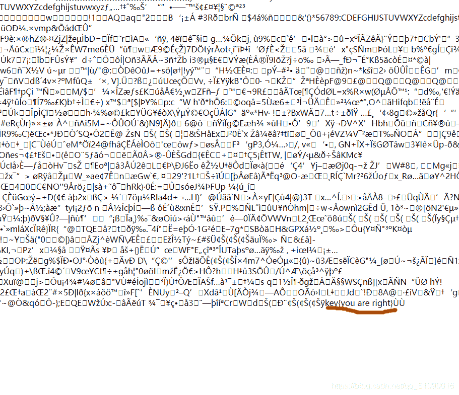
这样就比较简单了。

## 2.隐写

是一个压缩文件，打开得到：
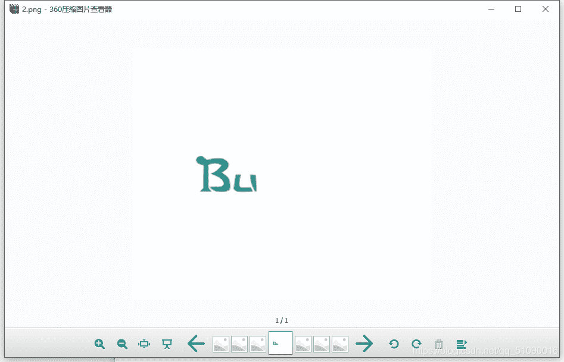
为什么解压打开就是这样的？？难不成这题目和像素有关吗？
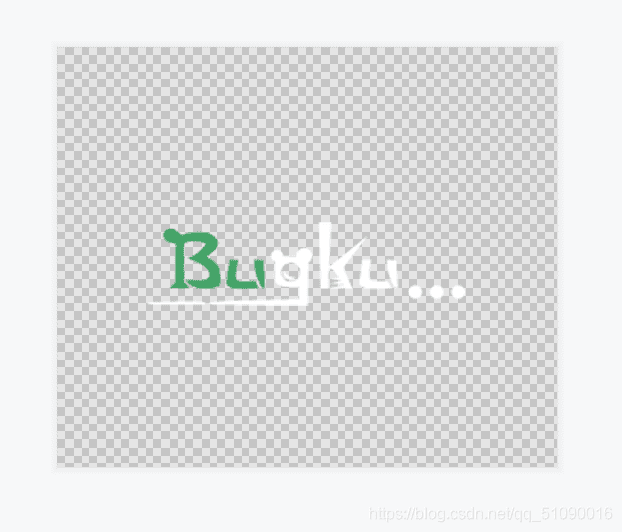
看了大佬的wp才知道还真和像素有关，这是一种改变图片宽高的方法，具体如下：

**图片隐写之修改宽高
1.图片长宽有问题 未显示完全 需修改后可查看
2.原图片像素500*420 420的十六进制是01a4,拖进winhex,500的十六进制是01f4，修改
3.得到原图片**

也就是说，我们可以用winhex打开，然后把a4改成f4就行了，像下面这样：
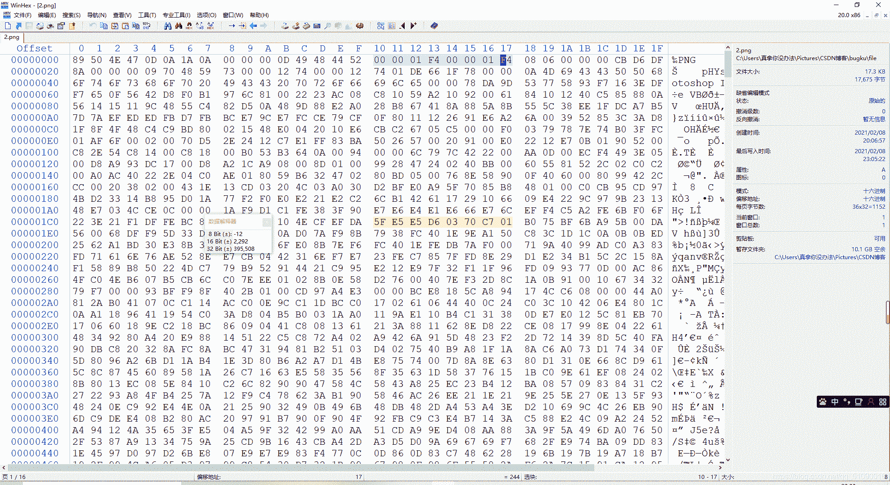
这样隐藏的信息就出来了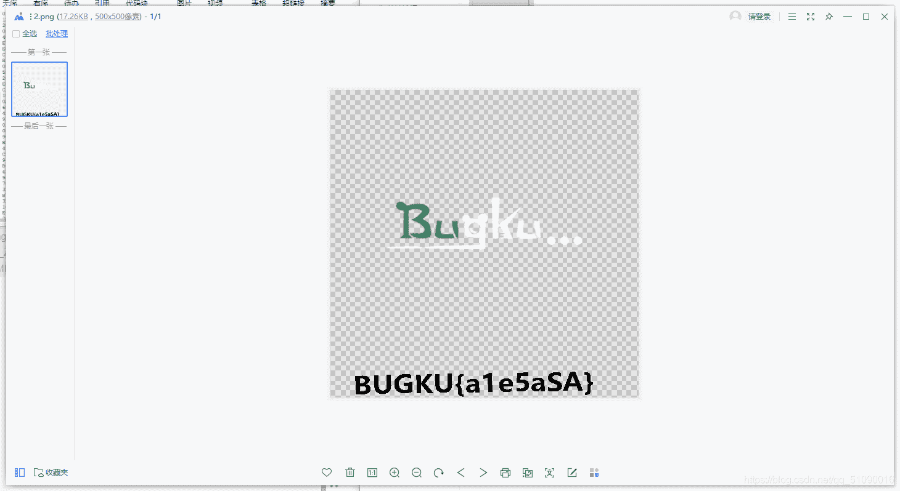

## 3 talent

打开文件：
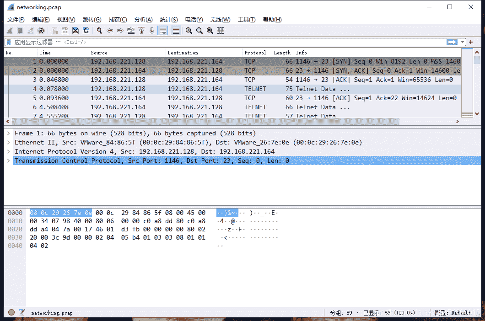
怎么自动用wireshark打开了。。既然打开了，那就ctrl f 搜索一下flag吧：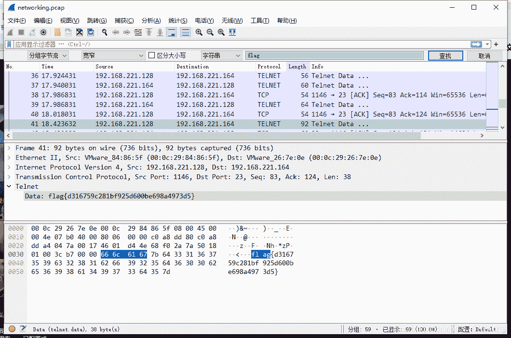
就这么出来了？？？终于有一道题我能自己做出来了。。。

## 4.眼见非实

下载文件打开，是一个压缩包：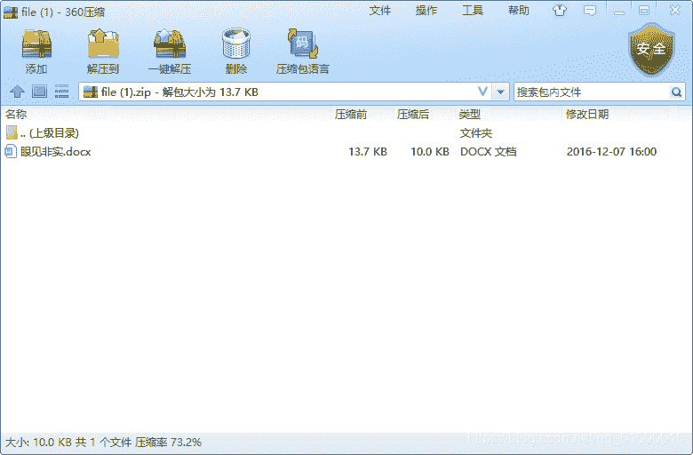

再打开里面的docx：
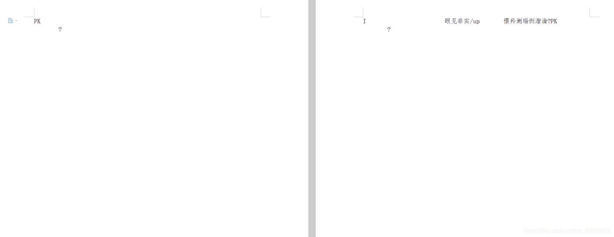

一堆奇怪的东西，用winhex看看文件头：
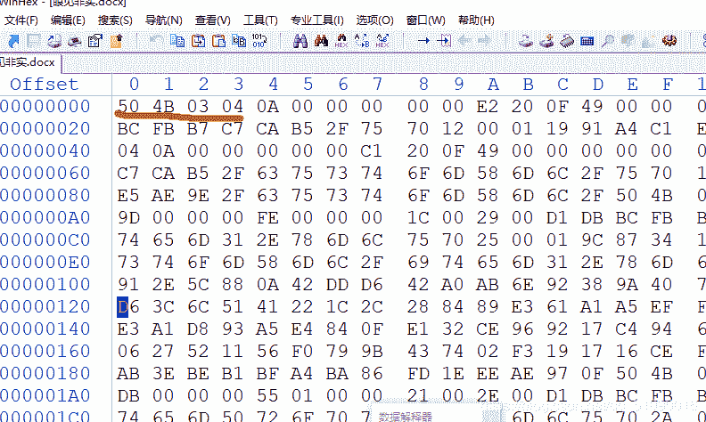
发现文件头为50 4B 03 04说明是一个压缩文件，后缀改成zip再解压缩：
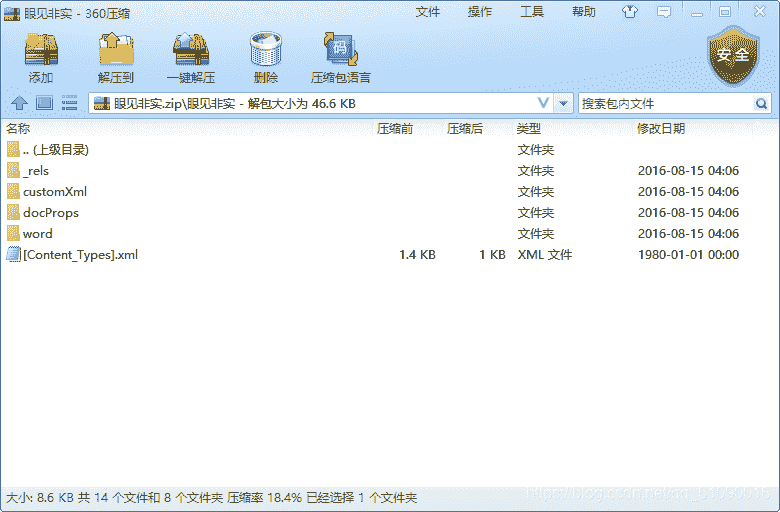
只好每个都看看，终于在document.xml里找到了：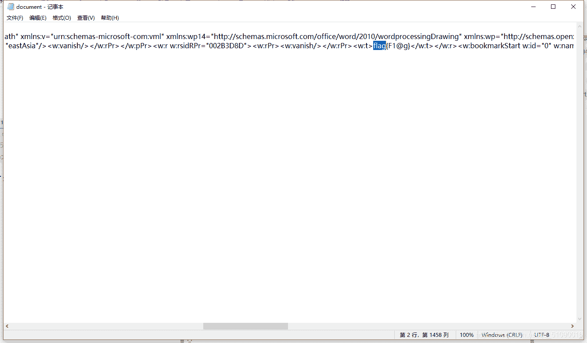

## 5.啊哒

描述: 有趣的表情包 来源：第七届山东省大学生网络安全技能大赛

下载压缩包打开，是一张图片：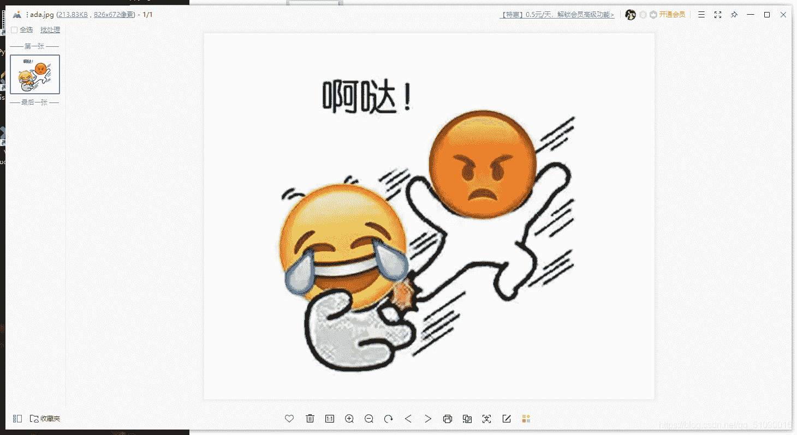
用记事本打开看看，搜索一下flag：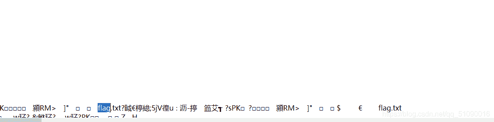
有一个txt文件，按照我之前做题的经验，我可以把这个文件后缀改成zip然后用360压缩打开，应该就可以分离出文件：
成功了，然后怎么获得密码又没思路了。。只好到此为止百度一下大佬。

原来另一个关键点在图片属性里，查看图片属性会发现下面有一串16进制编码：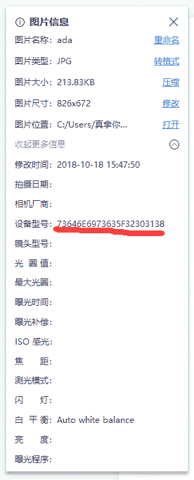
把这个16进制编码转字符，就是解压的密码了：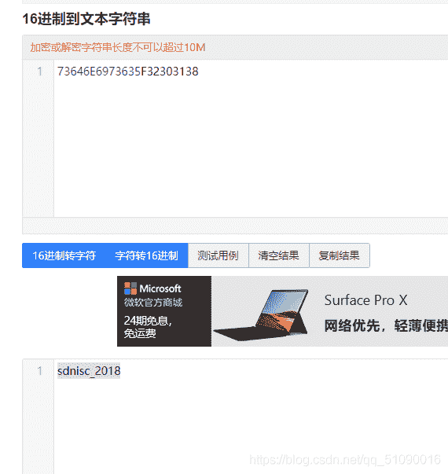
输密码解压就行了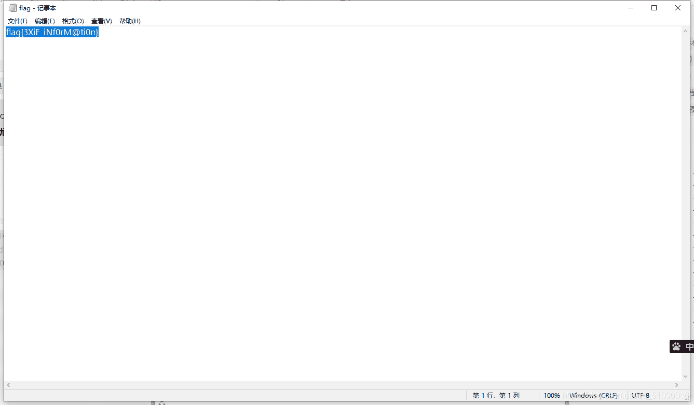

## 总结：

1.图片隐写先转换下格式看看:jpg可以换成html或者txt

2.图片隐写之修改宽高
.图片长宽有问题 未显示完全 需修改后可查看
原图片像素500*420 420的十六进制是01a4,拖进winhex,500的十六进制是01f4，修改

3.文件按原本的格式打开不对时，可以用winhex打开看文件头看文件类型再打开

4.文件用winhex打开发现隐藏flag.txt文件时，可以改后缀名为zip，然后用360压缩打开，就可以分离出flag.txt

5.有些信息会隐藏在图片属性里