<!--yml
category: 未分类
date: 2022-04-26 14:43:53
-->

# bugku 杂项 就五层你能解开吗_CTF杂项入门题_weixin_39937312的博客-CSDN博客

> 来源：[https://blog.csdn.net/weixin_39937312/article/details/110136214](https://blog.csdn.net/weixin_39937312/article/details/110136214)

## 杂项题: 磁盘镜像

磁盘里藏着flag

7z解压，挂载，分离都可以

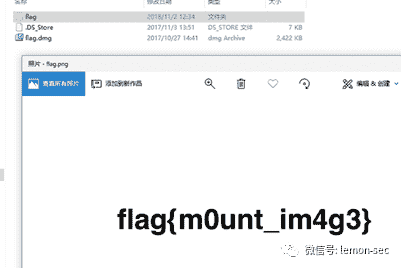

## 杂项题: 神奇的图片

可能是二维码也可能是图形，要根据生成的图片进行判断。

#!/usr/bin/env python2

# -*- coding: UTF-8 -*-

from PIL import Image

x = 150

y = 900

pic = Image.new("RGB",(x, y))

f =open("basic.txt","r")

flag_s = []

for i in f.readlines():

    j=i.strip("\n").replace(")","").replace("(","")

   flag_s.append(j)

f.close()

s = ""

k = 0

for i in range(x):

   for j in range(y):

       s = flag_s[k].split(",")

       pic.putpixel([i,j],(int(s[0]),int(s[1]),int(s[2])))

       k += 1

pic.show()

pic.save("flag.png")

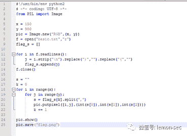

更改x，y值可以看到里面不是二维码而是数字，继续修改到合适的位置

得到的图片用ps翻转即可得到下面的图

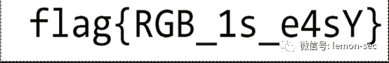

## 杂项题：怀疑人生

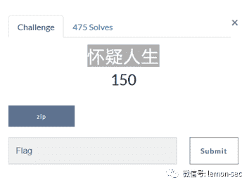

下载压缩包

https://ctf.bugku.com/files/8d61ff10962c756f9b1d8cd048e9f3c6/zip

这个链接不能直接打开，大概是因为没有注册bugku账户登录的话无法直接访问。

更改后缀名，解压

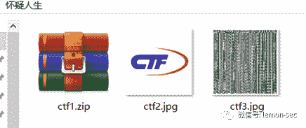

就发现了这么三个东西  直接解压哈哈哈

第一部分，压缩包解压，发现有密码，那就爆破吧

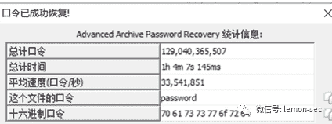

得到密码解压 文本文件

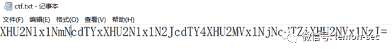

这应该是base64把  解密看看

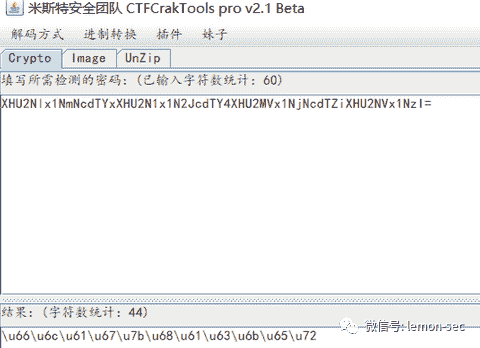

得到 Unicode编码  

\u66\u6c\u61\u67\u7b\u68\u61\u63\u6b\u65\u72  

之后在解码

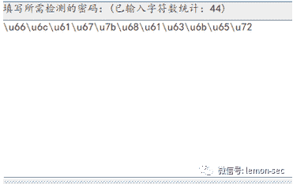

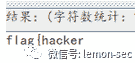

接着看第二个图片ctf2  我还是用360压缩打开发现有东西 但是需要密码

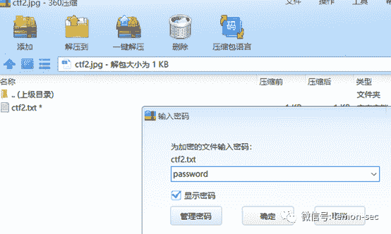

用之前的密码是错误的

那么在十六进制编译器里打开看看

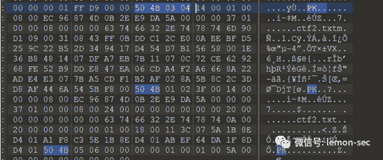

发现有 .zip的文件头和文件尾 ：

(https://blog.csdn.net/qq_42777804/article/details/98876791)

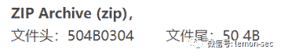

那么我们直接将他后缀改为  .zip 发现可以解压  

解压后得到文本文件 

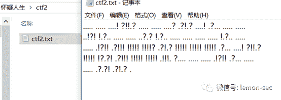

发现这个是 ook编码 

那么在线 解码 https://www.splitbrain.org/services/ook

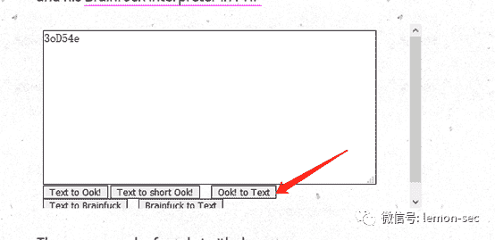

得到   3oD54e

查了好久这个居然是base58   

还是base58在线解码  https://www.jisuan.mobi/pbHzbBHbzHB6uSJx.html

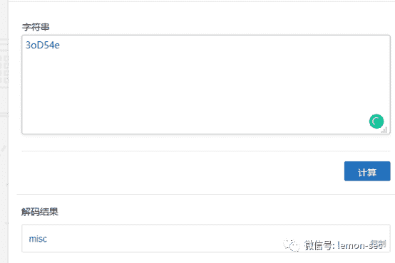

第三张图片是一张二维码 扫描 得到：

我用qq直接扫描出来了！！！！！！

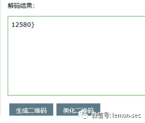

最后部分为     12580}

flag{hackermisc12580}

但是我看其他大佬都是用这个软件扫出来的

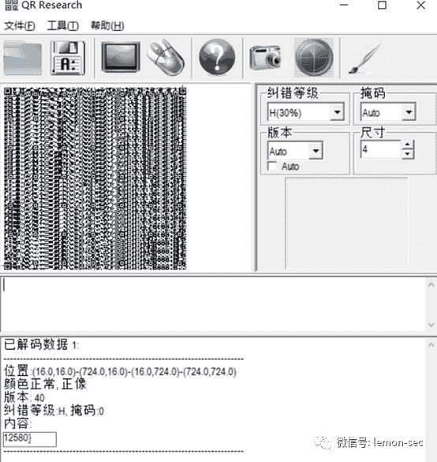

## CTF加密篇之ok(Ook！)

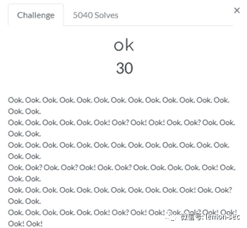

**ok**

Ook. Ook. Ook. Ook. Ook. Ook. Ook. Ook.Ook. Ook. Ook. Ook. Ook. Ook. Ook.

Ook. Ook. Ook. Ook. Ook. Ook! Ook? Ook!Ook! Ook. Ook? Ook. Ook. Ook. Ook.

Ook. Ook. Ook. Ook. Ook. Ook. Ook. Ook.Ook. Ook. Ook. Ook. Ook. Ook. Ook.

Ook. Ook? Ook. Ook? Ook! Ook. Ook? Ook.Ook. Ook. Ook. Ook! Ook. Ook. Ook.

**本题要点：****Ook!****编码**

首先看到题目~

哇！

好长的Ook！啊~~~

这个就只能依靠日常积累和万能的搜索引擎了~~~

有一个非常好用的在线网站~

https://www.splitbrain.org/services/ook

来吧~ 复制粘贴

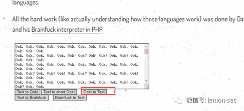

在线解码

bingo~

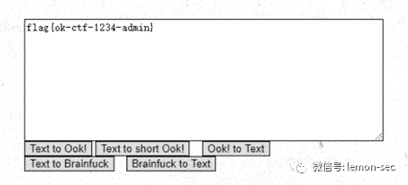

## 杂项题：红绿灯

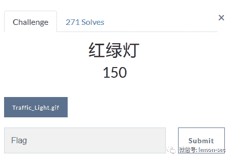

https://ctf.bugku.com/files/65beb9db8419bd99c0d97068959d2b3e/Traffic_Light.gif

打开图片然后另存到桌面

是个红绿灯的动图

题目内容为一个gif的文件，然后使用2345看图王打开，并将每一帧图片都保存下来

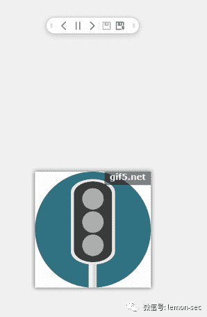

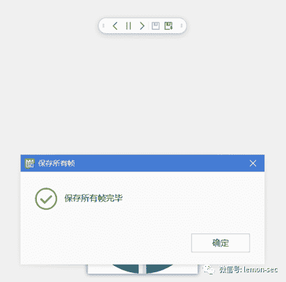

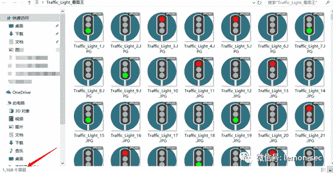

1168个图

其中有大概一半左右的图片为没有颜色的红绿灯，将其全部删除。

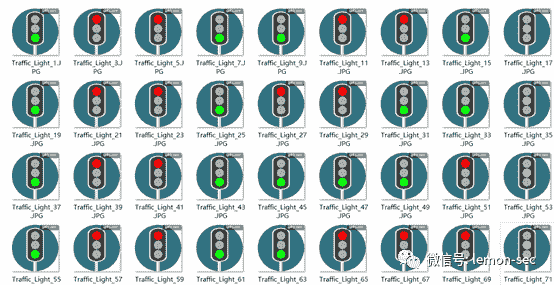

删除完之后，在文件夹里面调节大小的时候，突然发现最左侧和最右侧的一列颜色都是一样的，推测最右侧的一列为空格，因为ascii128位，最左侧的为0，得出绿色为0，红色为1，留下中间的7列。

然后把图片的大小调节为合适的大小，7个一行。

一共455张图片，65组7位二进制数，红灯为1，绿灯为0，将图片信息记录下来

11001101101100110000111001111111011101000011011000110011011010011100110110011101111111100000110100111100110111110110100111010011101000110011110111011101000110001011000011011101011111111010001100001011111111010011100100110100110011011001100110001110001110111111110011011010011001100110011111010011110011011111111011111010000110011110111010111111111001011000011101011011111011010011100100110011101111101100001110101111010011100110110001110010001100111111101

然后利用二进制转换字符串的python的脚本来转换得出flag

def fun1():#二进制字符串转换字符串

    #需要转换的字符串

    f ='11001101101100110000111001111111011101000011011000110011011010011100110110011101111111100000110100111100110111110110100111010011101000110011110111011101000110001011000011011101011111111010001100001011111111010011100100110100110011011001100110001110001110111111110011011010011001100110011111010011110011011111111011111010000110011110111010111111111001011000011101011011111011010011100100110011101111101100001110101111010011100110110001110010001100111111101'

    b = ''

    i = 0

    j = 7

    while j <= len(f):

        a = '0' + f[i:j]

        b += chr(int(a,2))

        i = j

        j += 7

    print(b)

def fun2():#字符串转换二进制字符串

    #需要转换的字符串

    f = ' '

    b = ''

    c = ''

    for i in f:

        a = str(bin(ord(i)))

        b = a[2:].zfill(7)

        c += b

    print(c)

fun1()

#fun2()

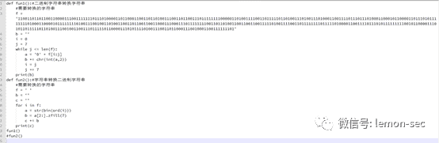

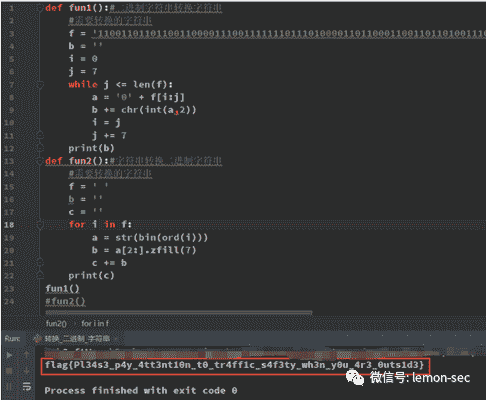

flag{Pl34s3_p4y_4tt3nt10n_t0_tr4ff1c_s4f3ty_wh3n_y0u_4r3_0uts1d3}

## 杂项题：不简单的压缩包

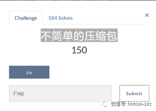

下载压缩包

https://ctf.bugku.com/files/e5a937a3985f5264a723bcbd0e062b0f/zip

更改后缀名后，解压

需要密码

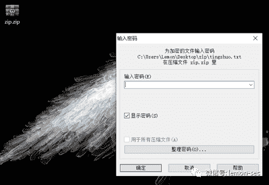

打开010

在末尾发现第二个压缩包

zip文件头是504B0304，文件尾504B

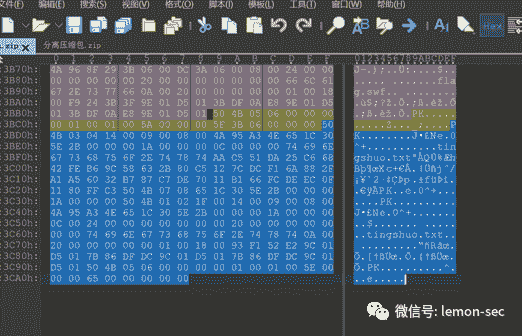

手动分离出去或者使用binwalk分离

另存为第二个zip

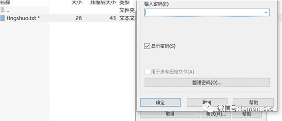

打开，有密码，以为是伪加密，把140009改成140000，进压缩包，提示解压文件损坏。。。

那行吧，不是伪加密，只能放ARCHPR暴力破解，说不定破解几个小时就出来了。。。
然鹅。。。。。事情并不是这样

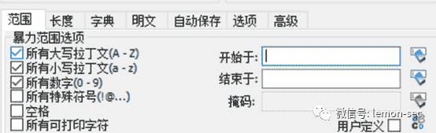

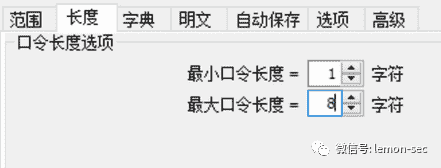

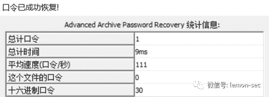

居然一运行就跑出了密码，密码是0。。。。

接下来，你们懂的，解压出tingshuo.txt，发现一段谜之日语

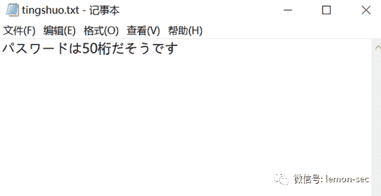

翻译一下

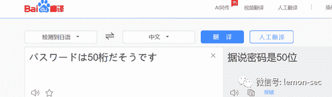

密码50位，对应的应该是zip.zip的，但是密码它有50位？？？暴力破解能解到地老天荒，密码会不会在属性里？看了一下属性好像没什么问题(之前还试过流隐写破解，还是没什么发现)

那，猜猜密码？？50位密码，如果混合组合，肯定没法解开，要不然试试相同符号密码？于是我做了一个这样的字典。

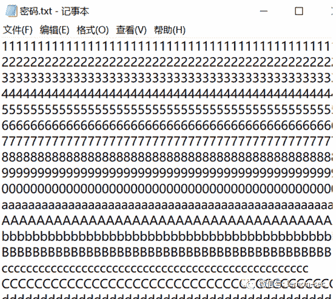

每行50个相同字符

打开ARCHPR，跑一下字典

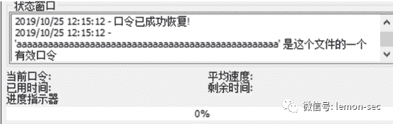

50个a

好了，打开zip.zip，输入密码，解压出flag.swf文件

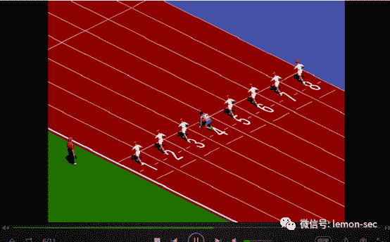

一个谜之游戏，我试了好几次，通不了关，可能是我太菜了吧
我想着。。。。是一个游戏，通关之后可能会有flag，试试改存档？

但是并没有存档文件出现在文件夹里。。。

调整一下思路
在百度搜索.swf

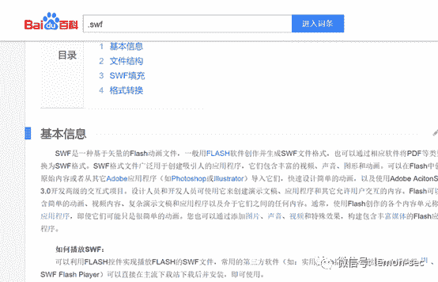

既然是应用程序那就试试反编译看源码喽，也许修改能直接通关吧。
然后，我在网上找到一个名叫JPEXS Free Flash Decompiler的软件。

用它打开flag.swf

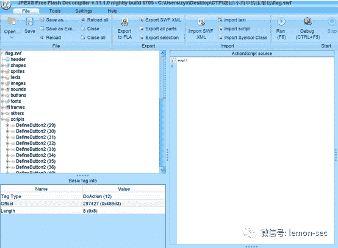

一个一个看源码，在scripts中有一个名叫DefineSprite (171)的项目，点开之后发现一段奇怪的字符串。

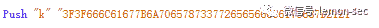

看上去像是16进制，转换一下试试，

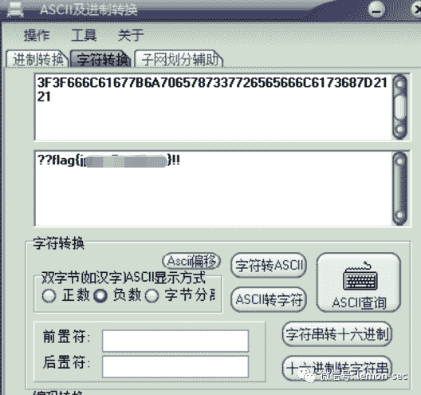

密码居然在这里
填进flag，居然通过了！！！！

flag{jpexs7reeflash}

看了大佬的解题思路，脑洞太多了，自己解不出来。。。

整理了下最近做题常用到的工具，自行考虑下载，毕竟这些工具也是来源于网络！