<!--yml
category: 未分类
date: 2022-04-26 14:48:57
-->

# bugkuCTF web进阶+web最后两题_goddemon的博客-CSDN博客

> 来源：[https://blog.csdn.net/qq_33942040/article/details/109131637](https://blog.csdn.net/qq_33942040/article/details/109131637)

## bugkuCTF一些题目

# 江湖魔头

①js文件类–>js文件被压缩
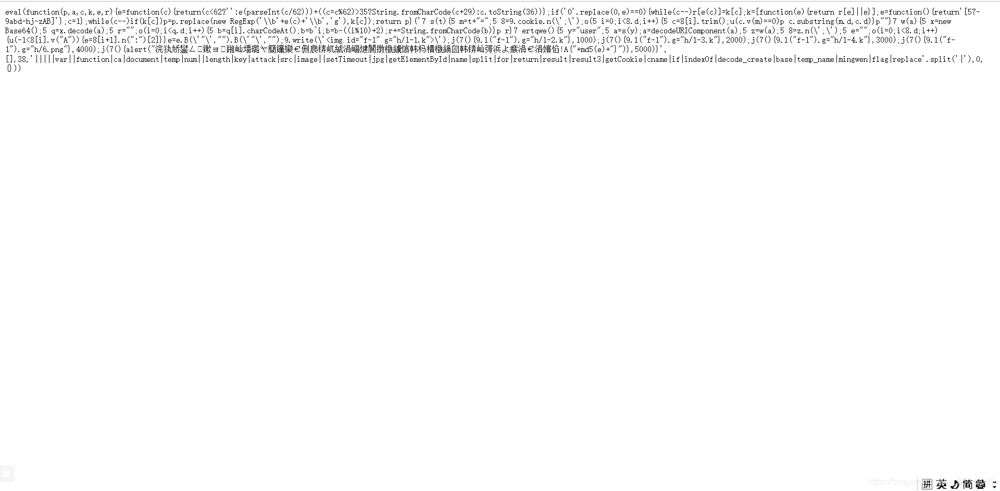
解压缩方法–>在该网站解压缩即可

```
https://tool.lu/js/ 
```

②伪造cookie
1.解密与获取cookie类
获取cookie

```
var test=getCookie(‘user’); 
```

解密cookie类

```
test=decodeURIComponent(test)
test=decode_create(test) 
```

进行更改cookie

```
test='O:5:"human":10:{s:8:"xueliang";i:852;s:5:"neili";i:571;s:5:"lidao";i:92;s:6:"dingli";i:73;s:7:"waigong";i:0;s:7:"neigong";i:0;s:7:"jingyan";i:0;s:6:"yelian";i:0;s:5:"money";i:100000;s:4:"flag";s:1:"0";}' 
```

2.进行编码回去
自带函数代码

```
function decode_create(temp) {
	var base = new Base64();
	var result = base.decode(temp);
	var result3 = "";
	for (i = 0; i < result.length; i++) {
		var num = result[i].charCodeAt();
		num = num ^ i;
		num = num - ((i % 10) + 2);
		result3 += String.fromCharCode(num)
	}
	return result3
} 
```

解码代码

```
var result3 = "";
	for (i = 0; i < test.length; i++) {
		var num =test[i].charCodeAt();
		num = num + ((i % 10) + 2);
		num = num ^ i;
		result3 += String.fromCharCode(num)
	} 
```

编写的代码

```
var base = new Base64();
var output = "";
		var chr1, chr2, chr3, enc1, enc2, enc3, enc4;
		var i = 0;
		input = _utf8_encode(result3);
		while (i <result3.length) {
			chr1 = result3.charCodeAt(i++);
			chr2 =result3.charCodeAt(i++);
			chr3 = result3.charCodeAt(i++);
			enc1 = chr1 >> 2;
			enc2 = ((chr1 & 3) << 4) | (chr2 >> 4);
			enc3 = ((chr2 & 15) << 2) | (chr3 >> 6);
			enc4 = chr3 & 63;
			if (isNaN(chr2)) {
				enc3 = enc4 = 64;
			} else if (isNaN(chr3)) {
				enc4 = 64;
			}
			output = output +
			_keyStr.charAt(enc1) + _keyStr.charAt(enc2) +
			_keyStr.charAt(enc3) + _keyStr.charAt(enc4);
		} 
```

进行编码

```
output=encodeURIComponent(output); 
```

注意
1.修改的值只能是money,因为其他值未知上限更改后–>导致会爆作弊行为状况特点
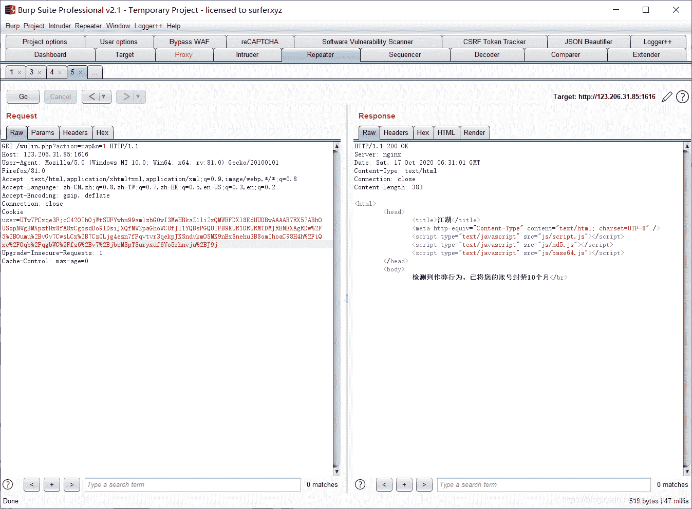
2.修改完钱后进行购买5本书籍即可

最后获取flag

```
flag{a13d82fe0daf4730eac8f8e0d4c17e72} 
```

# web进阶

1.phpcmsV9
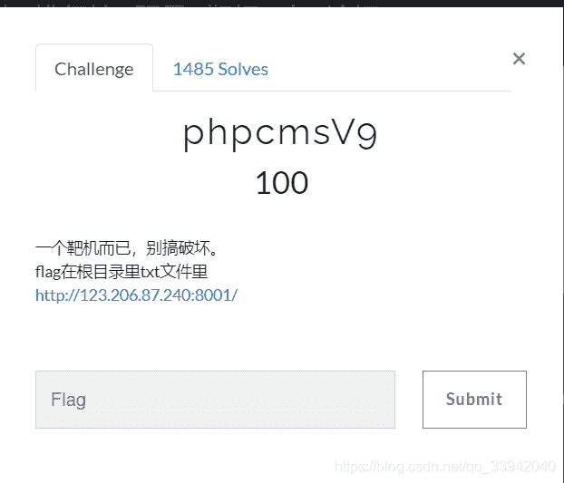
这题我有点迷
扫描出robots.txt文件后 然后就得到了flag
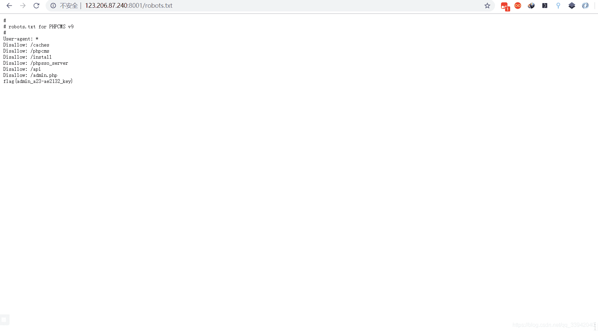
2.海洋cms+小明的博客（都进不去）
http://120.24.86.145:8008/
http://123.206.87.240:9003/
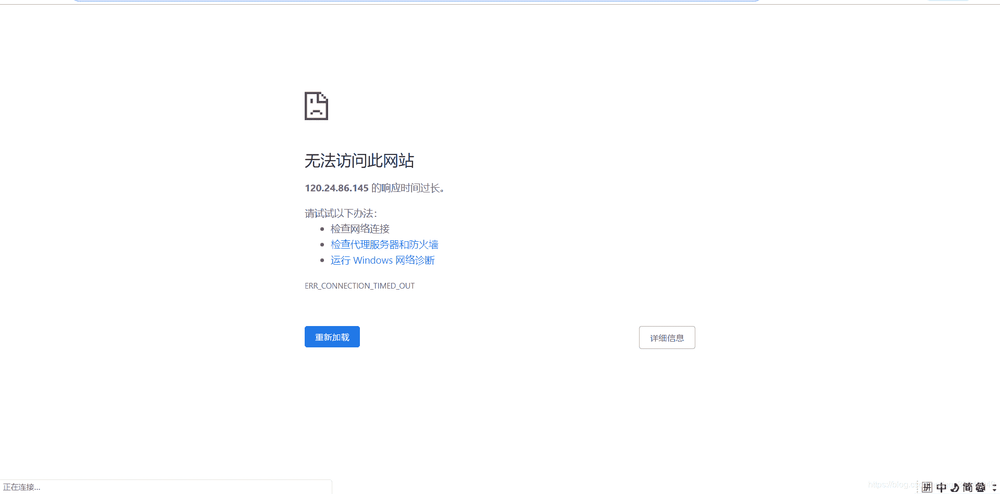
应该是平台崩了
3.Bugku-cms1
进去后是这个样子
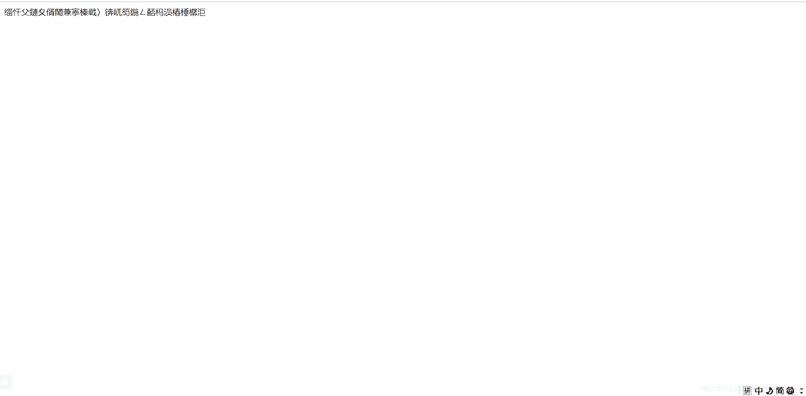
因为题目提示后台中
就反手一个admin–>结果发觉并没有这个东西
然后用御剑扫了半天,啥重要的都无

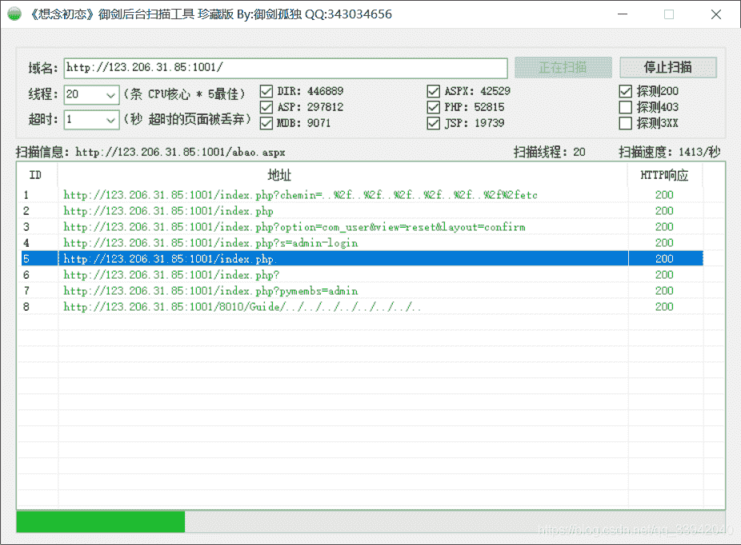
然后找重定向,cookie类思路
发觉啥都无
就去查了下别人的wp
发觉–>是源文件被前面玩的人给删了

我也是醉了
4.后面干脆点了一遍看那些靶场能玩
发觉只有这三个靶场可玩了
maccms-苹果cms可玩

## bugku导航

思路①==
这是什么鬼题目？
这么垃圾的吗？
进入网站后页面
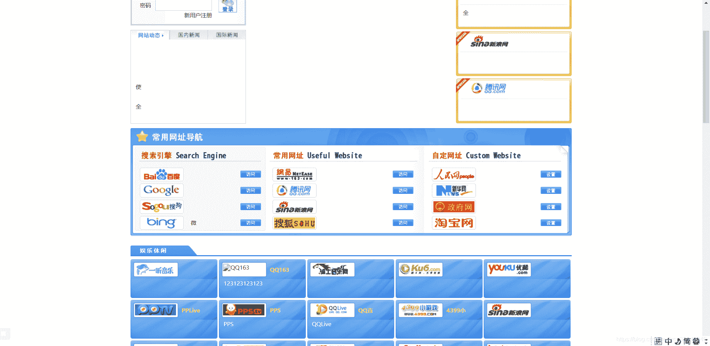
直接御剑走起–>
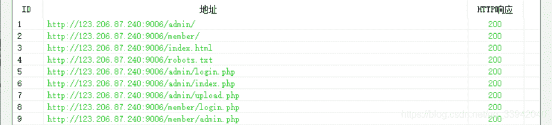
扫描到这些文件和1.zip资源
发觉所有文件的路径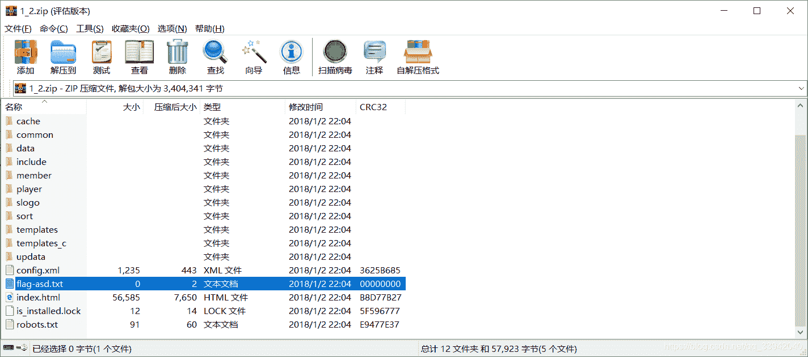
本来最开始以为还要绕的
但是还是在url中访问了下这个文件
？？？？？–>flag出来了？？？？？
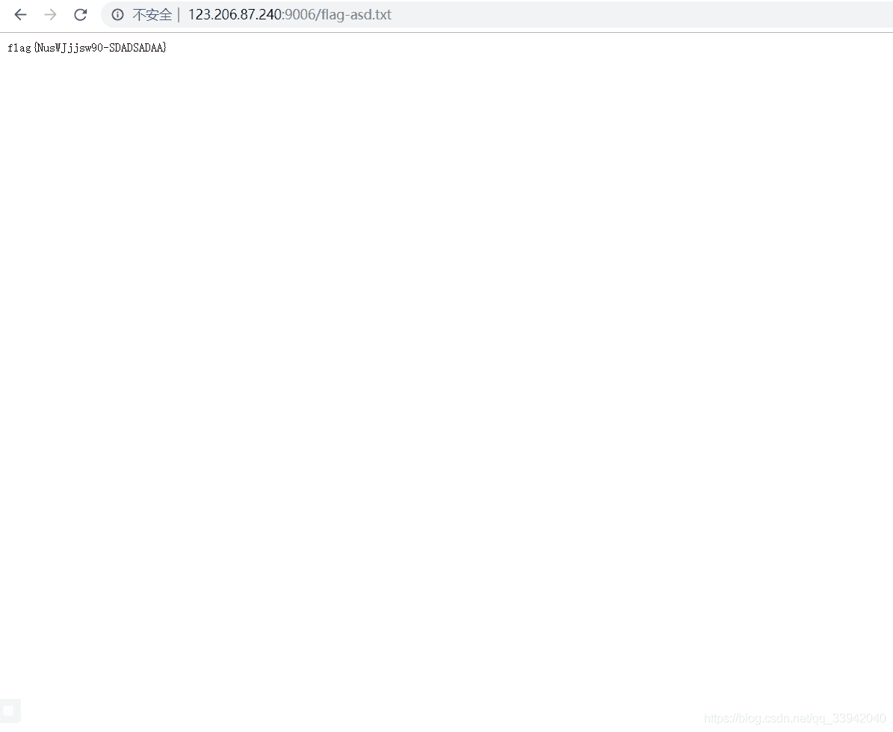
<mark>思路②</mark>
翻了下别人的wp
发觉可利用代码审计思路进行
（因为自己代码审计能力薄弱的原因）
所以这里直接放大佬的链接文档
[审计思路](https://blog.csdn.net/qq_43233085/article/details/105256209)

# 实战2-注入

进入网站,然后疯狂找注入点
http://www.kabelindo.co.id/readnews.php?id=21

然后后面就是基于正常的注入模式即可
flag

```
flag{tbnomax} 
```