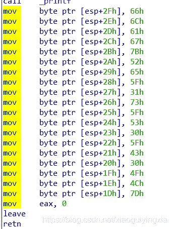
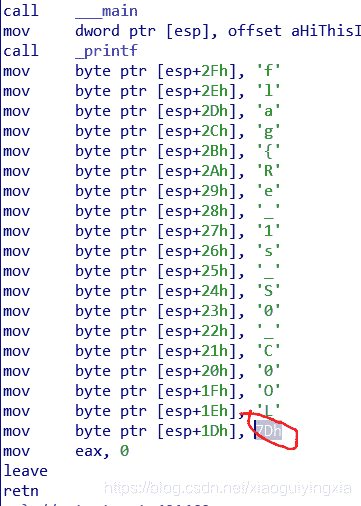

<!--yml
category: 未分类
date: 2022-04-26 14:50:19
-->

# bugkuCTF之逆向入门解题思路_邻家小白的博客-CSDN博客

> 来源：[https://blog.csdn.net/xiaoguiyingxia/article/details/98968651](https://blog.csdn.net/xiaoguiyingxia/article/details/98968651)

## 逆向入门

我们把文件下载得到的exe文件拖入ida。看到有个main主函数。
printf就是输出

然后每一条按下“R”得出结果

R，后的字符即可。flag{Re_1s_S0_C0oL}