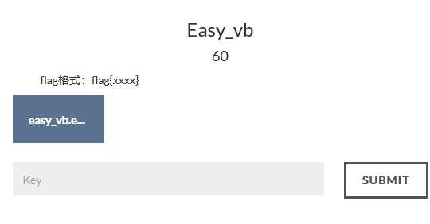
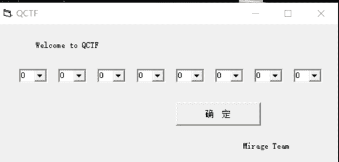
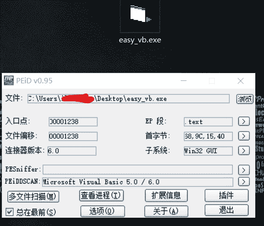
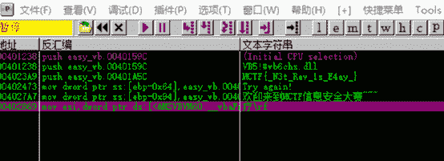

<!--yml
category: 未分类
date: 2022-04-26 14:38:14
-->

# bugkuCTF平台逆向题第一道Easy_vb题解_iqiqiya的博客-CSDN博客_bugkueasy_vb

> 来源：[https://blog.csdn.net/xiangshangbashaonian/article/details/78915694](https://blog.csdn.net/xiangshangbashaonian/article/details/78915694)

题目地址:

http://123.206.31.85/files/6d5c35762f3e316cde9647c14fd0b56d/easy_vb.exe

下载后运行截图

查壳 无壳 直接载入OD

直接反汇编窗口右键à中文搜索引擎à智能搜索即可发现flag

IDA载入查看

发现IDA浏览窗口直接向下翻几下就可以发现

