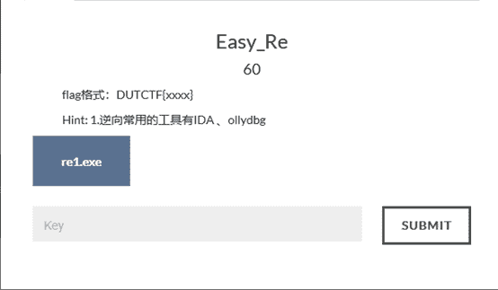
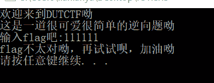
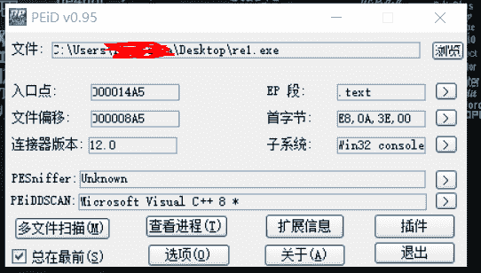
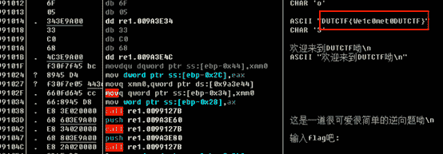
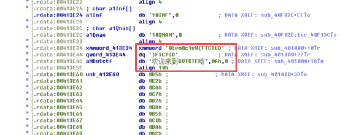
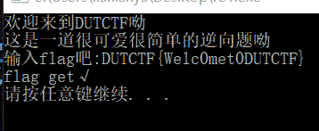

<!--yml
category: 未分类
date: 2022-04-26 14:34:37
-->

# bugkuCTF平台逆向题第二道Easy_Re题解_iqiqiya的博客-CSDN博客_easy_re

> 来源：[https://blog.csdn.net/xiangshangbashaonian/article/details/78915909](https://blog.csdn.net/xiangshangbashaonian/article/details/78915909)

题目链接：

http://123.206.31.85/files/1b62f97dce25f61c3a43ee953e7467c6/re1.exe

tips:

下载后打开

查壳 无壳

OD载入直接右键选择中文搜索引擎-->智能s搜索   就可以看到字符串flag

IDA载入 将这两处转为字符即可 但发现flag是逆序的 反过来就好

最后验证下

