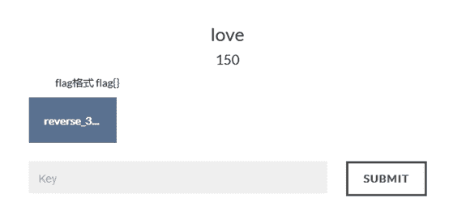
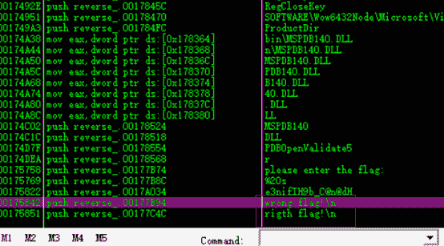
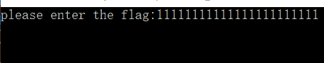
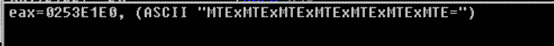
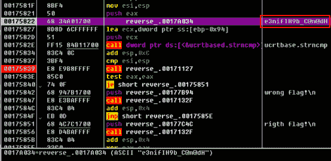
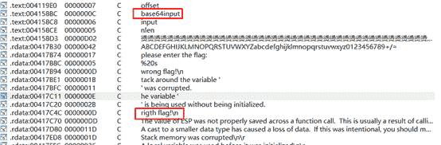
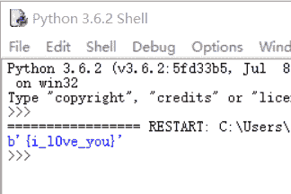

<!--yml
category: 未分类
date: 2022-04-26 14:32:10
-->

# bugkuCTF平台逆向题第五道love题解_iqiqiya的博客-CSDN博客_bugku love

> 来源：[https://blog.csdn.net/xiangshangbashaonian/article/details/78923289](https://blog.csdn.net/xiangshangbashaonian/article/details/78923289)

题目链接：

[http://123.206.31.85/files/99278e700add95793a765b13ab1314ea/reverse_3.exe](http://123.206.31.85/files/99278e700add95793a765b13ab1314ea/reverse_3.exe)

tips：

查壳无壳（截图略）

载入OD

搜索字符串

随意输入1111111111111111111

发现进行了base64加密

再向下单步 发现、

结合IDA看下

int sub_4156E0**()**

**{**

size_t v0**;**// eax@6

constchar*****v1**;**// eax@6

size_t v2**;**// eax@9

char v4**;**// [sp+0h] [bp-188h]@6

char v5**;**// [sp+Ch] [bp-17Ch]@1

size_t v6**;**// [sp+10h] [bp-178h]@3

size_t j**;**// [sp+DCh] [bp-ACh]@6

size_t i**;**// [sp+E8h] [bp-A0h]@1

char Dest**[**108**];**// [sp+F4h] [bp-94h]@5

char Str**;**// [sp+160h] [bp-28h]@6

char v11**;**// [sp+17Ch] [bp-Ch]@6

unsignedint v12**;**// [sp+184h] [bp-4h]@1

int savedregs**;**// [sp+188h] [bp+0h]@1

memset**(&**v5**,**0xCCu**,**0x17Cu**);**

v12 **=****(**unsignedint**)&**savedregs **^** __security_cookie**;**

**for****(** i **=**0**;****(**signedint**)**i **<**100**;****++**i **)**

**{**

v6 **=** i**;**

**if****(** i **>=**0x64**)**

sub_411154**();**

Dest**[**v6**]****=**0**;**

**}**

sub_41132F**(**"please enter the flag:"**,** v4**);**

sub_411375**(**"%20s"**,****(**unsignedint**)&**Str**);**

v0 **=** j_strlen**(&**Str**);**

v1 **=****(**constchar***)**sub_4110BE**(&**Str**,** v0**,****&**v11**);**

strncpy**(**Dest**,** v1**,**'('**);**

sub_411127**();**

i **=** j_strlen**(**Dest**);**

**for****(** j **=**0**;****(**signedint**)**j **<****(**signedint**)**i**;****++**j **)**

Dest**[**j**]****+=** j**;**

v2 **=** j_strlen**(**Dest**);**

strncmp**(**Dest**,** Str2**,** v2**);**

**if****(** sub_411127**()****)**

sub_41132F**(**"wrong flag!\n"**,** v4**);**

**else**

sub_41132F**(**"rigth flag!\n"**,** v4**);**

sub_41126C**(&**savedregs**,****&**dword_415890**);**

sub_411280**();**

**return** sub_411127**();**

**}**

分析可知:将输入的串Str1先进行base64加密 再与串Str2比较 若相等 则输出"right flag"

由此，我们只需将Str2也就是"e3nifIH9b_C@n@dH"进行解密即可

Python脚本：

**import** base64

s **=**"e3nifIH9b_C@n@dH"

flag **=**""

**for** i **in** range**(**len**(**s**)):**

flag **+=** chr**(**ord**(**s**[**i**])****-** i**)**

flag **=** base64**.**b64decode**(**flag**)**

**print(**flag**)**

所以得到flag{i_l0ve_you}