<!--yml
category: 未分类
date: 2022-04-26 14:43:23
-->

# bugkuctf web部分（前8题）解题报告_KEN781215的博客-CSDN博客

> 来源：[https://blog.csdn.net/KEN781215/article/details/102446217](https://blog.csdn.net/KEN781215/article/details/102446217)

写点东西记录一下，方便以后查看。

[http://ctf.bugku.com/challenges](http://ctf.bugku.com/challenges)

web2：

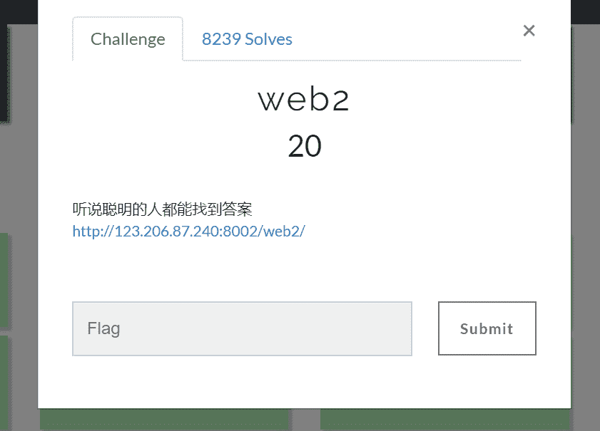

签到题，[花里胡哨](https://www.baidu.com/s?wd=%E8%8A%B1%E9%87%8C%E8%83%A1%E5%93%A8&tn=24004469_oem_dg&rsv_dl=gh_pl_sl_csd)的果断去看源码。。。。。

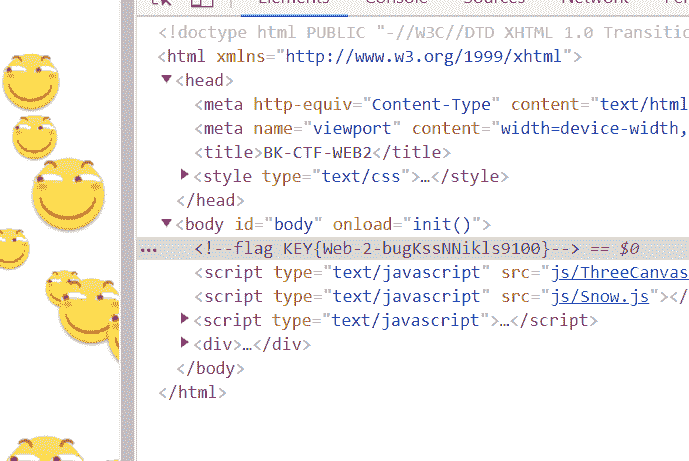

计算器：

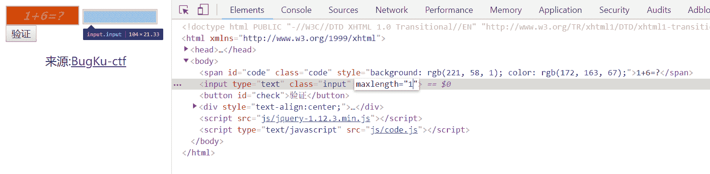

 发现只能输入一个数字，肯定是对提交的内容做了长度限制，打开开发者工具把长度改一下（如果好运的话如图就直接出结果）

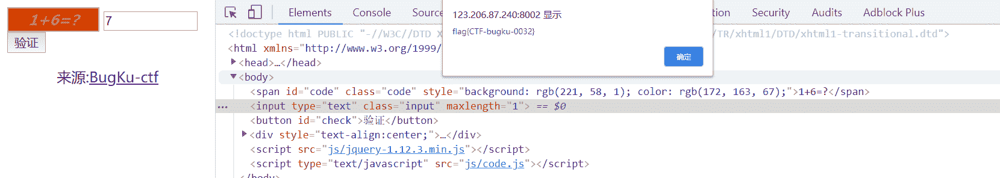

## web基础$_GET：

发现是很简单的代码  提交的数据（get方式）只要what=flag就行

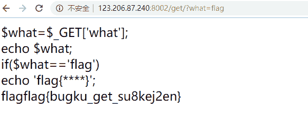

## web基础$_POST：

用一下火狐的插件hackbug，得到flag：flag{bugku_get_ssseint67se}

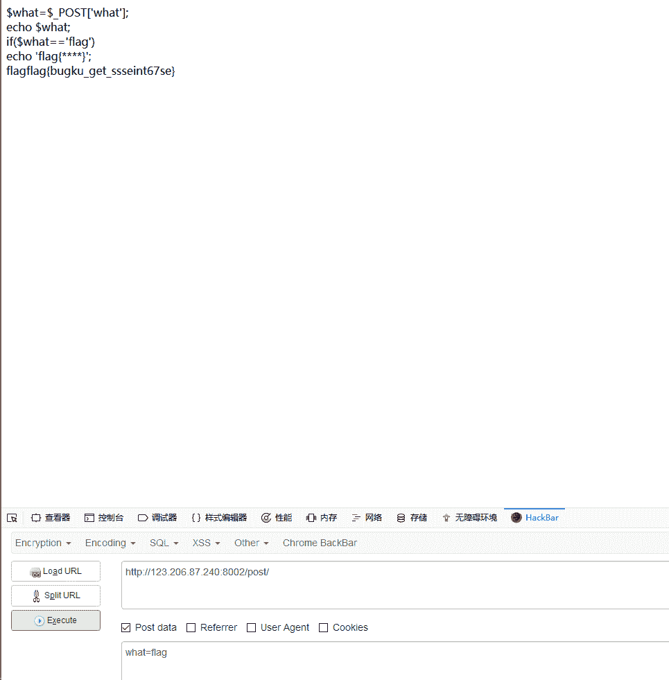

 矛盾：
读一下代码  判断输入的num  如果不是数字的话且为1的话输出flag  应了题目的话  [自相矛盾](https://www.baidu.com/s?wd=%E8%87%AA%E7%9B%B8%E7%9F%9B%E7%9B%BE&tn=24004469_oem_dg&rsv_dl=gh_pl_sl_csd)，  但是我们有很多方法让num为1但是不是数字  比如num= 1e0.1，但不能1e1.

 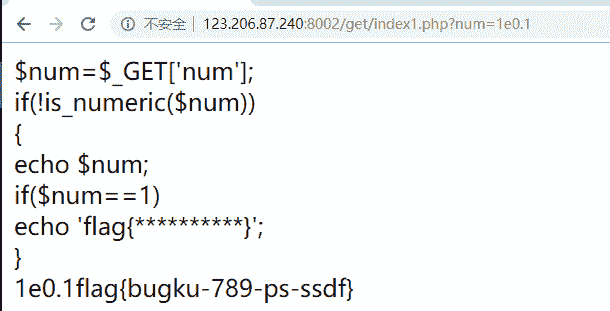

你必须让他停下来:

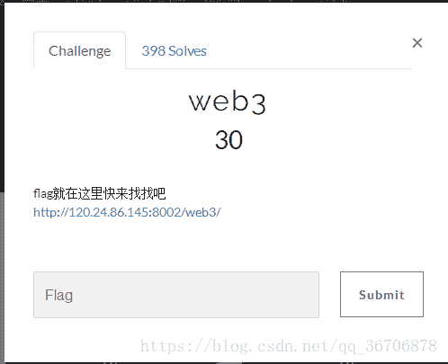

打开网页之后发现一直弹出这个框  是不是特别烦  直接个禁止了,然后就是一片空白  一片茫然啊  f12看一下

 

然后把中间的一串字符弄好

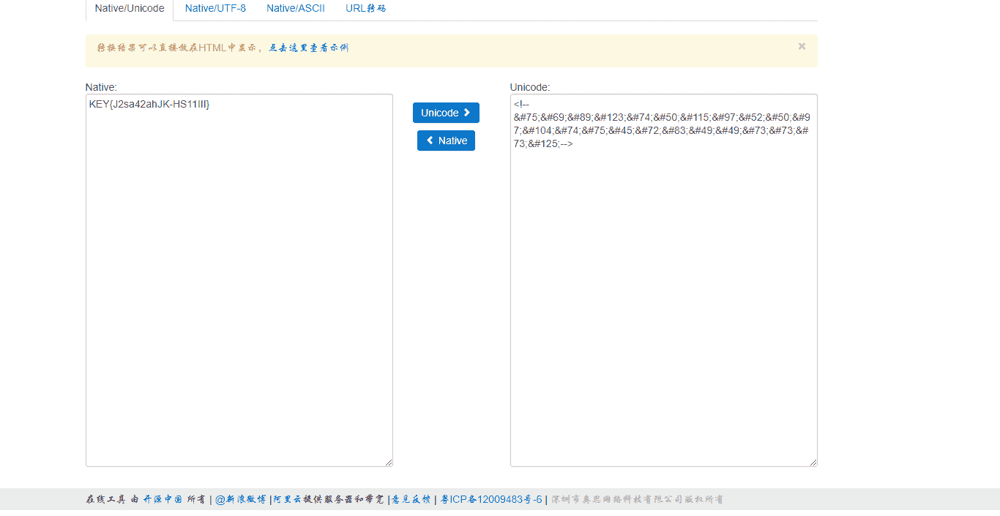

flag就出来了

域名解析：

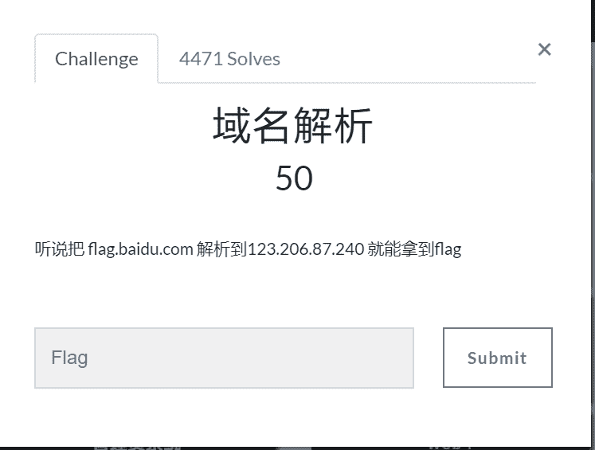

这要了解一下host

沿该路径找到hosts文件

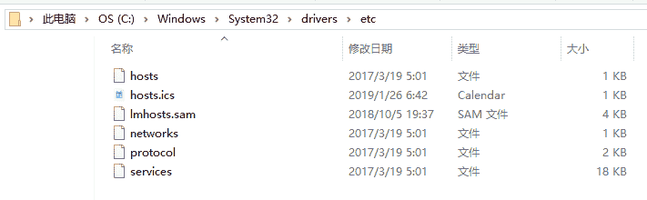

 拖出来改，要权限，加上

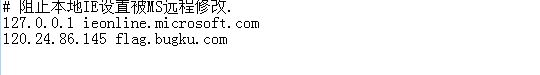

保存之后，再在浏览器里打开flag.bugku.com就能看到flag。（windows和linux都行）

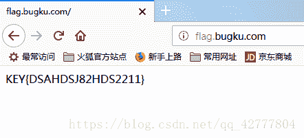