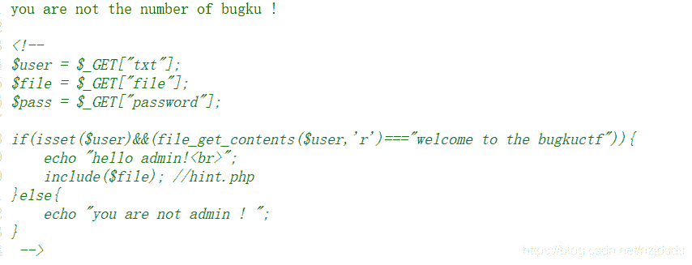
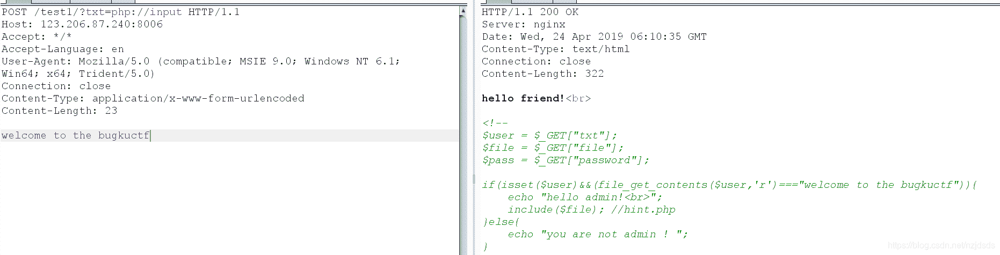
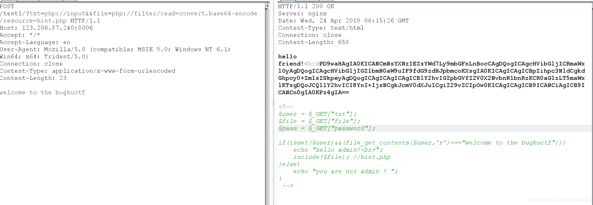
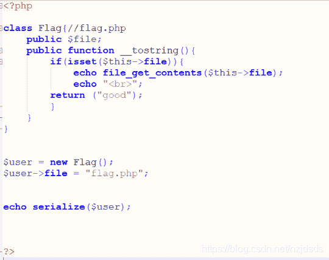
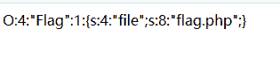
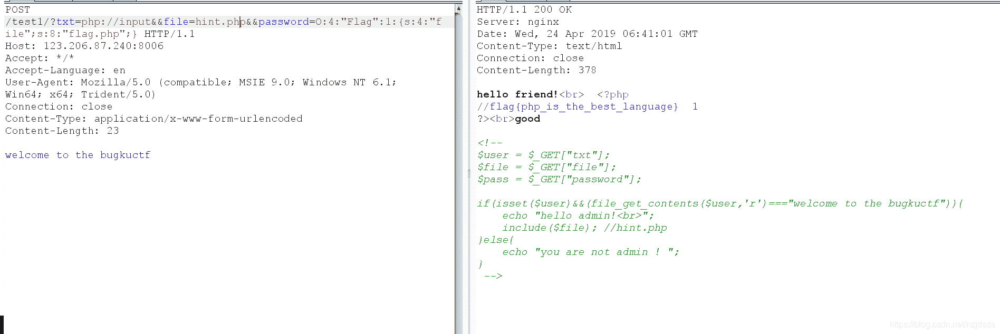

<!--yml
category: 未分类
date: 2022-04-26 14:19:57
-->

# bugku【welcome to bugkuctf】题解_大方子的博客-CSDN博客

> 来源：[https://blog.csdn.net/nzjdsds/article/details/89527124](https://blog.csdn.net/nzjdsds/article/details/89527124)

**1.****通过php://input对变量输入内容，让file_get_contents能够读取变量的内容**

**2.****通过php://filter/read=convert.base64-encode/resource=xxx.php得到其他PHP文件的源代码**

**3.****通过反序列化，对echo的魔术方法__tostring()里面的参数进行赋值**

题目地址：[http://120.24.86.145:8005/post/](http://120.24.86.145:8005/post/)

打开题目出现


查看源码，看到提示



这里需要我们设置通过txt给$user变量赋值，然后file_get_contents读取$user的内容如果等于welcome to the bugkuctf   即输出hello admin!  并且文件包含$file里面的参数

对txt参数试用php://input，然后参数通过post发送出去即可



然后我们在利用这个文件包含漏洞使用

php://filter/read=convert.base64-encode/resource=xxx.php

来进行访问php文件的源码（base64转码后，不转码的话被包含的php代码还是会被网页执行），并通过base64解码查看的方法来查看hint.php和index.php的源代码



```
/*hint.php*/

<?php  

class Flag{//flag.php  
    public $file;  
    public function __tostring(){  
        if(isset($this->file)){  
            echo file_get_contents($this->file); 
			echo "<br>";
		return ("good");
        }  
    }  
}  
?> 
```

```
/*index.php*/

<?php  
$txt = $_GET["txt"];  
$file = $_GET["file"];  
$password = $_GET["password"];  

if(isset($txt)&&(file_get_contents($txt,'r')==="welcome to the bugkuctf")){  
    echo "hello friend!<br>";  
    if(preg_match("/flag/",$file)){ 
		echo "ä¸è½ç°å¨å°±ç»ä½ flagå¦";
        exit();  
    }else{  
        include($file);   
        $password = unserialize($password);  
        echo $password;  
    }  
}else{  
    echo "you are not the number of bugku ! ";  
}  

?>  

<!--  
$user = $_GET["txt"];  
$file = $_GET["file"];  
$pass = $_GET["password"];  

if(isset($user)&&(file_get_contents($user,'r')==="welcome to the bugkuctf")){  
    echo "hello admin!<br>";  
    include($file); //hint.php  
}else{  
    echo "you are not admin ! ";  
}  
 --> 
```

这里需要用到反序列化的知识和魔术方法的知识。

在index.php中通过$password = unserialize($password);   进行了反序列化并调用了echo方法输出$password，因为在echo被调用时候前都会先调用__tostring()的魔术方法（在hint.php源码中），然后我们在hint.txt的源码中看到我们需要把$file参数赋值为flag.php即可得到flag。

所以我们需要自己构造序列，来达到对_tostring里面的$file参数赋值





O:4:"Flag":1:{s:4:"file";s:8:"flag.php";}

我们把构造好的序列化输出通过password上传即可得到flag

