<!--yml
category: 未分类
date: 2022-04-26 14:39:24
-->

# buuctf-crackMe题解及感悟_夏男人的博客-CSDN博客

> 来源：[https://blog.csdn.net/weixin_51373492/article/details/117041292](https://blog.csdn.net/weixin_51373492/article/details/117041292)

这道题花了我将近两天的时间，期间因为看wp完全看不懂疯狂请教学长，最终自己动手调试出来了。实在是不容易，也确实学到了许多东西，记录于此。

下载题目的程序后，惯例查壳，发现莫得

先打开程序，程序要我们输入用户名和密码，了解。

丢进ida

进入主函数wmain
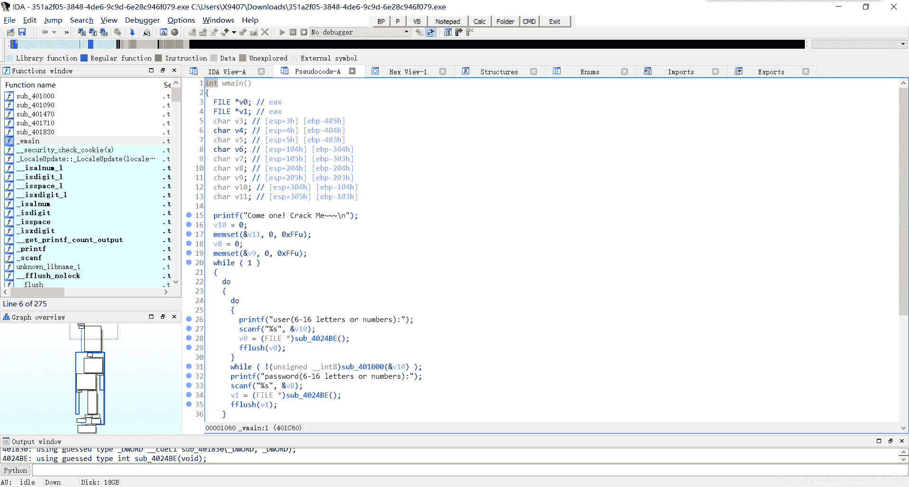

把函数名字改成看得懂的单词

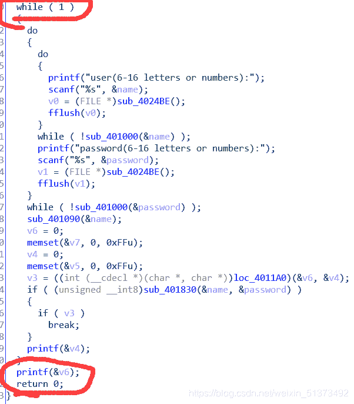

由此处的while和最里层的那个break可知，要从该循环跳出，这俩if都得满足

首先我们分析第一个if，点进sub_401830并开始分析

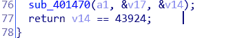

因为这个if要成立，所以这个return后面的表达式必须成立，及v14==43924成立，我们此处逆向分析（字面意思）

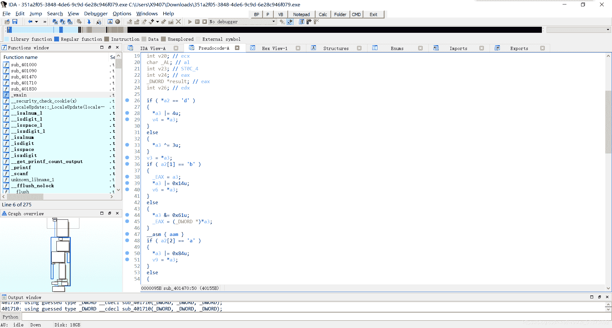

此处出现了很多很多if判断，按照经验我们可以把if后面的数字按r转换成字符，此处我们猜测if全部满足后结果刚好等于43924（不猜搞不出，全部分析。。想想都恐怖）

可以写个python脚本验证一下我们的猜测

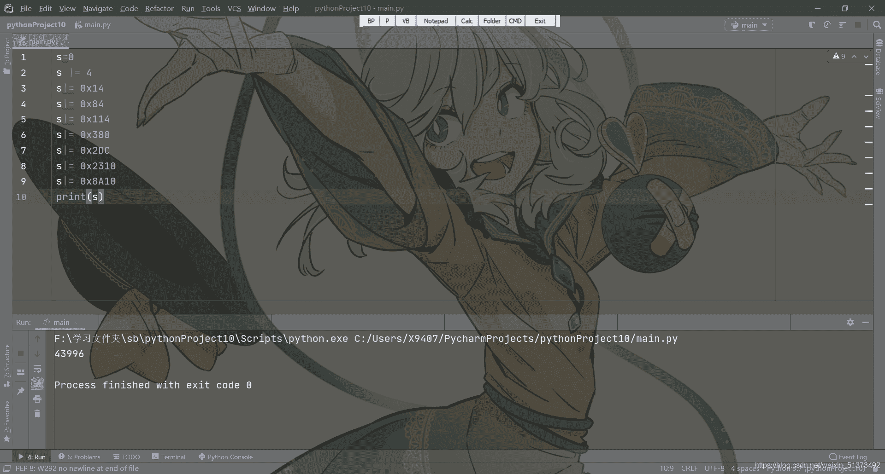

咦，答案不是43924，这是为什么呢（棒读）

原来是

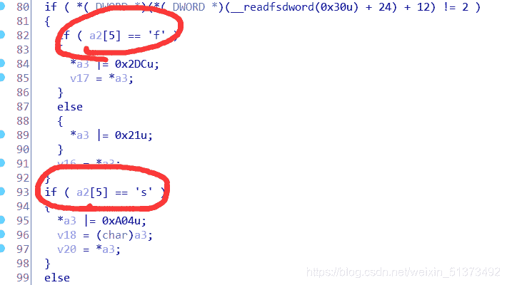

这个地方有两个选择，我选了上面那个。

改成下面那个后

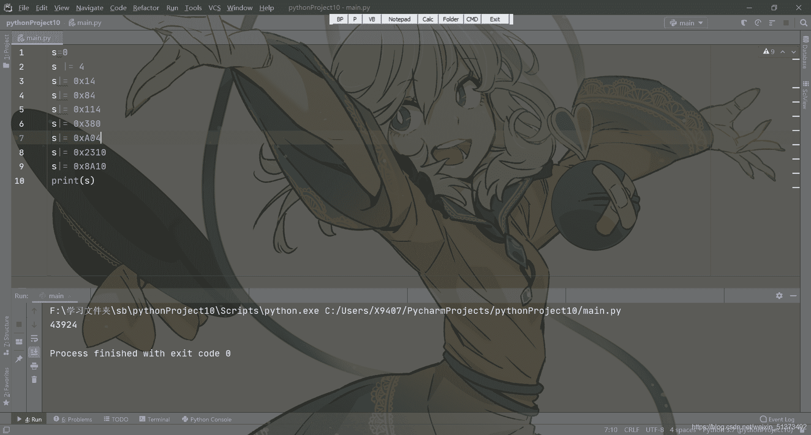

完美。由此得出v17为"dbappsec"

ok,继续反推

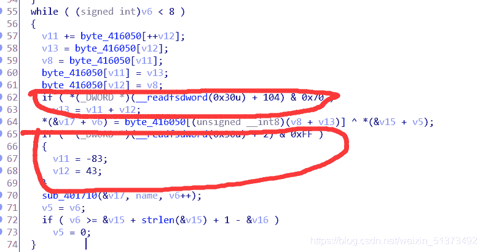

这俩我第一次做的时候分析好久，不知道这是啥玩意儿，上网查了查后发现是反调试的函数，直接不管。

因为我们已经得到v17，同时用户名也知道是welcomebeijing，而最开始说点开程序的时候要输入用户名。于是我们可以通过用ollydbg动态调试的方法得出byte_416050的值

拖进ollydbg，算好动态偏移后，执行程序

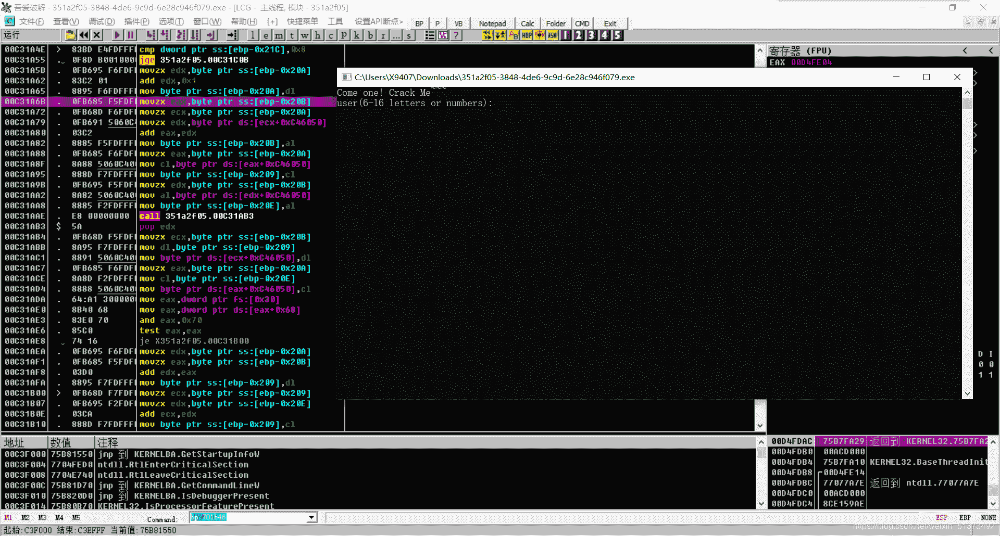

输入用户名 welcomebeijing

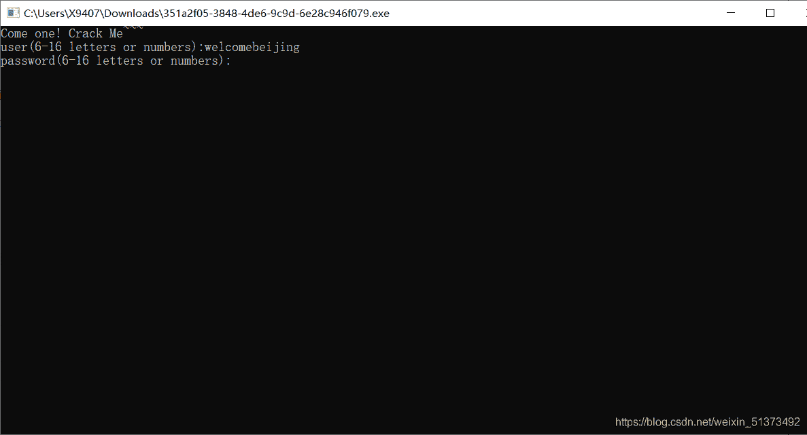

此时我们停下，找到ida的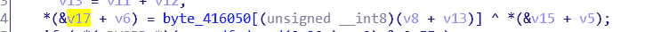

的地址

上面那个xor eax，ecx即为关键步骤，象征着
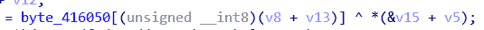

此处的异或，而通过上方的汇编代码我们可以知道上一行的 movzx ecx, [ebp+var_209]是将byte_416050的值存入ecx，此处的ecx的值即为我们想要知道的值！

由此，我们得到了思路，在xor处下断点，使每次运行时程序停在xor的前一命令，方便我们得知ecx的值。

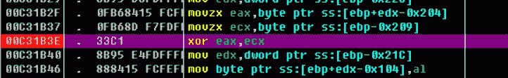

然后回到程序，随便输入个密码（反正等下会断在那儿

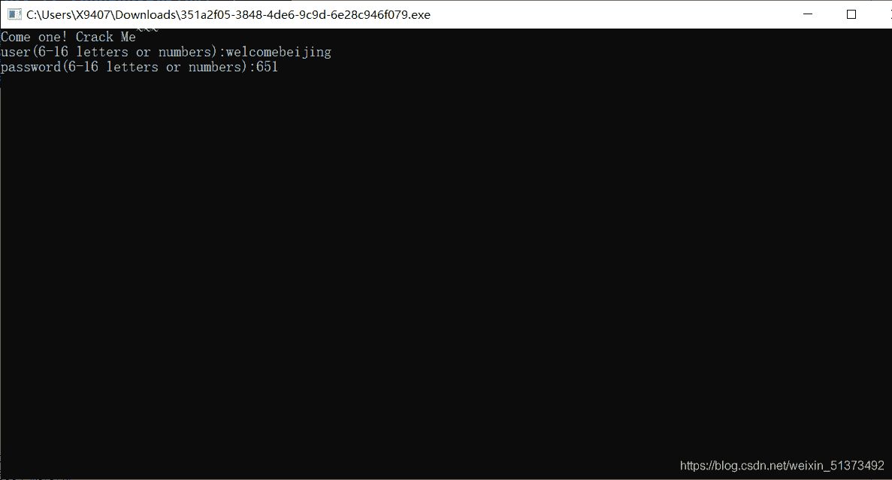

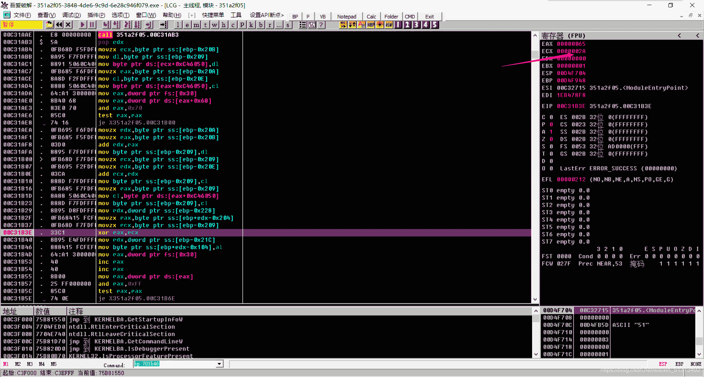

看到了吗，ecx的值。

因为while（v6<8），所以执行了8次，此处我们继续f9执行，并记录下每次ecx的值。得到ecx，即byte_416050的存储的值0x2a,0xd7,0x92,0xe9,0x53,0xe2,0xc4,0xcd

然后继续回推

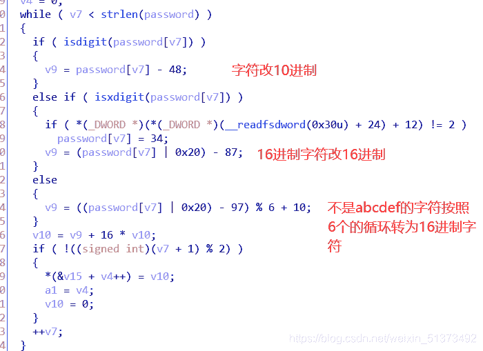

（我的表达方式可能有点奇怪，大家稍微谅解一下

下面那个if无所谓管不管，直接可以写代码了

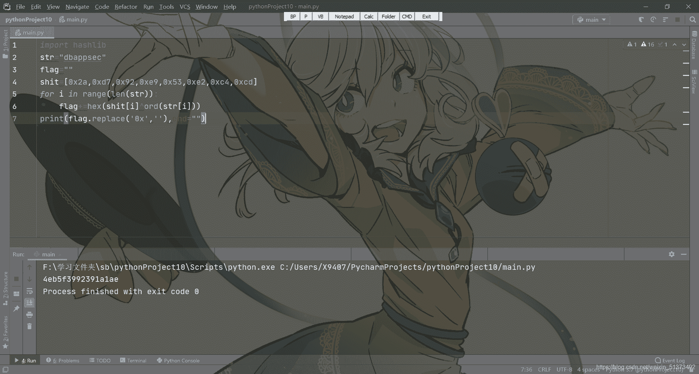

把这串字符丢到网上的md5在线解密，得出flag{d2be2981b84f2a905669995873d6a36c}
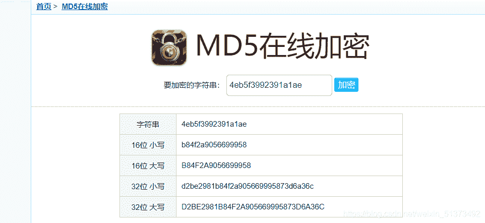

虽然做的时候感觉啥都不知道，但是做完后发现自己基本理解了这道题，还是很开心的

感悟：
。
。。
恋恋真可爱
（无意识的赞美