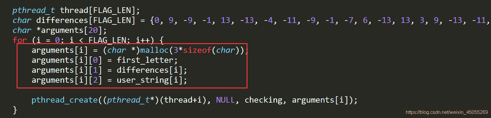
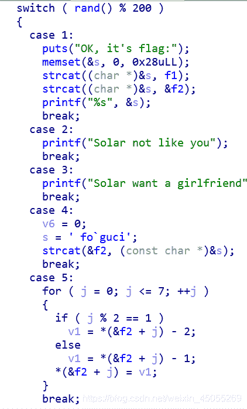
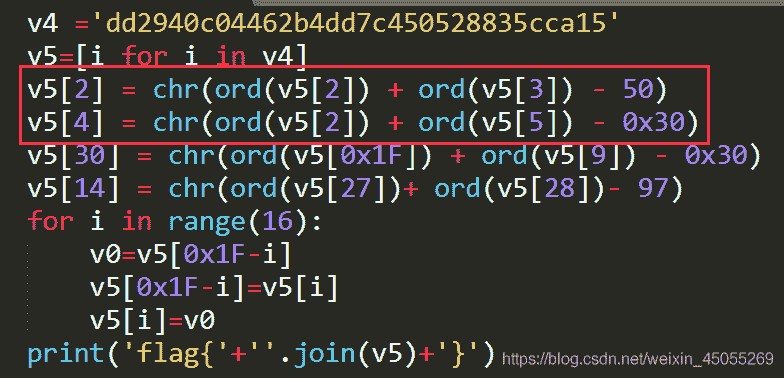
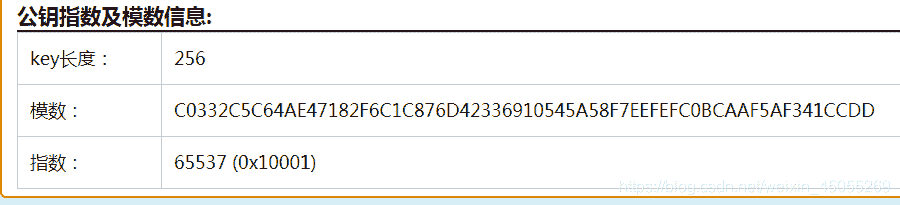
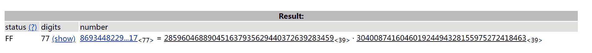
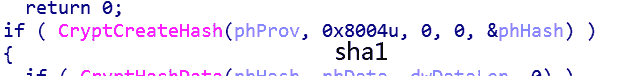
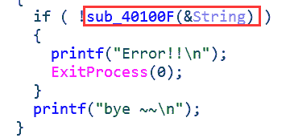
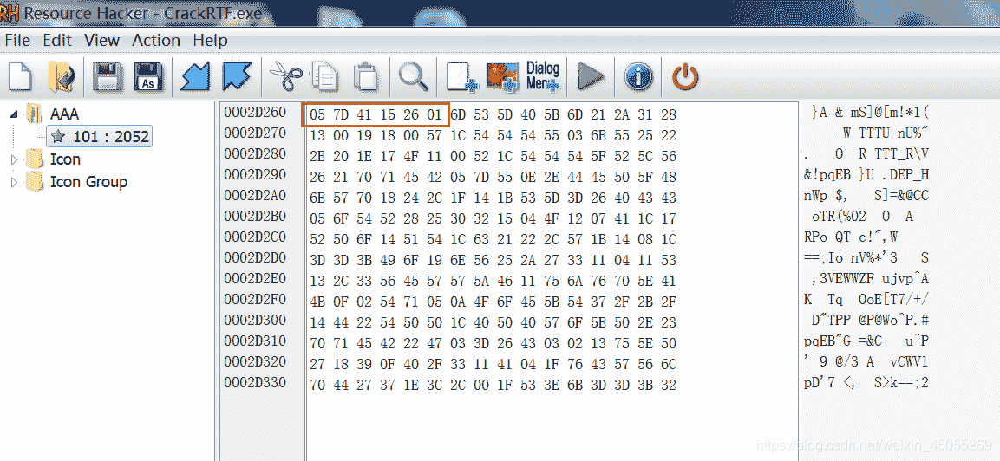
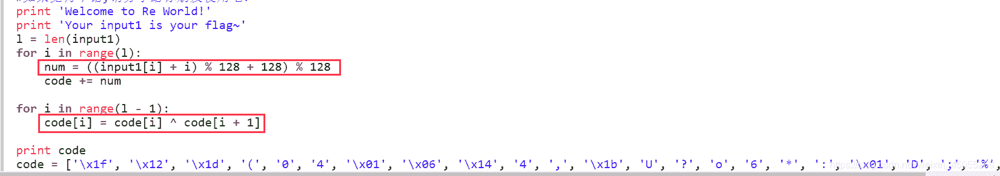

<!--yml
category: 未分类
date: 2022-04-26 14:51:46
-->

# buu逆向刷题（二）_北风~的博客-CSDN博客

> 来源：[https://blog.csdn.net/weixin_45055269/article/details/108748458](https://blog.csdn.net/weixin_45055269/article/details/108748458)

#### 1.Java逆向解密

压缩包解压之后，找到Reverse.class，上jd-gui-windows-1.6.2，反编译java，代码逻辑清晰，输入的字符加‘@’再与0x20异或，与已知字符比较。
神奇的是这个脚本，先异或还是先加减，结果一样。按照运算的优先级，先加减再异或的，所以反过来，应是先异或再加减。

```
KEY = [180, 136, 137, 147, 191, 137, 147, 191, 148, 136, 133, 191, 134, 140, 129, 135, 191, 65]
for i in KEY:
    print(chr((i^0x20)-ord('@')),end='') 
```

#### 2.刮开有奖

<mark>数组变换用C执行+base64</mark>，base64还是很香的，出到别的算法，还有私钥啥的。太菜了
数组变换的函数，由IDA反编译出来的，写成C

```
#include <iostream>
using namespace std;
int __cdecl sub_4010F0(char *a1, char a2, char a3)
{
	int result; 
	int i; 
	int v5; 
	int v6; 

	result = a3;                                  
	for (i = a2; i <= a3; a2 = i)               
	{
		v5 = i;
		v6 = a1[i];                                 
		if (a2 < result && i < result)            
		{
			do
			{
				if (v6 > a1[result])                  
				{
					if (i >= result)
						break;                              
					++i;                                  
					a1[v5] = a1[result];                  
					if (i >= result)
						break;                              
					while (a1[i] <= v6)                 
					{
						if (++i >= result)                
							goto LABEL_13;
					}
					if (i >= result)
						break;
					v5 = i;
					a1[result] = a1[i];
				}
				--result;                               
			} while (i < result);
		}
	LABEL_13:
		a1[result] = v6;                            
		sub_4010F0(a1, a2, i - 1);                  
		result = a3;
		++i;
	}
	return result;
}
char str[11] = { 90,74,83,69,67,97,78,72,51,110,103 };
int main()
{
	cout << str << endl;
	sub_4010F0(str, 0, 10);
	cout << str << endl;
} 
```

两个base64字符串解密
8个字符拼接在一起。

#### 3.findit

安卓app题目，JEB打开，找关键判断发现变量没有被运算，尽管一大堆，后来又发现一串字符看着像是flag，‘p’, ‘v’, ‘k’, ‘q’, ‘{’, ‘m’, ‘1’, ‘6’, ‘4’, ‘6’, ‘7’, ‘5’, ‘2’, ‘6’, ‘2’, ‘0’, ‘3’, ‘3’, ‘l’, ‘4’, ‘m’, ‘4’, ‘9’, ‘l’, ‘n’, ‘p’, ‘7’, ‘p’, ‘9’, ‘m’, ‘n’, ‘k’, ‘2’, ‘8’, ‘k’, ‘7’, ‘5’, '}，接着想到凯撒密码，看着里面有flag字，10位位移，喜提flag

#### 4.parallel-comparator-200

给了C文件，代码审计，<mark>除了普通的循环，矩阵也可实现循环</mark>
核心pthread_create((pthread_t*)(thread+i), NULL, checking, arguments[i]);，(pthread_t*)(thread+i)为0，但又涉及随机数，但这里推测随机数是固定值，所以需要爆破。

```
import string
r=''
a=[0, 9, -9, -1, 13, -13, -4, -11, -9, -1, -7, 6, -13, 13, 3, 9, -13, -11, 6, -7]
flag=string.printable
b=[0 for i in range(25)]
for i in range(25):
	b[i]=97+i
for x in b:
	r+='\n'
	for i in range(20):
		for z in flag:
			if x+a[i]^ord(z)==0:
				r+=z
				break
print(r) 
```

#### 5.8086

16位汇编，DOSBox跑一下，好吧，啥也没有，IDA打开，字符串与0x1F的异或。

#### 6.[GKCTF2020]Check_1n

师傅牛逼，控制台里的虚拟电脑，搜索中文字符串拿到开机密码HelloWorld，打砖块游戏，死亡得flag。

#### 7.luck_guy

linux,patch me提示你改跳转

f1明确，少f2,4赋值f2，5处理f2，4-5-1顺序，得flag

#### 8.简单注册器

<mark>坑</mark>
<mark>数组赋值典型题目</mark>
掉到坑里了，创建了一个新的数组，没考虑数组变化对后续数组的影响。
数组赋值注意：
1.字符串转数组

```
v4 ='dd2940c04462b4dd7c450528835cca15'
v5=[i for i in v4] 
```

2.数组变化对后续数组的影响
还在原来的数组里改

py版本

```
v4 ='dd2940c04462b4dd7c450528835cca15'
v5=[i for i in v4]
v5[2] = chr(ord(v5[2]) + ord(v5[3]) - 50)
v5[4] = chr(ord(v5[2]) + ord(v5[5]) - 0x30)
v5[30] = chr(ord(v5[0x1F]) + ord(v5[9]) - 0x30)
v5[14] = chr(ord(v5[27])+ ord(v5[28])- 97)
for i in range(16):
    v0=v5[0x1F-i]
    v5[0x1F-i]=v5[i]
    v5[i]=v0
print('flag{'+''.join(v5)+'}') 
```

C版本

```
#include<iostream>
using namespace std; 
int main() {
	int v9 = 2;
	int v11 = 31;
	char v5[] = "dd2940c04462b4dd7c450528835cca15";
	v5[v9] = ((char)(v5[v9] + v5[3] - 50));
	v5[4] = ((char)(v5[v9] + v5[5] - 48));
	cout << v5[4] << endl;
	v5[30] = ((char)(v5[v11] + v5[9] - 48));
	v5[14] = ((char)(v5[27] + v5[28] - 97));
	cout << v5 << endl;
	int v4;
	for (v4 = 0; v4 < 16; ++v4) {
		char v0 = v5[31 - v4];
		v5[31 - v4] = v5[v4];
		v5[v4] = v0;
	}

	cout << v5 << endl;
} 
```

#### 9.rsa

算法题，真不错，公钥求私钥，解密密文

##### 公钥解析（提取e，n）

http://tool.chacuo.net/cryptrsakeyparse对公钥进行解析
得到n,e

##### 公钥解析(提取p,q)

http://www.factordb.com/（公钥解析）
https://tool.lu/hexconvert/（进制转换）
16进制转10进制

p = 285960468890451637935629440372639283459
q = 304008741604601924494328155975272418463

##### 脚本解密

```
import gmpy2
import rsa
e=65537
n=86934482296048119190666062003494800588905656017203025617216654058378322103517
p = 285960468890451637935629440372639283459
q = 304008741604601924494328155975272418463

phin=(q-1)*(p-1)
d=gmpy2.invert(e,phin)

key=rsa.PrivateKey(n,e,int(d),p,q)

with open("D:\\Downloads\\rsa\\output\\flag.enc", "rb+") as f:
    f = f.read()
    print(rsa.decrypt(f, key)) 
```

#### 10.CrackRTF

拿到题目各种提示语，好在逻辑清晰，首先输入6位，加上’@DBApp’组成12位，经过第一个算法，得到一串字符。sub_40100A函数，调用windows的加密函数，8004u标识符sha1加密，不可逆，结合输入字符从100000开始，暴力破解。

<mark>python得出的结果是小写，所以爆破时，若是源文件是大写，需要大写转小写。</mark>

```
import hashlib
flag="@DBApp"
for i in range(100000,999999):
	s=str(i)+flag
	x=hashlib.sha1(s.encode())
	cnt=x.hexdigest()
	if "6e32d0943418c2" in cnt:
		print(cnt)
		print(str(i)+flag) 
```

第二个算法，sub_401019，同样的windows内置加密，8003u，md5解密，网站尝试解一下，失败，前面12位再加6位，一共18位，而且这6位不一定是数字 ，不像第一个有限制，18位全字符爆破32位md5加密，emmm。这样爆破跑也可，接着往下看。

最终判断下还有sub_40100F，里面嵌套的sub_401005，从文件的资源文件“AAA”取出字符串与输入字符异或，怎么能找到最后异或的字符？lpString地址最后指向rtf文件（结合sub_401005第三个参数nNumberOfBytesToWrite写入的字符数量推测），所以从lpString地址取字符，恰好取到rtf的文件头，自己创建一个rtf文件，取rtf文件的文件头
"AAA"资源，利用ResourceHacker工具提取。



```
s = "{\\rtf1"
a = [0x05,0x7D,0x41,0x15,0x26,0x01]
flag = ""
for i in range(0,len(s)):
	x = ord(s[i]) ^ a[i]
	flag += chr(x)
print(flag) 
```

依次输入两个密码，生成文件。
找到

Flag{N0_M0re_Free_Bugs}

#### 11\. [GWCTF 2019]pyre

pyc逆向，网站反编译，出来之后
<mark>利用最后一位不变从后往前写脚本。python前包后不包</mark>

```
code = ['\x1f','\x12','\x1d','(','0',
    '4','\x01','\x06','\x14','4',
    ',','\x1b','U','?','o','6',
    '*',':','\x01','D',';','%','\x13']
for i in range(len(code)-2,-1,-1):
	code[i]=chr(ord(code[i])^ord(code[i+1]))
for i in range(len(code)):
	print(chr((ord(code[i])-i)%128),end='') 
```